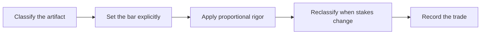

# Choosing the Right Engineering Bar

> **Core skill:** Matching rigor to stakes instead of habit — consciously choosing how much engineering discipline each artifact deserves, and naming the choice.

## Why This Matters

Field work runs several engineering standards at once. A throwaway probe that reads a data sample should be deleted within days; a service on the customer's critical path will be examined by their auditors for years. Applying one standard to both fails in opposite directions: uniform maximal rigor makes the FDE too slow to learn, and uniform minimal rigor eventually ships something fragile into an environment where failure is public. The skill is not picking one bar; it is calibrating per artifact, deliberately, and telling the truth about which bar applies.

Calibration is where field judgment concentrates, because the cost asymmetry is sharp. Gold-plating a throwaway costs days; under-engineering a production path costs the customer's trust, the deployment's credibility, and sometimes the account. The FDE must therefore be able to look at any piece of work and answer, in one breath: who is affected if this fails, what happens when it fails at an inconvenient hour, who will maintain it after me, and what data does it touch? Those answers map directly to the amount of process the artifact has earned.

The subtler discipline is visibility. A bar that lives only in the FDE's head becomes a surprise later — when the customer assumes the pilot was built like production, or when the team discovers that the "quick script" now processes payroll data weekly. Naming the bar, writing it down, and re-deciding it when stakes change converts rigor from a personal habit into an explicit, reviewable engineering decision.

## The Rigor Spectrum

| Artifact class | Appropriate bar | What must still hold, always |
|----------------|-----------------|------------------------------|
| Throwaway probe | Minimal ceremony; deleted quickly | Customer data protected; no production credentials |
| Demo | Source-controlled; honest gap list | Real data used safely; limitations stated aloud |
| Pilot with users | Tests on core flows; access controls; logging | No admin shortcuts left open; users informed it is a pilot |
| Production internal tool | Review, tests, monitoring, runbook | Ownership, rollback, and error handling defined |
| Critical path system | Full quality practice plus audit trail and drills | Everything above, plus evidence for auditors and operators |

The middle rows are where most field work lives, and where most calibration errors happen — pilots treated as demos, or demos expected to perform like pilots.

## Deciding the Bar

| Question | Why the answer moves the bar |
|----------|------------------------------|
| Who is affected if this fails? | Hundreds of users and one analyst imply different failure tolerances |
| What happens when it fails at an inconvenient hour? | Unattended failure demands monitoring and recovery paths |
| Who maintains it after me? | Handing to a customer team requires documentation and simplicity |
| What data does it touch? | Personal, regulated, or financial data sets a floor no bar can go under |
| Is anyone outside the room relying on it? | External reliance turns internal tools into commitments |
| What is the cost of building it twice? | Cheap rebuilds justify low rigor; costly ones justify rigor now |
| Would the customer's auditors accept this evidence? | Regulated contexts answer the question themselves |

Answering these six questions takes ten minutes and routinely saves weeks. The failure mode is skipping them because the answer feels obvious — it usually is obvious, but only after being asked.

## Upgrading and Downgrading Consciously

| Transition | What must happen first | What must be written |
|------------|------------------------|----------------------|
| Probe to demo | Data handling checked; code retrieved if needed | The gap list between shown and real |
| Demo to pilot | Access controls, logging, core-flow tests | Pilot expectations and known limitations |
| Pilot to production | Hardening phases from quality to handover | Residual gaps, accepted risks, owners |
| Production to retired | Migration or export path; deprecation notice | Sunset plan and data disposition |



Both directions require a decision. An upgrade nobody decided looks like uncontrolled growth; a downgrade nobody wrote down looks like neglect — and both destroy confidence when discovered.

## Practical Applications

### Artifact Classification Note

```markdown
## Artifact Note — <name>

| Field | Statement |
|-------|-----------|
| Class | probe or demo or pilot or production or critical path |
| Bar applied | <what practices are required at this class> |
| Why this class | <who depends on it, data touched, maintenance path> |
| Upgrade trigger | <the event that will change the class> |
| Accepted trade-offs | <what was consciously skipped, agreed with whom> |
| Review date | <when the class is re-checked> |
```

### Bar-Setting Checklist

- [ ] Every artifact I own has a named class, not an implied one
- [ ] The class is visible to the customer where it affects their expectations
- [ ] Data protection rules apply at every class without exception
- [ ] Upgrade triggers are written before the artifact ships anywhere
- [ ] Downgrades and skipped practices are recorded with an acceptor
- [ ] Classes are re-checked at phase gates and when new users appear

## Common Pitfalls

| Pitfall | Why It Is a Problem | Better Approach |
|---------|---------------------|-----------------|
| **Habit-driven rigor** | Uniform rigor is either too slow or too fragile for the stakes | Classify first; let the stakes set the process |
| **The hidden bar** | Unstated standards produce mismatched expectations on both sides | Name the class and state it where it matters |
| **Dogmatic minimalism** | "It is just a demo" meets real data and real auditors | Treat data protection as a floor beneath every class |
| **Silent upgrades** | Costs appear in production without anyone deciding they should | Convert class changes into recorded decisions |
| **Risk owned by nobody** | Accepted trade-offs without an acceptor return as surprises | Every acceptance gets a name attached |
| **Static classification** | Artifacts grow into importance while their rigor stays frozen | Recheck classes when users, data, or reliance change |

## Success Indicators

- I can state the class and bar of every artifact I own without preparation
- Customers are surprised only by improvements, never by the absence of production discipline
- Upgrade costs are anticipated because triggers were written in advance
- No production artifact in my portfolio runs on demo-grade shortcuts
- Reviewers can trace each artifact's rigor decisions to recorded rationale

## Related Topics

- [[06_From_Prototype_to_Production]]
- [[01_Demo_Driven_Development]]
- [[02_Solution_Design_and_Rapid_Prototyping/00_overview|Solution Design and Rapid Prototyping]]
- [[career-path/03_Staff_Engineer/00_overview|Staff Engineer]]
- [[software-engineering-note/12_Software_Quality/Software Quality Overview]]

## Summary

Choosing the right engineering bar is the FDE's calibration skill: classifying each artifact by who depends on it, what data it touches, and who maintains it; applying rigor proportional to stakes; upgrading and downgrading through recorded decisions with named acceptors; and keeping data protection as a floor no class ever goes below. The goal is not maximal rigor or minimal rigor — it is rigor that matches reality, chosen in the open, so speed and safety stop competing and start sequencing.
