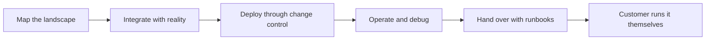

# Integration and Deployment Engineering

> **Core capability:** The FDE ships and runs production systems inside the customer's environment — integrating with real systems, deploying through real change processes, debugging under pressure, and handing over operations that stay healthy without them.

## Why This Matters

This is the capability that separates forward deployed engineering from every advisory role nearby. The FDE does not recommend what the customer should build; the FDE builds, deploys, and operates it inside the customer's environment — and the customer's environment does not care about best practices. It contains a fifteen-year-old ERP, a database nobody has schema for, a firewall that took three weeks to get through, and a change-advisory board that meets on Thursdays.

Integration is where demos become systems. Real data is dirtier, real interfaces are undocumented, and real constraints (network zones, licensing, approval chains) decide the design more than engineering taste does. The FDE learns to read an enterprise landscape the way an engineer reads a codebase: find the systems of record, the boundaries, the brittle joints, and the places where a small change is safe.

Deployment and handover are equally first-class. A system that only the FDE can run is not a deployment; it is a dependency. The craft includes release and change management inside the customer's processes, field debugging when something breaks at 9 a.m. on their busiest day, runbooks and operational handover, and the judgment to know what to automate and what to leave human.

## Topics in This Capability Area

| Topic | Core Skill | When It Matters |
|-------|------------|-----------------|
| [[01_Enterprise_Integration_Patterns]] | Connecting to ERP, CRM, legacy systems, and their interfaces | Every deployment that touches existing systems |
| [[02_Data_Pipelines_in_Customer_Environments]] | Moving and cleaning data where the customer's rules apply | Whenever systems must share truth |
| [[03_Deployment_Models_and_Environments]] | On-prem, VPC, hybrid, air-gapped — choosing and fitting in | At architecture time and every change |
| [[04_Field_Debugging_and_Troubleshooting]] | Diagnosing problems in environments you do not fully control | Whenever production misbehaves |
| [[05_Release_and_Change_Management_for_Customers]] | Shipping through the customer's change processes | Every release after the pilot |
| [[06_Operational_Handover_and_Runbooks]] | Making the system runnable by the customer's own teams | At go-live and after each phase |
| [[07_Production_Incidents_at_Customer_Sites]] | Managing incidents when your system is the event | The worst-timed moments, inevitably |

## From Integration to Independence

The end state is not a system you keep alive — it is a system they own.

## Practical Applications

### Go-Live Readiness Checklist

- [ ] Systems of record, interfaces, and data flows are documented as built, not as designed
- [ ] Deployment path through the customer's change process is mapped with owners and lead times
- [ ] Rollback or mitigation plan exists for the first weeks in production
- [ ] Monitoring and alerting reach both customer operators and the FDE team
- [ ] Runbooks cover the top failure modes found during field testing
- [ ] Handover recipients have run the system themselves at least once, supervised

## Common Pitfalls

| Pitfall | Why It Is a Problem | Better Approach |
|---------|---------------------|-----------------|
| **Lab-condition assumptions** | Field environments break designs that never met reality | Test in the customer's actual environment early |
| **Hero mode** | Only the FDE can run the system — a permanent leash | Hand over operations with runbooks and drills |
| **Ignoring change control** | Unapproved releases get rolled back and burn trust | Ship through their process, with their calendar |
| **Debugging by guessing** | Field incidents punish improvisation | Instrument first, isolate, then fix |
| **Undocumented as-built state** | Drift between design and reality causes outages | Maintain as-built documentation from day one |

## Success Indicators

- The customer's own operations team runs releases and routine changes
- Incident response improves from "call the vendor" to "the runbook covered it"
- Integration surprises trend down as the landscape map matures
- Deployments to the same customer get faster because the path is walked, documented, and owned
- Postmortems name systemic causes, not individuals

## Related Capabilities

- [[04_AI_Systems_in_Customer_Environments/00_overview|AI Systems in Customer Environments]]: the specific case of deploying AI into these landscapes
- [[05_Enterprise_Navigation_Security_and_Compliance/00_overview|Enterprise Navigation: Security and Compliance]]: the approvals and constraints around every integration
- [[career-path/07_SRE_and_Platform_Engineer/00_overview|SRE and Platform Engineer]]: reliability and platform discipline behind habitable systems
- [[career-path/18_Applied_AI_Engineer/00_overview|Applied AI Engineer]]: product-side engineering the FDE adapts for the field
- [[software-engineering-note/06_Software_Engineering_Operations/Fundamental/13 CI CD Pipelines|CI CD Pipelines]]: pipeline mechanics for repeatable delivery

## Summary

Integration and deployment engineering is the operational heart of the FDE role: reading enterprise landscapes, integrating with systems the customer barely understands themselves, deploying through real change processes, debugging where you do not control the environment, and handing over systems the customer can run without you. Deployments end successfully when the FDE can leave — and the system keeps working.
