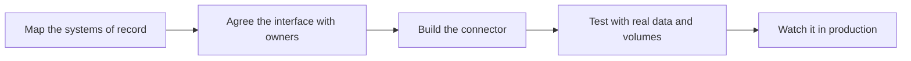

# Enterprise Integration Patterns

> **Core skill:** Connecting to ERP, CRM, legacy systems, and their interfaces — meeting systems of record where they actually are, through interfaces the customer can support, not the ones the documentation promises.

## Why This Matters

Every deployed system eventually meets the systems of record: the ERP that holds orders, the CRM that holds customers, the legacy core that holds balances. Those systems are not designed to be integrated with — they were designed to run the business. The interfaces they expose are usually whatever accumulated over years: nightly file drops, a SOAP endpoint nobody has touched since the last upgrade, database views that a departed contractor created, an export button that writes to a shared drive. The FDE's job is to find the interfaces that exist, in the state they exist, and build against those.

Integration is where demos become systems. In a demo, data arrives clean and on time through an interface you control. In a customer environment, the order feed is a CSV with shifted columns on the last day of every month, the customer record lookup takes three seconds under load, and the connector runs under a service account that a security review will scrutinize. Reading an enterprise landscape is like reading an unfamiliar codebase: find the systems of record, the boundaries between them, the brittle joints, and the places where a small, well-understood change is safe.

The FDE rarely gets to choose the elegant interface. The interface that wins is the one the customer can approve, operate, and support after the engagement ends — even when a better option is technically available. Integration decisions outlive the deployment: they become contracts between teams, and the maintenance burden falls on the customer's own engineers. Choosing an interface is therefore a long-term commitment, not just this quarter's delivery decision.

## Reading the Integration Landscape

| System Archetype | Interfaces It Tends to Expose | Risk Profile | How to Approach It |
|------------------|-------------------------------|--------------|--------------------|
| ERP | Batch extracts, IDoc or message formats, RFC or OData endpoints, database tables | High change cost; upgrades break custom interfaces | Treat every interface as an agreement with the ERP team; confirm upgrade and maintenance calendars before building |
| CRM | REST APIs, bulk export jobs, webhooks | Rate limits and pagination surprises; field-level permission rules | Ask for the field-level permission model early; design around rate limits from day one |
| Mainframe and legacy core | Flat files, fixed-width records, screen-level access, stored procedures | Sparse documentation; tribal knowledge; slow change | Find the person who has run it longest; instrument heavily; never assume a field means what its name suggests |
| Bespoke internal applications | CSV exports, shared folders, databases with no formal schema | No owner, no service window, silent failures | Get a named owner before integration; add your own monitoring because none exists |
| SaaS systems | Public APIs, webhook events, integration platforms | Clean interfaces but hidden licensing and volume tiers | Confirm API entitlements and volume terms with procurement, not just the admin console |

## Interface Choices and Trade-offs

| Interface Style | Strengths | Weaknesses | When It Wins |
|-----------------|-----------|------------|--------------|
| Database read | Always available; full data set; no API limits | Couples you to internal schema; bypasses business rules and permissions | Only as a last resort, with a view layer owned by the database team |
| Scheduled file exchange | Simple to govern; works everywhere including air-gapped sites | Latency; silent partial files; no error signaling by default | Environments with strict network rules where nothing else is approved |
| API integration | Real-time semantics; explicit contracts; error codes | Rate limits, versioning, and auth complexity | Default choice when a maintained API exists and volume fits |
| Message queue or events | Decoupled; handles bursts; natural audit trail | Requires broker infrastructure and operating skills | High-volume or near-real-time flows between cooperating systems |
| Screen-level automation | Reaches systems with no other interface | Brittle; breaks on UI changes; fragile credentials | Genuinely legacy systems where no other path is approved or possible |

Prefer the least clever interface that satisfies the requirement and that the customer can operate. Every integration adds a joint that can fail; the FDE's goal is the smallest number of joints, each one observable and owned.



The loop does not end at production: every interface is re-validated when either side changes. Change notification is the feature nobody asks for and everybody needs.

## Working with the Customer's Integration Team

| Topic | What to Settle Early | Why It Matters Later |
|-------|----------------------|----------------------|
| Ownership | Who on the customer side owns each side of the interface | Incidents get routed to a person, not a team name |
| Credentials | Service accounts, key storage, rotation cadence | Security reviews block go-live over unmanaged secrets |
| Volumes and timing | Expected record counts, peak windows, scheduling | Interfaces that work in test fail at month-end peaks |
| Error handling | Who is alerted, what happens to failed records, retry policy | Silent data loss is discovered by the business, late |
| Change notification | How each side announces schema or endpoint changes | The most common source of surprise outages |
| Environments | Test systems with realistic data, refresh cadence | Integration tested only in production is tested in front of the customer |

## Practical Applications

### Integration Readiness Checklist

- [ ] Every system of record, interface, and data direction is drawn on a landscape diagram
- [ ] Each interface has a named owner on the customer side and a documented agreement
- [ ] Service credentials are stored in an approved secret store with a rotation plan
- [ ] Volume, timing, and peak-load behavior are known from real data, not assumptions
- [ ] Failure modes are explicit: what happens to a record that fails mid-flow
- [ ] The interface is monitored before go-live, not after the first silent failure
- [ ] Upgrade and maintenance calendars for both sides are recorded and watched

### Integration Specification Template

```markdown
## Integration Spec — <source system, target system, direction>

| Field | Value |
|-------|-------|
| Business purpose | <what breaks in the business if this stops> |
| Interface style | <file, API, queue, view> |
| Owner, source side | <name, team> |
| Owner, target side | <name, team> |
| Schedule or trigger | <cron, event, manual> |
| Expected volume | <records per run, peak> |
| Failure behavior | <retry, dead letter, alert path> |
| Change notification | <who tells whom, how, how far ahead> |
| Monitoring | <where failures surface, who sees them> |
```

## Common Pitfalls

| Pitfall | Why It Is a Problem | Better Approach |
|---------|---------------------|-----------------|
| **Trusting documented interfaces** | Documentation drifts from reality; fields change without notice | Validate against real payloads from production before designing |
| **Assuming clean identifiers** | The same customer has three keys across three systems | Confirm the matching key with the business, not the schema |
| **Ignoring volumes and peaks** | Test-scale flows collapse at month-end or batch time | Size for the observed peak, not the average |
| **Direct database reads as a shortcut** | Couples you to internal schema and skips permissions | Ask for a supported view or extract owned by the database team |
| **No customer-side owner** | Incidents become your problem forever; changes arrive unannounced | Make a named owner a precondition of go-live |
| **Silent failure handling** | Records vanish and the business finds out weeks later | Design alerts and dead-letter visibility before launch |

## Success Indicators

- Each interface has an owner, an agreement, and monitoring the customer can see
- Integration incidents get routed and resolved by the customer's own teams
- Schema and endpoint changes arrive through the agreed notification path, not as outages
- Reconciliation between systems is routine and matches, with exceptions explained
- The same account's next integration reuses the landscape map and the interface patterns

## Related Topics

- [[02_Data_Pipelines_in_Customer_Environments]]
- [[03_Deployment_Models_and_Environments]]
- [[05_Enterprise_Navigation_Security_and_Compliance/00_overview|Enterprise Navigation: Security and Compliance]]
- [[career-path/15_Solutions_and_Enterprise_Architect/00_overview|Solutions and Enterprise Architect]]
- [[software-engineering-note/01_Software_Requirements/Software Requirements Overview]]

## Summary

Enterprise integration patterns are the FDE's map and compass inside a landscape nobody fully understands: find the systems of record, learn the interfaces that actually exist, choose the least clever option the customer can support, and give every joint an owner, an agreement, and monitoring. Integration decisions become contracts that outlive the engagement, so they are made with the customer's long-term ability to operate them in mind — not just the current delivery date.
