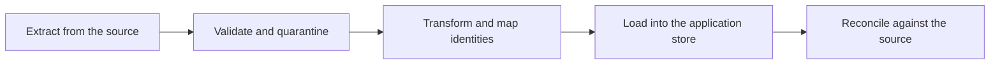

# Data Pipelines in Customer Environments

> **Core skill:** Moving and cleaning data where the customer's rules apply — their classification, retention, and permissioning, applied at every hop, with reconciliation that proves the data arrived whole.

## Why This Matters

Almost every deployment moves data. Even the simplest capability needs a feed from a source system, a store the application can query, and a flow of updates when the source changes. In a product environment the FDE would inherit a managed pipeline; in a customer environment the pipeline is often something the FDE builds, negotiates, and then defends in an audit. The customer's rules — data classification, residency, retention, separation of duties — apply to every hop, and they are not negotiable engineering preferences. They are conditions of operating.

Customer data is also dirtier than any demo corpus. Identifiers disagree across systems. Dates arrive in several formats within the same file. Free-text fields carry the real meaning while structured fields go stale. Rows are soft-deleted, re-appearing in next week's extract. None of this is a reason to stop; it is the raw material of the job. The FDE who treats cleaning and validation as first-class pipeline stages ships slower on the first day and far faster over the first month.

Pipelines are also the place where correctness is provable. The business question at every review is simple: is the data complete, fresh, and correct? A pipeline the FDE cannot reconcile is a pipeline the customer cannot trust, no matter how well the downstream application performs. Reconciliation — counts, checksums, sampled records — is what turns "the pipeline ran" into "the data is right."

## The Shape of Customer Data

| Data Reality | What It Breaks | How the FDE Responds |
|--------------|----------------|----------------------|
| Inconsistent identifiers | Joins silently drop or duplicate records | Agree a matching key with the business; build and test a mapping table |
| Mixed formats and encodings | Parsers fail or corrupt values silently | Validate types at ingest; quarantine bad records instead of guessing |
| Soft deletes and status flags | Deleted records keep flowing through | Read the business rule for "active"; filter explicitly |
| Free-text carrying real meaning | Structured fields look clean but are wrong | Sample against reality; treat free text as the source of truth where it is |
| Late and partial extracts | Downstream reports go briefly wrong | Bound the pipeline by extract completion, not by clock time |
| Duplicate records with tiny differences | Aggregates double-count | Deduplicate with a stated rule the customer confirms |

## Pipeline Design Principles

| Principle | Why It Matters | In Practice |
|-----------|----------------|-------------|
| Validate at ingest | Bad data caught early is cheap; caught late it is an incident | Reject or quarantine with a visible reason, never silently fix |
| Make every hop idempotent | Reruns happen; partial failures happen more | Key writes so a rerun converges instead of duplicating |
| Reconcile against the source | The business measures trust in data totals | Automated count and sum checks with an exception report |
| Keep a raw landing copy | Cleaning logic will change; raw data is re-processable | Land as received, transform downstream, respect retention rules |
| Classify data at the pipeline edge | Residency and access rules bind every hop | Tag records with their classification; enforce masking or filtering before storage |
| Observe freshness explicitly | Staleness looks like correctness until someone checks | Freshness monitors and alerts that name the pipeline, not the symptom |



The loop is closed by reconciliation: every run ends with a statement about completeness, not just about exit status.

## Reconciliation and Quality Controls

| Control | What It Catches | Effort to Add |
|---------|-----------------|---------------|
| Row counts per extract | Missing or partially delivered files | Low — compute per run and compare |
| Sum or hash checks on key measures | Silent corruption or truncation | Low — one query on each side |
| Sampled record-level comparison | Mapping and transformation errors | Medium — a scheduled job and a review habit |
| Duplicate detection on business keys | Double-counting in downstream reports | Low to medium, depends on key quality |
| Freshness and lag monitoring | Stalled feeds that look idle but healthy | Low — alert when newest record ages past threshold |
| Exception queue triage | Systematic issues hiding as one-off rejects | Ongoing — someone must own the queue |

## Practical Applications

### Pipeline Readiness Checklist

- [ ] Source owners and extract contracts are documented for every feed
- [ ] The business matching key is agreed and tested against real records
- [ ] Validation rules are written down, with actions for rejects and quarantines
- [ ] Every stage is idempotent and safe to rerun mid-failure
- [ ] Reconciliation counts and checks run after every load and alert on mismatch
- [ ] Classification, masking, and retention rules are applied at every hop, not just at the edge
- [ ] Freshness and lag monitors exist before the pipeline is called production-ready

### Pipeline Run Record Template

```markdown
## Pipeline Run — <name, date, run id>

| Field | Value |
|-------|-------|
| Source extract | <file or query, time range, record count> |
| Validation | <passed, quarantined, reasons> |
| Transform | <mapping version applied> |
| Load | <rows written, rows updated, rows skipped> |
| Reconciliation | <source totals vs loaded totals, deltas explained> |
| Freshness | <newest record age, within bound yes or no> |
| Exceptions | <open items and owners> |
```

## Common Pitfalls

| Pitfall | Why It Is a Problem | Better Approach |
|---------|---------------------|-----------------|
| **Cleaning in the source** | The source system's team did not agree and will overwrite it | Clean downstream, keep the source untouched |
| **Silent corrections** | Guessed fixes corrupt data invisibly | Quarantine with a reason; let a human decide |
| **Extract bounded by clock time** | Late files produce permanently missing rows | Bound runs by extract completion markers |
| **One-off reconciliation** | Trust decays as soon as checks stop | Automate reconciliation and review exceptions on a cadence |
| **Ignoring retention rules** | Raw copies become a compliance finding | Apply retention to raw landings from day one |
| **No exception owner** | The quarantine queue grows until it is ignored | Name an owner and a triage rhythm before go-live |

## Success Indicators

- Source-to-target reconciliation passes routinely, with exceptions explained rather than averaged away
- The customer's data team trusts pipeline totals enough to cite them in their own reports
- Freshness and lag alerts fire before the business notices stale data
- Data quality issues are found by pipeline checks, not by downstream users
- The next pipeline in the same account reuses the same validation and reconciliation patterns

## Related Topics

- [[01_Enterprise_Integration_Patterns]]
- [[03_Deployment_Models_and_Environments]]
- [[04_Field_Debugging_and_Troubleshooting]]
- [[career-path/09_Data_and_ML_Engineer/00_overview|Data and ML Engineer]]
- [[software-engineering-note/12_Software_Quality/Software Quality Overview]]

## Summary

Data pipelines in customer environments are where the customer's rules and the customer's data meet the FDE's engineering: validate at ingest, keep every hop idempotent, reconcile against the source, and treat classification and retention as design inputs rather than paperwork. The pipeline's real output is not rows in a table — it is the customer's confidence that the data is complete, fresh, and correct, provable on demand and owned by someone after the FDE leaves.
