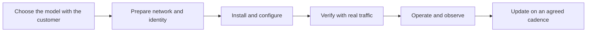

# Deployment Models and Environments

> **Core skill:** On-prem, VPC, hybrid, air-gapped — choosing the model that fits the customer's security and network posture, and living inside its consequences for updates, telemetry, and support.

## Why This Matters

The deployment model is decided long before the FDE arrives. It follows from the customer's security posture, network architecture, regulatory obligations, and procurement history — not from engineering preference. A bank may require everything inside its own data centers; a healthcare customer may accept a dedicated cloud tenancy in an approved region; a defense-adjacent organization may require an air-gapped installation updated through physical media. The FDE's first job is to learn which model the customer has chosen and why, because that choice shapes every later decision: how software ships, how problems are debugged, how logs are collected, and who can touch what.

Each model changes the operational physics of the deployment. In a SaaS tenancy, upgrades are continuous and telemetry flows freely. Behind a customer VPC, the FDE needs their cooperation to see anything. On-premise, the FDE may be a visitor in someone else's data center with escort and change windows. Air-gapped, there is no remote path at all: releases travel on media, debugging is done from cold backups of logs, and every intervention is a scheduled visit. None of these are better or worse in the abstract — they are different constraint sets, and the design must be honest about which one it serves.

Fitting into the environment is as much a social task as a technical one. Firewall rules, TLS inspection, proxies, certificate authorities, load balancers, and maintenance calendars belong to other teams with their own queues and priorities. The FDE who learns those teams' processes, lead times, and vocabulary early gets changes approved in days; the one who treats them as friction waits weeks. The deployment succeeds when the environment accepts it as a tenant, not as an intruder.

## Choosing the Deployment Model

| Model | What It Means | Design Implications | Typical Driver |
|-------|---------------|---------------------|----------------|
| SaaS multi-tenant | Runs on the vendor's infrastructure, shared control plane | Vendor controls upgrades, telemetry, scaling; customer controls only configuration and data scope | Lowest friction; often blocked by data rules |
| Dedicated cloud tenancy | Runs in the customer's or an approved cloud account and region | Customer controls network and identity; vendor needs an operating path that fits their controls | Data location rules with cloud appetite |
| On-premise | Runs in the customer's data center | Updates are events; capacity is fixed; the customer operates the hardware | Strict security posture or existing data center investment |
| Hybrid and data-plane split | Control plane with the vendor, data plane inside the customer boundary | Two environments to keep compatible; version skew is a standing risk | Vendor needs reachability; customer needs data locality |
| Air-gapped | No network path in or out | Releases on media; local tooling; logs must be shipped out deliberately | Regulated or sensitive environments |

## What Each Model Changes

| Concern | SaaS | Dedicated Tenancy | On-Premise | Air-Gapped |
|---------|------|-------------------|------------|------------|
| Upgrades | Continuous, vendor-scheduled | Scheduled with the customer | Change-window events | Media-based, infrequent, planned |
| Telemetry and logs | Full, real-time | Approved subset, customer-visible | Customer-collected, shared on request | Hand-carried or none until arranged |
| Remote debugging | Standard practice | Through agreed access paths | Rare; often screen-share only | Impossible without a site visit |
| Secrets and keys | Vendor-managed | Split responsibilities | Customer-managed key material | Everything stays inside |
| Scaling | Elastic | Within account limits | Hardware-bound | Hardware-bound, pre-planned |

The pattern to internalize: the more closed the environment, the more the FDE must compensate with preparation — pre-arranged access, richer local diagnostics, and updates batched into fewer, bigger, well-drilled events.



## Fitting into the Customer's Environment

| Reality | What It Forces | How to Handle It Well |
|---------|----------------|-----------------------|
| Firewall and egress rules | Every outbound path is a request with a lead time | Submit the full list of endpoints early; design for the approved subset |
| TLS inspection and proxies | Certificates may be re-signed; clients must trust the proxy chain | Test the actual inspection path, not the clean path |
| Identity and access | Service accounts, groups, and approvals take time | Start identity requests in week one; they are the long pole |
| Change windows | Installation and restarts happen on the customer's calendar | Batch work into fewer windows; rehearse inside them |
| Certificate authorities | Internal CAs and short-lived certs | Automate renewal; know the process that follows expiry |

## Practical Applications

### Environment Fit Checklist

- [ ] The deployment model and its rationale are recorded, with the customer's security function aligned
- [ ] The full list of required network paths, endpoints, and ports is approved in writing
- [ ] Identity, service accounts, and key custody are agreed and provisioned early
- [ ] Telemetry, log, and support access paths are designed within the customer's rules
- [ ] Upgrade and maintenance cadence is agreed, including who approves which class of change
- [ ] The first install has been rehearsed end to end before the production window
- [ ] Break-glass and emergency access paths exist and are tested before they are needed

### Environment Fit Sheet

```markdown
## Environment Fit — <customer, environment, date>

| Field | Value |
|-------|-------|
| Deployment model | <SaaS, tenancy, on-prem, hybrid, air-gapped> |
| Network zones | <where each component lives> |
| Approved paths | <endpoints and ports, approvals and dates> |
| Identity scheme | <accounts, groups, key custody> |
| Telemetry path | <what leaves the boundary, to where, under what agreement> |
| Update cadence | <frequency, approval route, rollback window> |
| Support access | <modes available, hours, conditions> |
```

## Common Pitfalls

| Pitfall | Why It Is a Problem | Better Approach |
|---------|---------------------|-----------------|
| **Designing before knowing the model** | Architecture that cannot run in the chosen environment is waste | Confirm model and constraints before detailed design |
| **Underestimating network lead times** | Approvals arrive after the pilot deadline passes | File every network request the week constraints are known |
| **Telemetry assumed, not agreed** | Logs silently unavailable when the first incident needs them | Negotiate the telemetry path as a deliverable, with an owner |
| **One-way version drift** | Hybrid components fall out of compatibility | Pin versions on each side and test the pair before any change |
| **Ignoring certificate expiry** | An environment quietly breaks on a calendar date | Track and automate renewal; alert before expiry |
| **No rehearsal for the closed model** | Air-gapped installs punish improvisation | Dry-run the full path including media handling and verification |

## Success Indicators

- The deployment lives inside the customer's rules without standing exceptions or waivers
- Network, identity, and change requests are forecast and filed before they block work
- The customer's operators can restart, patch, and verify the system within their own processes
- Telemetry and support access are sufficient to debug the top failure modes
- The next environment or account reuses the fit sheet and the approval playbook

## Related Topics

- [[01_Enterprise_Integration_Patterns]]
- [[02_Data_Pipelines_in_Customer_Environments]]
- [[04_AI_Systems_in_Customer_Environments/00_overview|AI Systems in Customer Environments]]
- [[career-path/07_SRE_and_Platform_Engineer/00_overview|SRE and Platform Engineer]]
- [[software-engineering-note/06_Software_Engineering_Operations/Fundamental/13 CI CD Pipelines|CI CD Pipelines]]

## Summary

Deployment models and environments are the physics of forward-deployed work: the customer's security posture picks the model, and the model dictates how software ships, how problems are seen, and how much freedom the FDE has inside the boundary. The craft is to choose and fit with the local realities — network, identity, change process, telemetry — with the same care given to the software itself, so the deployment is accepted as a tenant of the environment rather than fought by it.
