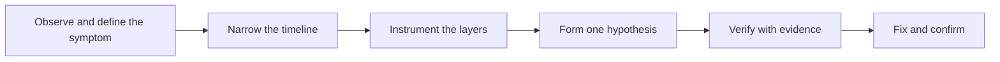

# Field Debugging and Troubleshooting

> **Core skill:** Diagnosing problems in environments you do not fully control — instrumenting first, isolating the failing layer with evidence, and pressing for fixes that survive contact with production.

## Why This Matters

Field incidents do not arrive with a stack trace and a repro script. They arrive as "the numbers are wrong since Tuesday" or "the integration stopped at 3 a.m. and we only noticed now." The system the FDE built is one part of a chain the customer owns — network, identity, proxies, databases, upstream feeds, third-party services — and any link can be the cause. Debugging here is an investigative discipline: define the symptom precisely, find the earliest evidence of divergence, and narrow the space until the cause is named. Guessing is expensive in a customer environment because every wrong hypothesis costs credibility as well as time.

The FDE's handicap is visibility. In an owned environment, you read any log or metric you want. In a customer environment, you see what was arranged: telemetry that survived a security review, logs the customer is willing to share, screen-share sessions with an operator at the other end. The practical answer is to design observability before it is needed — the metrics, correlation identifiers, and counters that make the top failure modes diagnosable from the inside out. The second answer is discipline: when access is scarce, waste none of it on unstructured exploration.

Fixes have a second life after they are written. A fix in a customer environment must pass their change process, must not invalidate the evidence that justified it, and must leave the system more diagnosable than before. The best field engineers treat each resolved incident as an investment in the next one: a new check, a clearer log line, a documented failure mode that goes into the runbook. Over a long engagement, debugging becomes less frequent and faster at the same time.

## A Field Debugging Method

| Step | Action | Bar to Pass |
|------|--------|-------------|
| 1 | Define the symptom precisely | A statement of what is wrong, for whom, measured how |
| 2 | Bound the timeline | The earliest moment the divergence can be observed |
| 3 | Instrument the path | Checks at each layer between source and symptom |
| 4 | Isolate the layer | Evidence narrows the chain to one segment |
| 5 | Name the cause | An explanation that accounts for all observations, not most |
| 6 | Fix, verify, and record | The fix is confirmed with the same measure that found the problem |

Discipline rule: one hypothesis at a time, one change at a time. A fix applied on top of three unknowns removes information instead of adding it.

## The Layers to Check

| Layer | Common Failure Mode | Signal to Look For |
|-------|---------------------|--------------------|
| Network and connectivity | Paths fail, DNS resolves differently, timeouts under load | Connection errors with timing patterns; works from one host, not another |
| Identity and access | Expired credentials, rotated secrets, permission changes | Sudden 401 or 403 at a clean previous success point |
| Configuration | A value changed in one environment only | Divergence between environments in a specific parameter |
| Data | Source format or content shifted | Validation rejects, count drops, or values across a boundary |
| Application | The software's own logic under a corner case | Reproducible given the same inputs; logs point inside the boundary |
| Third-party dependencies | External service latency or behavior change | Latency and error shifts that begin outside your change window |
| Environment resources | Disk, memory, connection pools exhausted | Gradual degradation, restart fixes, recurs over time |



After every cycle the loop returns with better instrumentation than the one before, which is why the second occurrence of a failure class is always cheaper than the first.

## Debugging Without Owning the Environment

| Constraint | Workaround | Caution |
|------------|------------|---------|
| No remote access | Screen-share sessions with the customer; local log bundles handed over | Prepare exact commands and questions; session time is scarce |
| No production data | Sanitized fixtures mirroring production shapes | Sanitizers drift; re-validate fixtures when schemas change |
| Read-only access | Design diagnostic scripts that need no write rights | Package them as a repeatable kit, not ad-hoc commands |
| Change freezes | A pre-agreed break-glass path for emergency fixes | Break-glass used casually dies quickly; reserve for severity |
| Slow ticket queues | Escalation paths agreed in advance for each dependency team | Learn each team's lead times and file early |

## Practical Applications

### Field Debugging Checklist

- [ ] The symptom is written as a measurable statement before any hypothesis
- [ ] The timeline is bounded to the earliest provable divergence point
- [ ] Each layer of the chain has an observable check before conclusions
- [ ] Only one change is made per confirmation cycle, with results recorded
- [ ] The fix is verified with the same measure that detected the problem
- [ ] The failure mode, its signal, and its resolution are added to the runbook
- [ ] Any new instrumentation needed to catch recurrence is filed as a follow-up

### Field Debug Log Template

```markdown
## Debug Session — <issue, date, participants>

| Field | Value |
|-------|-------|
| Symptom as reported | <verbatim, with source> |
| Symptom as measured | <metric, value, comparison baseline> |
| Timeline bound | <first divergence point and evidence> |
| Layers checked | <layer, check, result> |
| Hypothesis | <single statement under test> |
| Confirmation | <evidence that confirmed or refuted> |
| Fix applied | <change, by whom, when> |
| Verification | <measure and result> |
| Follow-ups | <instrumentation, runbook updates, owner> |
```

## Common Pitfalls

| Pitfall | Why It Is a Problem | Better Approach |
|---------|---------------------|-----------------|
| **Debugging by guessing** | Wrong fixes change the system and destroy evidence | Instrument and isolate before touching anything |
| **Multiple changes per cycle** | Results become uninterpretable when they differ | Change one thing, confirm, then continue |
| **Trusting the reporter's theory** | Users describe causes, not symptoms | Re-derive the symptom from raw observations |
| **Skipping the timeline** | Problems get attributed to the last visible event | Bound divergence to the earliest provable point |
| **Fixing without a verification measure** | The problem returns and nobody notices | Confirm the fix with the same metric that found it |
| **Solving privately** | The customer learns nothing and stays dependent | Resolve with visibility; update runbooks and monitoring |

## Success Indicators

- Incidents are resolved with a named cause and evidence, not a plausible story
- Mean time to resolution falls because instrumentation accumulates per failure class
- The customer's own team resolves known failure modes from the runbook before calling
- Postmortems show more detection-quality improvements than heroics
- The diagnostic kit — scripts, queries, log bundles — improves with every engagement

## Related Topics

- [[03_Deployment_Models_and_Environments]]
- [[05_Release_and_Change_Management_for_Customers]]
- [[07_Production_Incidents_at_Customer_Sites]]
- [[career-path/07_SRE_and_Platform_Engineer/00_overview|SRE and Platform Engineer]]
- [[06_Customer_Communication_and_Executive_Influence/00_overview|Customer Communication and Executive Influence]]

## Summary

Field debugging is evidence-driven diagnosis inside an environment the FDE only partly controls: define the symptom measurably, bound the timeline, instrument every layer, and isolate the cause before changing anything. Because access is scarce and fixes travel through the customer's change process, the discipline pays twice — it resolves today's incident and leaves behind the checks, logs, and runbook entries that make the next one cheaper, until the customer can handle their own failure modes without a call to the vendor.
