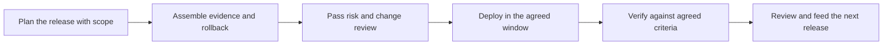

# Release and Change Management for Customers

> **Core skill:** Shipping through the customer's change processes — change boards, risk reviews, freeze periods — so releases land on schedule, with evidence, and rollback is never an improvisation.

## Why This Matters

Deploying the software is the easy half of a release; getting it through the customer's change process is the half that decides the date. Enterprises gate production change through change advisory boards, risk assessments, maintenance windows, and freeze calendars tied to financial close, holidays, audits, and peak business periods. The FDE who treats that machinery as bureaucracy fights it and loses; the one who learns it treats it as the delivery interface — a process to be understood, prepared for, and used well. A release that ships without approval is not faster; it is a trust incident waiting to be discovered.

The customer's change process also does real work for the deployment. It forces the release package to be explicit: what changes, what could go wrong, how it is rolled back, who is on call, what evidence proves it works. Every artifact the change board requires is a question the FDE should be able to answer anyway. The difference between a smooth release train and a stream of emergencies is rarely engineering quality — it is whether release planning, evidence, and rollback were done as part of the work or improvised the night before the window.

Over an engagement, release mechanics become a competitive advantage for the FDE team. The first release walks the path and documents it; subsequent releases reuse the request templates, the approval routes, the rollback rehearsals, and the communication cadence. Release velocity in a customer account is mostly organizational memory — and the FDE is the person who either builds it or spends every release rebuilding it.

## The Customer Release Lifecycle

| Stage | What It Looks Like | The FDE's Role |
|-------|--------------------|----------------|
| Request and plan | A change request describing scope and impact | Write it in the customer's language, with their risk taxonomy |
| Risk assessment | Security, operations, and business reviewers | Provide evidence: test results, data effects, rollback plan |
| Approval | Change board decision, often on a fixed calendar | Attend when needed; answer questions precisely |
| Scheduling | Window assigned within freeze calendars and calendars of key staff | Protect the window; confirm dependencies a week ahead |
| Deployment window | Execution inside a bounded, staffed window | Run the scripted plan; call success or rollback on evidence |
| Verification | Post-change checks against agreed criteria | Verify with the customer, not for them |
| Post-release review | Observations and follow-ups logged | Feed findings into the next release and the runbook |

## Release Trains and Freeze Calendars

| Approach | How It Works | Trade-offs |
|----------|--------------|------------|
| Ad-hoc releases | Ship when ready, request a window each time | High process overhead per release; approval fatigue |
| Batched release train | Fixed cadence — monthly or quarterly — collects changes | Predictable effort; small fixes may wait |
| Hotfix and emergency path | Expedited approval for urgent fixes | Preserves production; abusing it erodes the process |
| Freeze periods | No changes during close, audits, or peak seasons | Plan around; use the freeze to prepare and rehearse |

Practical rule: publish the release calendar for the next quarter and negotiate it with the customer's change coordinator, so both sides plan the same dates. Surprises in release management are almost always calendar surprises.



## What Every Release Package Needs

| Artifact | Purpose | Common Failure If Missing |
|----------|---------|---------------------------|
| Release notes | States what changes and for whom, in plain language | Business surprises and support confusion |
| Rollback plan | A tested way back, with a decision owner and trigger | Rollback improvised during the window |
| Test evidence | Proof against agreed criteria, on customer-shaped data | Review rejection or conditional approval |
| Data and migration notes | What happens to existing data, reversibility | Data loss discovered after the window closes |
| Communication plan | Who is told what, before, during, and after | Users discover changes by breaking |
| Runbook updates | Procedures adjusted to the new version | Operators following stale steps |

## Practical Applications

### Release Readiness Checklist

- [ ] The change request is written in the customer's risk and impact language
- [ ] Rollback is defined, rehearsed, and has a named decision owner
- [ ] Test evidence matches the criteria the reviewers will actually apply
- [ ] The window is confirmed against freeze calendars and key staff availability
- [ ] Communication to users and support is scheduled before, during, and after
- [ ] Runbooks and monitoring are updated as part of the release, not after
- [ ] Post-release review is scheduled before the change is deployed

### Change Request Summary Template

```markdown
## Change Request — <release, date, change id>

| Field | Value |
|-------|-------|
| Scope of change | <components, versions, customer impact> |
| Business reason | <why now> |
| Risk level and rationale | <per the customer's taxonomy> |
| Test evidence | <what was tested, criteria, results> |
| Backup and rollback | <method, decision owner, trigger conditions> |
| Window and duration | <date, time, expected length> |
| Communication | <audiences, channels, times> |
| Verification | <checks after deploy, who signs off> |
```

## Common Pitfalls

| Pitfall | Why It Is a Problem | Better Approach |
|---------|---------------------|-----------------|
| **Treating change control as an enemy** | Shadow releases eventually surface as trust incidents | Work inside the process and improve it from within |
| **Rollback as an afterthought** | The worst moment to design a way back is during failure | Rehearse rollback before every significant release |
| **Evidence mismatched to criteria** | Approval stalls on formalities nobody prepared | Ask reviewers what they need, then produce exactly that |
| **Ignoring freeze calendars** | Requests die on arrival during close or audit weeks | Plan the calendar a quarter ahead with the change coordinator |
| **Skipping user communication** | Users experience changes as breakage | Include communications in the release plan, not the afterthought |
| **One-off releases every time** | Ten releases cost ten times the process effort | Build a release train with a fixed cadence and reusable package |

## Success Indicators

- Releases land inside their approved windows without emergency escalation
- The change board approves with questions that are easy to answer because evidence was prepared
- Rollback remains untested in production because plan quality keeps it unnecessary
- Release effort per change falls as templates and the calendar mature
- Users learn about changes from communication, not from incidents

## Related Topics

- [[03_Deployment_Models_and_Environments]]
- [[06_Operational_Handover_and_Runbooks]]
- [[07_Production_Incidents_at_Customer_Sites]]
- [[career-path/12_Technical_Program_Manager/05_Stakeholder_Alignment/00_overview|Stakeholder Alignment (TPM)]]
- [[software-engineering-note/06_Software_Engineering_Operations/Fundamental/13 CI CD Pipelines|CI CD Pipelines]]

## Summary

Release and change management for customers is the discipline of shipping on the customer's terms: understand their approval machinery, write requests in their language, assemble evidence and rollback plans with the same care as the code, and negotiate a release calendar both sides can plan against. Done well, it converts the change process from a gate that blocks delivery into a rhythm that makes delivery predictable — and every release makes the next one cheaper.
