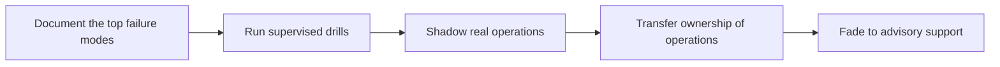

# Operational Handover and Runbooks

> **Core skill:** Making the system runnable by the customer's own teams — documentation that gets used, drills that build muscle, and a handover plan that survives staff turnover.

## Why This Matters

A system that only the FDE can run is not a deployment — it is a dependency with a monthly invoice. The end state of forward-deployed work is the customer operating their own system: deploying its changes, watching its health, handling its known failure modes, and knowing when to escalate. Handover is what converts the FDE from operator to advisor, and it is a phase with its own plan, timeline, and exit criteria — not a folder of documents emailed at go-live. Teams that treat handover as a deliverable rather than a process discover, months later, that knowledge never actually transferred.

What transfers in handover is broader than steps. It includes access and credentials, ownership of monitoring and alerts, decision rights over restarts and changes, the vendor escalation path, and the hard-won knowledge of which problems are routine and which are signals of something worse. A runbook covers the procedural part; the ownership map covers the organizational part. Both need to exist, and both need to be tested, because an untested runbook is a rumor about operations rather than a capability.

Receivers learn by doing. Reading documentation builds recognition; running the operations builds competence. The handover plan therefore works through a ramp: watch the FDE do it, run it jointly, run it alone with the FDE watching, then run it alone. Staff turnover is the true test — after the original recipients move on, is the system still operable? That question turns handover from a polite ritual into an engineering requirement.

## What Handover Actually Transfers

| Dimension | Weak Handover | Strong Handover |
|-----------|---------------|-----------------|
| Knowledge | Architecture documents nobody reads | Runbooks written against the real failure modes; training on the top ones |
| Access | FDE retains admin; customer has read-only | Customer holds production access; FDE's access is scoped and time-bound |
| Monitoring | Alerts route to the vendor team | Alerts route to the customer's operations, with agreed thresholds |
| Ownership | Everything escalates to the FDE | Named owners for each component and integration |
| Decision rights | Customer asks permission to restart | Customer restarts within documented rules; escalation for the rest |
| Vendor path | The FDE's phone number | A support process, with severity definitions and expectations |

## Writing Runbooks That Get Used

| Runbook Element | Content | Common Failure If Missing |
|-----------------|---------|---------------------------|
| Purpose and scope | What the procedure covers and when to run it | The runbook is applied at the wrong moments |
| Preconditions | Access, tools, data state, and permissions required | The procedure stalls halfway at 2 a.m. |
| Steps with expected output | Each step, plus what success looks like | Operators cannot tell success from failure |
| Verification | Checks that prove the situation resolved | Problems are declared fixed but return |
| Escalation | Who to contact, when, with what information | Incidents linger at the wrong team |
| Rollback or abort | How to stop and revert safely | Improvised responses under pressure |
| Version and owner | Who maintains it and when it was last exercised | The runbook silently ages out of truth |



The fade from doing to advising is deliberate: each phase removes the FDE from the critical path until the customer's team is the critical path.

## Drills and the Fade-Out Plan

| Phase | Who Runs the Operation | Typical Content | Exit Criterion |
|-------|------------------------|-----------------|----------------|
| Instruction | FDE, customer watches | Normal operations and top failure modes explained and demonstrated | Recipients can describe the system's failure surface |
| Joint operation | FDE and customer together | Real routine operations, one supervised incident drill | Recipients complete procedures with coaching only |
| Supervised independence | Customer runs, FDE available | Real keystrokes by the customer; FDE observes silently | Recipients resolve routine failures without prompting |
| Ownership | Customer alone | Full scope within the support agreement | Escalations are by the agreed path, not by habit |
| Advisory | Customer alone; FDE consulted | Improvement and extension work | Support tickets match the agreement, not the relationship |

## Practical Applications

### Handover Readiness Checklist

- [ ] Runbooks cover the failure modes actually seen during field testing and pilot
- [ ] Each runbook was exercised by the receiving team at least once, supervised
- [ ] Monitoring and alerting reach the customer's operations team, with agreed thresholds
- [ ] Production access is held by the customer; the FDE's access is scoped and time-bound
- [ ] Every component and integration has a named owner on the customer side
- [ ] The support path — severities, hours, contact routes — is documented and agreed
- [ ] A fade-out schedule exists with exit criteria, not just good intentions

### Runbook Template

```markdown
## Runbook — <scenario>

| Field | Value |
|-------|-------|
| Purpose | <what this procedure covers> |
| When to use | <trigger and severity> |
| Preconditions | <access, tools, state> |
| Steps | <numbered steps with expected output per step> |
| Verification | <checks that prove resolution> |
| Escalation | <who, when, with what evidence> |
| Abort or rollback | <safe stop and revert> |
| Owner and review date | <name, next exercise date> |
```

## Common Pitfalls

| Pitfall | Why It Is a Problem | Better Approach |
|---------|---------------------|-----------------|
| **Documentation dump at go-live** | Pages nobody has run are not procedures | Write runbooks from real failure modes and exercise each one |
| **Runbooks without expected output** | Operators cannot judge success from failure | State what good looks like after every step |
| **Keeping admin access** | The FDE stays on the critical path forever | Transfer production access; scope your own to the agreement |
| **Alerts routed to the vendor** | The customer never builds operational muscle | Route alerts to their operations, with thresholds they own |
| **No drills** | The first real incident doubles as the first training | Schedule supervised drills before go-live |
| **Unowned components** | Problems float between teams unresolved | Assign a named owner per component and integration |

## Success Indicators

- The customer's own teams deploy routine changes without the FDE present
- Known failure modes are resolved from runbooks before escalating
- Alerts and decisions land with the customer's operations, on their on-call rotation
- Turnover of the original recipients does not reopen the FDE dependency
- The FDE's time shifts from operating the system to improving it and expanding scope

## Related Topics

- [[05_Release_and_Change_Management_for_Customers]]
- [[07_Production_Incidents_at_Customer_Sites]]
- [[career-path/07_SRE_and_Platform_Engineer/00_overview|SRE and Platform Engineer]]
- [[career-path/16_Developer_Advocate_and_Technical_Consultant/00_overview|Developer Advocate and Technical Consultant]]
- [[software-engineering-note/14_Software_Engineering_Professional_Practice/03_Communication_Skills|Communication Skills]]

## Summary

Operational handover and runbooks are how the FDE works themselves out of a job the customer should own: transfer knowledge, access, monitoring, ownership, and decision rights through a planned ramp of drills and supervised independence. Runbooks written against real failure modes, exercised by the receiving teams, and tied to a fade-out schedule with exit criteria turn a deployment into a capability — one that keeps working after staff turnover and long after the FDE has moved to the next field.
