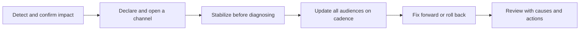

# Production Incidents at Customer Sites

> **Core skill:** Managing incidents when your system is the event — stabilizing fast, communicating honestly on a cadence, fixing the cause, and leaving the relationship stronger than before.

## Why This Matters

Every deployed system eventually stars in a customer incident. The invoice run fails on quarter-end close. The integration stalls during the CEO's Monday briefing. The timing is never convenient and the audience is never small. What happens in the first hour — who declares, who stabilizes, who communicates, and who decides — usually determines the damage more than the underlying defect does. An hour of clean command and honest updates leaves a customer thinking "they handle problems well." An hour of silence and improvisation leaves a customer asking whether the deployment should exist at all.

Incidents at customer sites have a distinctive shape. The FDE is usually a bridge between two incident organizations: the customer's operations teams, following their processes, and the FDE's own engineering teams, holding the deep knowledge. Neither side has the full picture, and both need a single voice that translates: what is known, what is unknown, what is being done, when the next update comes. That voice is often the FDE. Command in this context means clarity — declaring severity, assigning roles, protecting the fixers from interruption, and keeping every audience informed at the pace they need.

The aftermath is where trust is rebuilt or lost. A postmortem that names systemic causes, produces real corrective actions with owners, and visibly improves detection and response converts an incident into evidence of competence. The FDE's instinct to move on quickly is exactly wrong: the postmortem, shared honestly with the customer, is one of the highest-return activities in the entire engagement.

## Incident Response in a Customer Context

| Phase | Actions | Communication |
|-------|---------|---------------|
| Detect and declare | Confirm impact from real signals, declare severity, open a channel | Alert the customer's on-call; state facts and unknowns |
| Assess | Determine scope: who and what is affected, since when | First update: impact, current understanding, next update time |
| Stabilize | Mitigate before diagnosing: failover, rollback, feature disable, throttle | Say what was done and its effect, not just that it was done |
| Diagnose | Isolate the cause with evidence while mitigation holds | Keep the agreed cadence even when there is nothing new |
| Resolve | Fix forward or return to a known-good state; verify against criteria | Announce resolution, residual risk, and monitoring plan |
| Review | Postmortem with timeline, causes, and corrective actions | Share the written review with the customer and commit to actions |

Declare early and downgrade later. An incident channel with no incident burns less trust than an incident discovered by the customer.

## Communication During an Incident

| Audience | What They Need | Cadence |
|----------|----------------|---------|
| Customer operators | Technical state, what to do or not do, workarounds | Frequent, even when unchanged — silence reads as chaos |
| Customer business and executives | Impact in business terms, confidence in the response, next milestone | At declaration, at stabilization, at resolution |
| Your own engineering team | Full technical detail, evidence, and what is needed from them | Continuous in the technical channel |
| Account and support teams | Facts they will be asked about, and the approved narrative | Before they are surprised by the customer |



## Making the Postmortem Count

| Section | Content | Test of Quality |
|---------|---------|-----------------|
| Timeline | Facts with timestamps, from first signal to resolution | A reader can reconstruct the incident without asking questions |
| Impact | What the business lost or risked, in their terms | Matches what the customer experienced, not a generous version |
| Causes | Technical and organizational, including why detection and response worked as they did | Names systems and gaps, never individuals |
| What worked | Honest account of what limited the damage | Specific enough to reinforce |
| Corrective actions | Changes with owners, dates, and verification | Each action prevents or shortens a class of incidents |
| Customer-visible commitments | What the customer will see change, and when | Tracked to completion, not filed and forgotten |

## Practical Applications

### Incident Response Checklist

- [ ] Severity is declared against agreed definitions, not negotiated in the moment
- [ ] A single incident channel exists with a named coordinator and clear roles
- [ ] Stabilization options are on the table before diagnosis begins
- [ ] Update cadence is set at declaration and honored even when there is no news
- [ ] The customer's business impact language is used with business audiences
- [ ] Resolution is verified against the same signals that detected the incident
- [ ] Postmortem is scheduled, written, shared, and tracked to action completion

### Incident Log Template

```markdown
## Incident — <title, date, severity>

| Field | Value |
|-------|-------|
| Detected by | <monitoring, user report, partner> |
| Impact | <who and what affected, in business terms> |
| Timeline | <timestamps: detect, declare, stabilize, resolve> |
| Stabilization | <what was done and its effect> |
| Root cause | <systemic cause, not a person> |
| Detection gap | <why it was found when it was> |
| Corrective actions | <action, owner, date, verification> |
| Customer comms | <what was shared and when> |
```

## Common Pitfalls

| Pitfall | Why It Is a Problem | Better Approach |
|---------|---------------------|-----------------|
| **Diagnosing before stabilizing** | The customer keeps bleeding while you study the wound | Mitigate first, then find the cause |
| **Silent stretches** | Silence is read as things being out of control | Keep the cadence even with no new information |
| **Speculating publicly** | Wrong theories broadcast early destroy credibility | Share facts, label hypotheses as hypotheses |
| **Fixing privately, closing quietly** | The customer never learns what happened or what changed | Review openly, with actions and follow-through |
| **Blaming individuals** | People hide problems next time; causes go unnamed | Write systemic causes; fix processes and detection |
| **No follow-through on actions** | The same incident returns wearing a new date | Track corrective actions to verified completion |

## Success Indicators

- Incidents are declared early and coordinated through a shared channel with clear roles
- Customers describe the response as calm and informative even when the incident was serious
- Root-cause fixes reduce recurrence of the same failure class
- Detection improves after every incident: earlier signals, better alerts
- Postmortem actions complete on schedule and are visible to the customer

## Related Topics

- [[04_Field_Debugging_and_Troubleshooting]]
- [[06_Operational_Handover_and_Runbooks]]
- [[06_Customer_Communication_and_Executive_Influence/00_overview|Customer Communication and Executive Influence]]
- [[career-path/07_SRE_and_Platform_Engineer/00_overview|SRE and Platform Engineer]]
- [[body-of-knowledge/CyBOK/01_Risk_Management_and_Governance|Risk Management and Governance]]

## Summary

Production incidents at customer sites are the moments the deployment's credibility is stress-tested in public: stabilize before diagnosing, communicate on an honest cadence to every audience in their own language, resolve with verification, and review with systemic causes and completed actions. Handled with discipline, an incident becomes proof that the system is operated seriously — and the relationship that emerges is stronger than the one that existed before the incident began.
