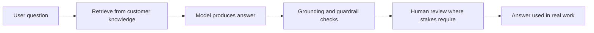

# AI Systems in Customer Environments

> **Core capability:** The FDE deploys AI capabilities onto customer data and workflows — adapting product AI to field constraints, evaluating quality against the customer's definition of correct, and earning trust where models are probabilistic and stakes are real.

## Why This Matters

The 2025–2026 wave that made forward deployment strategic is the enterprise AI deployment gap. Model capability is abundant; working deployments are rare. Most pilots stall on exactly the ground this path covers: customer data is messier than the demo, definitions of correctness are domain-specific and unpublished, compliance forbids sending data to the vendors the product relies on, and users will not trust a system that is confidently wrong in their professional domain.

An FDE deploying AI is therefore a translator of three languages at once: the model's behavior and limits, the customer's domain knowledge, and the engineering reality of the deployment environment. The product team supplies patterns (retrieval, tool use, guardrails) developed on product conditions. The FDE adapts them to conditions the product team never saw: an on-prem model gateway, a glossary of internal jargon, a quality bar defined by a regulator, or an evaluation that must run inside the customer's network.

The trust dynamics are unique to AI. Everything a customer accepts about deterministic software ("I will test it") meets something new ("it will be right most of the time, and we will manage the rest"). The FDE's job is not to promise perfection but to build the scaffolding around imperfection: evaluation, review workflows, escalation paths, and honest communication about confidence — so the capability can be used, not just admired.

## Topics in This Capability Area

| Topic | Core Skill | When It Matters |
|-------|------------|-----------------|
| [[01_Deploying_LLM_Applications_in_Enterprises]] | Adapting product AI patterns to customer environments | Every AI deployment |
| [[02_RAG_with_Customer_Data]] | Grounding models in customer knowledge with real quality control | Whenever output must reflect the customer's world |
| [[03_Field_Evaluation_and_Quality]] | Evaluating with the customer's data and their definition of correct | Before any AI capability is trusted with real work |
| [[04_Model_Constraints_and_Data_Residency]] | Working within vendor, network, and sovereignty limits | Every AI design in regulated customers |
| [[05_Human_in_the_Loop_Workflows]] | Designing review and escalation around probabilistic output | Throughout rollout to real users |
| [[06_Cost_Latency_and_Scale_in_the_Field]] | Making AI affordable and fast enough for the real workload | From pilot to production usage |
| [[07_Agents_and_Workflow_Automation_in_Production]] | Deploying autonomy with blast-radius control | When automation, not assistance, is the ask |

## Grounding the Model in the Customer's World

Every arrow is a place quality is won or lost — and every one of them is the FDE's to instrument.

## Practical Applications

### Field AI Deployment Checklist

- [ ] The customer's definition of "correct" is written down with real examples — including edge cases
- [ ] Evaluation runs on customer data, not product demo data, and its results were reviewed with the customer
- [ ] Data residency and vendor constraints are confirmed with the customer's security function, in writing
- [ ] A human review path exists for outputs that carry legal, financial, or safety weight
- [ ] Cost and latency at realistic usage are measured, not extrapolated from pilot traffic
- [ ] Users have been told, honestly, what the system does well and where it must not be trusted yet

## Common Pitfalls

| Pitfall | Why It Is a Problem | Better Approach |
|---------|---------------------|-----------------|
| **Demo-grade evaluation** | Flattering demos collapse in real usage | Evaluate on customer data with customer criteria |
| **Ignoring residency rules** | A single violation can end the deployment | Confirm constraints before architecture, in writing |
| **Answering instead of escalating** | Confidently wrong output destroys trust fastest | Design review and escalation paths deliberately |
| **Pilot economics extrapolated** | Production usage changes the cost curve | Measure at realistic scale before committing |
| **Skipping the trust conversation** | Users either over-trust or never adopt | Teach the system's limits as part of rollout |

## Success Indicators

- The customer can describe, accurately, what the AI does well and where review is required
- Evaluation evidence exists on customer data and both sides cite the same numbers
- Review workflows catch and route genuinely wrong outputs without drowning users
- Usage grows because trust grew — not because of a mandate
- The next AI deployment in the same account reuses this one's evaluation harness

## Related Capabilities

- [[03_Integration_and_Deployment_Engineering/00_overview|Integration and Deployment Engineering]]: the deployment substrate for every AI capability
- [[05_Enterprise_Navigation_Security_and_Compliance/00_overview|Enterprise Navigation: Security and Compliance]]: where residency and vendor constraints are decided
- [[01_Field_Discovery_and_Problem_Framing/00_overview|Field Discovery and Problem Framing]]: the domain understanding that evaluation depends on
- [[career-path/18_Applied_AI_Engineer/00_overview|Applied AI Engineer]]: the product-side discipline this capability fields
- [[career-path/18_Applied_AI_Engineer/04_AI_Security_and_Guardrails/00_overview|AI Security and Guardrails (Applied AI Engineer)]]: guardrail patterns the FDE adapts

## Summary

AI systems in customer environments is the FDE capability at the center of the current deployment wave: adapting product AI to customer conditions, grounding it in customer data, evaluating it against the customer's definition of correct, working within residency and vendor constraints, and building review workflows that make imperfection manageable. The goal is not a flawless model — it is a capability the customer can actually trust with real work.
