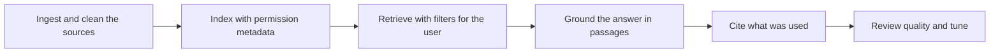

# RAG with Customer Data

> **Core skill:** Grounding models in customer knowledge with real quality control — index the right sources, respect permission boundaries, keep the corpus fresh, and prove retrieval quality on the customer's own material.

## Why This Matters

Customer knowledge lives everywhere except in one place: policy documents in a document management system, procedures on a wiki that half the company edits, answers buried in resolved tickets, contracts in PDF folders, and the definitive version inside the head of someone who has been there twenty years. A retrieval-augmented system that grounds its answers in that material is the most common shape of enterprise AI deployment — and the most common shape of failure. When a grounded system answers wrongly, the failure is usually retrieval: the decisive passage never reached the model, or the wrong passage did.

Customer data adds constraints that product RAG never meets. Documents carry permissions: a retrieval system that ignores access rules is a data-leak machine wearing a helpful face. Material is stale in ways nobody tracks. The same policy exists in three versions across two systems, and the retrieval results must show the current one or cite clearly. Vocabulary is local: acronyms, product names, and internal shorthand that public embeddings handle poorly and that no public corpus explains.

Quality control is therefore the FDE's real deliverable. Indexing is a few days; the engagement is won or lost on whether retrieval returns the correct, current, permitted passage — and whether anyone can prove it. That proof comes from retrieval evaluation on customer questions with known answers, reviewed with the customer's experts, and re-run whenever sources, chunking, or models change.

## The Customer Corpus

| Source | Typical State | Retrieval Risk | Treatment |
|--------|---------------|----------------|-----------|
| Policy documents | Versioned, formal, duplicated across systems | Stale versions retrieved as current | Track version and effective dates; prefer the newest, cite clearly |
| Wikis and procedures | Actively edited, inconsistent structure | Chunking splits steps from their context | Structure-aware chunking; keep steps with their headings |
| Tickets and resolved cases | Rich knowledge, informal language | Sensitive details mixed with general knowledge | Filter fields; apply the same permissions as the ticketing system |
| PDFs and scans | Mixed text quality, tables, forms | OCR noise and layout chaos degrade retrieval | OCR with review; table-aware extraction where answers live in tables |
| Structured records | Clean fields, identifiers, codes | Join semantics lost in text chunks | Retrieve records as records, not text blurbs, where possible |
| Email and chat | Decision history, unwritten rules | Permission and retention sensitivity | Include only where explicitly allowed; respect retention |

## Building Retrieval That Respects Boundaries

| Concern | Naive Approach | Field-Correct Approach |
|---------|----------------|------------------------|
| Permissions | One index, filtered after retrieval | Filter at query time by the requester's role, and verify with tests |
| Freshness | Index once at deployment | Incremental updates on source change or a scheduled refresh, with lag monitoring |
| Duplicates and versions | Everything indexed at equal weight | Deduplicate and version-rank; surface effective dates in citations |
| Jargon | Public embeddings only | Add a customer glossary; test retrieval on real questions using real acronyms |
| Citations | Answer with no sources | Every claim traceable to a passage the user can open |

## Quality Control for Grounded Answers

| Check | What It Catches | Method |
|-------|-----------------|--------|
| Retrieval recall on known questions | The right passage never arriving | A labeled set of questions with the passages that answer them |
| Citation accuracy | Answers citing passages that do not support them | Spot review of generated citations against sources |
| Permission behavior | Users seeing content they should not | Test with accounts across roles before rollout |
| Freshness behavior | Old versions ranked above current | Re-query after source updates; verify the new version wins |
| Refusal behavior | Confident answers where no source exists | Questions with no answer in the corpus; check refusal or escalation |



## Practical Applications

### Customer RAG Readiness Checklist

- [ ] A source inventory exists, with owner, classification, and update cadence for each
- [ ] Permission mapping was tested with accounts from at least two roles
- [ ] A retrieval evaluation set exists with real customer questions and known answers
- [ ] Freshness and lag are monitored per source, with alerts that name the source
- [ ] Citations resolve to passages the user is permitted to open
- [ ] Refusal and escalation behavior was tested on questions the corpus cannot answer
- [ ] The corpus refresh process has an owner on the customer side

### Corpus Inventory Template

```markdown
## Corpus Inventory — <source>

| Field | Value |
|-------|-------|
| Owner | <team or person> |
| Location and format | <system, file types> |
| Classification | <public, internal, restricted> |
| Update cadence | <how content changes and when> |
| Permission model | <who may see what, mapped how> |
| Quality issues | <OCR, duplicates, versions, gaps> |
| Retrieval priority | <primary or secondary source for which topics> |
```

## Common Pitfalls

| Pitfall | Why It Is a Problem | Better Approach |
|---------|---------------------|-----------------|
| **Ignoring document permissions** | A helpful answer becomes a compliance incident | Filter retrieval by the requester's role and test it |
| **Index once and forget** | Answers cite weeks-old policy as current | Incremental refresh with lag monitoring per source |
| **Ragged chunking of procedures** | Steps arrive without context and mislead | Chunk by structure; keep steps with their headings |
| **Public-vocabulary embeddings only** | Real questions use acronyms the embedding never learned | Add a customer glossary and test on real phrasing |
| **No citation discipline** | Users cannot verify, so they stop trusting entirely | Require traceable citations for every claim |
| **Skipping the no-answer cases** | The system invents answers where none exist | Test refusal and escalation on unanswerable questions |

## Success Indicators

- Retrieval evaluation on real customer questions improves and is reviewed with the customer
- Permission tests pass across roles, and security signs off without exception lists
- Freshness monitors catch stale sources before users cite them
- Users click citations and verify answers as a normal habit
- Knowledge gaps surface as corpus requests — a sign retrieval is being trusted enough to probe

## Related Topics

- [[01_Deploying_LLM_Applications_in_Enterprises]]
- [[03_Field_Evaluation_and_Quality]]
- [[04_Model_Constraints_and_Data_Residency]]
- [[career-path/18_Applied_AI_Engineer/01_LLM_Application_Patterns/00_overview|LLM Application Patterns (Applied AI)]]
- [[01_Field_Discovery_and_Problem_Framing/00_overview|Field Discovery and Problem Framing]]

## Summary

RAG with customer data is quality control wearing engineering clothes: inventory the sources, index with permission and version metadata, retrieve through the user's access filters, and prove with evaluation that the right passage surfaces for real questions. The model is rarely the problem in a grounded system — retrieval is — so the FDE invests where the failures actually live: permissions, freshness, vocabulary, chunking, and citations, reviewed on the customer's own material with the customer's own experts.
