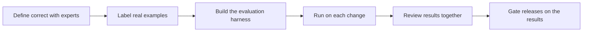

# Field Evaluation and Quality

> **Core skill:** Evaluating with the customer's data and their definition of correct — a written, shared standard tested on real examples before the capability is trusted with real work.

## Why This Matters

"Correct" in a customer's domain is not a default. A medical coder, a contracts lawyer, and a plant engineer each carry a definition of a good answer that lives in their training, their procedures, and their senior experts — and nowhere a model can read it. Product evaluation suites measure general quality; field evaluation measures whether outputs would pass review by the people who will actually sign off. The gap between those two is where pilots fail: the demo impressed, the trial on real work was rejected, and nobody had agreed in advance what "good enough" would look like.

Field evaluation is also a trust instrument, not just a test. When the customer's experts help define the evaluation set and review its results, correctness stops being the vendor's private claim and becomes a shared standard both sides can cite. The moment both parties look at the same numbers and agree what they mean is the moment adoption gets a foundation. An evaluation the customer cannot see, run on data they do not recognize, produces numbers nobody believes.

Operationally, field evaluation must fit inside the customer's constraints: data that cannot leave their network, experts with no spare hours, annotation tooling nobody wants to learn. The FDE designs for that reality — small, sharp evaluation sets built from real cases, harnesses that run inside the environment, and review sessions short enough that the right people actually attend. The set grows from review sessions and production feedback, and it becomes the automated gate that every later change must pass.

## Defining Correct with the Customer

| Step | Activity | Output |
|------|----------|--------|
| 1 | Interview the experts who will judge the outputs | Their vocabulary for quality and failure |
| 2 | Collect real examples: good, bad, and borderline | A candidate pool drawn from actual work |
| 3 | Classify error types and their severity | A taxonomy: which mistakes matter and which merely annoy |
| 4 | Write the rubric in their words | A standard both sides can read and apply |
| 5 | Confirm with sign-off | The customer owns the definition, not the vendor |

Guidance: a small set of high-quality examples with agreed labels beats a large set with vague ones. What matters is whether results predict the customer's judgment, not how many rows the spreadsheet holds.

## Building the Field Evaluation Set

| Element | Guidance | Why |
|---------|----------|-----|
| Source | Real cases from real workflows, with permission to use | Demo data flatters; real cases reveal |
| Selection | Cover the common cases and the known hard edge cases | The average is easy; the edges carry the risk |
| Labels | The customer's definition, applied by their experts | Vendor-labeled truth is not the customer's truth |
| Severity | Errors weighted by consequence, not by count | A rare dangerous error outweighs frequent typos |
| Ownership | A named customer-side reviewer and refresh cadence | Sets age as the business changes |
| Separation | Tuning examples kept apart from evaluation examples | Otherwise improvement is memorization |

## Running Evaluation in Customer Constraints

| Constraint | Approach |
|------------|----------|
| Data cannot leave the environment | Run the harness inside the boundary; return metrics, never raw data |
| Experts have no time | Short sessions with pre-selected, high-signal examples |
| No annotation tooling | A spreadsheet or simple internal form beats an unusable platform |
| Environments with restricted tooling | Package the harness as something the customer's own team can run |
| Results must convince management | One page: rubric, set, results, examples of what failed |



The gate matters: an evaluation that does not block a release is a report. The FDE and the customer agree which regressions stop a deployment and which trigger review.

## Practical Applications

### Field Evaluation Checklist

- [ ] The rubric is written in the customer's words and signed off by their experts
- [ ] The evaluation set draws from real cases, with permissions recorded
- [ ] Error severity is weighted by business consequence, not frequency alone
- [ ] The harness runs inside the customer's constraints and produces reviewable output
- [ ] Results were reviewed with the customer, and both sides cite the same numbers
- [ ] Regressions that block a release are defined in advance
- [ ] The set has an owner and a refresh cadence on the customer side

### Evaluation Record Template

```markdown
## Evaluation Record — <capability, date, version>

| Field | Value |
|-------|-------|
| Evaluation set | <name, size, source, last refresh> |
| Rubric version | <link or location, approvals> |
| Severity weights | <which error classes are blocking> |
| Results | <scores by error class, notable failures> |
| Deltas vs last run | <improvements and regressions> |
| Customer review | <who reviewed, date, comments> |
| Release decision | <ship, hold, or conditional with actions> |
```

## Common Pitfalls

| Pitfall | Why It Is a Problem | Better Approach |
|---------|---------------------|-----------------|
| **Demo-grade evaluation** | Flattering samples collapse at first real use | Evaluate on real customer cases with customer labels |
| **Vendor-only labels** | The customer never agreed what correct means | Their experts label; their rubric decides |
| **Counting errors without severity** | Dangerous rare mistakes hide behind trivial frequent ones | Weight errors by business consequence |
| **Evaluating once at acceptance** | Quality drifts as data and prompts change | Run on every change; refresh the set on a cadence |
| **Numeric results without examples** | Numbers do not persuade; concrete failures do | Present failing examples alongside scores in review |
| **No blocking threshold** | Regressions ship because nothing gates them | Agree in advance what stops a release |

## Success Indicators

- The customer's experts can state the rubric in their own words and do so consistently
- Evaluation results on customer data are cited by both sides in the same terms
- Regressions are caught before users see them, by the gate rather than by complaints
- The evaluation set grows from production findings and review sessions
- The next capability in the account starts from this rubric and harness

## Related Topics

- [[02_RAG_with_Customer_Data]]
- [[05_Human_in_the_Loop_Workflows]]
- [[01_Field_Discovery_and_Problem_Framing/00_overview|Field Discovery and Problem Framing]]
- [[career-path/18_Applied_AI_Engineer/03_Evaluation_and_Observability/00_overview|Evaluation and Observability (Applied AI)]]
- [[software-engineering-note/12_Software_Quality/Software Quality Overview]]

## Summary

Field evaluation and quality is the discipline of pinning down what "correct" means in a customer's domain, then proving machine output against it on real examples: a rubric in their words, labels from their experts, severity by business consequence, and a harness that runs inside their constraints. The evaluation is simultaneously a gate, an improvement signal, and a trust artifact — the shared standard that lets a probabilistic system be trusted with defined work, honestly and with evidence.
