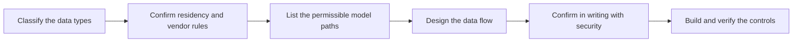

# Model Constraints and Data Residency

> **Core skill:** Working within vendor, network, and sovereignty limits — choosing where models run and what data may reach them, and confirming it in writing before the architecture is fixed.

## Why This Matters

Regulated customers carry rules that have nothing to do with model quality and everything to do with where data can exist. Personal data may not leave a jurisdiction. Certain vendors may not receive certain classifications. Logs may not retain raw content beyond a window. Support engineers in some regions may not access production systems. These are legal and contractual constraints, verified by auditors, and a single violation can end a deployment — not with a failed test, but with a compliance finding that closes the project. The FDE treats them as design inputs of the highest priority, confirmed in writing with the customer's security and compliance functions before the architecture hardens.

The constraint space is larger than "which cloud region." It includes the approved vendor list, network egress policy, retention and deletion obligations, model licensing terms, classification tiers and their handling rules, and even who inside the vendor's own company may see what. A deployment design must satisfy all of them simultaneously, and the design that satisfies them is often less elegant than the product default: a regional endpoint, a customer-hosted model, a gateway that redacts fields before egress, or a fully local deployment with no external calls at all.

Working within constraints is a creative discipline, not a defeat. There is almost always a permissible path to the business outcome — sometimes smaller (a redacted subset feeding a hosted model), sometimes heavier (an open model running on the customer's own infrastructure). The FDE's job is to find the permissible path early, prove it with the security function rather than around them, and build the controls that keep the deployment compliant on its worst day, not just its designed one.

## Mapping the Constraint Space

| Constraint | What It Forbids | Design Response |
|------------|-----------------|-----------------|
| Data residency | Processing or storing data outside a jurisdiction | Regional endpoints or in-country hosting; verify where logs land |
| Vendor approval lists | Sending data to unapproved providers or models | Route only to approved models; document the data path per call |
| Network egress | Unrestricted outbound connections | Allowlisted endpoints through an internal gateway |
| Retention and deletion | Keeping raw content beyond agreed windows | Configure retention down to trace content, not just tables |
| Model licensing | Certain commercial uses or redistribution | Confirm terms with procurement before integration choices freeze |
| Classification tiers | Higher tiers reaching lower-trust systems | Tier-aware routing: the model path changes with the data class |
| Support access | Personnel from restricted regions touching production | Access paths and support tooling that respect the boundary |

## Where the Model Can Run

| Option | Data Path | When It Fits |
|--------|-----------|--------------|
| Vendor API, direct | Content leaves the customer boundary to the vendor | Only where classification and residency permit it explicitly |
| Vendor API, approved region | Content reaches the vendor inside a permitted geography | Residency rules with an appetite for hosted models |
| Customer gateway to approved vendor | Content passes through customer controls first | Egress policy and inspection requirements |
| Self-hosted model | Content never leaves the customer's infrastructure | Strict residency or vendor restrictions; capability trade-offs accepted |
| Hybrid routing | Data classified; route by class to different paths | Mixed workloads where most data is low-classification |



## Controls That Make Constraints Enforceable

| Control | What It Enforces | How to Verify It |
|---------|------------------|------------------|
| Egress allowlists | Only approved destinations receive traffic | Network tests showing blocked paths fail closed |
| Gateway logging | Every model call is visible to the customer | Review logs together; confirm reviewability without raw content exposure |
| Redaction and classification filters | Fields leave only in permitted form | Test with the highest-classification data the workflow will touch |
| Key management | Customer-held keys where required | Key rotation test; confirm the customer can revoke access |
| Retention settings | Trace content ages out on schedule | Inspect the oldest retained content; confirm deletion works |

## Practical Applications

### Residency and Constraint Checklist

- [ ] Data types in scope are classified, with the customer's taxonomy, before design
- [ ] Residency, vendor, and retention rules are recorded in writing from security and compliance
- [ ] Every model call path is documented with what content crosses which boundary
- [ ] The permissible path was confirmed by the security function, not inferred
- [ ] Controls (allowlists, redaction, retention, keys) are tested, not just configured
- [ ] Support and access paths respect personnel and region restrictions
- [ ] A change in classification or vendor terms triggers a design review, not a silent drift

### Data Flow Record Template

```markdown
## Data Flow Record — <capability, date>

| Field | Value |
|-------|-------|
| Data types in scope | <with classification per type> |
| Boundary crossings | <what content crosses where, per path> |
| Model path | <endpoint or host, region, vendor> |
| Approvals | <who confirmed, in what document, when> |
| Controls | <allowlists, redaction, retention, keys> |
| Verification | <test performed and result> |
| Review trigger | <what change forces re-approval> |
```

## Common Pitfalls

| Pitfall | Why It Is a Problem | Better Approach |
|---------|---------------------|-----------------|
| **Confirming constraints late** | The architecture is built and then ruled impermissible | Confirm in writing before design freezes |
| **Reading policy from a wiki** | Wiki guidance drifts from the enforceable rule | Get the rule from the function that audits it |
| **Verbal-only approvals** | Audits judge documents, not recollections | Record every confirmation with owner, date, scope |
| **Ignoring secondary flows** | Logs, backups, and traces leak what the main path protects | Map every boundary crossing, including observability data |
| **One classification for all data** | Everything gets treated as the most restricted, or the least | Tier the data and route it accordingly |
| **Controls configured but untested** | A misconfigured control looks identical to a working one | Test controls with the data they must stop |

## Success Indicators

- Security and compliance sign off without exceptions or waivers
- The design document and the running system match on every boundary crossing
- Controls are exercised in tests, including a blocked-path failure case
- A change in data class or vendor terms has a defined review path that is actually used
- The next AI deployment in the account inherits the approved data path pattern

## Related Topics

- [[01_Deploying_LLM_Applications_in_Enterprises]]
- [[03_Field_Evaluation_and_Quality]]
- [[06_Cost_Latency_and_Scale_in_the_Field]]
- [[career-path/18_Applied_AI_Engineer/04_AI_Security_and_Guardrails/00_overview|AI Security and Guardrails (Applied AI)]]
- [[career-path/15_Solutions_and_Enterprise_Architect/05_Security_Risk_and_Compliance/00_overview|Security Risk and Compliance (SA)]]

## Summary

Model constraints and data residency turn legal and contractual rules into engineering requirements: classify the data, learn the residency, vendor, and retention rules from the function that enforces them, choose the permissible model path, and build controls that make the constraints true on the system's worst day. Confirmed in writing and verified in tests before design freezes, the constraints stop being obstacles and become the boundary that makes the deployment durable — safe to exist, audit, and extend.
