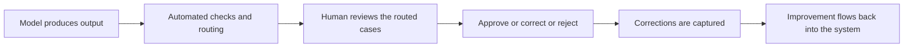

# Human in the Loop Workflows

> **Core skill:** Designing review and escalation around probabilistic output — placing the right human at the right point, with enough context to judge quickly and a path for the cases they cannot.

## Why This Matters

Customers do not need AI that is always right; they need AI they can rely on for defined work. The bridge between the two is workflow: where the human sits, what they see, and what happens when the model is wrong. A capability with no human review is trusted with nothing important until it has earned autonomy; a capability with review at every step is trusted with nothing at all because the review costs more than the work it saves. Finding the placement — review before action for high stakes, review in batches for medium stakes, audit after the fact for low stakes — is the FDE's design problem, and it decides whether adoption grows or stalls.

The review surface is where adoption lives or dies. A reviewer asked to re-do the work is slower than doing it themselves; a reviewer shown a proposed output with sources, a change highlight, and one-click correct-and-route actions is faster than working from scratch. Everything about the surface — what context is attached, what confidence signals are honest, what actions are possible, how corrections are captured — determines whether users experience the system as help or as overhead. Designing that surface is engineering, not decoration.

Review also generates the improvement loop. Every correction is a labeled example for the evaluation set, a candidate for prompt tuning or retrieval fixes, and a signal about where the model should refuse instead of answer. The FDE designs the capture — lightweight, in the flow, without extra meetings — so the system gets better as it is used, and the review burden trends down instead of becoming permanent scaffolding.

## Placing the Human

| Pattern | How It Works | Fits When |
|---------|--------------|-----------|
| Approve before action | Human approves each output before it takes effect | Legal, financial, or safety weight; early rollout |
| Batch review | Outputs queued and reviewed in sessions | Medium stakes with volume; drafting and triage |
| Exception-only review | Only flagged or low-confidence outputs reach a human | High volume, model quality proven on the class |
| Audit after | Actions proceed; a sample is reviewed post hoc | Low stakes, reversible actions, growing trust |
| Autonomy with monitoring | No routine review; drift and anomalies watched | Earned tier; requires the audit trail to exist |

Tiering is the design answer: route by stakes and confidence, not by a single global choice. The same capability can run approve-before-action for one workflow and audit-after for another.

## Designing the Review Surface

| Element | Purpose | Failure If Missing |
|---------|---------|--------------------|
| Source citations | Lets the reviewer verify in seconds instead of re-researching | Review becomes as slow as the work itself |
| Proposed output with diff | Shows exactly what would change | Reviewers miss subtle edits in long text |
| Honest confidence signals | Routes attention to the uncertain cases | Equal treatment wastes time on easy outputs |
| One-click actions | Correct, approve, route to expert | Friction kills the review habit within weeks |
| Reason capture | Records why an output was rejected or edited | The improvement loop starves |
| Queue health metrics | Backlog, age, agreement rate | Review silently becomes a bottleneck |

## Escalation and Feedback Loops

| Signal | Route To | Action |
|--------|----------|--------|
| High-stakes workflow by definition | Domain expert before action | Approve, correct, or reject with reason |
| Low confidence or failed checks | Triage queue | Fast human judgment; capture the case |
| Out of scope or no grounding found | Adjudication or refusal | Escalate rather than answer |
| Recurring correction pattern | FDE and product feedback | Fix prompts, retrieval, or evaluation coverage |
| Unexpected usage pattern | Customer workflow owner | Revisit placement; the review tier may be wrong |



## Practical Applications

### Human in the Loop Checklist

- [ ] Each workflow has a stated review tier based on stakes and reversibility
- [ ] The review surface shows sources, proposed changes, and honest confidence
- [ ] Actions — approve, correct, reject, escalate — take seconds, not minutes
- [ ] Corrections are captured in a form that feeds evaluation and tuning
- [ ] Queue health is monitored: backlog, age, and reviewer agreement
- [ ] Escalation paths to real experts exist and are exercised
- [ ] The tier is reviewed on evidence; tiers can tighten as well as loosen

### Review Workflow Template

```markdown
## Review Workflow — <capability, workflow, tier>

| Field | Value |
|-------|-------|
| Stakes and reversibility | <what a wrong output costs, undo options> |
| Review tier | <approve before action, batch, exception, audit> |
| Reviewer role | <who reviews, with what training> |
| Surface | <what they see: sources, diffs, confidence> |
| Actions | <approve, correct, reject, escalate> |
| Feedback capture | <where corrections go, who uses them> |
| Metrics | <backlog, age, agreement, escalation rate> |
| Tier review date | <when evidence is reviewed again> |
```

## Common Pitfalls

| Pitfall | Why It Is a Problem | Better Approach |
|---------|---------------------|-----------------|
| **Reviewing everything** | Overhead exceeds the value; users route around the system | Tier by stakes; review where judgment adds the most |
| **Reviewing nothing important** | One bad output in a high-stakes workflow destroys trust | Approve-before-action for legal, financial, and safety weight |
| **Bare outputs, no sources** | Verification takes longer than doing the work | Attach citations and diffs to every review |
| **Slow, clunky actions** | The review habit dies of friction in weeks | One-click correct and route; measure review time |
| **Corrections discarded** | The same errors recur; evaluation never grows | Capture reasons and feed them back as labeled examples |
| **Tier set once** | Review burdens calcify; trust never extends | Revisit tiers on evidence at a scheduled cadence |

## Success Indicators

- Review takes seconds per item, and reviewers describe the surface as faster than manual work
- Escalations reach the right experts instead of bouncing between queues
- Correction patterns feed the evaluation set, and repeat errors fall
- Review tiers have loosened on evidence in at least one workflow
- Users can explain which outputs they check and why, without prompting

## Related Topics

- [[03_Field_Evaluation_and_Quality]]
- [[07_Agents_and_Workflow_Automation_in_Production]]
- [[06_Customer_Communication_and_Executive_Influence/00_overview|Customer Communication and Executive Influence]]
- [[career-path/18_Applied_AI_Engineer/06_Responsible_AI_and_Governance/00_overview|Responsible AI and Governance (Applied AI)]]
- [[career-path/14_Product_Manager/01_Problem_Discovery/00_overview|Problem Discovery (PM)]]

## Summary

Human in the loop workflows are how probabilistic output becomes dependable work: tier review by stakes and reversibility, build a surface where verification takes seconds, route escalations to real experts, and capture every correction into the improvement loop. The design goal is not permanent supervision but earned autonomy — scaffolding that makes the capability trustworthy today and, evidence by evidence, lets the customer loosen the review where quality has proven itself.
