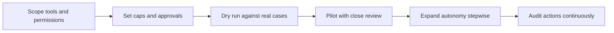

# Agents and Workflow Automation in Production

> **Core skill:** Deploying autonomy with blast-radius control — scoped tools, caps, and reversibility on every action an agent can take, with autonomy expanded only as evidence earns it.

## Why This Matters

Assistance and automation are different risk classes. A system that drafts a response can be wrong cheaply; a system that sends it, files it, pays it, or changes a record has taken an action with consequences. When the customer's ask shifts from "help our people do the work" to "do the work," the FDE's problem changes from output quality to blast-radius control: what can this agent reach, what can it change, what happens when it is wrong, and how does anyone find out in time. Enterprises that welcome a drafting assistant will block an autonomous actor until those questions have concrete answers.

Agents in customer environments also operate inside workflows they do not own. Triggers arrive from the customer's systems, actions land in their records, approvals involve their people, and failures must be handled by their operations. An agent is thus a production component — it needs idempotency, defined failure behavior, audit trails, and a kill switch — with the added twist that its decisions are probabilistic. The engineering answer is to make its permissions, limits, and reversibility the first design artifacts, not afterthoughts bolted on after a pilot incident.

Trust is built by graduating, not by promising. The path from suggestion to action runs through supervision: dry runs on real cases, review of every action in a pilot, limited autonomy under caps, and full autonomy only in scopes where the agent's record is proven. The FDE designs the graduation ladder with exit criteria, communicates it honestly to the customer, and keeps the audit trail that makes any later expansion a decision based on evidence rather than enthusiasm.

## From Assistance to Autonomy

| Level | What the Agent May Do | Required Controls |
|-------|-----------------------|-------------------|
| Suggest | Propose actions; humans execute | Review surface, action log |
| Draft | Prepare the complete action for human approval | Approval workflow, edit capture |
| Act with approval | Execute after explicit sign-off | Per-action review, audit trail |
| Act within limits | Execute autonomously under caps and scopes | Rate and quantity caps, reversibility, alerts |
| Act autonomously | Execute broadly in a proven scope | Monitoring, anomaly detection, periodic review |

## Blast-Radius Controls

| Control | What It Does | Example |
|---------|--------------|---------|
| Scoped credentials | The agent can only reach what its role needs | A bot account with write access to one system and read to another |
| Action allowlists | Only enumerated actions are possible at all | Refunds below a threshold; no capability for account deletion |
| Rate and quantity caps | Bounds worst-case damage per hour and per event | Max records changed per run; volume ceiling and alert |
| Dry-run mode | Executes the logic without the effect | A week of parallel runs comparing intended actions to reality |
| Reversibility | Every action has an undo or compensating action | Soft deletes; versioned records; reversible flags |
| Kill switch | One operator can stop the agent immediately | Documented procedure; tested by the customer's own team |
| Audit trail | Every action attributed, timestamped, and explainable | Which trigger, which inputs, which outputs, which version |

## Operating Agents in Customer Workflows

| Concern | Design Response |
|---------|-----------------|
| Triggers and scheduling | Prefer event triggers with idempotent handling; schedule with drift tolerance |
| Duplicate protection | Idempotency keys per action; dedupe by business identity |
| Failure handling | Defined retry policy, then handoff to a human queue — never silent stop |
| Human handoff | A clear path for the agent to say "I cannot safely do this" |
| Reporting | A regular digest of what the agent did, changed, and skipped |



The ladder is walked in this order, and each rung's exit criteria are agreed with the customer before the next is attempted.

## Practical Applications

### Agent Deployment Checklist

- [ ] Every tool and system the agent can reach is explicitly enumerated in its credentials
- [ ] Actions are allowlisted; dangerous operations are impossible, not discouraged
- [ ] Caps bound the worst case: per run, per hour, per customer-defined period
- [ ] A dry-run period ran against real cases with results reviewed
- [ ] Every action is reversible or has a compensating action, verified in testing
- [ ] The kill switch was tested by the customer's own operations team
- [ ] The audit trail answers who, what, when, why, and under which version
- [ ] The graduation ladder has written exit criteria agreed with the customer

### Agent Deployment Plan Template

```markdown
## Agent Deployment Plan — <agent, workflow, date>

| Field | Value |
|-------|-------|
| Scope | <triggers, actions, systems touched> |
| Credentials | <accounts, scopes, custody> |
| Allowlisted actions | <explicit list; exclusions noted> |
| Caps | <rates, ceilings, alert thresholds> |
| Reversibility | <undo method per action class> |
| Failure behavior | <retries, handoff queue, escalation> |
| Autonomy level and criteria | <current rung; evidence for the next> |
| Audit | <trail location, retention, review cadence> |
```

## Common Pitfalls

| Pitfall | Why It Is a Problem | Better Approach |
|---------|---------------------|-----------------|
| **Broad credentials by convenience** | One mistake can touch everything the account reaches | Least-privilege scopes per tool; no shared admin identity |
| **Skipping the dry run** | The first real actions are also the first test | Compare intended vs actual for a full cycle first |
| **No caps** | Worst-case damage is unbounded until someone notices | Bound rates and volumes with alerts before autonomy |
| **Irreversible actions** | A wrong action cannot be walked back | Make actions reversible or route them through approval |
| **Autonomy by enthusiasm** | Trust collapses on the first visible failure | Graduate on written criteria, with the customer |
| **Untested kill switch** | The stop button exists on paper only | Drill it with the customer's operators before go-live |

## Success Indicators

- The agent operates for a sustained period within caps and scopes without needing rescues
- Audit reviews show the agent's actions explained and attributable
- The customer's operations team can stop, restart, and inspect the agent themselves
- Autonomy expanded at least one rung on documented evidence, or was held back for stated reasons
- Reversibility was exercised in a real case and worked as designed

## Related Topics

- [[05_Human_in_the_Loop_Workflows]]
- [[06_Cost_Latency_and_Scale_in_the_Field]]
- [[03_Integration_and_Deployment_Engineering/00_overview|Integration and Deployment Engineering]]
- [[career-path/18_Applied_AI_Engineer/01_LLM_Application_Patterns/00_overview|LLM Application Patterns (Applied AI)]]
- [[body-of-knowledge/CyBOK/01_Risk_Management_and_Governance|Risk Management and Governance]]

## Summary

Agents and workflow automation in production are a blast-radius discipline first and a capability second: scope the credentials, allowlist the actions, cap the volumes, make the actions reversible, and graduate autonomy only as evidence accumulates. An agent the customer's own operators can stop, inspect, and audit — and that fails into a human queue instead of silence — is automation they can live with. The FDE's job is to make that control structure the deployment's most solid engineering, so autonomy can expand without a reckoning.
