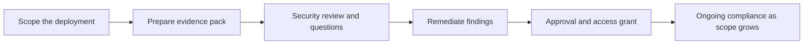

# Enterprise Navigation: Security and Compliance

> **Core capability:** The FDE gets to production through the customer's defenses — security reviews, access controls, data protection, procurement — by treating them as engineering problems with owners, evidence, and a path, not as obstacles to route around.

## Why This Matters

Every enterprise deployment passes through gatekeepers: the security team reviewing architecture, the identity team controlling access, the legal team owning data clauses, the procurement team enforcing vendor standards. In field anecdotes these teams are villains ("we spent six weeks fighting security for API access"). In reality they are the customer's immune system, and the FDE who understands their function moves through them faster.

The FDE's advantage is treating approvals as a predictable pipeline rather than a series of surprises. Each gate has standard outputs it wants: data-flow diagrams, access models, encryption evidence, retention policies, incident plans. An FDE who knows the shape of these artifacts prepares them once and reuses them across customers — converting a recurring weeks-long tax into a template-driven checklist.

For AI deployments the stakes rise. Customer data flowing into models, vendor-hosted inference, and cross-border processing raise questions that older integration projects never faced. The FDE must be able to answer those questions precisely — and to say honestly when a customer requirement cannot be met and what the alternatives are. Compliance honesty is a competitive advantage: it wins the trust of exactly the people who can stop the project.

## Topics in This Capability Area

| Topic | Core Skill | When It Matters |
|-------|------------|-----------------|
| [[01_Security_Reviews_and_Approvals]] | Preparing for and running security reviews efficiently | Before any production access, and each major change |
| [[02_Identity_Access_and_Least_Privilege]] | Designing access that security can approve and users can live with | Every deployment touching customer systems |
| [[03_Data_Protection_and_Residency]] | Classifying data, honoring residency, protecting it in transit and at rest | From first integration design |
| [[04_Procurement_and_IT_Governance]] | Fitting into standards, vendor lists, and buying processes | Before and during rollout, and every renewal |
| [[05_Compliance_Evidence_and_Documentation]] | Producing artifact packs that satisfy auditors and reviewers | Every review gate, and whenever scope grows |
| [[06_Partnering_with_Customer_Security_Teams]] | Building a working relationship with the immune system | From the first review onward |
| [[07_Risk_Communication_and_Decision_Records]] | Stating risk plainly and recording why decisions were made | At every design fork and exception |

## The Approval Pipeline

The pack is assembled once and reused for every customer — the differences are smaller than they look.

## Practical Applications

### Approval Sprint Checklist

- [ ] The customer's review gates, owners, and typical durations are mapped before work starts
- [ ] A data-flow diagram showing every system, boundary, and data category is ready to hand over
- [ ] Access is requested at the least privilege that works, with expiry and review dates
- [ ] Residency, retention, and vendor constraints are answered in the customer's own terminology
- [ ] Exception decisions are documented with owner, rationale, and compensating controls
- [ ] Security and legal reviewers receive the evidence packet before they have to ask for it

## Common Pitfalls

| Pitfall | Why It Is a Problem | Better Approach |
|---------|---------------------|-----------------|
| **Treating security as an enemy** | Adversarial reviews take longer and fail more | Serve the reviewer's job: give them what they need early |
| **Generic evidence packs** | Boilerplate that does not match the customer's questions | Tailor the packet to their framework and vocabulary |
| **Over-broad access requests** | Slows approval and increases blast radius | Least privilege, time-boxed, with a clear justification |
| **Verbal risk acceptance** | Nobody remembers who agreed to what | Written decision records with named owners |
| **Ignoring procurement reality** | The best deployment cannot ship through a blocked vendor path | Check vendor status before promising delivery dates |

## Success Indicators

- Approval lead times shrink across deployments because artifacts are reusable
- Security reviewers ask fewer clarifying questions and find fewer last-minute blockers
- Access reviews pass without findings because design was disciplined from the start
- The customer's security team becomes an advocate for the next phase
- Risk exceptions are rare, documented, and owned — not hidden

## Related Capabilities

- [[03_Integration_and_Deployment_Engineering/00_overview|Integration and Deployment Engineering]]: the systems these gates protect
- [[04_AI_Systems_in_Customer_Environments/00_overview|AI Systems in Customer Environments]]: where residency and vendor constraints bite hardest
- [[06_Customer_Communication_and_Executive_Influence/00_overview|Customer Communication and Executive Influence]]: how risk gets explained to decision-makers
- [[career-path/08_Security_Engineer/00_overview|Security Engineer]]: the security discipline behind enterprise requirements
- [[body-of-knowledge/CyBOK/01_Risk_Management_and_Governance|Risk Management and Governance (CyBOK)]]: the governance framework language

## Summary

Enterprise navigation is the FDE's path through the customer's defenses: mapping review gates, preparing reusable evidence, requesting least-privilege access, honoring data protection and residency rules, fitting procurement realities, and recording risk decisions honestly. The FDE who treats security and compliance as engineering problems with owners and artifacts stops fighting the immune system — and starts moving through it.
