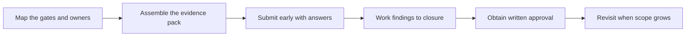

# Security Reviews and Approvals

> **Core skill:** Preparing for and running security reviews efficiently — mapping the gates and their owners, arriving with the evidence already assembled, and carrying findings to closure so approval becomes a predictable pipeline instead of a recurring surprise.

## Why This Matters

In an enterprise, no deployment reaches production without passing a security review. The review is not an obstacle invented to slow engineers down; it is the customer's immune system deciding whether this new thing is safe to admit into a body that carries real data, real customers, and real regulatory exposure. For the FDE, the practical consequence is simple: the review sits on the critical path between finished software and real users, and it is one of the few dependencies the FDE cannot compress with better engineering alone.

The saving grace is that reviews are predictable. Across customers, the same families of questions recur: what data moves where and why, who can access it, how is it protected in transit and at rest, what happens when something goes wrong, and what is the vendor's own posture. An FDE who has run a handful of reviews accumulates a reusable evidence base and walks into the next review with answers prepared rather than questions discovered. The differences between customers are smaller than they look; the vocabulary changes, the underlying controls do not.

For AI deployments the review has new teeth: prompts and documents flowing into models, vendor-hosted inference, cross-border processing, and outputs feeding decisions. Answering those questions precisely — and saying honestly when a customer requirement cannot be met and what the alternatives are — is what converts the security team from a gatekeeper into an ally. The approval you obtain is also the permission you will live under for every change that follows, so its scope and conditions deserve the same care as the architecture itself.

## The Shape of a Typical Review

Gate names differ across customers and industries; the sequence rarely does. Mapping it in the first weeks of an engagement tells you what must be true before the build finishes, rather than discovering it after.

| Gate | Who Owns It | What They Examine | Output |
|------|-------------|-------------------|--------|
| Intake questionnaire | Security governance | Scope, data categories, vendor posture | Ticket opened and reviewer assigned |
| Architecture review | Security architect | Data flows, trust boundaries, integration paths | Design conditions to meet |
| Identity and access review | Identity team | Accounts, roles, privilege scope, lifecycle | Approved access model |
| Data protection review | Privacy and legal | Classification, residency, retention, contracts | Data handling conditions |
| Vulnerability and testing review | Security engineering | Findings, patching, penetration paths | Remediation list |
| Conditional approval | Review board or delegate | Open conditions and compensating controls | Written approval with scope stated |

The FDE's job is not to have every answer at the intake meeting. It is to know which gate owns which question, so that no question arrives without warning and no answer is delivered to the wrong forum.

## Preparing the Evidence Pack

Most review rounds are spent producing documents that could have been prepared in advance. The pack below is assembled once, then tailored per customer — the structure survives, the wording adapts to their framework.

| Artifact | What It Proves | Reuse Notes |
|----------|----------------|-------------|
| Data-flow diagram | Every system, boundary, and data category involved | Annotate with the customer's own system names |
| Access model | Least privilege, expiry, and review cadence | Keep the design role-based, not person-based |
| Encryption summary | Protection in transit and at rest | Describe mechanisms in categories, not product claims you cannot verify |
| Logging and monitoring summary | That activity is visible and attributable | Show what the customer will see in their own tooling |
| Retention and deletion policy | That data lives and dies as promised | Align wording with the contract's language |
| Incident response plan | Who does what when something fails | Include the path back into the customer's team |
| Vendor security documentation | The organization's own posture | Keep current; stale documents start review rounds late |



Each step has an artifact at its exit: a gate map, a pack, a question log, a findings tracker, a written approval, and a re-review trigger list. When any of those is missing, the review does not fail once — it fails again at the next stage.

## Running the Review Well

| Practice | Why It Works | In Practice |
|----------|--------------|-------------|
| Bring reviewers in at design time | Design-stage feedback is cheap; post-build rejection is not | Walk the architecture before code exists |
| Pre-answer the standard questions | Reviewers spend attention on real risks | Attach the pack with the intake form |
| Keep a question log | Repeated questions signal gaps in the pack | Answer once, then update the artifact |
| Track findings like engineering work | Unmanaged findings silently stall the go-live gate | Each finding gets an owner, a fix, and a closing artifact |
| Get the approval in writing | Scope and conditions must survive staff changes | Ask for the approved scope in the reviewer's own words |
| Define re-review triggers | Production scope drifts quietly | Agree which change types reopen review |

## Practical Applications

### Review Readiness Checklist

- [ ] The customer's gates, owners, and review calendar are mapped in writing
- [ ] The evidence pack is assembled before the intake form is submitted
- [ ] Data flows are drawn in the customer's terminology, not product marketing terms
- [ ] Access is requested at the least privilege that works, with an expiry date
- [ ] Every finding has an owner, a target date, and a closing artifact
- [ ] The approval states the approved scope, conditions, and re-review triggers
- [ ] The pack is filed where the next FDE can find and reuse it

### Review Prep Memo Template

```markdown
## Security Review Prep — <customer, deployment, date>

| Field | Detail |
|-------|--------|
| Reviewing body | <forum or reviewer, sponsor on their side> |
| Systems in scope | <systems touched and how they connect> |
| Data in scope | <categories, classification, direction of flow> |
| Access requested | <roles, scope, justification, expiry> |
| Evidence attached | <diagrams, policies, vendor documents> |
| Open questions | <item, owner, date to resolve> |
| Decision requested | <approved scope and conditions sought> |
```

## Common Pitfalls

| Pitfall | Why It Is a Problem | Better Approach |
|---------|---------------------|-----------------|
| **Treating security as an obstacle** | An adversarial posture invites adversarial review, adding rounds and friction | Serve the reviewer's mandate; give them what they need before they ask |
| **Boilerplate evidence packs** | Generic material that ignores the customer's framework bounces back as questions | Tailor the pack to their controls and vocabulary while reusing its structure |
| **Starting review after the build** | The design is committed before the review can shape it | Bring reviewers in at architecture stage and design to their conditions |
| **Unmanaged findings** | Findings without owners and dates sit open and stall go-live | Run findings as engineering work items with closing artifacts |
| **Verbal approvals** | Nobody can reconstruct the approved scope after staff changes | Obtain the approval in writing with scope and conditions stated |
| **Forgetting re-review triggers** | Scope growth creates an unapproved production state | Agree up front which changes reopen review, and honor it |

## Success Indicators

- Review lead times shrink across deployments because the pack is reusable
- Reviewers ask clarifying questions rather than raising new blockers late
- Findings close before the go-live gate instead of becoming conditions carried into production
- The security team speaks for the next phase because the first approval held
- Every production change can be traced to a review decision that covers it

## Related Topics

- [[02_Identity_Access_and_Least_Privilege]]
- [[05_Compliance_Evidence_and_Documentation]]
- [[06_Partnering_with_Customer_Security_Teams]]
- [[career-path/08_Security_Engineer/00_overview|Security Engineer]]
- [[career-path/15_Solutions_and_Enterprise_Architect/05_Security_Risk_and_Compliance/00_overview|Security Risk and Compliance (SA)]]

## Summary

Security reviews and approvals are the FDE's path to production access: map the gates before the build, assemble an evidence pack that answers the standard families of questions, submit early, work findings to closure with owners and dates, and obtain written approval with re-review triggers defined. Handled this way, the review stops being the deployment's most feared dependency and becomes one of its most predictable ones — and the security team, served well once, becomes one of the strongest voices for what gets built next.
