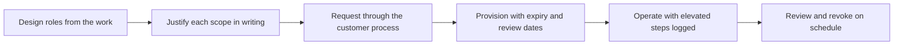

# Identity Access and Least Privilege

> **Core skill:** Designing access that security can approve and users can live with — scoped to need, time-bound by default, reviewable on the customer's schedule, and mapped onto their identity systems rather than reinvented beside them.

## Why This Matters

Access is the first thing a deployment requests and the last thing anyone cleans up. Every integration needs credentials: service accounts that call the customer's systems, roles that let users see what they should, administrative paths for operations. How you ask for that access is read by the customer as a preview of how you will treat their entire environment. A request that is scoped, justified, and time-bound says the FDE understands the stakes; a request for administrator rights "to save time" says the opposite, and it will be remembered at the next review.

There are two classic failure modes and both are expensive. Too much access — standing admin accounts, wildcard scopes, permanent credentials — slows approval, widens the blast radius of any mistake, and fails the customer's periodic access reviews, which forces a painful cleanup mid-deployment. Too little access, or access designed without knowing how the work actually happens, produces a deployment that cannot operate; teams then quietly share credentials or work around the model, which is worse than the original problem. The design target is least privilege that is still operable: defined roles, time-boxed elevation for the exceptional steps, and a clear runbook of what the system needs and why.

The customer's identity systems are where access must land. Their single sign-on, their group model, their joiner-mover-leaver process, their privileged access tooling — access designed with those mechanisms in mind is approved faster and survives reviews; access invented beside them becomes orphaned accounts and standing exceptions. In AI deployments the same discipline extends to the model's reach: whose data the system can retrieve, whose prompts are logged, and which outputs are attributable to which user are all access questions in disguise.

## Designing Access People Can Approve

| Design Choice | What It Looks Like | Why Security Approves It | Why Users Tolerate It |
|---------------|--------------------|--------------------------|-----------------------|
| Role-based access | Permissions attached to roles that map to actual jobs | Reviews are about roles, not individuals | New users onboard in minutes |
| Just-in-time elevation | Elevated rights granted for a window, then expire | Standing privilege is minimized | The occasional step-up is a minor cost |
| Scoped service accounts | One account per integration with the narrowest scopes that work | Blast radius is contained and attributable | Failures are traceable to one integration |
| Environment separation | Production credentials distinct from test environments | Test activity cannot touch production data | Tests stop being dangerous to run |
| Break-glass path | A documented emergency route with its own controls | Emergencies have a designed response | Nobody is tempted to keep a back door |
| Expiry by default | Every grant carries a review or end date | Access cannot drift stale | The model stays true to how work actually happens |

## Mapping onto the Customer's Identity

| Customer Mechanism | Typical Shape | FDE Integration Move |
|--------------------|---------------|----------------------|
| Single sign-on and identity provider | Users authenticate centrally; applications trust the provider | Federate rather than build local accounts |
| Group membership | Access derives from membership managed by the customer | Map roles to groups the customer already maintains |
| Approval workflows | Access requests route through owners and reviewers | Prepare the justification text once, reuse it per request |
| Joiner-mover-leaver process | Access changes when people change roles or leave | Ensure the deployment consumes those changes automatically |
| Privileged access management | Sensitive accounts are vaulted and sessions recorded | Use their vault rather than transporting credentials yourself |

## The Access Lifecycle



Each stage has a guardrail the FDE controls. In design, the guardrail is separation of duties — the account that deploys is not the account that approves. In operation, it is that no shared credentials exist and that elevated actions are logged where the customer can see them. In review, it is that accounts tied to a finished phase are revoked on schedule, not left "in case we need them." The deployment that leaves no orphaned accounts behind is the one invited back for the next phase.

## Practical Applications

### Access Discipline Checklist

- [ ] Every account and role traces to specific work that requires it
- [ ] No credentials are shared between people or between environments
- [ ] Long-lived secrets are stored in the customer's own vault, not in scripts or notebooks
- [ ] Every grant has an expiry or review date, and the dates are on a calendar
- [ ] Access flows through the customer's identity provider and group model where they exist
- [ ] Break-glass access exists, is documented, and is tested rather than improvised
- [ ] Accounts created for a phase are revoked when the phase ends

### Access Request Template

```markdown
## Access Request — <system, deployment, date>

| Field | Detail |
|-------|--------|
| Account or role | <name, type, environment> |
| Scopes requested | <systems, data, actions> |
| Justification | <the specific work that requires this> |
| Duration | <expiry date and review date> |
| Owner | <customer-side owner accountable for it> |
| Least-privilege alternative | <narrower option considered and why it was not enough> |
| Exit plan | <how and when access is revoked> |
```

## Common Pitfalls

| Pitfall | Why It Is a Problem | Better Approach |
|---------|---------------------|-----------------|
| **Standing admin access** | It slows approval, widens blast radius, and fails periodic access reviews | Just-in-time elevation for the steps that truly need it |
| **Shared credentials** | Activity cannot be attributed and revocation is all-or-nothing | One account per person or integration, always attributable |
| **Access without expiry** | Grants drift stale and accumulate silent privilege | Set review and end dates at request time |
| **Bypassing the customer's identity provider** | Local accounts become orphans outside the joiner-mover-leaver process | Federate with their systems wherever possible |
| **Requesting maximum scope "to save time"** | It trades a day of setup for weeks of review friction and lasting suspicion | Scope precisely, justify precisely, expand only with evidence |
| **Orphaned accounts after rollout** | Leftovers clutter reviews and signal a careless disposition | Make revocation a step in the rollout exit checklist |

## Success Indicators

- Access requests are approved in fewer rounds because scope and justification are precise
- The customer's periodic access reviews pass without findings against the deployment
- No credential exists outside the customer's own management systems
- Elevated actions are documented where the customer's security team can see them
- Post-rollout cleanups find nothing to revoke because revocation was planned, not improvised

## Related Topics

- [[01_Security_Reviews_and_Approvals]]
- [[03_Data_Protection_and_Residency]]
- [[07_Risk_Communication_and_Decision_Records]]
- [[career-path/08_Security_Engineer/00_overview|Security Engineer]]
- [[career-path/07_SRE_and_Platform_Engineer/00_overview|SRE and Platform Engineer]]

## Summary

Identity, access, and least privilege are how the FDE earns the right to touch customer systems: design roles from the real work, justify every scope in writing, run requests through the customer's own identity machinery, provision with expiry, operate with logged elevation, and revoke on schedule. Access that security can approve and users can live with is not a compromise between the two — it is the discipline that makes both true at once, deployment after deployment.
