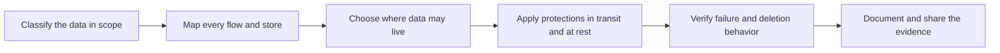

# Data Protection and Residency

> **Core skill:** Classifying data, honoring residency, protecting it in transit and at rest — deciding where data may live and flow before the integration is designed, and being able to prove the protections to the people who own the clauses.

## Why This Matters

The rules about customer data are rarely written by engineers. They arrive from legal, privacy, and risk functions as contract clauses and conditions of approval: which data categories may be processed, where processing may occur, how long anything may be retained, and what deletion must look like. By the time the FDE sees them, they are constraints on architecture — and constraints discovered late are the most expensive kind, because residency and retention decisions reach into where services run, which regions the vendor operates, how logs are kept, and how the system behaves during failover.

The first discipline is classification, and its purpose is to make the rest of the decisions smaller. Not all data deserves the same handling, but unclassified data defaults to the strictest reasonable treatment, which makes everything slow and expensive. When the FDE can say precisely which fields in which flow are public, internal, confidential, or personal and regulated, the residency and protection conversation becomes a set of concrete, answerable questions instead of a blanket negotiation. Classification is not a document that gets written once; it is a running inventory that changes whenever the integration grows a new field or a new destination.

AI deployments raise the stakes further. Prompts may contain sensitive context, retrieved documents may mix confidential material into a session, embeddings and logs persist beyond the moment of use, and vendor-hosted inference can move data across boundaries with a single API call. The FDE who can describe, in the customer's own vocabulary, what data reaches the model, what is stored, where it is stored, who can see it, and how it is deleted, is the person who gets AI systems approved. Retrofitting residency onto a finished design is a rewrite; designing with it from the first diagram is a constraint.

## Classifying Before Designing

| Class | What It Typically Contains | Design Implications |
|-------|---------------------------|---------------------|
| Public | Material the organization publishes or licenses openly | Minimal handling constraints; still track origin and accuracy |
| Internal | Operational content not intended for outsiders | Access limited to the organization; standard protections |
| Confidential | Business-sensitive content whose exposure causes harm | Strong access control, encryption, and retention limits |
| Personal and regulated | Content about identifiable people or under external rules | Strict residency, retention, and deletion obligations; evidence required |
| Sensitive and high-risk | Content where exposure causes severe harm to people or the organization | Highest protections; often excluded from systems entirely |

The practical move is to classify at the field level within each flow, not at the system level. A system is rarely uniformly sensitive; the flow is what reviewers examine.

## The Residency Decision Table

| Option | What It Means | When It Fits | Cost of Choosing It |
|--------|---------------|--------------|---------------------|
| In-region processing and storage | All data stays within one approved region | The clause permits only local handling | Limits failover and vendor feature options |
| In-region with approved-region failover | Primary handling local; contingency in pre-approved regions | Availability matters and clauses allow named regions | Must verify failover behavior matches promises |
| Vendor-hosted with regional controls | Data handled on vendor infrastructure with regional boundaries | Vendor operations genuinely support the boundary | Requires proof of boundary, not just configuration |
| Cross-border with safeguards | Data moves across borders under defined protections | The organization has deliberately permitted it | Highest scrutiny; safeguards must be verifiable |

## Protecting Data in Motion and at Rest

| Control Area | What Reviewers Look For | How the FDE Proves It |
|--------------|------------------------|-----------------------|
| Transport encryption | All movement between systems is protected | Show the path and where protection applies along it |
| Storage encryption | Data at rest is encrypted in every location it lives | Enumerate stores, including caches, queues, and logs |
| Key management | Who holds keys and how they are rotated | Describe the customer's control over keys where claimed |
| Access logging | Every read and write is attributable | Show sample log records in the customer's tooling |
| Retention and deletion | Data expires and deletes exactly as promised | Walk through what triggers deletion and what it covers |
| Backup handling | Backups obey the same rules as primary storage | Verify backups are in scope for residency and deletion |
| Model and prompt handling | What reaches models and what persists | Trace a prompt from entry to storage to expiration |



The step FDEs skip most often is verification: proving what happens during failover, during a support session, and at deletion time. Reviewers eventually ask, and "it should be fine" is not an answer that survives a written approval.

## Practical Applications

### Data Protection Checklist

- [ ] Every data category in the deployment is named and classified in writing
- [ ] A single diagram shows every flow, store, and boundary, annotated with categories
- [ ] Each residency constraint is traced to its source — the clause or condition that created it
- [ ] Failover, support access, and backup paths are checked against the same rules as the primary path
- [ ] Retention and deletion are described as concrete behavior, then verified in practice
- [ ] Model and prompt handling is documented wherever AI components are involved
- [ ] Evidence is filed where reviewers and the next FDE can find it

### Data Flow Record Template

```markdown
## Data Flow Record — <system, deployment, date>

| Field | Detail |
|-------|--------|
| Data category | <classification and what the field contains> |
| Source and destination | <systems, regions, owners> |
| Movement | <direction, protection in transit, frequency> |
| Storage | <every location, retention period, protection at rest> |
| Residency rule | <the constraint and where it came from> |
| Deletion path | <what deletes the data, when, and how it is verified> |
| Failover behavior | <what changes when the primary path fails> |
```

## Common Pitfalls

| Pitfall | Why It Is a Problem | Better Approach |
|---------|---------------------|-----------------|
| **Classification as a one-time document** | New fields and destinations silently escape the original classification | Treat classification as a running inventory updated with each change |
| **Residency discovered at contract stage** | By then the architecture may be unable to comply without a rewrite | Surface residency constraints before the first design diagram |
| **"It is encrypted" without specifics** | Vague claims fail scrutiny and hide gaps in caches, queues, and logs | Enumerate every store and state the mechanism category for each |
| **Copying data into unapproved places** | Laptops, test tenants, and sample exports become shadow stores outside the agreement | Keep working copies inside approved boundaries; sanitize test data |
| **Keeping data longer than promised** | Logs and backups quietly outlive their retention windows | Automate expiry and verify it against the written promise |
| **Assuming vendor defaults match the contract** | Default behavior is written for the vendor's convenience, not the customer's clauses | Check defaults against the clauses and change what does not match |

## Success Indicators

- Residency and retention questions are answered from a written record, not from memory
- The customer's reviewers confirm the deployment handles data as the contract claims
- Deletion and expiry behavior is verified, not assumed, and the verification is on file
- New features and fields are classified before they reach production
- AI components can be described end to end — what enters, what persists, what is deleted

## Related Topics

- [[02_Identity_Access_and_Least_Privilege]]
- [[05_Compliance_Evidence_and_Documentation]]
- [[04_AI_Systems_in_Customer_Environments/00_overview|AI Systems in Customer Environments]]
- [[career-path/08_Security_Engineer/00_overview|Security Engineer]]
- [[body-of-knowledge/CyBOK/01_Risk_Management_and_Governance]]

## Summary

Data protection and residency are design constraints the FDE turns into design decisions: classify data at the field level, map every flow and store in one place, choose residency deliberately and trace it to its clause, protect it in motion and at rest across every path including failover and backups, and verify what actually happens at deletion time. Done from the first diagram rather than the first audit, these choices cost little — done late, they are rewrites, and done dishonestly, they are lost trust.
