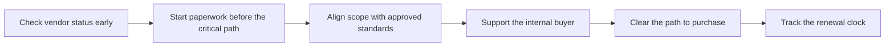

# Procurement and IT Governance

> **Core skill:** Fitting into standards, vendor lists, and buying processes — treating the commercial and governance machinery as part of the deployment plan, with technical inputs prepared before the paperwork lands on the critical path.

## Why This Matters

A deployment can be technically finished and still not ship, because the software has no path to purchase. Enterprises buy through governance: vendor onboarding that checks the company against standards, security questionnaires kept on file, data protection terms negotiated with legal, purchase orders raised by finance, and licensing models that must match how the organization budgets. None of this machinery is designed to be hostile; it exists because the organization has learned that ungoverned technology creates risk it cannot see. But it runs on its own clock, and that clock is usually longer than engineering expects.

The FDE does not own procurement, and should not pretend to. What the FDE owns is the technical substrate every one of those steps depends on: accurate architecture descriptions, capability statements that do not overclaim, integration details stated in the customer's vocabulary, and straight answers about hosting, data, and support. When those inputs are late or wrong, the process stalls — not because procurement is slow, but because it is waiting. The most avoidable delay in enterprise deployment is a paperwork dependency the FDE could have foreseen and fed in advance.

There is also a governance dimension that reaches beyond a single deal. Organizations maintain standards — approved architectures, preferred vendors, reference patterns — precisely so that similar needs do not become fifty bespoke exceptions. A deployment that fits an existing standard moves faster through every gate; a deployment that requires an exception creates work for people whose job is to minimize exceptions, and that work gets remembered. The FDE who can shape a solution to land inside the standard, while still solving the customer's problem, converts governance from an adversary into an accelerator. And because purchase decisions recur — expansions, renewals, additional business units — the paths opened in the first deal determine how fast every later phase can move.

## Where Procurement Sits in a Deployment

| Step | Owner | What The FDE Provides |
|------|-------|-----------------------|
| Need identified and funded | Customer sponsor | The problem statement in outcome terms the sponsor can defend |
| Vendor onboarding and review | Vendor management office | Company documentation, insurance and corporate papers, standard security material |
| Security questionnaire and evidence | Security and procurement | The evidence pack: architecture, data flows, controls |
| Contracting and data terms | Legal and privacy | Plain statements of data handling that match the product's real behavior |
| Purchase order and licensing | Finance and procurement | Licensing model clarity and deployment scope stated precisely |
| Rollout and entitlement | IT operations | Environment, access, and support details ready on day one |
| Renewal and expansion | Account team with the FDE | Outcome evidence and a technically accurate expansion scope |

## Working Within Standards and Vendor Lists

| Obstacle | What It Looks Like | How To Work It |
|----------|--------------------|----------------|
| Not on the approved vendor list | The purchase cannot proceed until onboarding completes, which takes weeks | Start onboarding at the first sign of commitment, not at signature time |
| Questionnaire not on file | Security review begins from zero even though the product is unchanged | Keep a current questionnaire and evidence pack ready to submit |
| Licensing model mismatch | The organization buys subscriptions, the deal is shaped as a one-time purchase, or the reverse | Learn the customer's budgeting shape and map the commercial model to it early |
| Data terms do not match standard clauses | Legal negotiates deviations that lengthen the process | Provide clear data handling facts early so negotiation starts from accuracy |
| Preferred-vendor pressure | Another vendor already holds the standard position | Compete on the standard's own terms: gap analysis against the incumbent's pattern |
| Multi-team approvals | Several owners must sign, each with separate concerns | Map every approver and their question, and answer each in their own forum |

The pattern behind all of these is the same: governance is a pipeline with owners and inputs, and the FDE's leverage is to supply the inputs early and accurately. Where the customer has a reference architecture or a standard pattern, reading it is the highest-value hour the FDE can spend — it tells you what an approvable solution looks like in this organization before you design one that is not.

## The Governance Rhythm



Two habits make this rhythm work. First, treat the internal buyer — the customer-side person who owns the purchase — as a teammate: they need technically accurate material to carry into rooms the FDE never enters, and they are measured on whether the purchase goes smoothly. Second, track the renewal clock from the day the first contract is signed, because the evidence gathered during rollout is the cheapest renewal material the account will ever have.

## Practical Applications

### Procurement Readiness Checklist

- [ ] Vendor onboarding status is checked before delivery dates are promised to anyone
- [ ] The current security questionnaire and evidence pack are on file or in motion
- [ ] The solution is mapped against the customer's standards and reference patterns
- [ ] Every approver in the buying chain is identified with the question they own
- [ ] Data handling facts have been given to legal early and plainly
- [ ] The licensing and deployment scope match the customer's budgeting model
- [ ] The renewal date is on a calendar with a plan for the evidence that will support it

### Procurement Readiness Snapshot Template

```markdown
## Procurement Snapshot — <customer, deployment, date>

| Field | Detail |
|-------|--------|
| Buying path | <who buys, through which process, with which standard> |
| Vendor status | <onboarding state, blockers, owner> |
| Security material | <questionnaire state, evidence pack location> |
| Legal and data terms | <state of review, open items> |
| Licensing shape | <model, term, budget cycle it must land in> |
| Approvers | <name, concern, forum where they decide> |
| Critical dates | <when paperwork must complete for the promised rollout> |
```

## Common Pitfalls

| Pitfall | Why It Is a Problem | Better Approach |
|---------|---------------------|-----------------|
| **Discovering procurement late** | Paperwork becomes the critical path and delays rollout predictably | Map the buying path in the first weeks, alongside the technical discovery |
| **Bypassing standards with side deals** | Shadow deployments get torn out at audit and damage the relationship with IT | Fit the standard or run the exception process honestly |
| **Letting promises outrun engineering** | Sales and procurement commitments the product cannot meet surface as defects later | Give accurate technical inputs and correct overclaims immediately |
| **Ignoring the renewal clock** | Renewal surprises arrive before the outcome evidence exists | Track dates and gather evidence continuously, not at renewal time |
| **Treating governance as someone else's job** | The FDE owns the technical inputs the whole process depends on | Prepare and hand over inputs before anyone has to ask |
| **Designing a bespoke solution that needs exceptions** | Every exception adds approvers, delay, and future review burden | Shape the solution to land inside an existing approved pattern |

## Success Indicators

- Vendor and questionnaire steps are complete before the customer expects to sign
- Approvers receive accurate, tailored material without having to chase the FDE
- The solution is described in the customer's standards language and needs no novel exception
- Rollout starts on the promised date because the commercial path was cleared, not fought
- Renewal conversations open with documented outcomes already in hand

## Related Topics

- [[01_Security_Reviews_and_Approvals]]
- [[03_Data_Protection_and_Residency]]
- [[05_Compliance_Evidence_and_Documentation]]
- [[career-path/12_Technical_Program_Manager/00_overview|Technical Program Manager]]
- [[career-path/15_Solutions_and_Enterprise_Architect/00_overview|Solutions and Enterprise Architect]]

## Summary

Procurement and IT governance are the commercial gauntlet every enterprise deployment must pass: vendor onboarding, questionnaires, data terms, purchase orders, and standards that shape what can be approved. The FDE's role is not to run the process but to feed it — early, accurately, and in the customer's own vocabulary — while shaping solutions that land inside existing patterns instead of demanding exceptions. The deployments that move fastest through governance are not the ones with the loudest urgency; they are the ones whose technical story was ready before anyone asked for it.
