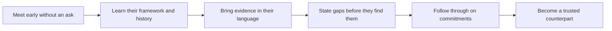

# Partnering with Customer Security Teams

> **Core skill:** Building a working relationship with the immune system — becoming a known, honest, and useful counterpart to the people whose job is to be suspicious, long before there is anything to approve.

## Why This Matters

Security teams are not a gate to sneak past; they are people with mandates, metrics, memories, and professional networks. Their job is to be skeptical of exactly the kind of change a deployment represents, and they are measured on how well they resist both breaches and busywork. The FDE who appears only when something is needed is, from the security team's perspective, an unknown quantity attached to a request — and unknown quantities get the slow, exhaustive treatment. The FDE who has invested in the relationship beforehand gets the faster, trust-based treatment, because the reviewer already knows how this person behaves when nobody is watching.

The relationship is built through small, unglamorous acts. Walking the architecture past the reviewer before it is final. Bringing your own findings — a misconfiguration you spotted, a control you cannot yet meet — rather than waiting for review to unearth them. Speaking their language: controls, boundaries, and evidence rather than features and roadmaps. Following through on every commitment, especially the small ones, because security teams track delivery the way auditors do. None of this requires the FDE to be a security specialist; it requires being the kind of counterpart whose claims do not need double-checking.

The payoff compounds in ways that go beyond one review. A security reviewer who trusts you can be consulted during design, which prevents whole classes of findings. They can be told about incidents early, which turns potential confrontations into joint responses. And because security people talk to their counterparts in other organizations, and move between companies, a reputation for straight dealing is one of the most portable assets an FDE can own. The security team is not the deployment's antagonist; it is the deployment's most consequential internal referral.

## What Security Teams Are Measured On

| Their Concern | What It Sounds Like | What Helps |
|---------------|--------------------|------------|
| Breach prevention | "What is the blast radius if this component is compromised" | Scoped access, segmented design, honest failure analysis |
| Audit cleanliness | "Will this create findings against us at the next assessment" | Evidence that keeps up with the system, gaps named early |
| Vendor sprawl | "Another vendor, another contract, another risk we carry" | Fitting an approved standard instead of demanding an exception |
| Shadow deployments | "How many things are running that we do not know about" | Full disclosure of everything the FDE touches, including trials |
| Incident readiness | "When this fails at 2 a.m., who does what" | A joint response path agreed before it is needed |
| Regulatory exposure | "What does this mean for the obligations we carry" | Precise statements of data handling behaviors |

## Practices That Build the Relationship

| Practice | Example | Effect Over Time |
|----------|---------|------------------|
| Meet before you need them | An introduction and architecture walkthrough months before approval | You are a known person, not a ticket number |
| Learn their framework | Reading the standard the reviewer must apply | Questions arrive in their terms, saving rounds |
| Bring solutions, not just questions | "Here is the control I propose; does it satisfy the requirement" | Reviewers spend judgment, not education, on your case |
| Report your own findings | Disclosing a misconfiguration found in testing | Integrity demonstrated at the moment it is costly |
| Close loops visibly | Confirming a fix and attaching the evidence without being asked | Your word becomes verifiable and therefore trusted |
| Respect their process | Using the intake process properly even when a shortcut is offered | You become evidence that the process can work |

## From Reviewer to Advocate



The transition from reviewer to advocate is never announced; it shows up as shorter reviews, design consultations offered without being asked, and a security voice that speaks in favor of the next phase. It is earned by the accumulation of a dozen small consistencies, and it can be lost in a single moment of spin.

## Practical Applications

### Security Relationship Checklist

- [ ] The security stakeholders for this account are mapped with names and concerns
- [ ] An introduction happened before the first formal review was submitted
- [ ] The customer's security framework and standards have been read
- [ ] At least one self-disclosed finding or gap has been shared voluntarily
- [ ] Every commitment made to the security team has been closed and confirmed
- [ ] The incident communication path is agreed and documented from both sides
- [ ] Security reviews for this account start from an existing relationship, not a cold ticket

### Security Partner Map Template

```markdown
## Security Partner Map — <customer, account, date>

| Role | Name | What they own | What they worry about | Best channel |
|------|------|---------------|-----------------------|--------------|
| <reviewer or architect> | <name> | <scope of authority> | <their stated concerns> | <meeting, thread, or forum> |
| <identity lead> | <name> | <scope> | <concerns> | <channel> |
| <security operations lead> | <name> | <scope> | <concerns> | <channel> |
```

## Common Pitfalls

| Pitfall | Why It Is a Problem | Better Approach |
|---------|---------------------|-----------------|
| **Going around security** | Shortcuts get discovered and convert a normal review into a trust incident | Use the process and improve it from inside |
| **Appearing only when you need something** | Every interaction becomes a transaction and every review starts cold | Invest in contact between requests |
| **Overpromising to smooth a review** | A security team that catches one exaggeration audits everything afterward | Promise only what is already true or scheduled |
| **Speaking product language to controls people** | Features do not answer control questions and the mismatch wastes rounds | Translate every claim into controls and evidence |
| **Treating one friendly approver as the whole team** | The reviewer's colleagues and successors have their own questions | Build breadth across the security organization |
| **Taking criticism personally** | Defensiveness reads as concealment and slows everything down | Treat findings as engineering input with a fast path to closure |

## Success Indicators

- Review requests are answered by name rather than routed through a queue
- The security team consults the FDE during design, before formal review
- Findings arrive smaller and earlier because relationships surface issues sooner
- Incidents are communicated jointly and quickly rather than escalated against you
- The security team can be cited as a positive reference when the next phase is proposed

## Related Topics

- [[01_Security_Reviews_and_Approvals]]
- [[07_Risk_Communication_and_Decision_Records]]
- [[06_Customer_Communication_and_Executive_Influence/00_overview|Customer Communication and Executive Influence]]
- [[career-path/08_Security_Engineer/00_overview|Security Engineer]]

## Summary

Partnering with customer security teams means converting the review relationship from a transaction into a working alliance: meet before you need anything, learn the framework the reviewer must apply, bring evidence and self-disclosed gaps instead of spin, close every commitment visibly, and respect the process even when a shortcut is offered. Done consistently, the immune system stops treating the deployment as a threat to be vetted and starts treating the FDE as a colleague to be backed — which is worth more at approval time than any amount of urgency.
