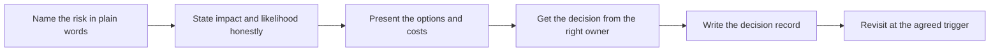

# Risk Communication and Decision Records

> **Core skill:** Stating risk plainly and recording why decisions were made — naming the risk, its impact, and its owner in language a busy executive can act on, then writing the decision down so it survives the people who made it.

## Why This Matters

Risk communication fails in two opposite directions, and both destroy trust. The first failure is silence: problems that are known but not spoken, risks that are assumed to be someone else's department, and the quiet hope that a concerning detail will not matter. Silence works until it does not, and by then the cost of the problem and the cost of the concealment have merged into a single trust incident from which deployments rarely recover cleanly. The second failure is doom: risk language used as a shield, problems presented without analysis, likelihoods inflated to transfer responsibility. Teams that cry wolf train their customers to stop listening, which is the same as silence with extra steps.

Between the two lies the FDE's actual job: presenting risk the way an engineer presents a system constraint — factually, with dimensions, and in terms of decisions. A usable risk statement names what could go wrong, what triggers it, how likely it is within stated confidence, how bad the impact would be, what is already reducing it, and what residual exposure remains. Each of those pieces is answerable from the deployment's actual design and history, and together they give the customer's decision-maker everything needed to accept, mitigate, or reject. The FDE does not own the risk — risk in a customer environment is ultimately accepted by the customer — but the FDE owns the clarity.

Decisions, once made, need to survive. Enterprises rotate people constantly, and a deployment built on a handshake agreement will be re-litigated the moment the people involved change. A decision record converts "why is it like this?" from archaeology into a lookup: what was decided, what options were on the table, what the rationale was, who owns the residual risk, and what event would reopen the question. Exceptions to controls and standards are a normal part of enterprise work — the difference between a governed exception and a future finding is whether the reasoning was written down. The FDE who treats decision recording as routine turns the customer's own institutional memory into an asset for the deployment instead of a threat to it.

## Stating Risk Plainly

| Element | The Question It Answers | What Good Looks Like |
|---------|------------------------|----------------------|
| The risk | What could go wrong | A specific failure or consequence, not a general anxiety |
| The trigger | What would make it happen | Conditions or steps that raise likelihood |
| The impact | How bad it would be | Consequence in the customer's terms: data, service, money, obligations |
| Likelihood and confidence | How probable it is and how sure you are | An honest range with the reasoning behind it |
| Current mitigations | What already reduces it | Existing controls, with how they are verified |
| Residual risk | What remains after mitigation | The exposure the owner is actually accepting |
| Owner and review date | Who carries it and when it is revisited | A named person and a date, not a committee |

## Decision Records That Survive

| Field | Purpose | Notes |
|-------|---------|-------|
| Date and participants | Establishes who decided, when | Include roles, not just names |
| The decision | The single sentence the record exists for | Written so a future reader cannot misread it |
| Options considered | Shows the decision was made, not defaulted | Include the option chosen against and why |
| Rationale | Captures the reasons that carried the day | The part successors most often need |
| Conditions and compensating controls | What makes the decision safe to live with | Anything the decision depends on being true |
| Residual risk and owner | Names the exposure and its carrier | The customer-side owner, explicitly |
| Revisit trigger | The date or event that reopens the question | Otherwise stale exceptions live forever |

## When an Exception Is Reasonable

| Situation | Reasonable Path | What Must Be Recorded |
|-----------|-----------------|-----------------------|
| A required control cannot be met yet but a credible path exists | Time-bound exception with a remediation plan | The plan, the intermediate controls, and the end date |
| A vendor constraint is contractual and changing it is impossible | Compensating controls elsewhere in the design | The constraint, the compensating control, and who verified it |
| Operational urgency outweighs process for a short window | Emergency change with retrospective documentation | What was done, why, and the review that follows |
| Two teams' requirements conflict | Escalation to the common owner with both cases stated | The trade-off as understood by the decider |



The record is not the end of the process; it is the license to proceed and the appointment for the next conversation. A risk accepted without a revisit trigger is a risk that has been forgotten with paperwork.

## Practical Applications

### Risk Communication Checklist

- [ ] Every significant risk is written in the structured form before it is discussed
- [ ] Impact is expressed in the customer's terms, not engineering abstractions
- [ ] Each presentation includes options with costs, not just the problem
- [ ] Acceptance is obtained from the owner who actually carries the risk
- [ ] Decisions are recorded the same day they are confirmed
- [ ] Every accepted risk has a revisit trigger on a calendar
- [ ] Reopened risks are re-presented with what changed, not re-argued from scratch

### Decision Record Template

```markdown
## Decision Record — <topic, date>

| Field | Detail |
|-------|--------|
| Decision | <what was decided, in one sentence> |
| Options considered | <alternatives and why each was not chosen> |
| Rationale | <the reasons that carried the decision> |
| Risk accepted | <what could go wrong, how bad, and under what conditions> |
| Compensating controls | <what reduces the exposure in the meantime> |
| Owner | <who carries the residual risk and reviews it> |
| Revisit trigger | <the date or event that reopens this> |
```

## Common Pitfalls

| Pitfall | Why It Is a Problem | Better Approach |
|---------|---------------------|-----------------|
| **Silent acceptance** | Unspoken risk resurfaces as a surprise and a trust incident | State every material risk in writing with an owner |
| **Risk without options** | Problems without options read as complaints and stall decisions | Attach two or three options with costs to every risk statement |
| **Doom language as a shield** | Inflated likelihoods train customers to discount all warnings | Give honest ranges and the reasoning behind them |
| **No named owner** | Shared risk becomes nobody's risk | Get the customer-side owner named in the record |
| **Burying risk in an appendix** | Decision-makers do not find what they are not shown | Put risk where the decision is made, in the document's main body |
| **Stale exceptions nobody revisits** | Old exceptions accumulate into a permanently non-standard state | Put every revisit trigger on a calendar and honor it |

## Success Indicators

- Decision-makers can restate the residual risks of the deployment accurately in their own words
- Risk discussions end with a decision and a record, not with a feeling
- Exceptions are rare, documented, owned, and closed on schedule
- Successors find prior reasoning in the records instead of reopening settled questions
- Bad news about risk is received as professional analysis rather than as failure

## Related Topics

- [[01_Security_Reviews_and_Approvals]]
- [[06_Partnering_with_Customer_Security_Teams]]
- [[career-path/12_Technical_Program_Manager/05_Stakeholder_Alignment/00_overview|Stakeholder Alignment (TPM)]]
- [[body-of-knowledge/CyBOK/01_Risk_Management_and_Governance]]
- [[career-path/15_Solutions_and_Enterprise_Architect/05_Security_Risk_and_Compliance/00_overview|Security Risk and Compliance (SA)]]

## Summary

Risk communication and decision records are how the FDE keeps a deployment honest under pressure: state risks in structured, decision-ready form; express impact in the customer's terms; always bring options; get acceptance from the owner who carries the exposure; and write every decision down with its rationale, residual risk, and revisit trigger. Done well, this discipline turns the scariest conversations into routine governance — and leaves behind exactly the institutional memory that lets the deployment survive its own success.
