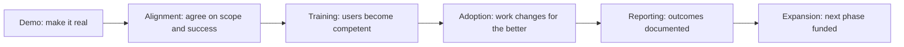

# Customer Communication and Executive Influence

> **Core capability:** The FDE carries the deployment in every room — demoing so stakeholders believe, briefing executives so sponsors stay committed, training users so adoption happens, and telling hard truths early enough that they remain solvable.

## Why This Matters

A forward deployment is a chain of conversations. Sponsors decide whether to fund it, operators decide whether to use it, security decides whether to allow it, and executives decide whether to expand it. The FDE who cannot carry the story in each of those rooms leaves the outcome to chance. Communication is not the soft layer around the technical work — it is how technical work becomes an accepted reality inside the customer's organization.

The audiences pull in different directions. An executive wants outcomes, risk, and what to tell the board; she does not want architecture. An operator wants to know exactly what changes in her Tuesday; he is not interested in the roadmap. The FDE's skill is translation without dilution: the same deployment expressed in the language and stakes of each audience — accurately, consistently, and without promising what engineering has not agreed to.

Hard communication is where this capability earns most of its value. Slipped dates, defects, scope cuts, and "that requirement cannot be met" are inevitable in the field. The FDE who surfaces problems early, in writing, with options and recommendations, converts them into manageable decisions. The FDE who waits for certainty converts them into trust incidents. In deployments, the communication timeline is the project timeline.

## Topics in This Capability Area

| Topic | Core Skill | When It Matters |
|-------|------------|-----------------|
| [[01_Demos_That_Land]] | Building and delivering demos that move decisions | Every review, steering meeting, and stage gate |
| [[02_Executive_Communication]] | Speaking outcomes, risk, and options to sponsors | Funding decisions, escalations, expansions |
| [[03_Training_and_Enablement]] | Making users competent and confident on the system | Before and during rollout |
| [[04_Expectation_and_Scope_Management]] | Keeping promises aligned with engineering reality | From first commitment onward |
| [[05_Difficult_Conversations]] | Delivering bad news early, with options | Defects, delays, unmet requirements, outages |
| [[06_Change_Management_and_Adoption]] | Helping the organization absorb the change | Throughout rollout, not just launch day |
| [[07_Written_Artifacts_for_Customers]] | Memos, status reports, and outcome documentation that hold up | Steady state of every engagement |

## Communication Across the Deployment

Each transition is a communication event with its own audience and vocabulary.

## Practical Applications

### Deployment Communication Checklist

- [ ] Every demo has one decision it exists to support, and the audience knows it
- [ ] Sponsor reads a one-page status of outcome, risk, and next decision — every cycle
- [ ] Training is measured by user competence, not by sessions delivered
- [ ] Scope changes are written, dated, and acknowledged by both sides
- [ ] Bad news has an owner, a timeline, and options attached before it ships
- [ ] Outcome documentation quotes the success criteria agreed at the start

## Common Pitfalls

| Pitfall | Why It Is a Problem | Better Approach |
|---------|---------------------|-----------------|
| **Demo as spectacle** | Impressive shows that do not map to decisions | One demo, one decision to move |
| **Optimistic status creep** | Small slippages reported as "on track" compound into credibility collapse | Report confidence ranges and early signals |
| **Training as checkbox** | Unevidenced enablement yields shelfware | Measure competence; iterate until users pass |
| **Bad news delayed** | The fix window shrinks while the surprise grows | Deliver problems while they are still cheap |
| **Executive decks full of architecture** | Sponsors disengage from what they cannot use | Lead with outcome, risk, options, ask |

## Success Indicators

- Sponsors can restate the deployment's value and risk in their own words, accurately
- Scope changes arrive as agreed decisions, not as arguments
- Users describe the system as "how we work now", not "the tool they gave us"
- Hard news is received as professional, not as failure
- The next phase gets funded on the strength of documented outcomes

## Related Capabilities

- [[01_Field_Discovery_and_Problem_Framing/00_overview|Field Discovery and Problem Framing]]: framing well is the start of communicating well
- [[04_AI_Systems_in_Customer_Environments/00_overview|AI Systems in Customer Environments]]: teaching model limits is a trust conversation
- [[05_Enterprise_Navigation_Security_and_Compliance/00_overview|Enterprise Navigation: Security and Compliance]]: risk language shared with reviewers and executives
- [[career-path/16_Developer_Advocate_and_Technical_Consultant/00_overview|Developer Advocate and Technical Consultant]]: the enablement and teaching discipline
- [[career-path/02_Senior_Software_Engineer/06_Communication_and_Influence/00_overview|Communication and Influence (Senior Engineer)]]: the foundational communication capability

## Summary

Customer communication and executive influence is how the deployment survives its own timeline: demos that move decisions, executive briefings that keep sponsorship funded, training that makes users competent, expectation management that keeps promises honest, and difficult conversations held early with options attached. In the field, the engineer who communicates well ships twice — once in code, once in the organization.
