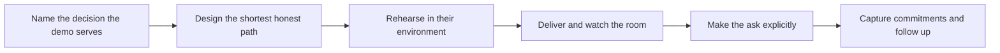

# Demos That Land

> **Core skill:** Building and delivering demos that move decisions — one demo, one decision, rehearsed in the customer's own environment, with the story a stakeholder can retell.

## Why This Matters

A forward deployment passes through a series of decisions: fund the pilot, approve the architecture, green-light the rollout, expand to the next team. Each of those decisions is made by people who will never read the code and rarely read the design document. The demo is how the deployment becomes real to them. A demo that lands converts a description into an experience — the stakeholder sees their own work moving through the system, in their own environment, and the abstract becomes something they can defend in a meeting the FDE will never attend.

Most demos fail quietly rather than spectacularly. They fail by showing features rather than decisions, by illuminating the product at the expense of the audience's problem, by running in a sandbox when the fragile question is integration with the customer's actual systems. The measure of a demo is not applause or praise; it is what changes afterward. If the decision the demo existed to support is not moved — funding released, approval granted, scope committed, concern retired — the demo was entertainment wearing a work costume.

The FDE's advantage is proximity to the customer's reality. The demo can run on their data, in their environment, against their workflow, with their terminology in every label on the screen. That is credibility no marketing demo can replicate. But it also raises the bar: their data exposes every defect in the system, their environment exposes every integration gap, and their domain experts will notice every shallow generalization. A demo that honors that reality builds trust; a demo that papers over it spends trust. Preparation is not about polish — it is about knowing exactly what the room needs to see, and being certain the system can show it.

## One Demo, One Decision

| Decision Type | Audience | What The Demo Must Show |
|---------------|----------|-------------------------|
| Fund a pilot | Sponsor and budget holder | The problem is real, this approach addresses it, and success will be visible |
| Approve the design | Architecture and security reviewers | Data flows exactly as documented, boundaries are respected |
| Green-light rollout | Steering group and operators | The workflow is usable by real staff on real work |
| Expand scope | Existing sponsor plus new teams | The proven core adapts to adjacent work with modest effort |
| Executive assurance | Leadership outside the project | The outcome in one screen, the risk in one line |

Every demo should begin with the sentence the presenter says silently: this demo exists so that this room decides this thing. If the presenter cannot name the decision, the audience certainly will not.

## Demo Craft

| Technique | Why It Works | Failure Mode If Ignored |
|-----------|--------------|------------------------|
| Use the customer's own data | Recognition does more than any narrative | Abstract sample data reads as a toy |
| Walk the critical path only | Attention is finite; deviations cost it | Feature tours dilute the decision |
| Narrate what happens and why | Audiences follow intent, not clicks | Silent screen work loses the room |
| Design the failure story | One controlled failure handled gracefully proves production-readiness | An unplanned error mid-demo becomes the memory of the meeting |
| Rehearse in the actual room | Environment quirks surface only in place | Configuration surprises at the worst moment |
| End with a concrete ask | Demos without a next step decay into impressions | "Interesting" becomes the final state |



The ask at the end is the whole point: a date for the next gate, a sign-off, an introduction, a resource assignment. Whatever happens afterward, the demo should produce a next-step sentence that everyone in the room has heard.

## Practical Applications

### Demo Readiness Checklist

- [ ] The decision this demo serves is written in one sentence before any build starts
- [ ] The room's attendees are known, with the question each one brings
- [ ] The demo runs on the customer's data or a faithful, approved representation of it
- [ ] The critical path takes minutes, not a full hour, to walk
- [ ] A known failure is designed into the story and handled gracefully
- [ ] The environment was rehearsed end to end at least once, in place
- [ ] The closing ask is written down, and the follow-up is sent within a day

### Demo Run Sheet Template

```markdown
## Demo Run Sheet — <customer, audience, date>

| Field | Detail |
|-------|--------|
| Decision being sought | <one sentence> |
| Attendees and their questions | <name, concern> |
| Scenario walked | <the customer workflow shown, in their terms> |
| Data used | <source, approval status> |
| Failure moment planned | <what fails, how it is explained and recovered> |
| Closing ask | <the specific commitment requested> |
| Follow-up owner | <who sends what, when> |
```

## Common Pitfalls

| Pitfall | Why It Is a Problem | Better Approach |
|---------|---------------------|-----------------|
| **Spectacle over substance** | Impressive shows that do not map to a decision end in polite silence | Build every demo backward from its decision |
| **Sandbox-only stories** | The integration questions that matter most are hidden until after approval | Demo against real systems where allowed, and state clearly where you could not |
| **Feature tours** | Every audience gets the same walkthrough and no one gets what they need | Tailor the path to the room's decision and vocabulary |
| **Ignoring the audience's own data** | Generic examples make the value abstract and forgettable | Show their records, their names, their workflow |
| **No ask at the end** | A demo without a next step becomes a memory of a nice meeting | End with a specific, attributable request |
| **Fearing the failure question** | An unpracticed error becomes the dominant memory | Design and rehearse a graceful failure moment |

## Success Indicators

- Decisions follow demos: funding, approvals, and scope moves happen in the days after
- Attendees retell the demo accurately to absent colleagues using their own words
- The demo's environment matches the deployment's reality closely enough that go-live surprises shrink
- Follow-up notes convert the room's reaction into committed next steps
- The same demo pattern, adapted once, works for the next stakeholder group

## Related Topics

- [[02_Executive_Communication]]
- [[04_Expectation_and_Scope_Management]]
- [[01_Field_Discovery_and_Problem_Framing/00_overview|Field Discovery and Problem Framing]]
- [[career-path/16_Developer_Advocate_and_Technical_Consultant/00_overview|Developer Advocate and Technical Consultant]]

## Summary

Demos that land are engineered backward from a decision: one room, one question, one critical path through the customer's own data, rehearsed in their environment, with a designed failure moment and a closing ask that produces a next step. The demo is not a performance of the software — it is the moment the deployment becomes real to the people who decide whether it continues, so it deserves the same rigor as the systems it shows.
