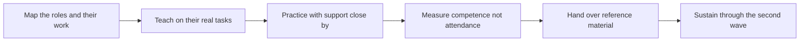

# Training and Enablement

> **Core skill:** Making users competent and confident on the system — teaching the customer's people to do their actual work through the deployment, and measuring enablement by competence rather than by sessions delivered.

## Why This Matters

A deployment is only as alive as its users. The system may run perfectly, but if the customer's operators cannot do their work through it, the deployment becomes shelfware with a support contract. Training is the bridge between a working system and working people, and in the field it is where adoption is won or lost — long before any metric dashboard shows the outcome. The FDE who treats training as a scheduling chore produces attendance records; the FDE who treats it as engineering a capability produces users who can operate, recover, and eventually teach the system themselves.

The most common mistake is teaching the product instead of the work. Users do not adopt features; they adopt the new way their Tuesday afternoon happens. Training built around the customer's real tasks — their queues, their documents, their approval chains, with their vocabulary in every label — transfers immediately into behavior. Training built around the product's architecture creates users who can describe the system but freeze when the real task hits an edge case. The distinction matters even more for AI components, where users must develop calibrated trust: knowing what the system is good at, where it fails, and what to do when it does.

Enablement also has a second customer: the organization after the FDE leaves. The deployment needs internal owners — power users, administrators, a support desk that can answer the first line of questions — or every minor issue becomes a field visit. And there is a second wave: staff who join or rotate in later never saw the launch training and learn from whatever the system happens to look like. Competence is not a one-time event but a property of the customer's organization, and the FDE engineers it the same way as any other system property: with design, measurement, and iteration. Training succeeds when it can be measured — users completing real tasks unaided, a support queue that shrinks over time, a power user who can onboard the next cohort alone.

## Training Audiences

| Audience | What They Need | Evidence of Success |
|----------|----------------|--------------------|
| Operators | To complete their own daily tasks through the system | Task completion unaided, at full quality |
| Power users | Depth to handle edge cases and coach colleagues | They resolve questions without escalating to the FDE |
| Administrators | Control of configuration, access, and health | They run routine administration without vendor help |
| Support desk | A first line of answers and escalation judgment | Ticket deflection on known questions, clean escalations |
| New joiners | A path to competence without the launch cohort | Onboarding material that teaches to the same standard |

## The Enablement Ladder

| Stage | Format | Exit Criterion |
|-------|--------|----------------|
| Awareness | Short briefing on what changes and why | Users can state what the system is for |
| Guided practice | Hands-on sessions on the users' own tasks | Users complete a familiar task with coaching |
| Independent use | Real work with support within reach | Users complete tasks unaided, at quality |
| Depth training | Edge cases, recovery, and judgment | Users handle the scenarios that used to escalate |
| Multipliers | Training the trainers and the documentation | A customer-side person teaches the next group |



Two properties of this ladder matter in the field. First, nobody skips rungs: independent use without guided practice produces confident misuse, which is worse and more persistent than hesitation. Second, the ladder ends outside the FDE — with the customer's own people teaching and their own reference material answering questions — or the deployment never becomes independent.

## Practical Applications

### Enablement Readiness Checklist

- [ ] Every user role is mapped, with the specific tasks each role performs in the system
- [ ] Training exercises use the customer's real tasks, terminology, and data shapes
- [ ] Practice happens in an environment where mistakes are safe
- [ ] Competence is measured by observed task completion, not by session attendance
- [ ] Power users and administrators receive depth training before go-live, not after
- [ ] Reference material is written for the customer, owned by the customer, and findable
- [ ] A support transition plan names who answers what once the FDE steps back

### Enablement Plan Template

```markdown
## Enablement Plan — <customer, deployment, date>

| Role | Tasks trained | Format | Competence check | Owner after handover |
|------|---------------|--------|------------------|----------------------|
| <operator> | <their real tasks> | <session type> | <observed completion> | <customer-side name> |
| <admin> | <administrative tasks> | <format> | <check> | <name> |
```

## Common Pitfalls

| Pitfall | Why It Is a Problem | Better Approach |
|---------|---------------------|-----------------|
| **Checkbox sessions** | Attendance is recorded, competence is not, and shelfware follows | Measure unaided task completion and iterate until it holds |
| **Teaching features, not work** | Users learn the product and freeze on their actual tasks | Train on the customer's real workflows end to end |
| **Training too early or too late** | Too early, skills decay before go-live; too late, early users improvise workarounds | Time enablement to the start of real use, with refreshers at go-live |
| **No measurement** | Nobody knows whether enablement worked until adoption quietly fails | Define competence checks before training begins |
| **Forgetting the second wave** | Later joiners learn from folklore and drift from the standard | Leave owned onboarding material and internal trainers behind |
| **No support transition** | Every small question routes back to the FDE, hiding a shallow deployment | Train the support desk and define the escalation path explicitly |

## Success Indicators

- Users complete their real tasks unaided within the agreed training window
- Questions reaching the FDE decline over the weeks after go-live
- Power users and administrators handle depth scenarios without escalation
- The customer's own materials and trainers carry the next cohort
- Adoption metrics hold through staff rotation because competence lives in the organization

## Related Topics

- [[06_Change_Management_and_Adoption]]
- [[07_Written_Artifacts_for_Customers]]
- [[career-path/16_Developer_Advocate_and_Technical_Consultant/00_overview|Developer Advocate and Technical Consultant]]
- [[career-path/02_Senior_Software_Engineer/00_overview|Senior Software Engineer]]

## Summary

Training and enablement are how the FDE turns a running system into working people: map the roles, teach on real tasks, let users practice where mistakes are safe, measure competence rather than attendance, and hand over reference material and internal trainers so the capability outlives the field team. The deployment is finished not when the system works, but when the customer's people can work — and when they can teach the next cohort without you in the room.
