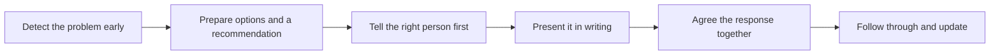

# Difficult Conversations

> **Core skill:** Delivering bad news early, with options — surfacing slipped dates, defects, unmet requirements, and outages while they are still cheap to fix, with a recommendation attached and a plan for the response.

## Why This Matters

Bad news is inevitable in the field: a date slips, a defect escapes into a workflow the customer depends on, a discovery invalidates a requirement everyone believed was met, an outage lands at the wrong hour. What separates deployments that survive these moments from those that do not is almost never the technical severity — it is the timing and shape of the conversation. Bad news delivered early, in plain language, with options attached, is a manageable problem. The same news delivered late, after the customer discovered it themselves, is a trust failure, and trust failures cost more than any defect.

The instinct to wait is understandable, even admirable in its way: engineers want to bring solutions, not problems, and each additional hour of investigation might turn the news into nothing. But waiting has an asymmetric payoff. If the problem resolves quietly, waiting saved one uncomfortable meeting. If it does not, waiting eliminated the customer's own response window — their chance to reroute staff, adjust a communication plan, or shift a dependent project. The customer does not need certainty from the FDE; they need time. The single most valuable thing the FDE can deliver in a bad-news conversation is a head start.

The craft of the conversation itself matters as much as its timing. Bad news lands well when it is organized around the customer's decisions: what happened, what it means for them, what caused it, what the options are, what you recommend, and what happens next. It lands badly when it is organized around the FDE's feelings — apology, defensiveness, or worst of all, vagueness that forces the customer to extract the facts by interrogation. And it lands best when it arrives in proportion: routine slippage delivered with disaster framing trains the customer to distrust the FDE's sense of scale. Calibrated honesty is what makes the rare red-flag conversation instantly believable.

## Bad News Categories

| Situation | Core Message | First Move |
|-----------|--------------|------------|
| Slipped date | The date moves; here is the new one and why | Confirm the new date internally before speaking, then tell the customer the same day it was learned |
| Defect in production | Something is wrong; here is the impact and the containment | Contain first if safety is at stake, then brief with impact stated |
| Requirement cannot be met | This is not possible as specified; here are the alternatives | Bring the alternative designs, not just the verdict |
| Outage | Service is down; here is what we know and when we next update | Communicate on a clock even when there is little new to say |
| Cost or effort growth | The honest number has changed; here is the trade space | Show where the change came from, with data |
| Customer-side change | The plan depends on something that moved on your side | Frame it as a joint re-plan, not an accusation |

## The Structure of Bad News

| Step | Purpose | Discipline |
|------|---------|------------|
| Situation | Say the headline first | No preamble, no burying in the third paragraph |
| Impact | What it means in the customer's terms | Their work, their dates, their risk — not system internals |
| Cause | What happened, stated without blame | Facts; blame makes the news harder to act on |
| Options | Two or three paths with costs | Real alternatives, not a rhetorical choice |
| Recommendation | What you would do, and why | The FDE's judgment is part of the value |
| Ask | What you need from them, and by when | A decision, a resource, a message |
| Next update | When they will hear from you again | Even if nothing is known, state the clock |



The order of notification deserves thought: the person who will be most exposed by the news should hear it before rather than during a large meeting — a sponsor surprised in front of peers is a sponsor made permanently cautious. Internal notification follows the same logic: the FDE's own team and manager should never learn of a serious problem from the customer.

## Practical Applications

### Difficult Conversation Checklist

- [ ] Problems are surfaced at the earliest evidence, not at the latest confidence
- [ ] The message leads with the situation and impact, not with apology or process
- [ ] At least two options with costs accompany every problem statement
- [ ] The most exposed stakeholder hears the news before any group setting
- [ ] The internal account team and manager are briefed before or with the customer
- [ ] A follow-up cadence is set even when new information is not yet available
- [ ] Blame is absent; causes are stated as facts the response can act on

### Bad News Brief Template

```markdown
## Bad News Brief — <topic, date>

**Situation:** <what happened or what we now know>

**Impact:** <what it means for the customer, in their terms>

**Cause:** <factual cause; what is still unknown>

**Options:** <option, cost, consequence> and <option, cost, consequence>

**Recommendation:** <what we propose and why>

**Ask:** <decision or resource needed, by when>

**Next update:** <date and channel>
```

## Common Pitfalls

| Pitfall | Why It Is a Problem | Better Approach |
|---------|---------------------|-----------------|
| **Waiting for certainty** | The customer loses their response window and learns they were not prioritized | Deliver the problem with its unknowns; the clock is the substance |
| **Surprising the sponsor in a meeting** | Public surprise converts a problem into a trust incident | Pre-brief the exposed stakeholder one-to-one, always |
| **Blame framing** | Blame makes the news harder to act on and poisons the next conversation | State causes factually and focus the message on response |
| **Options-free reporting** | A problem without options is a burden handed to the customer | Attach two or three paths with costs to every piece of bad news |
| **Over-apologizing** | Ritual apology crowds out the facts and reads as anxiety | Acknowledge once, plainly, then solve |
| **Hiding in email** | Serious news sent written-only can sit unread; serious news never verbal-only | Brief in person or call, then confirm in writing |

## Success Indicators

- The customer's leadership learns of problems from the FDE first, every time
- Bad news arrives while remediation is still cheap and options still exist
- Hard conversations end with an agreed response and a scheduled next update
- The customer's trust grows after incidents rather than eroding, because the response was professional
- The FDE's scale of alarm is calibrated enough that red-flag language instantly mobilizes the room

## Related Topics

- [[04_Expectation_and_Scope_Management]]
- [[02_Executive_Communication]]
- [[07_Written_Artifacts_for_Customers]]
- [[career-path/12_Technical_Program_Manager/05_Stakeholder_Alignment/00_overview|Stakeholder Alignment (TPM)]]
- [[career-path/02_Senior_Software_Engineer/06_Communication_and_Influence/00_overview|Communication and Influence (Senior Engineer)]]

## Summary

Difficult conversations are where the FDE's communication discipline pays its largest dividend: surface problems at the earliest signal, lead with situation and impact, bring options and a recommendation, protect the most exposed stakeholder from surprise, and set a follow-up clock even when there is nothing new to say. The goal is never to soften bad news but to deliver it whole — early, organized around the customer's decisions — so that a problem becomes a moment of demonstrated reliability rather than a permanent mark on the relationship.
