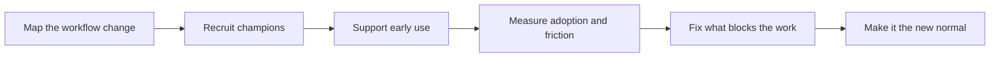

# Change Management and Adoption

> **Core skill:** Helping the organization absorb the change — treating the deployment as a change to how people work, supported through launch and beyond until the new way of working is the normal way of working.

## Why This Matters

A deployment changes a system, but adoption requires a change in people. Between "the software is live" and "the work happens through it" lies a stretch of organizational terrain that no amount of engineering elegance traverses by itself: workflows that no longer match what people memorized, roles whose importance shifts, metrics that now measure something new, habits built over years that resist a Tuesday-morning redesign. Rollout plans handle the logistics; change management handles the humans. Deployments that skip it launch cleanly and then quietly fail to be used.

The FDE participates in change management more than most engineering roles because the FDE is often the most trusted external voice in the building — the person who has seen the system work and can answer the question everyone actually cares about, which is some version of "what does this mean for me." That question is answered by actions as much as words: whether early friction gets fixed fast, whether champions are equipped rather than volunteered, whether the first month's problems are met with responsiveness or with a documentation link. Trust in the change is built the way it is built anywhere, through a series of small kept promises in front of a skeptical audience.

There is also a second-order population that decides the deployment's fate: the people who never attend a training session and encounter the system only when it changes something they own. Support desk staff, downstream teams, auditors, and neighboring departments all form their verdict from secondhand impression. Adoption is not complete when the trained users comply; it is complete when the untrained bystanders cannot tell where the old process ended and the new one began. That is the bar the FDE engineers toward — and it is only reachable if the change is followed past launch, into the months where friction surfaces and the new normal either sets or never does.

## What Changes When a System Lands

| Dimension | Typical Shift | Who Feels It Most |
|-----------|---------------|-------------------|
| Workflow | Steps merge, move, or disappear | Daily operators who memorized the old sequence |
| Roles | Some tasks gain oversight, others lose busywork | Team leads and senior staff whose judgment is now shared with the system |
| Metrics | New numbers become visible and consequential | Managers whose reporting changes shape |
| Incentives | Effort and credit redistribute | Anyone whose informal value came from the old bottleneck |
| Support | Questions find a new path | Support desk staff who inherit first-line duty |
| Confidence | Judgment is shared with a system | Experts whose expertise included the old process |

None of these shifts is inherently bad — most are improvements on paper — but each one produces friction, and friction unattended becomes resistance with a justification attached.

## The Adoption Curve in Practice

| Segment | Behavior | Tactic |
|---------|----------|--------|
| Enthusiasts | Adopt early, tolerate rough edges | Recruit them as champions, give them a direct channel and public credit |
| Early majority | Wait for proof it works for peers | Show outcomes from the enthusiasts' actual work, same roles as theirs |
| Skeptical middle | Adopt when the old path closes | Make the new path genuinely easier, and retire the old one deliberately |
| Holdouts | Resist while workarounds remain | Address the specific loss they are experiencing; remove workarounds last, not first |
| Secondary audiences | Never trained, affected anyway | Brief downstream teams and support before they are surprised |



The critical insight is the loop back from measurement to fixing. Adoption problems present as user complaints that sound like change resistance but are often disguised usability data: a step that takes one click too many, a report that arrives a day late, a search that returns the wrong document first. The FDE who hears friction as engineering input — and fixes it visibly — converts skeptics by demonstration. The FDE who hears it as attitude loses the room.

## Practical Applications

### Adoption Readiness Checklist

- [ ] The workflow and role changes are mapped with the customer's leads before rollout
- [ ] Champions are recruited by name, equipped with time, and thanked publicly
- [ ] Early friction has a fast, visible path to a fix — not a backlog
- [ ] Adoption is measured by task completion and outcome, not by logins
- [ ] Downstream and support audiences are briefed before the change reaches them
- [ ] The old path is retired on a deliberate schedule, with exceptions stated
- [ ] A stabilization period is planned after go-live, with resources named

### Resistance Map Template

```markdown
## Resistance Map — <deployment, date>

| Person or group | What they lose | Their influence | Response plan | Owner |
|-----------------|----------------|-----------------|---------------|-------|
| <name or team> | <workflow, status, or metric they valued> | <who listens to them> | <specific action, not general assurance> | <name> |
```

## Common Pitfalls

| Pitfall | Why It Is a Problem | Better Approach |
|---------|---------------------|-----------------|
| **Treating launch as the finish** | Adoption is decided in the months after go-live, when attention has moved elsewhere | Plan a stabilization period with named resources and a fix path |
| **Ignoring the workflow change** | The system is ready and the work is not, so users keep the old process alive | Map workflow shifts with the customer's leads before launch |
| **Champions without authority or time** | Unsupported champions burn out and their advocacy turns into warning | Give champions a mandate, hours, and visible credit |
| **Measuring logins instead of outcomes** | Vanity metrics hide disuse behind curiosity-driven traffic | Measure real task completion and outcome movement |
| **Fixing nothing early** | The first month sets the story; friction unanswered becomes folklore | Route early issues to a fast, visible repair loop |
| **Leaving workarounds in place indefinitely** | Two parallel processes double the cost and dilute the value case | Retire the old path deliberately, with named exceptions |

## Success Indicators

- The steady-state usage pattern emerges within weeks, not quarters
- Support questions shift from "how do I do this" to edge cases and improvements
- The old process is formally retired, and exceptions are few and documented
- Skeptics cite specific things that improved, in their own words
- Downstream teams experience the change as an improvement they were warned about, not a surprise

## Related Topics

- [[03_Training_and_Enablement]]
- [[07_Written_Artifacts_for_Customers]]
- [[01_Field_Discovery_and_Problem_Framing/00_overview|Field Discovery and Problem Framing]]
- [[career-path/12_Technical_Program_Manager/00_overview|Technical Program Manager]]

## Summary

Change management and adoption are how the FDE finishes a deployment in the only way that counts: the organization absorbs the change and the new way of working becomes the normal way of working. Map the workflow and role shifts, recruit and equip champions, treat early friction as engineering input with a fast fix path, measure real task outcomes rather than logins, brief the secondary audiences, and retire the old path on purpose. The system going live is the midpoint of the deployment; adoption is the finish line.
