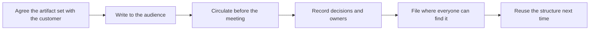

# Written Artifacts for Customers

> **Core skill:** Memos, status reports, and outcome documentation that hold up — written for the audience that will act on them, separating fact from forecast, and precise enough to survive being forwarded to people the FDE never meets.

## Why This Matters

A growing share of a deployment's decisions are made from documents rather than meetings. The sponsor forwards the status update to finance; the reviewer reads the memo before joining a call; the successor inherits the outcome report as the account's institutional memory. Every one of those documents is a message the FDE sends into rooms they will not enter, speaking to readers they cannot answer back. Written artifacts are the deployment's memory and its marketing simultaneously, and their quality compounds: a series of precise, honest reports builds a credibility balance that a single overoptimistic document has to be spent against.

The distinctive discipline of customer-facing writing is that it serves two masters at once. It must be accurate enough that the FDE's own organization can trust it as a record, and legible enough that the customer's busy readers get what they need in one pass. Internal writing can lean on shared context; customer writing cannot. Internal writing can be revised quietly; a customer document is a statement that will be quoted back. The FDE who writes cleanly, dates everything, and separates what happened from what is expected is producing something rarer than it sounds: a document that nobody has to verify.

There is also a strategic layer. Written artifacts are how outcomes survive personnel change — on both sides. Sponsors rotate, champions get promoted, FDEs move accounts, and the deployment's justification must be reconstructible from paper by whichever stranger inherits it. An account whose outcomes live only in meeting memories is an account that will eventually be re-scoped by someone's fresh assumptions. The FDE who documents outcomes against the original success criteria, in the customer's own vocabulary, is quietly building the case for renewal, expansion, and their own professional reputation at the same time.

## The Artifact Set

| Artifact | Audience | The Job It Does |
|----------|----------|-----------------|
| Status report | Working team and sponsor | Keeps reality shared: progress, risks, next decisions |
| Decision memo | Sponsor and approvers | Presents a fork with options, recommendation, and ask |
| Outcome report | Sponsor, finance, renewal stakeholders | Proves value against the agreed success criteria |
| Runbook for the customer | Operators and support | Lets the customer run without the FDE in the room |
| Meeting summary | All attendees and absentees | Fixes decisions and owners minutes after the meeting |
| Incident summary | Customer stakeholders and security | Records what happened, what changed, and what is prevented |

## Writing Standards for Customer Documents

| Standard | Why | In Practice |
|----------|-----|-------------|
| Lead with the outcome | Busy readers stop when they lose the thread | First line answers "what happened and so what" |
| Separate fact from forecast | Mixed registers destroy trust when reality diverges | Label anything not yet true as expected, planned, or at risk |
| Exact numbers and dates | Approximations get forwarded and become commitments | Write real numbers or say which number is not yet known |
| Name owners and next actions | Documents without owners produce no motion | Every action has a person and a date |
| Version and date everything | Successors must know which document governs | Header with status, date, and author on every artifact |
| No internal jargon | Vocabulary the customer does not own creates distance | Use the customer's system names and process words |



The circulate-before-meeting habit deserves special note: documents sent before a meeting set the agenda and force alignment asynchronously; documents sent after a meeting are minutes. The FDE who controls the pre-read controls what the meeting is actually about — and meetings about decisions are far shorter than meetings about information.

## Practical Applications

### Customer Writing Checklist

- [ ] Every artifact is written for its named audience, not for the FDE's manager
- [ ] The first sentence of any update is the outcome or the decision sought
- [ ] Fact and forecast are visually separated and labeled
- [ ] Dates and numbers are exact, or explicitly marked as pending
- [ ] Every action item names a person and a date
- [ ] Documents are versioned, dated, and stored where the customer can find them
- [ ] Outcome reports quote the success criteria agreed at the start of the engagement

### Outcome Report Template

```markdown
## Outcome Report — <deployment, period>

| Agreed success criterion | Status | Evidence |
|--------------------------|--------|----------|
| <criterion from the original scope> | <met, partial, not yet> | <where the proof lives> |

**What changed for the customer this period:** <plain statement of outcome>

**What remains:** <honest list of the unfinished>

**Next decisions:** <decision, owner, date>

**Prepared by / date / version:** <name, date, version>
```

## Common Pitfalls

| Pitfall | Why It Is a Problem | Better Approach |
|---------|---------------------|-----------------|
| **Journal-style status reports** | A chronological log buries the two facts busy readers needed | Lead with outcome, risk, and the decision sought |
| **Mixing fact and forecast** | Optimism leaks into the record and discredits it when reality diverges | Label expectations explicitly; keep the facts section clean |
| **Documents owned by nobody** | Orphaned artifacts go stale and mislead successors | Assign an author, a reviewer, and a refresh trigger per artifact |
| **Length as thoroughness** | Long documents get skimmed, and skimming loses the ask | One page for updates; appendix for depth |
| **Inconsistent versions in circulation** | Two conflicting documents force the customer to arbitrate | Version and date every artifact; retire superseded ones loudly |
| **Writing only for the room that asked** | The document gets forwarded to readers it was never written for | Assume every artifact will be read by strangers and write accordingly |

## Success Indicators

- Customer stakeholders quote the FDE's documents in their own decisions
- Successor teams reconstruct the deployment's history from written artifacts alone
- Outcome reports carry the renewal conversation without rework
- Meetings get shorter because the pre-reads carry the information
- No document has ever needed a correction because it overstated reality

## Related Topics

- [[05_Difficult_Conversations]]
- [[06_Change_Management_and_Adoption]]
- [[05_Enterprise_Navigation_Security_and_Compliance/00_overview|Enterprise Navigation: Security and Compliance]]
- [[software-engineering-note/14_Software_Engineering_Professional_Practice/03_Communication_Skills]]
- [[career-path/12_Technical_Program_Manager/00_overview|Technical Program Manager]]

## Summary

Written artifacts for customers are the FDE's durable voice: status reports that keep reality shared, memos that frame decisions, outcome reports that prove value against the original criteria, and runbooks that let the customer operate without them. Write for the reader who will act, separate fact from forecast, date and version everything, and assume each document will be forwarded to strangers — because it will be, and those strangers are the ones who decide what happens to the deployment next.
