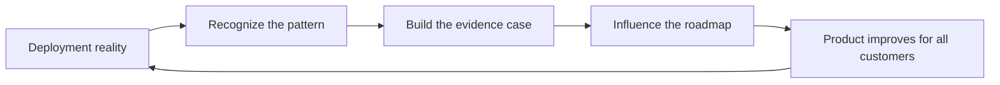

# Field to Product and Commercial Awareness

> **Core capability:** The FDE turns one customer's reality into leverage for the many — recognizing patterns across deployments, feeding the product roadmap with evidence, and understanding the economics that decide whether deployments renew, expand, or die.

## Why This Matters

A deployment solved only for one customer is a service engagement; a deployment whose learnings improve the product is a strategy. The organizations that made forward deployment strategic — Palantir's "one customer, many capabilities" being the canonical model — treat the field as the most expensive and most valuable research lab they have. The FDE is the instrument that converts deployment reality into product direction.

Pattern recognition is the core discipline. One customer wanting a feature is a request; the fourth customer hitting the same wall is a roadmap item with evidence behind it. The FDE learns to distinguish local quirks from structural truths, to quantify them (how many accounts, how much effort, what revenue at stake), and to package them in language product teams can act on — problem first, solution second.

Commercial awareness completes the picture. Deployments exist inside a business: they cost money to deliver and operate, they generate or protect revenue, and they are renewed, expanded, or abandoned based on perceived value. An FDE who understands deployment economics — why pilots fail to convert, what adoption does to cost curves, what makes an account expand — makes better engineering trade-offs and earns the trust of the commercial teams whose promises they must keep. This awareness also shapes the FDE's own career: it is the bridge to product, leadership, and founding paths.

## Topics in This Capability Area

| Topic | Core Skill | When It Matters |
|-------|------------|-----------------|
| [[01_The_Field_to_Product_Feedback_Loop]] | Running a disciplined loop from field signal to product change | Continuously, from the first deployment |
| [[02_Pattern_Recognition_Across_Deployments]] | Separating local quirks from structural patterns | After the second or third customer |
| [[03_Influencing_the_Product_Roadmap]] | Making credible, evidence-backed roadmap arguments | At planning cycles and escalations |
| [[04_Deployment_Economics_and_ROI]] | Understanding cost, value, and why deployments succeed or fail | At every commitment, and in reviews |
| [[05_Expansion_and_Renewal_Support]] | Engineering that grows the account and earns the renewal | Through rollout and beyond |
| [[06_Knowledge_Sharing_Across_FDE_Teams]] | Making one deployment's lessons available to all | As soon as more than one FDE exists |
| [[07_Career_Paths_Beyond_the_Field]] | Using field expertise as a platform for what comes next | At every career decision point |

## The Field Leverage Loop

The loop only closes if the FDE does the recognizing and the packaging — nobody else has the raw material.

## Practical Applications

### Field to Product Checklist

- [ ] Every deployment keeps a running evidence log of blockers, workarounds, and recurring asks
- [ ] Requests are quantified: accounts affected, hours lost, revenue at stake
- [ ] A monthly pattern review turns the logs into ranked, packaged proposals
- [ ] Roadmap arguments lead with the problem and evidence, not the requested feature
- [ ] Renewal and expansion decisions are supported with documented outcomes, not anecdotes
- [ ] Lessons are written so the next FDE starts from knowledge, not from zero

## Common Pitfalls

| Pitfall | Why It Is a Problem | Better Approach |
|---------|---------------------|-----------------|
| **Feature-request relay** | Product teams discount unprocessed asks | Package problems with evidence and frequency |
| **The loudest customer wins** | Roadmap driven by escalation volume, not truth | Weight signals by scale and structure |
| **Field knowledge in heads only** | Every FDE repeats every discovery | Write patterns down; build the shared playbook |
| **Engineering divorced from economics** | Technical choices that destroy deal value | Understand the value model you are serving |
| **Treating go-live as the finish** | Renewal and expansion are decided by what comes after | Engineer adoption and outcomes deliberately |

## Success Indicators

- Product changes can be traced back to field evidence packages
- The second deployment of a kind costs visibly less than the first
- Account teams request you for expansion work because outcomes hold up
- Your written patterns are referenced by other FDEs
- You can explain the deployment's business case as fluently as its architecture

## Related Capabilities

- [[01_Field_Discovery_and_Problem_Framing/00_overview|Field Discovery and Problem Framing]]: discovery produces the raw signal
- [[06_Customer_Communication_and_Executive_Influence/00_overview|Customer Communication and Executive Influence]]: outcome reporting feeds renewal and expansion
- [[career-path/14_Product_Manager/00_overview|Product Manager]]: the receiving end of field evidence
- [[career-path/17_Independent_Consulting_and_Technical_Founder/00_overview|Independent Consulting and Technical Founder]]: the commercial discipline in its purest form
- [[career-path/03_Staff_Engineer/00_overview|Staff Engineer]]: cross-team influence patterns for product direction

## Summary

Field to product and commercial awareness is what makes a forward deployment more than a project: recognizing patterns across customers, packaging field reality into evidence the product organization can act on, understanding the economics that decide renewal and expansion, and sharing knowledge so the practice compounds. The FDE who masters this loop stops being deployed and starts shaping what gets deployed.
