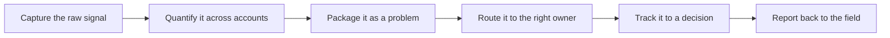

# The Field to Product Feedback Loop

> **Core skill:** Running a disciplined loop from field signal to product change — capturing what deployments reveal, quantifying it across accounts, packaging it as a problem the product organization can act on, and reporting back so the loop stays alive.

## Why This Matters

The field is the most expensive research lab an organization owns. Every deployment generates evidence that no survey, planning exercise, or internal brainstorm can produce: the workaround an operator invented at 6 a.m., the integration that fails at the fourth customer for the same structural reason, the feature request that is really a missing primitive wearing a costume. None of it becomes product direction automatically. Field signal decays — customers move on, workarounds ossify into accepted life, and the FDE who experienced the problem first-hand rotates to another account. The feedback loop is the mechanism that converts perishable field experience into durable product truth, and the FDE is the only person positioned to run it.

Left undisciplined, the path from field to product becomes a feature-request relay, and product teams learn to discount it. An unprocessed request from one customer is indistinguishable from preference; a request duplicated across five accounts, quantified in effort and revenue, with the workaround pattern documented, is evidence. The difference between these two artifacts is the FDE's actual craft: not carrying messages but doing the analytical work that turns experience into evidence. Teams that receive packaged problems respond with roadmap decisions; teams that receive raw asks respond with backlog courtesy.

The loop has a return path that most FDEs neglect at their peril. When field signal results in a product change, the customers who raised it — and the field teams who relayed it — should hear about it. Told nothing, customers conclude that raising issues is futile and stop raising them, which starves the loop at its source. Told what happened, they invest more signal, volunteer for early testing, and become allies in adoption. The feedback loop is not charity work that competes with deployment duties; it is the mechanism by which one customer's problem stops being paid for repeatedly by every following customer, and it is the difference between a field organization that compounds and one that repeats itself.

## Signal Types and How to Handle Them

| Signal | Example Shape | Handling |
|--------|---------------|----------|
| One-off ask | A single account wants a specific report format | Log it; revisit if a second account repeats it |
| Recurring blocker | The same integration failure appears in deployment after deployment | Quantify and package immediately; this is the core raw material |
| Workaround pattern | Users have invented a manual process to bridge a gap | Investigate the gap; workarounds reveal missing primitives |
| Extension request | A customer asks to apply the system to adjacent work | Capture the use case for roadmap and expansion purposes |
| Escalation | An executive demands a capability under pressure | Separate the relationship pressure from the underlying signal |
| Field defect pattern | The same class of defect recurs across environments | Route as a quality issue with cross-account evidence |

## The Loop, Step by Step

| Stage | Action | Artifact Produced |
|-------|--------|-------------------|
| Capture | Log the signal while the context is fresh | Field log entry with account, date, workaround, effort |
| Quantify | Count accounts, hours, revenue, risk exposure | Evidence summary with numbers and sources |
| Package | Frame as a problem, not a requested feature | Pattern brief with the problem statement leading |
| Route | Send to the product owner of that subsystem | Proposal in the receiving team's format and language |
| Track | Follow the decision, not just the submission | Status in the field log until resolved or rejected |
| Report back | Tell the field and the customer what happened | Note to the account and a line in the shared log |



A loop is judged by its closing, not its opening. A submission that gets a "not this cycle" is a closed loop if the reason is recorded and the field hears it; a submission that gets an enthusiastic "great idea" and then silence is an open loop that consumes trust every time it repeats.

## Practical Applications

### Field to Product Cadence Checklist

- [ ] Every deployment keeps a running field log: blockers, workarounds, recurring asks
- [ ] Each entry records account, date, effort involved, and the workaround in place
- [ ] Signals are quantified before they are submitted: accounts, hours, revenue at stake
- [ ] A regular review turns the log into a small number of ranked, packaged proposals
- [ ] Proposals lead with the problem, evidence, and scale — solution framing comes second
- [ ] Submissions are tracked to a decision, including the rejections and their reasons
- [ ] The field and the originating customer hear outcomes through a predictable channel

### Field Log Entry Template

```markdown
## Field Log — <entry id, date>

| Field | Detail |
|-------|--------|
| Account and deployment | <name and context> |
| Signal | <what happened, in one sentence> |
| Workaround in use | <what people do instead> |
| Cost | <hours, risk, or lost value per period> |
| Accounts affected | <count and names so far> |
| Pattern status | <one-off or emerging pattern> |
| Routed to | <product owner, date, proposal reference> |
| Status | <open, decided, delivered, declined with reason> |
```

## Common Pitfalls

| Pitfall | Why It Is a Problem | Better Approach |
|---------|---------------------|-----------------|
| **Relay without packaging** | Unprocessed asks get discounted as preferences | Do the quantification and problem framing before submitting |
| **Only the loudest customer is heard** | Roadmap drifts toward escalation volume instead of structural truth | Weight signals by how many accounts hit them and at what cost |
| **No feedback to the field** | Customers and FDEs stop investing signal when nothing returns | Close every loop with a reported outcome, including declines |
| **Capture by memory** | Signals not written down die with the deployment's context | Keep the log in a place the next FDE will actually read |
| **Treating every request as roadmap material** | Noise drowns the signal and product teams stop reading | Triage: most asks are one-offs; a few are patterns |
| **Abandoning the loop after a rejection** | A declined proposal is evidence too, often containing the real constraint | Record the reason and resurface the problem when conditions change |

## Success Indicators

- Product changes can be traced to evidence packages that started as field log entries
- The same recurring blocker stops reappearing in deployment after deployment
- Customers notice that their raised issues produce visible answers
- Product teams request field input because the packaging is trusted
- The field log is read by more than its author — it becomes shared infrastructure

## Related Topics

- [[02_Pattern_Recognition_Across_Deployments]]
- [[03_Influencing_the_Product_Roadmap]]
- [[01_Field_Discovery_and_Problem_Framing/00_overview|Field Discovery and Problem Framing]]
- [[career-path/14_Product_Manager/00_overview|Product Manager]]

## Summary

The field to product feedback loop turns deployment experience into product direction: capture signals while they are fresh, quantify them across accounts, package them as problems with evidence rather than requests, route them to owners who can act, track every outcome including the declines, and report back so the field keeps investing. Run as a discipline, it is what makes the second deployment of a kind cheaper than the first — and what makes the FDE's field time a strategic asset rather than a private education.
