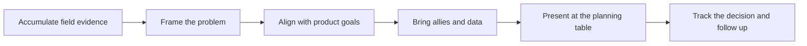

# Influencing the Product Roadmap

> **Core skill:** Making credible, evidence-backed roadmap arguments — bringing packaged problems and quantified field evidence to planning conversations, arguing with the product organization's language rather than against it.

## Why This Matters

Roadmaps are written under scarcity: limited engineering capacity, competing tenants of strategy, and more valid candidates than slots. A field argument enters that room as one claim among many, and it wins or loses on the quality of its evidence and the fluency of its framing. The FDE who walks in with "customers keep asking for this" is asking product to take a bet on the FDE's memory. The FDE who walks in with a problem statement, named accounts, measured cost, and a mechanism explanation is handing product a decision-ready case. Same underlying truth, radically different success rates.

The framing discipline matters more than most FDEs expect, because product organizations have immune systems too. Solution-first arguments — "build this feature" — trigger design instinct: product wants to solve the problem their way, and a pre-specified solution can only be accepted or rejected whole. Problem-first arguments — "these five accounts lose this much effort to this wall, here is the mechanism" — invite the product organization to own the solution, which makes it likelier they want to. The FDE supplies the problem and the evidence; the product team supplies the design and the trade-offs. Maintaining that division of labor is what turns a field voice into a trusted planning input rather than a lobbying effort.

The longest game is the actual game. An influence attempt that ends at a planning meeting is a transaction; an influence practice is a relationship with the product organization that runs across cycles. This means pre-wiring: sharing patterns early, consulting on designs that touch the accounts, volunteering deployments as validation environments, and being the field person who tells product when their shipped change worked. Influence compounds in the same way trust does — through repeated, accurate, low-drama interactions — and the FDE who invests in it finds that by the third planning cycle, their briefs are being requested rather than submitted.

## Ways a Roadmap Argument Gets Made

| Argument Shape | When It Works | Risk |
|----------------|---------------|------|
| Quantified field evidence | Recurring pattern with accounts, effort, and revenue attached | Weak numbers get discounted; do the arithmetic properly |
| Escalation support | An executive demand that genuinely reflects scale | Overuse makes the field look like a pressure channel rather than a signal channel |
| Strategic alignment | The ask maps directly to a stated product direction | Stretch alignment is transparent and costs credibility |
| Competitive context | A capability gap affecting wins and renewals | Only as good as the evidence; vague competitor claims poison the case |
| Customer validation offer | The customer will test, fund, or champion the feature | Obligates the FDE to deliver the customer's participation |

## Packaging the Case

| Element | Weak Version | Strong Version |
|---------|--------------|----------------|
| Title | "Feature request from Account X" | "Recurring integration blocker across five accounts" |
| Problem | One customer's frustration, narrated | The mechanism and who it affects, in one paragraph |
| Evidence | Impressions and recency | Counts, dates, effort, cost, and where the raw data lives |
| Impact | "It would be really useful" | What happens if it stays unsolved: effort, churn risk, deal risk |
| Proposed direction | A fully specified feature | The problem constraint stated; solution space left open |
| Ask | An implicit hope | A specific decision sought at a specific forum |



The follow-up step is where most FDEs drop the baton. A roadmap conversation is not over when the meeting ends; it is over when a decision is recorded and the field is told. Chasing the decision — politely, persistently, with new evidence when it arrives — separates the FDE whose asks get scheduled from the FDE whose asks get listened to.

## Practical Applications

### Roadmap Influence Checklist

- [ ] The proposal leads with the problem and evidence, not the requested feature
- [ ] Accounts, dates, effort, and cost are attached, with sources identified
- [ ] The argument is aligned to the product organization's stated goals, or honestly marked as an exception
- [ ] The solution space is left open unless a constraint requires otherwise
- [ ] The right forum and owner are identified before the case is submitted
- [ ] Allies — support, sales engineering, other FDEs — are aware and aligned before the meeting
- [ ] The decision is tracked to resolution, and the outcome is fed back to the field and the customer

### Roadmap Proposal Template

```markdown
## Roadmap Proposal — <problem name, date>

**Problem:** <one paragraph, mechanism-first, no solution language>

**Evidence:** <accounts, dates, effort, cost, links to raw data>

**Impact if unsolved:** <what keeps happening, to whom, at what scale>

**Constraints observed:** <what any solution must respect, from field reality>

**Alignment:** <product goal this touches, or the honest gap>

**Ask:** <the decision sought, from which forum, by when>
```

## Common Pitfalls

| Pitfall | Why It Is a Problem | Better Approach |
|---------|---------------------|-----------------|
| **Feature-request delivery** | Unpackaged asks get triaged as preferences and sink | Package problems with evidence and frequency before submitting |
| **Escalation as the standard channel** | If every ask rides an executive, the field becomes noise | Reserve escalations for scale cases; build the normal channel on evidence |
| **Solution-first framing** | Pre-specifying the fix invites rejection of the whole package | State the problem and constraints; let product own the design |
| **Surprising the product team at planning** | A cold pitch in a crowded room reads as lobbying | Pre-wire with owners and allies; arrive to confirm, not to ambush |
| **No follow-up after a yes** | Unfollowed-up wins slip silently out of roadmaps | Track decisions and re-raise with new evidence when needed |
| **Taking a no personally** | Grudge turns a transient decision into a durable relationship cost | Record the reason, adapt the case, and resurface when conditions change |

## Success Indicators

- Proposals include numbers the product team can reuse without re-derivation
- Field-originated changes appear on roadmaps with traceable evidence behind them
- Product pulls the FDE into planning conversations rather than receiving submissions
- Declined proposals come back with specific reasons that sharpen the next attempt
- Other FDEs adopt the packaging format because it demonstrably works

## Related Topics

- [[01_The_Field_to_Product_Feedback_Loop]]
- [[02_Pattern_Recognition_Across_Deployments]]
- [[career-path/14_Product_Manager/00_overview|Product Manager]]
- [[career-path/14_Product_Manager/07_Technical_Partnership/00_overview|Technical Partnership (PM)]]
- [[career-path/03_Staff_Engineer/00_overview|Staff Engineer]]

## Summary

Influencing the product roadmap is a discipline of packaging and persistence: bring problems with quantified field evidence, frame them in the product organization's language, align or honestly acknowledge the gap with strategy, pre-wire allies, leave the solution space open, and track every decision to a recorded outcome. The FDE does not win roadmap arguments by arguing harder but by making the field's evidence the easiest, most decision-ready input in the room — cycle after cycle, until the field voice is something planning waits for.
