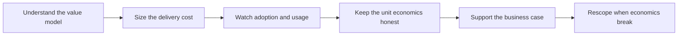

# Deployment Economics and ROI

> **Core skill:** Understanding cost, value, and why deployments succeed or fail — making engineering trade-offs in the currency of the business case the deployment exists to serve.

## Why This Matters

Every deployment is a bet: a customer spends money, attention, and organizational risk expecting a return in saved effort, reduced risk, or enabled revenue. The FDE sits at the point where that bet is won or lost, because most of the variables are engineering variables — how much custom work the deployment requires, how much support load it generates, whether it runs on clean product or on a bespoke scaffold that only its author understands. An FDE who cannot see the economics will make locally reasonable engineering choices that quietly destroy the deal: the elegant customization that becomes unmaintainable, the scope expansion that triples delivery cost, the one-off feature that earns a renewal check and costs five times that in perpetual support.

Commercial awareness also changes how the FDE interprets the field itself. Pilots that fail to convert, accounts that stall at rollout, renewals that arrive without evidence — these have causes, and the causes are often legible in adopter behavior and cost curves long before they appear in renewal numbers. The FDE who understands the value model can see adoption decay as an economic signal, can articulate why the twelfth custom integration should be a product investment instead of another deployment, and can tell the difference between a customer problem worth solving and a customer problem worth pricing.

None of this requires the FDE to become a salesperson. It requires fluency: being able to explain the deployment's business case as clearly as its architecture, to state what a new requirement costs and what it displaces, and to notice when the economics of a situation have quietly crossed from healthy to dangerous. That fluency is also the FDE's own career asset — it is the vocabulary of every room where field expertise gets converted into product, leadership, or founding decisions, and the people who can speak it are the ones who get invited into those rooms.

## The Cost Side

| Cost Element | What Drives It | How the FDE Influences It |
|--------------|----------------|---------------------------|
| Delivery engineering | Customization depth, environment complexity, integration count | Argue for product-native paths; keep custom work thin and documented |
| Support load | Bespoke behavior, unclear ownership, weak runbooks | Engineer for the customer's ability to self-serve and for clear escalation |
| Operating cost | Processing volume, environment choices, vendor components | Right-size architecture to the customer's actual scale trajectory |
| Maintenance drag | One-off features that must survive version upgrades | Prefer configuration over code; retire one-offs when product catches up |
| Coordination cost | Meetings, approvals, reviews across both organizations | Reuse artifacts, reduce decision surface, keep the cadence disciplined |
| Opportunity cost | Field time spent on one account rather than the pattern | Recognize patterns and push them to product rather than bespoke-solving each time |

## The Value Side

| Value Type | How It Shows Up | How To Know It Is Real |
|------------|-----------------|------------------------|
| Effort saved | Hours returned to the customer's staff | Task-level before-and-after, observed not asserted |
| Error reduction | Fewer mistakes, cleaner outputs, less rework | Defect and rework rates tracked on the same workflow |
| Throughput | More work completed by the same team | Volume handled without headcount increase |
| Risk reduction | Exposure avoided, controls strengthened | The risk owner acknowledges the change in writing |
| Decision quality | Faster, better-informed decisions | The decision-makers themselves describe the improvement |
| Revenue enablement | New business or retention the system supports | The commercial team attributes outcomes, not the FDE |

## Why Pilots Fail to Convert

| Cause | Warning Sign | Countermeasure |
|-------|--------------|----------------|
| Value never crossed into daily work | Usage stays in demonstrations and trials | Engineer adoption deliberately; tie to live workflows early |
| Cost of scaling was never priced | The pilot was hand-crafted and cannot multiply | Design the pilot to scale; avoid scaffolding that cannot ship |
| Success criteria were never agreed | Different stakeholders describe different purposes | Write measurable criteria before build, quote them at every review |
| Sponsorship thinned between phases | Meetings lose their executive chairs | Keep the sponsor cadence with outcome-and-risk reporting |
| The business case rested on impressions | Nobody can state the return with evidence | Instrument the workflow; document outcomes as they accumulate |



The rescope step is the one FDEs avoid until it is too late. When the cost of a commitment grows past its value, the professional move is to say so early with options — a reduced scope, a phased approach, a product dependency — not to absorb the delta silently until the deployment's economics turn permanently negative.

## Practical Applications

### Economic Awareness Checklist

- [ ] The deployment's value model is understood and stated in one paragraph
- [ ] The main cost drivers are known and observed, not assumed
- [ ] Custom work is tracked with its delivery and support cost visible
- [ ] Adoption metrics are read as economic signals, not vanity numbers
- [ ] Value evidence is captured against the agreed criteria as it happens
- [ ] Commitments that outrun value trigger an early, optioned conversation
- [ ] Recurring field costs get escalated to product instead of re-absorbed per account

### Value Model Sketch Template

```markdown
## Value Model — <deployment, date>

| Element | Detail |
|---------|--------|
| Value promised | <what the business case rests on> |
| Value observable | <what can be measured, how, and by whom> |
| Delivery cost drivers | <what makes this deployment expensive> |
| Support cost drivers | <what will keep costing after go-live> |
| Scale assumptions | <what must remain true for the economics to hold> |
| Break conditions | <what would make this deployment uneconomic, and what we would do> |
```

## Common Pitfalls

| Pitfall | Why It Is a Problem | Better Approach |
|---------|---------------------|-----------------|
| **Engineering divorced from economics** | Technical choices quietly destroy deal value and delivery capacity | Know the value model you serve and price choices against it |
| **Custom work priced as product work** | One-off effort is delivered as if it will amortize across accounts | Track custom cost honestly and push recurring needs to product |
| **Ignoring support cost of one-offs** | The feature that wins a renewal can cost multiples of it to sustain | Weigh every one-off against its lifetime support burden |
| **ROI claims without a baseline** | Unmeasured value cannot survive scrutiny at renewal | Establish before-and-after measurement before the change lands |
| **Treating adoption as a soft metric** | Usage decay is the leading indicator of a failing business case | Read and act on adoption as an economic signal |
| **Absorbing cost deltas silently** | Quiet erosion looks fine until the renewal conversation, then is fatal | Surface economics shifts early with options and recommendations |

## Success Indicators

- The FDE can state the deployment's business case as fluently as its architecture
- Commitments that outrun their value are renegotiated early, before damage
- Recurring field needs reach product instead of being re-solved per account
- Renewals and expansions rest on measured outcomes, not impressions
- Engineering trade-offs along the way reflect the value model, demonstrably

## Related Topics

- [[05_Expansion_and_Renewal_Support]]
- [[03_Influencing_the_Product_Roadmap]]
- [[career-path/17_Independent_Consulting_and_Technical_Founder/00_overview|Independent Consulting and Technical Founder]]
- [[career-path/15_Solutions_and_Enterprise_Architect/00_overview|Solutions and Enterprise Architect]]

## Summary

Deployment economics and ROI are the FDE's second language: understanding what the deployment costs to deliver and sustain, what value it must produce and how that value is actually measured, and why pilots stall and renewals sag when either side drifts. Fluency here changes engineering decisions in the moment — thin custom work, designed-for-scale solutions, early optioned conversations when costs outrun value — and it changes careers, because the field engineers who speak the business case are the ones trusted with what comes next.
