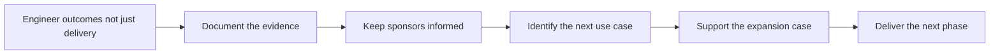

# Expansion and Renewal Support

> **Core skill:** Engineering that grows the account and earns the renewal — treating go-live as a beginning, documenting outcomes as they happen, and building the technical case for the next phase before anyone has to ask for it.

## Why This Matters

The renewal decision is made months before the renewal conversation. Accounts do not renew because a sales cycle concluded successfully months earlier; they renew because the deployment demonstrably changed how their people work and because the people who matter can point to the evidence. Likewise, expansion — a new team, a new use case, a new region — is almost never a cold sale. It is the visible consequence of a deployment that delivered something a neighboring group wants for itself. The FDE occupies the pivotal role in both: they are present in the months when outcomes accumulate or fail to, and they are the person best positioned to notice the next use case while it is still forming.

The failure mode is treating go-live as the finish line. After launch, field attention moves to the next account, the deployment enters steady state attended by support tickets, and the outcome story stops being written precisely when it starts mattering. When renewal season arrives, the account team assembles a case from memory, a few slides, and whatever the usage dashboard happens to show — a thin case against the natural drift of enterprise budgets. The FDE who keeps engineering the account after launch — measuring outcomes, fixing adoption friction, developing the customer's own owners — is doing renewal work, whether or not anyone calls it that.

Expansion has its own discipline. The best expansion leads are internal referrals from satisfied users, and they form around specific moments: the neighboring team sees a report produced faster, hears a champion describe the new workflow, watches a peer group stop doing work the old way. The FDE can engineer those moments — through the customer's own champions, through outcome documentation written for a general audience, through deliberately scoped proofs for the adjacent use case. What the FDE must not do is promise expansions the delivery organization cannot support; the surest way to convert a healthy account into a resentful one is to sell a second phase that engineering cannot staff.

## Engineering for the Renewal Clock

| Deployment Phase | What Renewal Depends On | FDE Action |
|------------------|-------------------------|------------|
| Rollout | Adoption actually happening in live work | Watch friction; fix early; support champions |
| Steady state | The system remaining useful and trusted | Keep improvements flowing; surface patterns; maintain cadence with the sponsor |
| Adoption dip | Friction or attention loss being caught early | Treat declining usage as an engineering signal, not a customer problem |
| Support events | Incidents handled in ways that build rather than erode trust | Communicate clearly; follow through; summarize what changed |
| Renewal window | Evidence assembled and stakeholders aligned | Support the account team with documented outcomes and accurate scope |
| Post-renewal | Momentum continuing into the next term | Re-baseline the plan; keep the outcome cadence alive |

## Expansion Patterns

| Expansion Type | What Unlocks It | Engineering Implication |
|----------------|-----------------|-------------------------|
| More users | A proven workflow spreading within the team | Capacity, licensing, and enablement for scale |
| More teams | Champions describing outcomes across boundaries | Configuration, permissions, and customization that generalize |
| New use case | The core proving adaptable to adjacent work | Scope and integration work; keep the proof bounded |
| New integration | The system earning a deeper place in the workflow | Interface work that follows product-native paths |
| New region or business unit | Outcomes surviving translation to another context | Residency, language, and support model differences |
| Enterprise standardization | The deployment becoming the reference pattern | Product fitness, documentation, and a defensible standard story |



The loop is self-reinforcing when it runs: each phase delivers outcomes, outcomes produce evidence, evidence supports the next phase. It breaks when any link is skipped — usually the evidence link, because it is the one that feels like administration in the middle of delivery.

## Practical Applications

### Renewal and Expansion Checklist

- [ ] Outcomes are documented continuously against the criteria agreed at the start
- [ ] Sponsors receive a regular outcome-and-risk cadence, not just problem escalations
- [ ] Adoption is monitored after launch, and dips trigger engineering investigation
- [ ] The customer's own champions can articulate the value without the FDE present
- [ ] Adjacent use cases and teams are identified while the proof is still fresh
- [ ] Practically scoped proofs are designed for expansion candidates, not open-ended promises
- [ ] Expansion commitments are made only with delivery capacity confirmed

### Renewal Evidence Pack Template

```markdown
## Renewal Evidence Pack — <account, period>

| Element | Detail |
|---------|--------|
| Original success criteria | <as agreed at deployment start> |
| Outcomes achieved | <criterion by criterion, with evidence> |
| Adoption summary | <real usage in real workflows, honestly stated> |
| Incidents and responses | <what happened and how it was handled> |
| Costs and changes | <what the deployment has meant operationally> |
| Next-phase candidates | <adjacent use cases with scoping notes> |
| Open items | <what remains unfinished, with plans> |
```

## Common Pitfalls

| Pitfall | Why It Is a Problem | Better Approach |
|---------|---------------------|-----------------|
| **Go-live treated as the finish** | The months after launch decide renewal, and they pass unattended | Plan post-launch engineering: adoption, outcomes, improvements |
| **Outcomes undocumented** | Renewal built on memory loses to budget pressure every time | Capture evidence continuously against the original criteria |
| **Surprises at renewal** | A renewal conversation that opens with unwelcome news feels like a trap | Keep the sponsor cadence steady so nothing is new at renewal time |
| **Promising expansions beyond capacity** | Oversold phases become under-delivered phases and damage a healthy account | Commit only with confirmed delivery capacity and honest scope |
| **Ignoring the departing champion** | When the internal advocate leaves, the deployment loses its voice | Spread enablement across several people; document value for successors |
| **Waiting for the customer to ask for more** | Expansion windows are short and obvious only in retrospect | Surface adjacent use cases proactively as proofs, not as pitches |

## Success Indicators

- Renewals open with documented outcomes already in the customer's hands
- Expansion conversations originate from the customer's own champions
- Post-launch improvements keep flowing, and users notice them
- The account team requests the FDE for expansion work because outcomes hold up
- Each delivered phase produces the evidence that case the next phase rests on

## Related Topics

- [[04_Deployment_Economics_and_ROI]]
- [[03_Influencing_the_Product_Roadmap]]
- [[06_Customer_Communication_and_Executive_Influence/00_overview|Customer Communication and Executive Influence]]
- [[career-path/15_Solutions_and_Enterprise_Architect/00_overview|Solutions and Enterprise Architect]]

## Summary

Expansion and renewal support is the FDE's long game: engineer outcomes after go-live, document them continuously against the original criteria, keep sponsors close with a steady cadence, watch adoption as an early signal, and develop the next phase from the customer's own reference rather than from a cold pitch. Accounts grow and renew because the deployment keeps proving itself — and the FDE is the person who decides whether that proof exists when the decision arrives.
