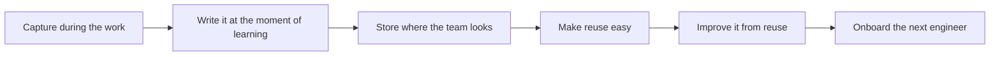

# Knowledge Sharing Across FDE Teams

> **Core skill:** Making one deployment's lessons available to all — capturing knowledge at the moment of learning, storing it where the team will find it, and making reuse easier than rediscovery.

## Why This Matters

Forward deployment is an expensive teacher, and it charges every engineer separately unless the lessons move. The first FDE to hit a given obstacle pays full price in investigation: the integration quirk, the approval sequence, the migration trick, the customer pattern that breaks assumptions. If that knowledge stays in one head, the second FDE pays the same price again, and the organization's field capability scales linearly with headcount while its efficiency scales with nothing at all. Knowledge sharing is what converts field experience from a private asset into a team compound — and the difference between the teams that have it and the teams that do not shows up in margins, delivery speed, and how much each new FDE must be allowed to fail before being trusted.

The obstacle is rarely willingness; engineers like sharing discoveries. It is friction and decay. Documentation efforts that demand hours produce artifacts that are late, generic, and unread. Knowledge captured in the wrong place — a personal note, a chat thread, a slide in an internal deck — cannot be found by the person who needs it at design time. The workable discipline is to write small things at the moment of learning, in the place where the reader will already be looking: the repository the code lives in, the playbook the deployment process references, the template the next deployment starts from. A paragraph in the right location beats a wiki page in the wrong one.

There is also a direction of sharing that FDEs underrate: the team itself. Patterns and field signals flow upward to product, but an FDE team's own operating knowledge — how to onboard a customer environment, standard questions to ask in week one, the audit checklist, the war stories about what went wrong — flows sideways, and it is often the most immediately valuable. War stories deserve special mention: a team that only shares successes teaches nothing about judgment. The failure case, written with what the signals were and what was missed, is the densest knowledge an FDE team can hold. Sharing it is what turns an individual's scar into a colleague's shortcut.

## What to Share

| Asset | Why It Compounds | Where It Lives |
|-------|------------------|----------------|
| Pattern briefs | Prevents the class of problem from being rediscovered per account | Where deployment design reviews will read them |
| Deployment playbooks | Turns a first deployment into a repeatable sequence | Beside the deployment process or templates |
| Reusable artifacts | Integration templates, checklists, evidence packs ready to adapt | In the shared repository, versioned like code |
| Environment quirks catalog | Saves hours of diagnosis on known oddities | Where support and engineers both look |
| Failure and incident writeups | Teaches judgment and warning signs; densest of all | Team knowledge base with a blameless format |
| Customer patterns | Helps colleagues anticipate stakeholder and governance behavior | Alongside pattern briefs and account notes |

## Sharing Mechanisms and Their Failure Modes

| Mechanism | Strength | Failure Mode |
|-----------|----------|--------------|
| Repository docs next to the code | Found at the moment of need | Written once and never revisited as the code evolves |
| Playbooks and checklists | Reduce first-time cost dramatically | Become ceremonial; steps followed without judgment |
| Templates for reuse | Make the right path the fast path | Templates drift from reality and teach outdated practice |
| Team reviews and retrospectives | Distribute context through conversation | Decisions made but never recorded outside the room |
| Onboarding for new FDEs | Forces gaps into the open | Onboarding taught by the longest-tenured person only |
| Office hours and pairing | Transfers tacit knowledge efficiently | Dependent on specific people's availability |



The improve-from-reuse step is where a knowledge base stays alive. Every reuse is an opportunity to correct: the template that needed an edit, the playbook step that was skipped, the quirk that has since been fixed in the product. Teams that treat documentation as a product with users — and revise it when users stumble — end up with knowledge that is trusted; teams that treat it as an obligation end up with a graveyard of stale pages that teaches newcomers to ignore all of it, including the parts that matter.

## Practical Applications

### Knowledge Sharing Checklist

- [ ] Lessons are written at the moment of learning, in minutes, not batched for later
- [ ] New knowledge lands where the next engineer will look: the repo, the playbook, the template
- [ ] Failures are documented in a blameless format alongside the successes
- [ ] Templates and playbooks get revised when reuse reveals their gaps
- [ ] Onboarding for new FDEs includes the written artifacts and exercises against them
- [ ] The team reviews its shared knowledge on a cadence and retires what the product has outdated
- [ ] Knowledge that helps product is routed through the field-to-product loop, not left in team files

### Deployment Playbook Skeleton

```markdown
## Deployment Playbook — <type of deployment>

| Section | Contents |
|---------|----------|
| Week one checklist | <what to establish before anything else> |
| Environment quirks known | <per-platform oddities and their fixes> |
| Integration checklist | <the ordered path that has worked> |
| Approval artifacts | <what reviewers asked for last time> |
| Enablement essentials | <training sequence that produced competence> |
| What went wrong before | <the failure modes and their warning signs> |
| Reuse notes | <what to adapt rather than rebuild> |
```

## Common Pitfalls

| Pitfall | Why It Is a Problem | Better Approach |
|---------|---------------------|-----------------|
| **Knowledge in heads only** | Every departure, rotation, or busy week costs the team a rediscovery | Write small, write at the moment, write where the reader looks |
| **Write-only documentation** | Docs written but never read, reused, or revised become noise | Treat documents as products with users; revise on reuse |
| **Heroic individual expertise** | Teams that depend on one person cannot scale or take vacations | Pair, template, and externalize the expert's tacit practice |
| **Failures unwritten** | A team that shares only wins teaches nothing about judgment | Write incident and failure notes in a blameless format |
| **Perfection before sharing** | Polishing forever means sharing never; drafts beat nothing | Share the rough version now; improve it when someone uses it |
| **Sharing into the void** | Artifacts stored where nobody looks help nobody | Publish at the place and time of need, not the place of record |

## Success Indicators

- New FDEs deliver with less hand-holding because the playbooks carry the basics
- The same obstacle is investigated once across the team, not once per engineer
- Playbooks and templates show revision history from real reuse
- Failure writeups are read and cited in design reviews before the failure repeats
- Colleagues across accounts ask the team for its artifacts by name

## Related Topics

- [[02_Pattern_Recognition_Across_Deployments]]
- [[07_Career_Paths_Beyond_the_Field]]
- [[career-path/16_Developer_Advocate_and_Technical_Consultant/00_overview|Developer Advocate and Technical Consultant]]
- [[career-path/03_Staff_Engineer/00_overview|Staff Engineer]]

## Summary

Knowledge sharing across FDE teams is what makes a field organization compound: capture lessons in the moment, store them where the next engineer will actually look, make reuse easier than rediscovery, revise the artifacts every time reuse teaches something, and write down failures with the same care as wins. The measure of a field team's maturity is not the brilliance of its best deployment — it is how little of that brilliance has to be rediscovered on the next one.
