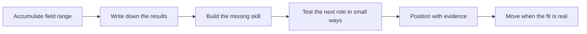

# Career Paths Beyond the Field

> **Core skill:** Using field expertise as a platform for what comes next — knowing what the field builds in you, naming what each destination requires, and positioning with evidence instead of hope.

## Why This Matters

Forward deployment develops a rare combination of skills, but it does so implicitly, and implicit skills are easy to under-value precisely by the people who hold them. The FDE accumulates judgment about customers, delivery under ambiguity, product sense from repeated contact with real usage, commercial literacy earned by watching deals live and die, and the ability to hold a room of executives. These are the scarce ingredients of several senior roles — product management, solutions architecture, engineering leadership, founding — but they are not automatically legible to hiring processes built around categories. The FDE who wants a choice of next steps must make their own experience legible: to themselves first, then to the rooms they want to enter.

The field also has a risk profile worth naming honestly. FDE work can be consuming — travel, customer pressure, context switching — and the skills compound best in the first several years, after which the marginal learning per deployment can flatten if the engineer is executing playbooks rather than building new judgment. Some FDEs thrive in the field for a career and grow into principal or field-leadership positions that shape how deployments are done. Others reach a point where the leverage they want — over products, over teams, over companies — lives further upstream. Neither path is a failure; the failure is drifting into one of them by inertia, discovering five years later that the skills were never documented and the choice was never made.

Preparation for any transition shares one core discipline: convert field experience into artifacts. The outcomes evidence, the pattern briefs, the playbooks, the decision records — all of it doubles as a professional portfolio that most engineers never build because their work is only visible in a repository. A product manager candidate who can say "here is a pattern I documented across five accounts and carried to a roadmap change" is describing the job they are applying for. A founder candidate who has watched ten budgets approve or reject software is holding market research that cannot be bought. The field is a platform; the FDE's job is to leave with the receipts.

## What the Field Builds

| Asset | What It Looks Like in Field Work | Where It Points |
|-------|----------------------------------|-----------------|
| Customer judgment | Reading rooms, sponsors, and politics quickly | Product, solutions, field leadership, founding |
| Delivery under ambiguity | Shipping value when requirements evolve weekly | Any senior engineering or program role |
| Product sense | Knowing what users actually do versus say | Product management, developer relations |
| Commercial literacy | Understanding value models, renewals, deal mechanics | Founder paths, solutions architecture, leadership |
| Executive communication | Persuading and briefing senior stakeholders | Management, program leadership, founding |
| Pattern recognition | Turning many deployments into structural insight | Staff-plus engineering, product strategy |

## Adjacent Paths and What They Require

| Path | What Carries Over | What To Build or Show |
|------|-------------------|-----------------------|
| Product management | Problems, evidence, customers, credibility with engineering | Prioritization frameworks, roadmap artifacts, one shipped product decision you influenced |
| Solutions and enterprise architecture | Design under real constraints, governance fluency | Architecture artifacts, standards work, cross-team design leadership |
| Engineering leadership | Trust, delivery discipline, calm in customer-facing pressure | People development stories, team outcomes, delegation practice |
| Founding and independent consulting | Commercial literacy, customer discovery, delivery economics | A documented market observation, a willingness to define value yourself |
| Developer relations and enablement | Teaching, demos, field empathy | Public artifacts, communication samples, community presence |
| Applied AI and specialist tracks | Deployment experience with models in real environments | Depth in evaluation, guardrails, and the discipline of your specialty |



The test-in-small-ways step is what keeps a transition honest. Before committing to product, take on a scoped product-shaped project inside a deployment. Before leadership, lead something adjacent — an enablement program, a cross-account initiative. Small tests produce real evidence and real preferences, and they cost far less than a role change made on theory.

## Practical Applications

### Career Checkpoint Checklist

- [ ] The skills the field has built are written down with concrete examples, not adjectives
- [ ] The destinations being considered are each described in terms of their real daily work
- [ ] At least one missing skill per destination is identified, with a plan to build it
- [ ] A small test of the next role has been run — a scoped project, a stretch assignment
- [ ] Results, artifacts, and outcome documents are collected where they can be shown
- [ ] Relationships across the customer base and the company are maintained, not just used
- [ ] The decision to stay or move is remade deliberately at intervals, not inherited from inertia

### Capability Evidence Log Template

```markdown
## Capability Evidence — <name, period>

| Capability | Situation | What I did | Observable result |
|------------|-----------|------------|-------------------|
| <e.g. customer judgment> | <deployment, escalation, design fork> | <action taken> | <outcome someone else can verify> |
| <e.g. commercial literacy> | <pricing, renewal, scope trade> | <action> | <result> |
```

## Common Pitfalls

| Pitfall | Why It Is a Problem | Better Approach |
|---------|---------------------|-----------------|
| **Treating field work as not real engineering** | Undervaluing it hides the very experience senior roles prize | Name the capabilities explicitly, with examples |
| **Inertia staying past the learning** | Years pass executing playbooks rather than compounding judgment | Re-evaluate deliberately at intervals; make staying a choice |
| **Choosing a destination from theory** | A role imagined is often unlike the role performed | Run small tests before transitioning |
| **No written record of outcomes** | Unofficial experience cannot be shown to anyone who matters | Keep the capability evidence log current |
| **Moving for the title only** | A wrong-context title can strand the very skills that made you valuable | Match the destination to how you want to work, not just its label |
| **Burning relationships on the way out** | The field community is small and remembers; customers become colleagues | Leave accounts healthy, handovers complete, bridges intact |

## Success Indicators

- You can describe what you have done in terms that make sense outside the field function
- Small tests have produced evidence about the next role before any formal move
- People in the destination function already know you as a contributor, not a candidate
- Former customers and colleagues are references who volunteer, not ones you must chase
- Whichever direction you choose — deeper in the field or beyond it — the choice was made, not accepted

## Related Topics

- [[06_Knowledge_Sharing_Across_FDE_Teams]]
- [[04_Deployment_Economics_and_ROI]]
- [[career-path/17_Independent_Consulting_and_Technical_Founder/00_overview|Independent Consulting and Technical Founder]]
- [[career-path/14_Product_Manager/00_overview|Product Manager]]
- [[career-path/03_Staff_Engineer/00_overview|Staff Engineer]]

## Summary

Career paths beyond the field are reached by knowing what the field built in you, naming it with evidence, building the specific skills each destination requires, and testing the next role before committing to it. The FDE's experience — customer judgment, delivery under ambiguity, commercial literacy, executive communication — is exactly what upstream roles need, but only if it is made legible. The move, when it happens, should be a decision made deliberately and repeatedly, with a portfolio of receipts and a network of intact relationships — not an accident that happened while the deployment schedule was busy.
