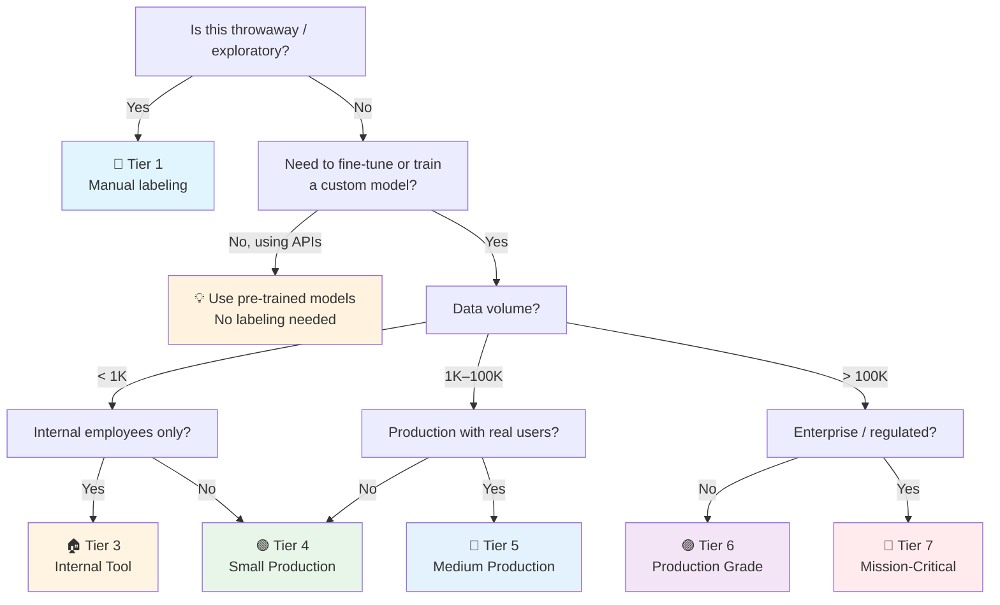

# AI Data Labeling & Training Data Checklist

> The **data foundation** checklist — creating, versioning, and quality-controlling training data for AI.
> Companion to [[AI]] (application layer), [[AI Evaluation]] (measuring model quality), [[Database]] (data infrastructure).
> For software engineers new to AI: "models are commodities; data is the moat." This checklist ensures your data is actually usable.
> Last updated: 2026-08-07

---

## 1. Labeling Strategy & Scope

- [ ] **Goal defined** — What is the labeled data for? Different goals need different strategies:
  - **Training/Fine-tuning** — Model learns patterns from input→output pairs. Needs 500–10K high-quality examples.
  - **Evaluation** — Measure model quality on unseen data. Needs 50–500 carefully curated examples.
  - **Active learning** — Label only what the model is uncertain about. Iterative, needs model-in-the-loop.
  - **Reinforcement Learning from Human Feedback (RLHF)** — Rank model outputs by preference. Complex, expensive.
- [ ] **Labeling guidelines written** — A written document that every labeler follows. Contains: task definition, edge cases, examples with explanations, priority rules for ambiguous cases. **Without written guidelines, every labeler interprets the task differently → inconsistent data → bad model.** This is the #1 cause of poor training data quality.
- [ ] **Scope bounded** — "Label everything" is not a strategy. Define: which fields to label, which entity types to extract, which categories to classify into, the taxonomy (hierarchy of categories). A tight, well-defined scope produces better data than a broad, vague one.
- [ ] **Labeling source chosen** — Who labels the data?
  - **Domain experts** — Highest quality, most expensive, slowest. Use for specialized domains (medical, legal).
  - **Professional labelers** — Good quality, moderate cost. Use for standard tasks (sentiment, NER).
  - **Crowdsource (MTurk, Scale AI)** — Cheapest, lowest quality, needs heavy QA. Use for high-volume, low-complexity tasks.
  - **AI-assisted (LLM pre-labeling)** — LLM generates initial labels, humans review and correct. Fastest, growing in popularity. Requires careful validation (the LLM has its own biases).
  - **Programmatic (weak supervision)** — Snorkel-style: rules, heuristics, and external knowledge bases generate "weak" labels. No human labelers, but labels are noisy.
- [ ] **Cost estimated upfront** — Labeling cost = (number of examples) × (time per example) × (labeler hourly rate). Example: 5,000 examples × 2 min each × $20/hr = ~$3,300. Double it for QA and re-labeling. Budget before starting, not after.

## 2. Labeling Workflow & Tooling

- [ ] **Labeling tool chosen** — Match the tool to the task:
  - **Text classification / NER** — Label Studio, Prodigy, Doccano, Argilla
  - **Image bounding box / polygon / mask** — CVAT, Label Studio, Roboflow
  - **Audio transcription** — Label Studio, Praat
  - **LLM preference ranking (RLHF)** — Argilla, Label Studio, custom
  - **Embeddings / retrieval evaluation** — Argilla (built for this)
  - **Spreadsheets** — Acceptable for small sets (< 500 rows), but lacks version control and audit trail
- [ ] **Labeling UI/UX tested** — Labelers use the tool for hours. Bad UI = fatigue = errors. Test with 5 examples before committing to a tool. Look for: keyboard shortcuts, bulk actions, undo, progress tracking.
- [ ] **Inter-annotator agreement (IAA) measured** — Have 2+ labelers label the same subset (~50–100 examples). Measure agreement:

| Metric | Range | Meaning |
|---|---|---|
| **Cohen's κ (kappa)** | -1 to 1 | Agreement beyond chance. > 0.6 acceptable, > 0.8 good, < 0.4 = guidelines need revision. |
| **Fleiss' κ** | -1 to 1 | Multi-annotator version of Cohen's κ. Use when > 2 labelers. |
| **Raw agreement %** | 0–100% | Simple but misleading — doesn't account for chance agreement. 90% sounds good but may be chance if one class dominates. |

If κ < 0.6: guidelines are ambiguous, task is poorly defined, or labelers need training. Fix the guidelines before labeling at scale.

- [ ] **Adjudication process** — When labelers disagree, who decides? Process: flag disagreement → senior labeler or domain expert adjudicates → record the decision → update guidelines to prevent future disagreement. The adjudicated label becomes the gold standard.
- [ ] **Labeler training** — Labelers trained on guidelines, tested on a calibration set (~20 examples with known answers). Must pass before labeling production data. Retrain when guidelines change.

## 3. Data Quality Control

- [ ] **Gold standard items interspersed** — Embed known-answer examples (gold items) in the labeling queue. Labelers don't know which are gold. If a labeler's gold accuracy drops below threshold → flag for retraining. Catches: fatigue, misunderstanding, malicious labeling.
- [ ] **Duplicate items for consistency check** — Insert the same item 2–3 times across the queue (days apart). If the same labeler gives different labels to the same item → inconsistency → unreliable data. Track per-labeler consistency.
- [ ] **Label distribution checked** — Is your data balanced? If 95% of examples are class A and 5% class B, the model will learn to always predict A. Check class distribution before training. Fix: oversample minority class, undersample majority, use class weights, or collect more minority data.
- [ ] **No data leakage** — Training and test data must not overlap. Check: same document split across train/test (document-level split, not row-level), duplicate rows in both sets, temporal leakage (test data from before training data's time range). Leakage = inflated metrics, false confidence → [[Database]] §2.
- [ ] **No PII in labeled data** — Training data with PII is a compliance risk (GDPR/PDPA). Redact or anonymize before labeling. Especially: emails, phone numbers, national IDs, addresses in text data; faces/plates in image data.
- [ ] **Source diversity** — Is your data from diverse sources? All data from one source (one website, one demographic) = biased model. Document the sources and demographics. Bias in → bias out.

## 4. Data Versioning & Provenance

- [ ] **Dataset versioned** — Like code, data changes. Use DVC (Data Version Control), LakeFS, or simple git-LFS. Each version has: a commit hash, a changelog ("added 500 examples, removed 20 duplicates"), and a frozen state. `dataset_v3` is reproducible.
- [ ] **Provenance tracked** — For every labeled item: source (where did the raw data come from?), labeler (who labeled it?), timestamp, guideline version used, adjudication history. Without provenance, you can't debug "why does the model make this mistake?"
- [ ] **Train/validation/test split frozen** — The split is part of the dataset version. Never re-split after training — it invalidates all previous evaluation comparisons. New data goes into a new dataset version with a new (or extended) split.
- [ ] **Data card / datasheet documented** — A "README" for the dataset. Contains: purpose, collection method, demographics, label definitions, known biases, license, recommended use, out-of-scope uses. Like a model card but for data. Required for any dataset shared across teams.

## 5. Programmatic & AI-Assisted Labeling

- [ ] **Weak supervision considered for scale** — Snorkel-style programmatic labeling: write heuristic rules (regex, keyword lists, external KB lookups) that generate noisy labels at scale. No manual labeling. Trade-off: volume vs accuracy. Use when: manual labeling is too expensive, and you can write decent heuristics.
- [ ] **LLM pre-labeling validated** — Use an LLM (GPT-4, Claude) to generate initial labels, humans review and correct. Validate: sample 100 LLM-labeled items, manually verify accuracy. If LLM accuracy < 80%, the pre-labels are adding more noise than they save.
- [ ] **Synthetic data generation** — Generate training data with an LLM (e.g., "generate 100 examples of customer complaints about billing"). Use for: augmenting scarce data, balancing classes, generating edge cases. Validate: synthetic data can contain hallucinations or amplify LLM biases. Always human-review synthetic data before training on it.
- [ ] **Data augmentation for variety** — For text: back-translation (EN→TH→EN creates a paraphrase), synonym replacement, random deletion. For images: flip, crop, rotate, color jitter. Augmentation increases dataset size and robustness — but only if the augmentations are realistic (a flipped car is still a car; a flipped "6" is a "9").
- [ ] **Active learning pipeline** — Model-in-the-loop: train model → identify low-confidence predictions → send those to labelers → retrain. Labels the most informative examples first, reducing total labeling cost by 50–80%. Requires infrastructure (model retraining loop, labeler queue integration).

## 6. Task-Specific Labeling Concerns

### Text Classification & NER

- [ ] **Taxonomy locked before labeling** — Category list is fixed and documented. Adding a new category mid-labeling invalidates earlier labels (they didn't have the option). Lock the taxonomy, label, expand only in a new dataset version.
- [ ] **Boundary rules for NER** — Named Entity Recognition: where does an entity start and end? "Bank of Thailand" — is it one entity or "Bank" + "of Thailand"? Written boundary rules prevent inconsistency.
- [ ] **Nested / overlapping entities handled** — "John works at IBM" — "John" is a PERSON, "John works at IBM" is a SENTENCE. Some schemas allow nesting; most don't. Decide and document.

### Image / Vision Labeling

- [ ] **Bounding box tightness rules** — How tight should a bounding box be? Around the object tightly, or with context? Consistent tightness matters — inconsistent boxes confuse the model. Provide visual examples.
- [ ] **Occlusion rules** — Object partially blocked by another object — label the visible part, the full extent (estimated), or skip? Decide and document.
- [ ] **Small object rules** — Objects smaller than X pixels — label or skip? Small objects are hard for models; a threshold prevents wasting labels on unlearnable examples.

### RLHF / Preference Ranking

- [ ] **Preference scale defined** — Binary (A better than B), Likert (1–5), or ranking (sort N outputs). Binary is simplest and most reliable. Likert adds nuance but introduces subjectivity.
- [ ] **Blind comparison** — Labelers must not know which model generated which output (otherwise they prefer the familiar model). Blind the source.
- [ ] **Preference consistency** — If A > B and B > C, then A should > C (transitivity). Check for intransitive preferences — they indicate labeler confusion or random clicking.

## 7. Legal, Ethical & Bias Considerations

- [ ] **Data licensing verified** — Do you have the right to use this data for training? Web-scraped data may have copyright restrictions. Datasets have licenses (CC-BY, MIT, research-only). Document the license per data source. Training on copyrighted data without permission is a legal risk.
- [ ] **Consent for data use** — Were the data subjects informed their data would be used for AI training? GDPR/PDPA require a lawful basis. User-generated content from your app: terms of service must cover AI training use.
- [ ] **Bias audit on dataset** — Check for representation: gender, race, age, geography, language, accent. If your dataset is 90% one demographic, the model will perform poorly for others. Document known biases in the data card. This isn't just ethics — it's product quality.
- [ ] **Toxic / harmful content filtered** — Training data scraped from the internet contains toxic, hateful, and CSAM content. Filter before labeling and training. Document the filtering approach (keyword blocklists, classifier filters, manual review).
- [ ] **Right to erasure planned** — Can you remove a specific person's data from the dataset if requested (GDPR)? For raw data: yes (delete the row). For a trained model: no (data is baked into weights). Document this limitation. Don't train on data you can't afford to bake in.

---

## Quick Sanity Check Before Training

- [ ] Labeling guidelines written and tested (labelers can follow them)
- [ ] Inter-annotator agreement measured (κ ≥ 0.6)
- [ ] Gold standard items interspersed in labeling queue
- [ ] Label distribution checked (no severe class imbalance)
- [ ] Train/validation/test split frozen, no leakage
- [ ] Dataset versioned (DVC/git), provenance tracked
- [ ] Data card / datasheet written
- [ ] No PII in labeled data (or documented retention)
- [ ] Source diversity documented, known biases noted
- [ ] Data licensing verified for all sources
- [ ] Adjudication process for disagreements defined

---

## Project Tier Scoping Matrix

> **How to use this table:** Pick your tier first, then focus only on the sections marked ✅ (required) or 🟡 (recommended). Skip ❌ sections entirely — they'd be over-engineering for your context.
>
> **Legend:** ✅ Required · 🟡 Recommended / partial · ❌ Skip

### Tier Descriptions

| # | Tier | Description | Typical Team | Data Volume | Lifespan |
|---|---|---|---|---|---|
| 1 | 🧪 **POC / Spike** | Validate labeling feasibility. | 1 dev | < 100 examples | Days–weeks |
| 2 | 🔧 **Prototype / MVP** | Enough data for a prototype model. | 1–2 devs | 100–1K examples | Weeks–months |
| 3 | 🏠 **Internal Tool** | Real labeled data for internal use. | 1–3 devs | 1K–10K examples | Ongoing |
| 4 | 🟢 **Small Production** | Production-grade labeled dataset. | 1–2 devs + labelers | 10K–100K examples | Ongoing |
| 5 | 🔵 **Medium Production** | Large-scale labeling pipeline. | 2–5 devs + labeler team | 100K–1M examples | Ongoing |
| 6 | 🟣 **Production Grade** | Enterprise-scale, continuous labeling. | 5+ devs + labeling ops | 1M+ examples | Long-term |
| 7 | 🔴 **Mission-Critical / Regulated** | Regulated data (healthcare, legal). | 10+ devs + domain experts | Varies | Decades |

### Which Tier Am I?

### Checklist Applicability by Tier

| # | Section | 🧪 POC | 🔧 Prototype | 🏠 Internal | 🟢 Small Prod | 🔵 Medium Prod | 🟣 Production Grade | 🔴 Mission-Critical |
|---|---|:---:|:---:|:---:|:---:|:---:|:---:|:---:|
| 1 | Labeling Strategy | 🟡 self-label | ✅ + guidelines | ✅ + scope | ✅ + cost estimate | ✅ + source choice | ✅ + labeling ops | ✅ + domain experts |
| 2 | Workflow & Tooling | ❌ spreadsheet | 🟡 tool chosen | ✅ + IAA measured | ✅ + adjudication | ✅ + labeler training | ✅ + calibration | ✅ + formal |
| 3 | Quality Control | ❌ | 🟡 spot-check | ✅ + gold items | ✅ + distribution check | ✅ + leakage check | ✅ + full QA pipeline | ✅ + formal |
| 4 | Versioning & Provenance | ❌ | ❌ | 🟡 git | ✅ + DVC | ✅ + provenance | ✅ + data card | ✅ + formal |
| 5 | Programmatic / AI-Assisted | ❌ | ❌ | ❌ | 🟡 LLM pre-label | ✅ + active learning | ✅ + synthetic data | ✅ + validated |
| 6 | Task-Specific | 🟡 basic | ✅ + taxonomy | ✅ + boundary rules | ✅ + occlusion/nesting | ✅ + RLHF if needed | ✅ + formal | ✅ + formal |
| 7 | Legal & Bias | ❌ | 🟡 PII check | ✅ + license | ✅ + bias audit | ✅ + consent | ✅ + toxic filter | ✅ + regulatory |

---

## Sources

- Complements [[AI]] (fine-tuning section), [[AI Evaluation]], [[Database]] (data quality), [[Security]].
- DVC — https://dvc.org/doc
- Label Studio — https://labelstud.io/guide/
- Argilla — https://docs.argilla.io/
- Snorkel (weak supervision) — https://www.snorkel.org/
- Data Cards — https://pair-code.github.io/datacardsplaybook/
- Inter-annotator agreement — https://www.aclweb.org/anthology/2020.acl-main.657/
