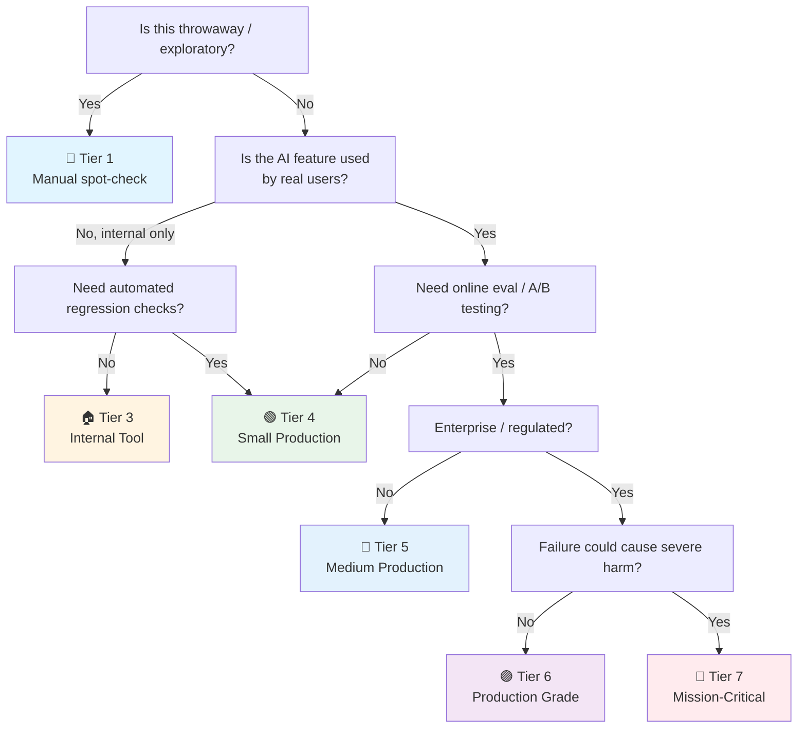

# AI Evaluation Checklist

> The **quality measurement** checklist — how to know your AI actually works, not just "feels right."
> Companion to [[AI]] (§5 Evaluation, expanded), [[AI Data Labeling]] (ground truth), [[QA]] (testing).
> For software engineers: AI outputs are stochastic — you can't `assert(result == expected)`. This checklist is your testing strategy.
> Last updated: 2026-08-07

---

## 1. Evaluation Strategy (Start Here)

- [ ] **Evaluation type chosen** — What are you measuring?

| Type | Question answered | When | Cost |
|---|---|---|---|
| **Offline eval** | "Does this change improve quality on the golden set?" | Before deploy, in CI | Low (automated) |
| **Online eval** | "Does this change improve outcomes for real users?" | After deploy, in production | High (real traffic) |
| **Behavioral eval** | "Is the model behaving as expected across scenarios?" | Pre-deploy + production | Medium (scenario-based) |
| **Leaderboard eval** | "How does this model compare to others on standard benchmarks?" | Model selection phase | Low (run benchmarks) |

- [ ] **Success criteria defined BEFORE building** — "What score do we need to ship?" defined before the first eval run. Example: "Extraction F1 ≥ 0.85, hallucination rate < 5%, latency p99 < 2s." Without pre-defined criteria, confirmation bias drives "it's good enough" decisions.
- [ ] **Baseline established** — Before improving, measure the baseline: current model/prompt on the golden set. All improvements are measured against this baseline. "The new prompt scored 82%" means nothing without knowing the baseline scored 78%.
- [ ] **Statistical thinking internalized** — AI outputs are stochastic. A single eval run's score is noisy. Rule of thumb: differences < 2% on < 200 examples are noise. Use bootstrap confidence intervals or run multiple times. **Do not declare a winner from a 20-sample comparison.** This is the #1 statistical mistake in AI evaluation.

## 2. Golden Dataset Construction

- [ ] **Golden set size adequate** — Minimum viable: 50 examples. Recommended: 200–500. Comprehensive: 1000+. More examples = tighter confidence intervals, but diminishing returns after 500 for most tasks. Quality > quantity — 100 carefully curated examples beat 1000 hastily labeled ones.
- [ ] **Golden set covers edge cases** — Not just the happy path. Include: empty inputs, very long inputs, adversarial inputs, multi-language inputs (Thai!), ambiguous cases, boundary conditions. The model fails on edge cases, not the median case. Intentionally curate examples where the model is likely to fail.
- [ ] **Golden set versioned** — The golden set evolves: new edge cases discovered in production are added, stale examples updated. Version the dataset. An eval run is only meaningful with its dataset version recorded → [[AI Data Labeling]] §4.
- [ ] **Expected outputs defined** — For each input, what is the "correct" output? Options:
  - **Exact expected output** — For extraction/classification (input → expected label)
  - **Reference output for comparison** — For generation tasks (input → reference answer, scored by similarity/quality)
  - **Criteria-based (no reference)** — For open-ended tasks (input + rubric → judge scores against rubric)
- [ ] **Golden set not used for training** — The golden set is for evaluation only. If examples from the golden set are in the training data, the model has "seen the test" — scores are inflated and meaningless. Strict separation → [[AI Data Labeling]] §3.
- [ ] **Production-sourced examples** — The golden set should reflect real production inputs, not synthetic examples. Sample from actual user queries (with PII redacted). A golden set of "obvious" examples will pass while production fails on messy real data.

## 3. Metrics by Task Type

- [ ] **Right metric for the task** — Using the wrong metric gives misleading signals:

| Task | Primary metric | What it measures | Weakness |
|---|---|---|---|
| **Classification** | Accuracy, Precision, Recall, F1 | Correct label prediction | Accuracy misleading on imbalanced data |
| **Named Entity Extraction** | Entity-level F1, Exact match | Correct entity spans + labels | Partial match (wrong boundary) scored as 0 |
| **Summarization** | ROUGE-N, BLEU | N-gram overlap with reference | Weak proxy — doesn't measure meaning/quality |
| **Translation** | BLEU, chrF, COMET | N-gram / embedding similarity | BLEU correlates poorly with human judgment |
| **Code generation** | pass@k, HumanEval | Functional correctness (does it run + pass tests?) | Only covers tasks with testable outputs |
| **RAG retrieval** | Recall@k, Precision@k, MRR | Are the right documents retrieved? | Doesn't measure generation quality |
| **RAG end-to-end** | Faithfulness, Answer Relevance (RAGAS) | Is the answer grounded in retrieved docs? Does it answer the question? | Requires reference answers or LLM-judge |
| **Open-ended generation** | LLM-as-judge, human rating | Quality, helpfulness, correctness | Judge bias, cost |
| **Embeddings** | MTEB scores | Retrieval/clustering quality across tasks | Generic — may not reflect your domain |

- [ ] **Precision vs Recall trade-off documented** — For classification: do you care more about catching all positives (recall) or avoiding false positives (precision)? Example: spam detection → high precision (don't false-alarm legit email). Medical diagnosis → high recall (don't miss a disease). Set the threshold based on the business cost of false positives vs false negatives.
- [ ] **Per-class metrics checked** — Overall accuracy hides per-class problems. A model with 95% overall accuracy may score 50% on the minority class. Always check per-class precision/recall. Fix: collect more minority data, use class weights, or adjust the decision threshold.
- [ ] **F1 chosen over accuracy for imbalanced data** — If 95% of your data is class A, a model that always predicts A has 95% accuracy and zero usefulness. F1 (harmonic mean of precision and recall) is more informative for imbalanced datasets. Macro-F1 averages across classes equally; weighted-F1 weights by class frequency.

## 4. LLM-as-Judge

> When there's no objective right answer (open-ended generation, summarization quality, helpfulness), use an LLM to judge. This is the standard approach in modern AI evaluation.

- [ ] **Judge model chosen** — Use a strong model as judge (GPT-4, Claude 3.5 Sonnet). The judge should be stronger than the model being judged — a weak judge can't evaluate a strong model. Never use the same model to judge itself (self-preference bias).
- [ ] **Judge prompt validated** — The judge prompt is itself a prompt that needs testing. Validate: run the judge on 50 examples where you know the correct ranking (from human labels). If judge-human agreement < 80%, the judge prompt needs revision. The judge prompt is the #1 factor in judge quality.
- [ ] **Known biases mitigated** — LLM judges have documented biases:
  - **Self-preference** — Judges prefer outputs from their own model family (GPT-4 prefers GPT-4 outputs)
  - **Length bias** — Judges prefer longer outputs, even when shorter is better
  - **Position bias** — In pairwise comparison, judges prefer the first option presented
  - Mitigation: use a different model family as judge, normalize for length, randomize option order
- [ ] **Rubric-based scoring** — Instead of "rate this 1–10," use a rubric: "Score 1–5 on: accuracy, completeness, conciseness. For each, explain the score." Structured rubrics produce more consistent and debuggable judgments than holistic scoring.
- [ ] **Pairwise comparison over absolute scoring** — "Is A better than B?" is more reliable than "Rate A from 1–10." Humans and LLMs are better at relative comparison than absolute rating. Use pairwise for model/prompt comparison, absolute scoring for standalone quality tracking.
- [ ] **Temperature 0 for the judge** — Judge outputs should be deterministic. Set temperature to 0 (or 0.1 max). A noisy judge adds variance that masks real differences.

## 5. Benchmarking & Standard Suites

- [ ] **Standard benchmarks run for model selection** — Before choosing a model, check its scores on relevant benchmarks. Don't rely on the model's announcement blog — run it yourself on a subset.

| Benchmark | Task | What it tests |
|---|---|---|
| **MMLU** | Multiple-choice | General knowledge across 57 subjects |
| **MMLU-Pro** | Multiple-choice | Harder version of MMLU |
| **HumanEval / MBPP** | Code generation | Python coding problems with unit tests |
| **GSM8K / MATH** | Math reasoning | Grade-school / competition math |
| **GPQA** | Graduate-level Q&A | PhD-level science reasoning |
| **MT-Bench / AlpacaEval** | Open-ended generation | Multi-turn conversation quality (LLM-judged) |
| **MTEB** | Embedding models | Retrieval, clustering, classification for embeddings |

- [ ] **Benchmark relevance validated** — MMLU scores don't predict RAG quality. HumanEval doesn't predict Thai-language ability. Choose benchmarks relevant to your task. A model that tops MMLU may be bad at your specific use case. Always validate with your own golden set after benchmark screening.
- [ ] **Benchmark contamination checked** — Some models are trained on benchmark data (the test leaked into training). Scores are inflated. Check: does the model regurgitate the benchmark answer verbatim? If so, the score is meaningless. Use newer/private benchmarks (GPQA Diamond, your own golden set) to detect contamination.
- [ ] **Don't overfit to benchmarks** — Optimizing for a benchmark can hurt real-world performance (Goodhart's Law). Benchmarks are a screening tool, not the goal. The goal is performance on *your* task for *your* users.

## 6. Evaluation Pipeline (CI/CD)

- [ ] **Evals run in CI** — Every model/prompt change triggers an eval run against the golden set. A regression (score drops below threshold) blocks the merge, like a failing unit test → [[QA]] §7.
- [ ] **Eval results tracked over time** — A dashboard showing score history: each eval run, what changed, the score. Spot trends (gradual improvement, sudden regression). Store eval run metadata: model version, prompt version, golden set version, timestamp, score breakdown.
- [ ] **Eval threshold set** — What score constitutes "pass"? Not 100% (unrealistic for AI). Set based on baseline: baseline + 2% (improvement) or baseline - 1% (regression alert). Tunable per metric.
- [ ] **Eval runtime reasonable** — Golden set evals should complete in < 10 minutes in CI. If your golden set is 500 examples and the model takes 2s each, that's 17 minutes. Speed up: parallelize (batch API), use a smaller subset for CI (full set nightly), or cache results for unchanged components.
- [ ] **Eval results reviewed in PR** — When a PR changes a prompt or model, the eval diff is shown in the PR: "baseline F1: 0.82 → new F1: 0.85 (+3%). Regression on class B: recall dropped 5%." Like a code diff, but for quality.

## 7. Human Evaluation

- [ ] **Human eval for high-stakes decisions** — When the metric says "good" but users will judge subjectively (tone, helpfulness, correctness), human evaluation is necessary. Metrics are proxies; humans are the ground truth for subjective quality.
- [ ] **Blind evaluation** — Evaluators must not know which model/prompt generated which output. Blind evaluation removes familiarity bias ("I recognize this style, it's the old model"). Label outputs as "A" and "B," not "old" and "new."
- [ ] **Inter-rater reliability measured** — Multiple evaluators rate the same outputs. Measure agreement (Cohen's κ → [[AI Data Labeling]] §2). Low agreement = the evaluation criteria are subjective/unclear → refine the rubric.
- [ ] **Sample size adequate** — Human eval is expensive. Minimum: 50 outputs per condition for directional signal. 100+ for statistical confidence. Use power analysis to determine sample size before starting.
- [ ] **Adversarial / red-team examples included** — Include inputs designed to break the model: prompt injection, edge cases, adversarial phrasing. The model's behavior on adversarial inputs is more informative than behavior on easy inputs.

## 8. Production Monitoring & Online Eval

- [ ] **Production feedback captured** — Thumbs up/down, correction rates, "was this helpful?" buttons. The source of truth for real-world quality. Offline evals drift from reality — production feedback is the correction.
- [ ] **Sampling rate set** — Not every request needs feedback prompts. Sample 5–10% of traffic to avoid survey fatigue. Trigger targeted feedback on: low-confidence outputs, new feature areas, or after model changes.
- [ ] **Shadow evaluation** — Deploy new model/prompt in "shadow mode": process real production inputs, but don't show outputs to users. Compare shadow outputs to production outputs offline. Catches issues before users see them.
- [ ] **A/B testing with business metrics** — Route a percentage of traffic to the new model/prompt. Measure: task completion rate, conversion, retention, CSAT — not just AI metrics. "The new model scores higher on ROUGE" is meaningless if users complete fewer tasks. Tie AI quality to business outcomes → [[Release]] §5.
- [ ] **Quality regression alerting** — If production feedback (thumbs ratio, correction rate) drops > 10% from baseline, alert. This catches silent regressions: provider model updates, input drift, prompt template bugs.

---

## Quick Sanity Check Before Shipping an AI Change

- [ ] Success criteria defined before the eval ("F1 ≥ 0.85, hallucination < 5%")
- [ ] Baseline measured (all improvements are relative to baseline)
- [ ] Golden set has ≥ 100 examples, covers edge cases, versioned
- [ ] Right metric for the task (F1 for classification, RAGAS for RAG, LLM-judge for open-ended)
- [ ] Statistical significance checked (not a 20-sample "winner")
- [ ] LLM-as-judge calibrated against human labels (agreement ≥ 80%)
- [ ] Eval run in CI, regression blocks merge
- [ ] Per-class metrics checked (no hidden minority-class failures)
- [ ] Production feedback mechanism deployed (thumbs, corrections)
- [ ] A/B test planned for the change

---

## Project Tier Scoping Matrix

> **How to use this table:** Pick your tier first, then focus only on the sections marked ✅ (required) or 🟡 (recommended). Skip ❌ sections entirely — they'd be over-engineering for your context.
>
> **Legend:** ✅ Required · 🟡 Recommended / partial · ❌ Skip

### Tier Descriptions

| # | Tier | Description | Typical Team | Eval Scale | Lifespan |
|---|---|---|---|---|---|
| 1 | 🧪 **POC / Spike** | Validate feasibility. | 1 dev | Manual spot-check | Days–weeks |
| 2 | 🔧 **Prototype / MVP** | Basic eval for prototype. | 1–2 devs | 20–50 examples | Weeks–months |
| 3 | 🏠 **Internal Tool** | Real eval for internal AI. | 1–3 devs | 50–200 examples | Ongoing |
| 4 | 🟢 **Small Production** | CI eval pipeline. | 1–2 devs | 200–500 examples | Ongoing |
| 5 | 🔵 **Medium Production** | LLM-judge + A/B testing + online eval. | 2–5 devs | 500+ examples | Ongoing |
| 6 | 🟣 **Production Grade** | Full eval platform + red-teaming. | 5+ devs | 1000+ examples | Long-term |
| 7 | 🔴 **Mission-Critical / Regulated** | Formal V&V + regulatory audit. | 10+ devs | Continuous | Decades |

### Which Tier Am I?

### Checklist Applicability by Tier

| # | Section | 🧪 POC | 🔧 Prototype | 🏠 Internal | 🟢 Small Prod | 🔵 Medium Prod | 🟣 Production Grade | 🔴 Mission-Critical |
|---|---|:---:|:---:|:---:|:---:|:---:|:---:|:---:|
| 1 | Evaluation Strategy | 🟡 spot-check | ✅ + baseline | ✅ + success criteria | ✅ + statistical sig | ✅ + online eval | ✅ + behavioral eval | ✅ + formal V&V |
| 2 | Golden Dataset | ❌ | 🟡 20 examples | ✅ 50+ examples | ✅ 200+ + edge cases | ✅ 500+ + versioned | ✅ 1000+ + production-sourced | ✅ + formal |
| 3 | Metrics by Task | ❌ | 🟡 accuracy | ✅ + F1 | ✅ + per-class | ✅ + task-specific | ✅ + custom metrics | ✅ + formal |
| 4 | LLM-as-Judge | ❌ | ❌ | 🟡 if open-ended | ✅ + calibrated | ✅ + bias mitigated | ✅ + pairwise | ✅ + multi-judge |
| 5 | Benchmarking | ❌ | ❌ | 🟡 MTEB for embeddings | ✅ + task-relevant | ✅ + contamination check | ✅ + custom benchmark | ✅ + formal |
| 6 | Evaluation Pipeline (CI) | ❌ | ❌ | 🟡 manual | ✅ + evals in CI | ✅ + dashboard | ✅ + threshold gating | ✅ + formal |
| 7 | Human Evaluation | ❌ | ❌ | 🟡 spot-check | ✅ + blind eval | ✅ + IAA measured | ✅ + adversarial | ✅ + red-team |
| 8 | Production Monitoring | ❌ | ❌ | 🟡 feedback btn | ✅ + sampling | ✅ + A/B testing + shadow | ✅ + regression alerts | ✅ + full online eval |

---

## Sources

- Complements [[AI]] (§5 Evaluation), [[AI Data Labeling]] (golden set construction), [[QA]] (testing), [[Release]] (A/B testing).
- RAGAS (RAG evaluation) — https://docs.ragas.io/
- MTEB leaderboard — https://huggingface.co/spaces/mteb/leaderboard
- LLM-as-judge paper — https://arxiv.org/abs/2306.05685
- EleutherAI eval harness — https://github.com/EleutherAI/lm-evaluation-harness
- W&B Weave (eval tracking) — https://wandb.ai/site/weave
- Inspect AI (UK AISI eval framework) — https://inspect.ai-safety-institute.org.uk/
