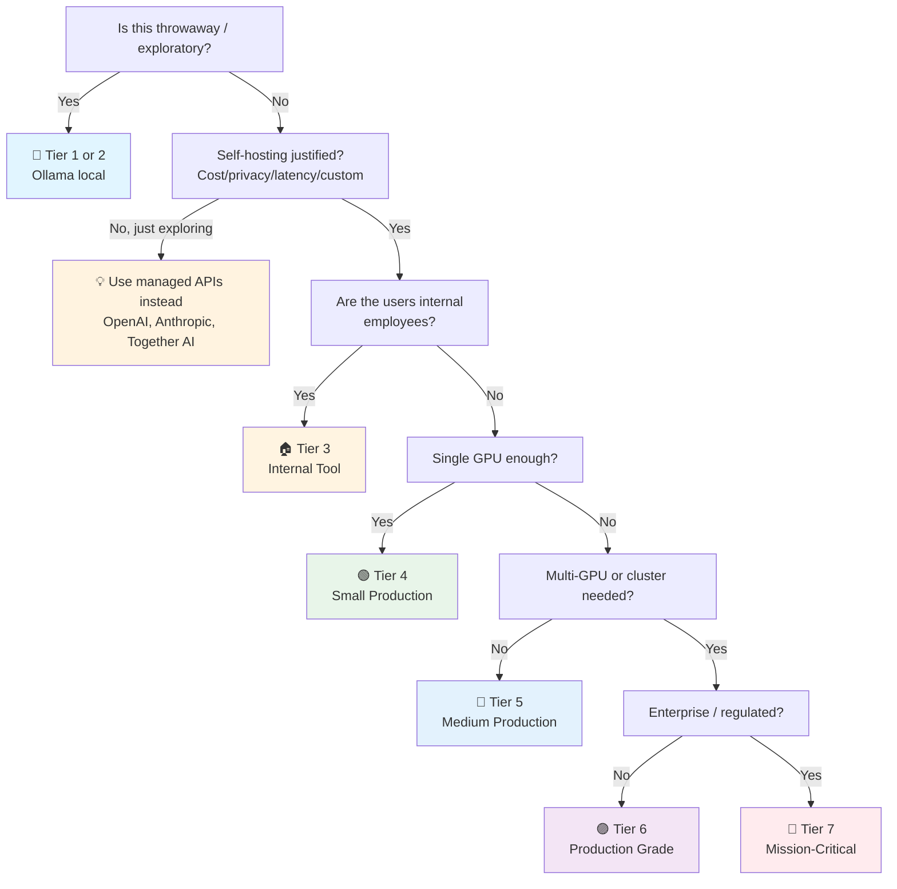

# AI Inference & Serving Checklist

> The **model hosting** checklist — running LLMs and other models yourself, instead of calling an API.
> Companion to [[AI]] (application layer), [[Database]] (data infrastructure), [[Infrastructure]] (hosting).
> Covers vLLM, TGI, Ollama, Triton, llama.cpp, and quantization (GGUF, GPTQ, AWQ).
> Last updated: 2026-08-07

---

## 1. When to Self-Host (Decision First)

- [ ] **Self-hosting justified** — Self-host only when at least one applies:
  - **Cost** — High API volume where self-hosting is cheaper (break-even analysis done)
  - **Privacy / data residency** — Cannot send data to external APIs (GDPR, HIPAA, classified)
  - **Latency** — Need sub-50ms local inference (edge, on-device)
  - **Customization** — Fine-tuned model or custom inference logic
  - **No rate limits** — API provider limits are blocking you
  - **Offline** — Disconnected environments (edge, air-gapped)
- [ ] **Break-even cost calculated** — API cost vs GPU rental cost:
  - API: $X per 1M tokens. Monthly cost = (tokens/month) × X.
  - Self-host: GPU rental ($/hr) × 24 × 30 + ops time. Monthly cost = GPU + your time.
  - Rule of thumb: self-hosting a 7B model on 1× A10g (~$0.75/hr spot) breaks even vs GPT-4o at ~5–10M tokens/month. A 70B model on 2× A100 breaks even at 50M+ tokens/month.
- [ ] **Ops capacity honest** — Self-hosting means you own: GPU provisioning, monitoring, incident response, model updates, security patches. If your team has no GPU ops experience, use managed (Together AI, Anyscale, RunPod serverless) before self-managing raw instances.
- [ ] **Fallback to API** — Even when self-hosting, have an API fallback for: traffic spikes (GPU overloaded), model updates (your model is rebuilding), or quality regression (API model is better for this query).

## 2. Model Format & Quantization

- [ ] **Model format chosen** — The format determines compatibility with serving engines:

| Format | Created by | Best for | Notes |
|---|---|---|---|
| **Safetensors** | HuggingFace | GPU inference (vLLM, TGI) | Default for HF. No arbitrary code execution (safe). |
| **GGUF** | llama.cpp | CPU + consumer GPU, edge, local | Single-file, quantized, portable. Most popular for local. |
| **GPTQ** | AutoGPTQ | GPU (quantized) | Older, largely superseded by AWQ |
| **AWQ** | MIT-Han-Lab | GPU (quantized) | Better than GPTQ in speed + quality. Supported by vLLM. |
| **ONNX** | Microsoft | Cross-platform, edge, mobile | Standardized runtime. Good for production edge deployment. |
| **TensorRT** | NVIDIA | NVIDIA GPU max performance | Fastest on NVIDIA, but vendor lock-in and complex build. |

- [ ] **Quantization level chosen** — Reduce model size with minimal quality loss:

| Level | Size (7B model) | Quality loss | Speed | When to use |
|---|---|---|---|---|
| FP16 (no quant) | ~14 GB | None | Baseline | When you have VRAM to spare |
| **Q8 (8-bit)** | ~7 GB | Negligible | Faster | Safe default for most |
| **Q5_K_M** | ~5 GB | Minimal | Faster | Best quality/size ratio (GGUF) |
| **Q4_K_M** | ~4 GB | Slight | Fast | Most popular — good balance |
| Q3 / Q2 | ~3 GB | Noticeable | Fastest | Last resort (low VRAM) |

- [ ] **Quality benchmarked post-quantization** — Quantization degrades quality. Run your golden eval set (→ [[AI]] §5) on both the full-precision and quantized models. If the quantized model drops below your quality threshold, use a higher precision or a smaller model at full precision. Never assume "Q4 is fine."
- [ ] **Safetensors over pickle** — When downloading models from HuggingFace, prefer `.safetensors` over `.bin`/`.pkl`. Pickle files can contain arbitrary Python code (malicious model files are a real supply-chain attack). Safetensors can only store tensors → [[Security]].
- [ ] **Thai language support checked** — Not all models handle Thai well. Check: model tokenizer covers Thai script (not just Latin), benchmark scores on Thai tasks (if available), test with Thai prompts before committing. Qwen models and Llama 3 have reasonable Thai support. Models trained only on English/Latin will produce gibberish on Thai.

## 3. Serving Engine Selection

- [ ] **Serving engine matched to use case** —

| Engine | Best for | Key feature | Deployment |
|---|---|---|---|
| **vLLM** | High-throughput LLM serving | **PagedAttention** + continuous batching | Docker, Kubernetes |
| **TGI** (Text Generation Inference) | HuggingFace ecosystem | Easy HF model loading, OpenAI-compatible API | Docker |
| **Ollama** | Local dev, small-scale prod, edge | Single-command model loading, GGUF native | Binary, Docker |
| **Triton** | Multi-model, mixed workloads | Model repository, multi-framework (PyTorch, ONNX, TensorRT) | Docker, K8s |
| **llama.cpp** | CPU-only, edge, embedded | C++ server, minimal dependencies, GGUF | Binary |
| **SGLang** | Complex structured generation, agents | RadixAttention (prefix caching), structured outputs | Docker |

- [ ] **vLLM for production throughput** — vLLM's PagedAttention manages the KV cache like virtual memory, allowing high batch sizes without OOM. Continuous batching means new requests join an ongoing batch without waiting. This is why vLLM gets 5–10x the throughput of naive serving. Use vLLM unless you have a specific reason not to.
- [ ] **OpenAI-compatible API** — vLLM, TGI, Ollama, and SGLang all expose an OpenAI-compatible `/v1/chat/completions` endpoint. Your application code can switch between OpenAI API and self-hosted by changing the `base_url`. This is the biggest portability win — build against the OpenAI API spec, swap backends freely.
- [ ] **TGI for HuggingFace simplicity** — If your models are all on HuggingFace and you want a simple Docker pull-and-serve, TGI is the easiest. Less tunable than vLLM but simpler to operate.
- [ ] **Ollama for dev/edge** — Ollama is excellent for local development and edge. For production: works for small scale (a few concurrent users), but lacks the batching and throughput optimizations of vLLM. Know the ceiling.

## 4. GPU Resource Management

- [ ] **GPU memory budgeted** — A model needs VRAM for: model weights + KV cache + activations + overhead.

| Model size (FP16) | Weights | KV cache (4K context, batch 32) | **Total VRAM needed** | GPU recommendation |
|---|---|---|---|---|
| 1.5B | ~3 GB | ~2 GB | **~6 GB** | T4, RTX 3060 |
| 7B | ~14 GB | ~8 GB | **~24 GB** | RTX 3090/4090, A10g |
| 13B | ~26 GB | ~12 GB | **~40 GB** | A100 (40GB), 2× A10g |
| 70B | ~140 GB | ~30 GB | **~170 GB** | 2× A100 (80GB), 4× A100 |

- [ ] **KV cache understood** — The KV (Key-Value) cache stores intermediate attention computations for tokens already generated. Without it, each new token recomputes all previous tokens (O(n²)). The KV cache makes generation O(n) but consumes VRAM proportional to `batch_size × context_length × num_layers × hidden_dim`. This is why long contexts and large batches eat VRAM fast.
- [ ] **Max concurrency calculated** — How many concurrent requests can your GPU handle? Limited by: VRAM (weights + KV cache for all active requests), compute (batch size affects latency). vLLM's continuous batching maximizes concurrency within the VRAM budget. Monitor: if requests are queuing, you need more GPUs or a smaller model.
- [ ] **GPU OOM prevented** — OOM kills the serving process. Prevention: set `--gpu-memory-utilization` (vLLM, default 0.9 — leave 10% headroom), limit `--max-num-seqs` (max concurrent sequences), limit `--max-model-len` (max context length). Monitor VRAM usage and alert before 95%.
- [ ] **Multi-GPU serving** — Models larger than one GPU: tensor parallelism (TP) splits each layer across GPUs (vLLM `--tensor-parallel-size 2`). Pipeline parallelism (PP) splits layers across GPUs (less common for inference). TP is faster but requires NVLink/PCIe bandwidth. Know your GPU topology.
- [ ] **CPU offloading / quantization for low-VRAM** — Can't fit a 70B on your GPUs? Options: (1) AWQ/GPTQ quantization (4-bit, fits 70B on 1× A100 80GB), (2) CPU offloading (slow — some layers on CPU, some on GPU), (3) GGUF on CPU + partial GPU offload (llama.cpp). Each is a trade-off between speed, quality, and cost.

## 5. Batching & Throughput

- [ ] **Continuous batching enabled** — Traditional batching waits for all requests in a batch to finish before starting a new batch (one slow request stalls the batch). Continuous batching (vLLM, TGI) inserts new requests into an ongoing batch at token-level granularity. This is the #1 throughput optimization — 5–10x over naive batching.
- [ ] **Batch size tuned** — Larger batches = higher throughput but higher latency per request. For interactive (chat): small batches, low latency. For batch (embeddings, offline processing): large batches, max throughput. Different workloads, different tuning.
- [ ] **Prefix caching / prompt caching** — Many requests share the same system prompt or few-shot prefix. vLLM's automatic prefix caching (and SGLang's RadixAttention) cache the KV for shared prefixes — the prefix is computed once, reused across requests. Huge cost saver for RAG (shared system prompt + instructions).
- [ ] **Speculative decoding (advanced)** — A small "draft" model proposes tokens, the large model verifies in parallel. If the draft is right, you skip expensive forward passes. 2–3x speedup for text generation. Supported in vLLM. Requires a compatible draft model — not always worth the complexity.
- [ ] **Streaming for chat** — Interactive chat must stream (SSE/WebSocket). Non-streaming (wait for full response) feels broken to users for > 3 seconds. vLLM/TGI/Ollama all support streaming — make sure your client handles it properly.

## 6. Deployment & Operations

- [ ] **Containerized** — Serving engine runs in Docker with: model files mounted/volume, GPU access (`--gpus all` / NVIDIA Container Toolkit), healthcheck (`/health` endpoint), resource limits. Versioned image, not `latest`.
- [ ] **Kubernetes / orchestration** — For production: GPU node pools, pod autoscaling on queue depth (not just CPU — GPU is the bottleneck), pod disruption budgets, rolling updates. GPU scheduling in K8s is tricky — nodes are scarce, don't let low-priority pods sit on GPU nodes.
- [ ] **Health check endpoint** — vLLM: `GET /health`, TGI: `GET /health`, Ollama: `GET /api/health`. Load balancer checks health, routes traffic only to healthy instances. A model loading or OOM-crashed instance must be removed from rotation.
- [ ] **Graceful shutdown** — On SIGTERM: stop accepting new requests, finish in-flight requests, then exit. Prevents mid-generation truncation on deployments. Configure the serving engine's shutdown timeout.
- [ ] **Model loading time budgeted** — Loading a 70B model takes minutes (disk → VRAM). Plan for slow startup: readiness probe delays, warm-up requests, no hard 30-second health check timeout. Pre-load models on startup, don't lazy-load on first request.
- [ ] **Cold start mitigation** — Serverless GPU (RunPod, Modal, Replicate): cold start = model load time (minutes for large models). Mitigate: keep instances warm (minimum instances > 0), use smaller models, or accept the latency.

## 7. Observability & Monitoring

- [ ] **GPU metrics collected** — GPU utilization (%), GPU memory used / total, GPU temperature, power draw. NVIDIA DCGM exporter or `nvidia-smi` scraping. GPU at 100% utilization is good (you're using your expensive hardware). GPU memory at 100% is bad (OOM imminent).
- [ ] **Inference metrics** — Requests/sec, tokens/sec (input and output separately), time-to-first-token (TTFT), time-per-output-token (TPOT), end-to-end latency. These are the SLO metrics for inference.
- [ ] **Queue depth monitored** — Requests waiting for GPU. Growing queue = insufficient capacity or model too slow. Alert on queue depth > 0 sustained — interactive workloads should have zero queue.
- [ ] **Error rate tracked** — OOM errors, timeout errors, CUDA errors. These are different failure modes: OOM = capacity issue, timeout = latency issue, CUDA = driver/hardware issue. Different runbooks.
- [ ] **Model output quality sampled** — Even with fixed model weights, quality can drift: bad quantization manifesting at scale, temperature/sampling bugs, prompt template mismatches. Sample 1% of outputs and spot-check or run through LLM-as-judge (→ [[AI]] §5).
- [ ] **Cost per token tracked** — GPU cost ÷ tokens generated = cost per token. Compare to API equivalent. If self-hosting is more expensive than API, re-evaluate the decision to self-host.

## 8. Security

- [ ] **Model files from trusted sources** — Download from official HuggingFace repos (verified publisher), verify file hashes. Malicious model files (pickle RCE) are a real attack vector. Prefer safetensors → [[Security]].
- [ ] **Network isolation** — Inference server not exposed to the internet. Behind a reverse proxy / API gateway with auth. Internal network only, like any database → [[Database]] §8.
- [ ] **No arbitrary code execution from model output** — If the model generates code (Python, SQL, shell), it must be sandboxed (container, gVisor, firecracker). Never `exec()` model output on the host. This is a remote code execution vector.
- [ ] **GPU driver security** — NVIDIA drivers have had CVEs. Keep drivers updated. Container Toolkit updated. Don't run the inference server as root.
- [ ] **Rate limiting / abuse prevention** — Self-hosted doesn't mean unlimited. Each request costs GPU time (= electricity + hardware depreciation). Rate-limit per user, per API key. Monitor for abuse patterns (one user hogging the GPU).

---

## Quick Sanity Check Before Launch

- [ ] Self-hosting justified (cost/privacy/latency), break-even calculated
- [ ] Model format + quantization chosen, quality benchmarked vs full precision
- [ ] Serving engine chosen (vLLM for throughput, Ollama for dev/edge)
- [ ] GPU VRAM budgeted: weights + KV cache + overhead
- [ ] Continuous batching enabled (vLLM/TGI)
- [ ] OpenAI-compatible API endpoint exposed
- [ ] Health check endpoint, load balancer configured
- [ ] GPU metrics + inference metrics + queue depth monitored
- [ ] Graceful shutdown, model loading time budgeted in startup
- [ ] Model files from trusted source, safetensors preferred
- [ ] Rate limiting in place, server not internet-exposed
- [ ] API fallback defined for when self-hosted is overloaded

---

## Project Tier Scoping Matrix

> **How to use this table:** Pick your tier first, then focus only on the sections marked ✅ (required) or 🟡 (recommended). Skip ❌ sections entirely — they'd be over-engineering for your context.
>
> **Legend:** ✅ Required · 🟡 Recommended / partial · ❌ Skip

### Tier Descriptions

| # | Tier | Description | Typical Team | Users | Lifespan |
|---|---|---|---|---|---|
| 1 | 🧪 **POC / Spike** | Validate self-hosting. Ollama on laptop. | 1 dev | Internal only | Days–weeks |
| 2 | 🔧 **Prototype / MVP** | Self-hosted model for a prototype. | 1–2 devs | Beta testers | Weeks–months |
| 3 | 🏠 **Internal Tool** | Self-hosted model for employees. Single GPU. | 1–3 devs | Employees | Ongoing |
| 4 | 🟢 **Small Production** | Single-GPU serving, low traffic. Real users. | 1–2 devs | < 1K users | Ongoing |
| 5 | 🔵 **Medium Production** | Multi-GPU or auto-scaling. Meaningful traffic. | 2–5 devs | 1K–100K users | Ongoing |
| 6 | 🟣 **Production Grade** | GPU clusters, multi-model serving, high throughput. | 5+ devs | 100K+ users | Long-term |
| 7 | 🔴 **Mission-Critical / Regulated** | Regulated AI inference (healthcare, finance). | 10+ devs | Varies | Decades |

> **⚠️ Tiering note:** Self-hosting model inference is **rarely worth it below Tier 4**. If you're at Tier 1–3, use managed APIs (OpenAI, Anthropic) or managed open-weights (Together AI, Anyscale). The operational burden of GPU management exceeds the savings at small scale.

### Which Tier Am I?

### Checklist Applicability by Tier

| # | Section | 🧪 POC | 🔧 Prototype | 🏠 Internal | 🟢 Small Prod | 🔵 Medium Prod | 🟣 Production Grade | 🔴 Mission-Critical |
|---|---|:---:|:---:|:---:|:---:|:---:|:---:|:---:|
| 1 | When to Self-Host | 🟡 Ollama | 🟡 justified | ✅ | ✅ + break-even | ✅ + fallback to API | ✅ + multi-model | ✅ + formal |
| 2 | Model Format & Quantization | 🟡 GGUF | ✅ + quant chosen | ✅ + benchmarked | ✅ + AWQ for GPU | ✅ + safetensors | ✅ + multi-format | ✅ + formal |
| 3 | Serving Engine | 🟡 Ollama | 🟡 Ollama/vLLM | ✅ vLLM/TGI | ✅ + OpenAI-compat API | ✅ + prefix caching | ✅ + Triton multi-model | ✅ + formal |
| 4 | GPU Resource Management | ❌ | 🟡 VRAM budgeted | ✅ + KV cache | ✅ + max concurrency | ✅ + multi-GPU (TP) | ✅ + GPU clusters | ✅ + capacity plan |
| 5 | Batching & Throughput | ❌ | ❌ | 🟡 continuous batching | ✅ + batch tuning | ✅ + prefix caching | ✅ + speculative decode | ✅ + formal |
| 6 | Deployment & Operations | ❌ | 🟡 Docker | ✅ + healthcheck | ✅ + K8s/autoscaling | ✅ + graceful shutdown | ✅ + multi-region | ✅ + formal |
| 7 | Observability | ❌ | ❌ | 🟡 GPU metrics | ✅ + inference metrics | ✅ + queue depth | ✅ + cost/token | ✅ + full stack |
| 8 | Security | 🟡 trusted source | 🟡 + network | ✅ + no exec | ✅ + rate limit | ✅ + driver updates | ✅ + sandboxing | ✅ + regulatory |

---

## Sources

- Complements [[AI]] (application layer), [[Database]] (data infrastructure), [[Security]], [[Infrastructure]].
- vLLM docs — https://docs.vllm.ai
- TGI — https://huggingface.co/docs/text-generation-inference
- llama.cpp / GGUF — https://github.com/ggerganov/llama.cpp
- PagedAttention paper — https://arxiv.org/abs/2309.06180
- NVIDIA DCGM exporter — https://github.com/NVIDIA/dcgm-exporter
