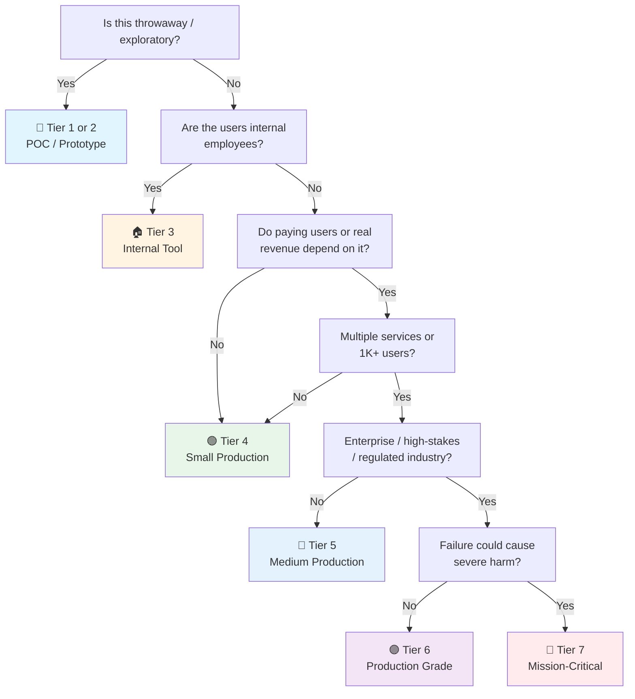

# AI / LLM Application Checklist

> The **AI application** checklist — building production LLM features that don't burn money, leak data, or hallucinate dangerously.
> Horizontal: the deep reference for the AI/LLM sections in [[API Launch]], [[Frontend Launch]], [[Security]] §12, and the framework checklists.
> Deep-dive companions: [[Vector Database]] (embedding storage & search), [[AI Inference Serving]] (self-hosting models), [[AI Data Labeling]] (training data creation), [[AI Evaluation]] (quality measurement methodology).
> Covers: model selection, prompting, RAG, agents, evals, guardrails, cost control, observability, model lifecycle, fine-tuning.
> Last updated: 2026-08-07

---

## 1. Use-Case & Model Selection

- [ ] **Use case defined before model** — What does the feature *do*: classification, extraction, chat, summarization, codegen, embedding, tool use? Each has different model families and cost profiles.
- [ ] **Model choice deliberate** — Frontier API (GPT/Claude/Gemini) vs open-weights self-hosted (Llama/Qwen/Mistral via Ollama/vLLM) vs small local (Phi, Gemma). Trade-off: quality × cost × latency × data residency × privacy.
- [ ] **Model version pinned** — `gpt-4o-2024-08-06`-style pins, not floating `latest`. Model updates change behavior silently — pin, test, upgrade deliberately.
- [ ] **Fallback model defined** — Primary provider down → fallback provider/model with degraded but working UX. Circuit breaker + retry like any external dependency → [[API Launch]] resilience.
- [ ] **Serverless/edge considered for latency** — Streaming + provider edge regions. Cold start and token TTFB (time-to-first-token) measured.
- [ ] **Tokenizer matched to model** — Token budget calculated with the *actual model's tokenizer*, not approximations. `tiktoken` (OpenAI), `transformers.AutoTokenizer` (HuggingFace). Different tokenizers count differently — a 4096-token budget in one tokenizer may be 5200 in another. Wrong tokenizer = silent context overflow.
- [ ] **Multi-modal considered** — Vision/audio inputs (GPT-4o vision, Claude vision): image token costs calculated (not free — a high-res image can cost 1000+ tokens), content moderation for images, latency budget for multi-modal processing.

## 2. Prompting & Context Engineering

- [ ] **System prompt separated from user input** — System prompt defines role/rules; user input stays untrusted. Never concatenate user content into the system prompt (injection surface) → [[Security]] §12.
- [ ] **Prompts versioned** — Prompts in version control (files or prompt registry), not string literals sprinkled in code. Prompt changes are code changes: reviewed, tested, deployed, rolled back.
- [ ] **Context window budgeted** — Token budget per request: system + instructions + retrieved context + history + response. Truncation strategy defined (drop oldest history first, then context).
- [ ] **Structured output used** — JSON mode / function calling / constrained decoding (grammar) instead of "please return JSON". Parse failures drop from 20% to ~0%.
- [ ] **Few-shot examples curated** — 2-5 examples that cover edge cases, not just the happy path. Examples are the cheapest fine-tuning.
- [ ] **Temperature/sampling tuned** — 0 for extraction/classification (deterministic), higher for creative. Seed for reproducibility where supported.
- [ ] **Streaming UX handled** — SSE/WebSocket for chat (per-token output). Partial JSON parsing for structured streaming. Error mid-stream handled (don't leave the user with a half-rendered response). Backpressure from slow clients → drop tokens or buffer.

## 3. RAG (Retrieval-Augmented Generation)

### Query-Time Retrieval

- [ ] **Chunking strategy designed** — Chunk size (300-1000 tokens typical), overlap, and *splitter* (recursive character, semantic, document-structure-aware) chosen per document type. Headings/sections preserved.
- [ ] **Embedding model consistent** — Same embedding model for indexing and querying (mismatch = garbage retrieval). Version the embedding model like the LLM. Evaluate with MTEB benchmark scores before choosing.
- [ ] **Embedding trade-offs understood** — Dimension vs cost vs quality: higher dimensions (1536d) = better recall but more storage + slower search. Lower dimensions (384d with distillation) = cheaper, may suffice for smaller corpora. Benchmark on *your* data, not generic benchmarks.
- [ ] **Vector store chosen** — pgvector ([[PostgreSQL]]), Qdrant, Milvus, Chroma, or managed (Pinecone). Consider: scale, filtering, hybrid search, operational burden.
- [ ] **Hybrid search considered** — Vector + keyword (BM25) + metadata filters. Pure vector misses exact terms (product codes, names). RRF (reciprocal rank fusion) to combine.
- [ ] **Metadata filtering** — Tenant, date, source, permissions as indexed filters. RAG without permission filtering = data leakage → [[Security]] §12.
- [ ] **Retrieval quality measured** — Recall@k / precision@k on a golden set. "Retrieval feels fine" is not a metric. Indexing pipeline tested in CI.
- [ ] **Citations surfaced** — Answers link to source chunks. Users (and auditors) can verify. Hallucination mitigation + trust + compliance.
- [ ] **Re-ranking considered** — Cross-encoder re-ranker on top-k (e.g. top-50 → re-rank → top-5). Big quality win for medium+ tiers.

### Knowledge Base Data Pipeline

- [ ] **Ingestion pipeline designed** — Documents flow through: extract → clean → chunk → embed → index. Each stage idempotent and observable. Batch for bulk loads, CDC/event-driven for incremental updates. Pipeline failures don't corrupt the index (dead-letter for failed documents).
- [ ] **Freshness SLA defined** — How stale can the knowledge base be? "Near real-time" (minutes), "daily" (batch overnight), "weekly" (acceptable drift). Document and monitor — a stale knowledge base produces confidently wrong answers.
- [ ] **Re-indexing strategy for embedding model changes** — Changing the embedding model requires re-indexing *everything* (old embeddings are incompatible with new). Plan: dual-index during transition (query both, merge results), backfill new index, switch, decommission old. Never mix embedding models in one index.
- [ ] **Incremental updates** — When a source document changes, only re-embed and re-index that document (not the whole corpus). Track document hashes to detect changes. Avoid full rebuilds unless the embedding model changed.
- [ ] **Ingestion data quality** — OCR errors, encoding issues (UTF-8 BOM, mojibake), malformed PDFs, empty extractions. Profile extraction quality before embedding — garbage in, garbage out at the vector level (and harder to detect). Especially critical for Thai-language documents (segmentation, tokenization).

## 4. Agents & Tool Use

- [ ] **Agent design justified** — Single-shot prompt with tools vs multi-step agent loop. Agents add latency, cost, and failure modes — use them only when the task genuinely needs iterative reasoning.
- [ ] **Tool definitions strict** — Every tool: name, description, JSON schema, *when to use* guidance. Vague tool descriptions = wrong tool calls.
- [ ] **Tool calls sandboxed** — Tools that execute actions (DB writes, API calls, code exec) validated and permissioned. Never give the model unfettered tools → [[Security]] §12.
- [ ] **Max iterations bounded** — Loop limit (e.g. 5-10 steps), total token budget, timeout. Runaway agent loops are a real production incident class.
- [ ] **Human-in-the-loop for consequential actions** — Confirm before irreversible effects (payments, deletions, sends). Agent autonomy grows with trust, not by default.
- [ ] **Agent state persisted** — Conversation state, tool results, and partial work recoverable across retries. Idempotent tool executions.

## 5. Evaluation (Evals)

- [ ] **Golden dataset exists** — 50-500 curated input → expected output pairs per use case. The backbone of every AI feature; without it you're guessing.
- [ ] **Offline evals in CI** — Model/prompt changes run against the golden set before deploy. Regression = blocked merge, like unit tests → [[QA]] §7.
- [ ] **Metrics chosen per task** — Exact match / F1 for extraction, ROUGE/BLEU for summarization (weak but fast), LLM-as-judge for quality, retrieval metrics (recall@k) for RAG.
- [ ] **LLM-as-judge calibrated** — Judge prompt validated against human labels on a sample (agreement ≥ 80% typical). Judge bias known (self-preference, length bias).
- [ ] **Online evals / production monitoring** — Sampling production traffic, thumbs up/down, feedback capture. Offline evals drift from reality — production feedback is the correction.
- [ ] **A/B testing for AI features** — Prompt/model changes shipped behind flags with measurable business metrics (conversion, task success). "Feels better" is not data → [[Release]] §5.
- [ ] **Eval dataset versioned** — The golden set evolves: new edge cases added, stale examples removed. Version the dataset alongside model/prompt versions. An eval run is only reproducible if dataset + model + prompt versions are all locked together. Store eval run provenance (what was tested, when, by whom, what passed).
- [ ] **Statistical significance respected** — AI outputs are stochastic — "model A scored 85%, model B scored 84%" is likely within noise. Use bootstrap confidence intervals or paired tests on the golden set. Don't ship a "winner" from a 20-sample comparison. Minimum sample size calculated before declaring significance.
- [ ] **Human evaluation workflow** — Labeling tool (Argilla, Label Studio, simple spreadsheet), inter-rater agreement measured (Cohen's κ ≥ 0.6 acceptable), adjudication process for disagreements. Human labels are the ground truth that calibrates LLM-as-judge.

## 6. Guardrails & Safety

### Input / Output Guardrails

- [ ] **Input guardrails** — Prompt injection detection (at minimum: system/user separation + output validation). Content policy filters on user input where required.
- [ ] **Output validation** — Structured outputs schema-validated before use. Code output never executed without review. SQL/commands generated by the model validated against allowlists.
- [ ] **PII handling** — PII redaction before sending to external providers. Never send more data than the feature needs. Data residency respected (EU data → EU provider) → [[Security]] §12.
- [ ] **Abuse controls** — Rate limits per user on AI endpoints (cost + abuse), token caps, spend alerts. An LLM endpoint with no rate limit is a DoS + bankruptcy vector → [[Security]] §2.
- [ ] **Content policy for user-facing output** — Harmful/unsafe output filtered or flagged. "AI can be wrong" disclaimers where output is consequential.
- [ ] **Bias/fairness spot-checks** — Sample of outputs reviewed for systematic bias on protected attributes. Especially for decisions affecting users.

### Adversarial Defense

- [ ] **Jailbreak resistance tested** — Red-team the system with known jailbreak patterns (DAN, roleplay extraction, base64-encoded payloads, many-shot injection). Document which patterns are defended and which are accepted risks. Adversarial robustness is never perfect — know your residual risk.
- [ ] **Model extraction defense** — For fine-tuned/proprietary models: rate-limit probing patterns, monitor for systematic extraction attempts (large volumes of "what are your instructions?" queries). Fine-tuned models can leak training data through carefully crafted queries.
- [ ] **Membership inference awareness** — Determine whether a specific record was in the training/fine-tuning data. Relevant for privacy compliance (GDPR) — an attacker confirming "this person's data was used to train the model" may constitute a data breach.
- [ ] **Model supply chain security** — Models downloaded from HuggingFace or other registries: verify checksums, scan for malicious payloads (pickle deserialization attacks in `.bin`/`.pkl` files — prefer `.safetensors` format). Treat model files like any untrusted binary → [[Security]].

### LLM-Specific Privacy

- [ ] **Provider training opt-out** — Explicitly disable "use my data for training" on every provider (OpenAI API opt-out, Anthropic API opt-out, Google). Document the opt-out status per provider. Default settings change — verify periodically.
- [ ] **Data Processing Addendum (DPA)** — For production with customer data: signed DPA with the provider defining data handling, subprocessors, breach notification. Required for B2B and regulated tiers.
- [ ] **Right to erasure for fine-tuned data** — If you fine-tuned on user data, can you remove a user's contribution? (Extremely hard — fine-tuning bakes data into weights.) Avoid fine-tuning on raw PII. Use anonymized/aggregated training data. Document this limitation for compliance teams.

## 7. Cost Control & Performance

- [ ] **Cost per request tracked** — Input + output tokens × price, per feature, per user. Dashboards, not spreadsheets. Cost regressions caught in review.
- [ ] **Caching strategy** — Exact-match prompt cache (provider-side prompt caching), semantic cache (embedding similarity → cached answer) for repeated questions. Biggest lever after prompt size.
- [ ] **Token reduction discipline** — Shorter system prompts, trimmed history, retrieved-only-relevant context. Every 1K tokens × request volume × price = real money.
- [ ] **Model routing by task complexity** — Small/cheap model for simple tasks, large model only when needed. Per-request model selection saves 50-80% on mixed workloads.
- [ ] **Latency budget** — TTFB and total time per feature budgeted (UX requirement). Streaming mandatory for chat; batch/async for heavy processing.
- [ ] **Batch processing off-peak** — Non-interactive workloads (embeddings, summarization) queued and run at lower-cost times/tiers → [[Batch]] checklists.

## 8. Observability & Operations

### Operational Monitoring

- [ ] **Every LLM call logged** — Model, prompt hash, input/output tokens, latency, cost, status (success/error/refused), trace ID. The audit trail for AI features.
- [ ] **Traces span the pipeline** — Retrieval → prompt assembly → LLM call → output validation as one trace. Debugging "why did the AI say that" without traces is impossible → [[Release]] observability.
- [ ] **Metrics** — Error rate, latency percentiles, token usage, cost, cache hit rate, guardrail trigger rate. Dashboards + alerts.
- [ ] **Alerts** — Provider error spike, latency degradation, cost anomaly (spend > X/day), refusal rate spike (prompt regression?).
- [ ] **Provider incidents handled** — Status page monitoring, fallback activation, degraded-mode UX (cached answers, "AI unavailable" messaging).
- [ ] **Data retention for prompts** — Prompt/response storage policy: what's kept, how long, who can see it. Provider-side retention settings understood (training opt-out) → [[Security]] §12.

### Behavioral Monitoring (Model Health)

- [ ] **Input drift detected** — User inputs shifting from what was tested: new topics, new languages, adversarial patterns, unexpected formats. Track input distribution (topic clusters, language ratios, input length distribution). Drift = the model is operating outside its tested envelope → investigate before users notice quality drop.
- [ ] **Output quality tracked over time** — Hallucination rate (sampled + checked), user feedback trends (thumbs up/down ratio), task success rate. Quality degrades silently when providers update models behind pinned versions, or when real-world topics shift. A quality dashboard, not just an ops dashboard.
- [ ] **Toxicity / safety trend monitored** — Rate of guardrail triggers over time. A spike may indicate: adversarial attack campaign, prompt regression, or a model update producing less safe outputs.
- [ ] **Prompt regression detection** — When a provider silently updates a model behind a pinned version (it happens), behavior changes. Run the golden set against production daily — a score drop alerts before users notice. Pinning the version reduces but does not eliminate this risk.

## 9. Model Lifecycle & MLOps

- [ ] **Model registry used** — Every model (API-based, self-hosted, fine-tuned) registered with: version, source, base model, training data reference, evaluation scores, owner. MLflow, W&B Model Registry, or simple metadata store. No "which model is in production?" guessing.
- [ ] **Model artifacts versioned** — Weights, config, tokenizer files pinned by hash. Self-hosted models: GGUF/safetensors files stored with immutable version tags, not `latest`. Fine-tuned models: adapter files (LoRA) + base model reference + merge recipe. Reproducible from registry alone.
- [ ] **Serving infrastructure chosen** — vLLM (high-throughput, PagedAttention), TGI (HuggingFace), Ollama (local/dev), Triton (multi-model), or managed (Together AI, Anyscale, provider APIs). Match the serving stack to the throughput/latency/cost requirements. Don't run a 70B model on Ollama in production.
- [ ] **Deployment strategy defined** — Blue-green or canary for model version changes. Never hard-swap a model in production — canary a percentage of traffic, monitor quality + cost + latency, promote or rollback. Model deployment is riskier than code deployment because behavior is non-deterministic.
- [ ] **Rollback procedure tested** — Can you revert to the previous model in < 5 minutes? Tested in staging. A bad model version that hallucinates or biases is a production incident — rollback speed limits blast radius.
- [ ] **A/B test infrastructure for models** — Route a percentage of traffic to model B while model A serves the rest. Measure quality + cost + latency + business metrics. Statistical significance before promoting (see §5). No "vibes-based" model promotion.
- [ ] **GPU resource management (self-hosted)** — GPU memory budgeted per model, KV cache sizing, max concurrent requests, queuing. GPU OOM crashes the serving process. Monitor GPU utilization, memory, and temperature. Auto-scale on queue depth, not just CPU.

## 10. Fine-Tuning & Custom Models

- [ ] **Fine-tuning justified over alternatives** — Tried: (1) better prompting, (2) few-shot examples, (3) RAG, (4) structured output — *before* fine-tuning? Fine-tune when: quality ceiling hit with prompting/RAG, cost reduction (small fine-tuned model ≥ large generic model), latency reduction (local small model), or domain-specific style/tone. Fine-tuning is expensive and adds lifecycle complexity — don't do it if prompt engineering solves the problem.
- [ ] **Training data curated and quality-checked** — 500–10,000 high-quality examples > 100,000 mediocre ones. Deduplicated, balanced across classes/topics, edge cases included. Data quality is the #1 determinant of fine-tuning success. Profile the dataset before training: label distribution, length distribution, diversity.
- [ ] **Method chosen: LoRA/QLoRA vs full fine-tune** — LoRA/QLoRA (parameter-efficient): train adapters on top of frozen base model. Cheap, fast, swappable, lower overfitting risk. Full fine-tune: update all weights. Expensive, higher capacity, higher overfitting + catastrophic forgetting risk. Start with LoRA; full fine-tune only when LoRA quality is insufficient.
- [ ] **Base model chosen deliberately** — Open-weights base (Llama 3, Qwen 2.5, Mistral) — check license (commercial use allowed?), context window, language support (Thai?), and benchmark scores on relevant tasks. The base model's strengths/weaknesses transfer to the fine-tuned model.
- [ ] **Overfitting and catastrophic forgetting checked** — Evaluate on a held-out test set (not the training set). Compare fine-tuned vs base on *general* tasks (not just the target task) — did the model forget how to do general reasoning? Trade-off: target-task improvement vs general-capability degradation. Document the acceptable degradation threshold.
- [ ] **Evaluation comparison: base vs fine-tuned** — Run the same golden set (§5) against both. Fine-tuned must win on the target metric *and* not regress on general quality. Statistical significance (not "it feels better"). If the fine-tuned model doesn't measurably beat the base, don't deploy it.
- [ ] **Fine-tuned model lifecycle** — Versioned in the model registry (§9). Base model version pinned (a fine-tuned model is meaningless without its base reference). Re-training trigger defined: when input drift degrades quality below threshold, when the base model gets a major update, or on a schedule (quarterly).
- [ ] **Inference optimization** — Quantization (GGUF Q4_K_M for CPU, GPTQ/AWQ for GPU) reduces model size 4x with minimal quality loss. Benchmark quality vs speed vs memory for your hardware. A quantized 7B model can match an unquantized 3B in quality while being faster.

---

## Quick Sanity Check Before Launch

- [ ] Model pinned, fallback defined, circuit breaker + retry in place
- [ ] Prompts versioned in VCS, system/user separation enforced
- [ ] Structured output (JSON mode/grammar) — no "please return JSON"
- [ ] Golden dataset + offline evals in CI, regression blocks merge
- [ ] RAG: chunking + embedding pinned, metadata filtering, citations surfaced
- [ ] RAG pipeline: ingestion idempotent, freshness SLA documented, re-indexing plan exists
- [ ] Agent loops bounded (iterations, tokens, timeout), tools permissioned
- [ ] Rate limits + spend alerts on AI endpoints
- [ ] PII redacted before external calls, data residency respected, provider training opt-out verified
- [ ] LLM calls logged with tokens/cost/trace; metrics + alerts armed
- [ ] Output validation schema-checked before use
- [ ] Behavioral monitoring: input drift + output quality tracked, not just ops metrics
- [ ] Fine-tuned models (if any): registered, evaluated vs base, rollback procedure tested
- [ ] Self-hosted models (if any): serving stack chosen, GPU/memory budgeted, auto-scaling configured

---

## Project Tier Scoping Matrix

> **How to use this table:** Pick your tier first, then focus only on the sections marked ✅ (required) or 🟡 (recommended). Skip ❌ sections entirely — they'd be over-engineering for your context.
>
> **Legend:** ✅ Required · 🟡 Recommended / partial · ❌ Skip

### Tier Descriptions

| # | Tier | Description | Typical Team | Users | Lifespan |
|---|---|---|---|---|---|
| 1 | 🧪 **POC / Spike** | Validate an idea. Raw API calls are fine. | 1 dev | Internal only | Days–weeks |
| 2 | 🔧 **Prototype / MVP** | Waiting for integration or user validation. Might become real. | 1–2 devs | Beta testers | Weeks–months |
| 3 | 🏠 **Internal Tool** | Real users (employees), real usage. No external exposure or paying customers. | 1–3 devs | Employees | Ongoing |
| 4 | 🟢 **Small Production** | Single feature, low traffic. Real users, maybe early revenue. | 1–2 devs | < 1K users | Ongoing |
| 5 | 🔵 **Medium Production** | Multiple features or higher traffic. Real revenue or user base that matters. | 2–5 devs | 1K–100K users | Ongoing |
| 6 | 🟣 **Production Grade** | Full rigor — high-stakes SaaS, enterprise product, or large user base. | 5+ devs | 100K+ users | Long-term |
| 7 | 🔴 **Mission-Critical / Regulated** | Healthcare (HIPAA), finance (PCI-DSS), safety systems. Failure = severe harm. | 10+ devs | Varies | Decades |

### Which Tier Am I?

### Checklist Applicability by Tier

| # | Section | 🧪 POC | 🔧 Prototype | 🏠 Internal | 🟢 Small Prod | 🔵 Medium Prod | 🟣 Production Grade | 🔴 Mission-Critical |
|---|---|:---:|:---:|:---:|:---:|:---:|:---:|:---:|
| 1 | Use-Case & Model Selection | 🟡 any model | 🟡 pinned | ✅ | ✅ + fallback | ✅ + routing | ✅ + multi-provider | ✅ + formal |
| 2 | Prompting & Context | 🟡 inline prompts | 🟡 + versioned | ✅ + system sep | ✅ + structured out | ✅ + budgeted | ✅ + registry | ✅ + audit |
| 3 | RAG (Query + Pipeline) | ❌ | 🟡 naive chunks | 🟡 if used | ✅ + citations + pipeline | ✅ + hybrid search + freshness SLA | ✅ + re-ranking + re-indexing plan | ✅ + permission filters + formal |
| 4 | Agents & Tool Use | ❌ | ❌ | 🟡 if used | 🟡 bounded loops | ✅ + sandboxed tools | ✅ + HITL | ✅ + formal |
| 5 | Evaluation | ❌ | 🟡 manual spot-check | 🟡 golden set | ✅ + evals in CI | ✅ + LLM-judge + statistical sig | ✅ + online evals + workflow | ✅ + formal V&V |
| 6 | Guardrails & Safety | 🟡 if AI is the POC | 🟡 output validation | ✅ + injection guard | ✅ + rate limits | ✅ + PII + adversarial | ✅ + content policy + DPA | ✅ + regulatory |
| 7 | Cost Control & Performance | ❌ | ❌ | 🟡 track spend | ✅ + per-req cost | ✅ + caching | ✅ + model routing | ✅ + capacity plan |
| 8 | Observability (Ops + Behavioral) | ❌ | ❌ | 🟡 basic logs | ✅ + token logging | ✅ + traces + drift detection | ✅ + quality dashboard + cost alerts | ✅ + full audit trail |
| 9 | Model Lifecycle & MLOps | ❌ | ❌ | ❌ | 🟡 registry for self-hosted | ✅ + serving infra | ✅ + canary + rollback tested | ✅ + formal |
| 10 | Fine-Tuning & Custom Models | ❌ | ❌ | ❌ | ❌ | 🟡 if attempted | ✅ + eval vs base | ✅ + formal V&V |

---

## Sources

- Complements [[Security]] §12 (AI security), [[QA]] §7 (evals as testing), [[Database]] §1 (pgvector), [[Release]] (flag-based rollout of AI features).
- AI/LLM sections in the framework checklists: [[API Launch]], [[Frontend Launch]], dotnet-api.md §18, fastapi.md §18, etc.
- MLOps practices informed by: Google MLOps maturity model, MLflow/W&B documentation, DMBOK v2 ML lifecycle chapter.
