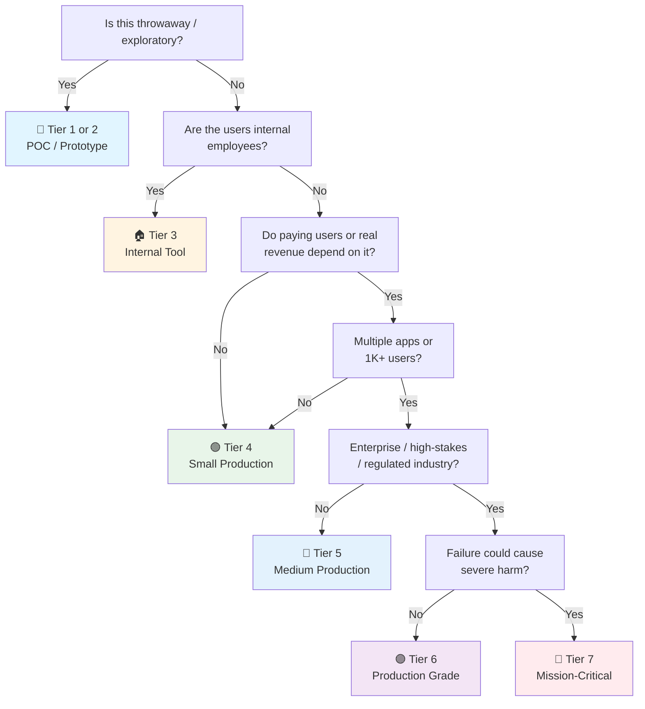

# Claude Code Agent-Driven Project Checklist

> How to structure and run a project driven by Claude Code — the steering stack (CLAUDE.md, rules, skills, subagents, hooks, permissions), the workflow loop, and verification discipline.
> Tool-agnostic sibling: [[general-agents-driven]] · App-building checklist: [[ai]] · General frontend: [[web]]
> Last updated: 2026-09-14 (rewritten from agents-driven.md; added §8 Persona & System Prompt + layout tree)

---

## 1. CLAUDE.md (Project Memory)

- [ ] **CLAUDE.md at repo root** — The always-loaded context. Short beats long: a tight set of real instructions outperforms a long file that buries what matters.
- [ ] **Only what Claude can't infer** — Exact build/test/lint commands, architecture constraints, directories to leave alone, team conventions a linter doesn't enforce. Not personality notes, not generic advice, not things a linter already covers.
- [ ] **Start it late, grow it on error** — Begin minimal (or empty). Add an entry each time Claude gets something wrong worth recording. Every line earns its place.
- [ ] **Nested CLAUDE.md only for monorepo zones** — Subdirectory files load when working in that subtree. Prefer path-scoped rules (§2) for cross-cutting concerns.
- [ ] **User-level vs project-level split** — Personal preferences (`~/.claude/CLAUDE.md`) stay out of the committed project file. Project file = team-wide facts only.
- [ ] **Committed to the repo** — The team shares one Claude. Reviewed in PRs like code.

## 2. Rules (Path-Scoped Constraints)

- [ ] **`.claude/rules/` for conventions** — Markdown files with constraints. Unscoped rules behave like CLAUDE.md (always loaded) — scope them.
- [ ] **`paths:` frontmatter on every rule that can have it** — A rule scoped to `src/api/**` stays out of context during docs-only sessions. Unscoped = always costing tokens.
- [ ] **Rule vs CLAUDE.md decision** — File/path-specific constraint ("migrations are append-only", "API handlers validate with Zod") → scoped rule. Whole-project fact → CLAUDE.md.
- [ ] **Rule vs hook decision** — "Every time X, always do Y" that MUST happen → hook (§5), not a rule. Instructions are followed *most* of the time; under long-session pressure or prompt injection they can fail.

## 3. Skills (Procedural Knowledge)

- [ ] **`.claude/skills/<name>/SKILL.md`** — Folders of instructions + scripts + resources. Only name+description load at session start; body loads on invoke (progressive disclosure).
- [ ] **Procedures belong in skills, not CLAUDE.md** — Deploy runbooks, release checklists, review processes, code-gen workflows. A 30-line procedure in CLAUDE.md is a smell.
- [ ] **Keep SKILL.md lean** — Heavy examples, templates, edge cases → sibling files the skill references. Claude pulls them in only when relevant.
- [ ] **Description is the trigger** — First line of the description decides whether the skill auto-matches the task. Make it self-contained: "Use when X. Does Y."
- [ ] **Slash-command entry points** — `/code-review`, `/release` for the workflows you invoke deliberately.
- [ ] **Vault checklists become skills** — The [[web]]/[[next]]/[[api]] checklists are the source; a project skill distills the tick-list for that repo's stack.

## 4. Subagents (Isolated Contexts)

- [ ] **`.claude/agents/*.md`** — YAML frontmatter (name, description, optional model + tool allowlist) + body as system prompt. Body never enters the parent context; only the final message returns.
- [ ] **Use subagents for clutter-producing side tasks** — Deep search, log analysis, dependency audits, research. Intermediate results you won't reference again stay out of the main window.
- [ ] **Use skills (not subagents) when you want to steer each step** — Skill = procedure plays out in the main thread. Subagent = fire-and-return-summary.
- [ ] **Second-opinion reviewer agent** — A fresh model (different family if possible) reviews the plan or the diff. The agent doing the work shouldn't grade it.
- [ ] **Pin model + tools per agent** — Cheap/fast model for mechanical agents (formatting, changelog), strong model for architect/reviewer. Minimal tool allowlist per agent (deny-by-default).
- [ ] **Specialist roster, not a swarm** — architect / implementer / qa-reviewer / security-reviewer covers most projects. Nesting goes 5 deep but rarely should.

## 5. Hooks (Deterministic Enforcement)

- [ ] **"Never do X" → hook, not instruction** — A real guardrail is deterministic. `PreToolUse` hook inspects every tool call; exit code 2 denies it with a reason Claude sees.
- [ ] **"Every time X, do Y" → hook** — PostToolUse: run prettier/biome after edits, run goimports after Go file writes. The model *choosing* to format ≠ formatting happening.
- [ ] **Stop hook as quality gate** — Blocks turn-end until a check passes (tests green, lint clean). Include a safeguard so it can't block forever.
- [ ] **Session hooks** — SessionStart: inject current branch/deploy state. PreCompact: back up transcript before compaction. Notification: ping on completion (long tasks).
- [ ] **Hooks live in `settings.json`** — Committed project settings for team-wide hooks; local settings for personal ones. Managed settings for org-enforced, non-overridable guardrails.
- [ ] **Hook types matched to job** — command (linters, scripts), HTTP (Slack, ticketing), mcp_tool, prompt/agent (judgment calls). First three are deterministic; last two use model judgment.

## 6. Permissions & Security

- [ ] **Deny-by-default allowlist** — `settings.json` permissions: tight `allow` list for routine commands, `ask` for the rest, explicit `deny` for the dangerous (rm -rf, force-push, curl|bash, prod DB access).
- [ ] **Secrets never in reach** — No `.env` readable by the session that isn't meant to be; API keys in vault/env, never in CLAUDE.md, rules, or committed settings. Claude reads everything in scope.
- [ ] **Prompt-injection awareness** — Web content, dependency READMEs, and issue text are untrusted input. Hooks/permissions are the backstop when instructions say "never" — instructions alone can be overridden by injected content.
- [ ] **Scoped credentials** — Fine-grained GitHub tokens (repo-scoped, PR-only where possible), read-only DB credentials for exploration, separate write path.
- [ ] **Diff review before commit** — Scan every diff for secrets and security regressions before it lands (§8). Hooks can automate the scan; the human owns the merge.
- [ ] **`--dangerously-skip-permissions` only in sandboxes** — Container/devcontainer/VM with no prod credentials. Never on a machine with real access.

## 7. MCP, Plugins & Team Distribution

- [ ] **MCP servers for external systems** — DB introspection (read-only), issue tracker, internal APIs. `.mcp.json` committed for team-shared servers; scoped tool permissions per server.
- [ ] **Every MCP server expands the attack surface** — Inventory what's connected; remove unused servers. Third-party MCP = third-party code with tool access.
- [ ] **Plugin for the whole setup** — Bundle skills + subagents + hooks + output styles into a plugin so teammates install one thing, not twelve files.
- [ ] **Output styles used judiciously** — They sit in the system prompt (highest instruction weight, never compacted). Check built-ins (Explanatory, Learning) before writing a custom one; custom styles replace the default engineering behavior unless `keep-coding-instructions: true`.
- [ ] **`append-system-prompt` for one-off invocations** — Additive, per-invocation (CI pipelines, scripts). Not a persistence mechanism; adherence diminishes with length.

## 8. Persona & System Prompt

- [ ] **Persona ≠ project memory** — "Who I am / how I work" lives in the system-prompt channel; "this repo's facts" lives in CLAUDE.md (§1). Don't dump a full persona into CLAUDE.md — it wastes context and dilutes the facts that matter.
- [ ] **Output styles for a persistent persona** — `.claude/output-styles/<name>.md` injects into the system prompt: never compacted, cached, highest instruction-following weight of any file method. The right home for a SOUL.md-style persona.
- [ ] **`keep-coding-instructions: true`** — A custom output style *replaces* the default engineering behavior (scoping, security, verification habits) unless this flag is set. Without it Claude stops acting like a software engineer and becomes a general assistant.
- [ ] **Check built-ins first** — `Proactive`, `Explanatory`, `Learning` cover autonomy, teaching, and collaborative-coding needs without maintaining a style file.
- [ ] **`append-system-prompt` for one-off personas** — Additive (doesn't replace the default role), per-invocation, "run this session as X." Diminishing returns as it grows.
- [ ] **Subagent bodies are system prompts** — The body after YAML frontmatter in each `.claude/agents/*.md` is that subagent's persona (skeptical tester, paranoid security reviewer). Give specialists distinct voices.
- [ ] **Distill, don't transplant** — Seed the persona from SOUL.md but compress to ~10 lines: identity, mission, 3–5 non-negotiables, how decisions get framed. Copy/adapt; never reference a machine-local Hermes path.

---

## 9. Workflow: Plan → Implement → Commit

- [ ] **Explore in plan mode first** — Read-only mapping before edits (Shift+Tab or `--permission-mode plan`). For architectural questions: ask Claude to think it through before proposing.
- [ ] **Plan reviewed before code** — Open questions written to a plan file, answered, iterated. A good plan means implementation lands in one pass. High-stakes changes: fresh model reviews the plan (§4).
- [ ] **Implement in accept-edits mode, one piece at a time** — One function/component per step, or stub-then-fill. Big-bang "do the whole feature" prompts drift.
- [ ] **Commit at logical checkpoints** — Clean, revertible, conventional commits (`feat:`, `fix:`, `docs:`). Stage deliberately — don't let the agent auto-commit everything. Revert should be a one-line operation, not archaeology.
- [ ] **Branch per agent task** — Feature branches (or git worktrees for parallel agents). `develop`/`main` protected; PR is the review gate.
- [ ] **One issue per prompt** — A prompt listing every problem in a file does worse than working through them one at a time.

## 10. Verification & Self-Checks

- [ ] **Every task has a runnable pass/fail check** — Test suite, build exit code, linter, screenshot diff. Without one, the agent stops when work *looks* done.
- [ ] **Agent shows the command and output** — "Tests pass" without the run is a claim, not a result. Require evidence in the session.
- [ ] **Layered verification, light → strict** — (1) in-prompt "run tests until green", (2) stop hook blocking turn-end (§5), (3) second-opinion subagent refuting the result (§4). Pick the layer by risk tier.
- [ ] **Fix root cause, never suppress** — Explicit instruction (CLAUDE.md rule): no bare `except:`/`catch {}`, no fake fallback data, no disabling the failing test to go green.
- [ ] **CI is the final verifier** — Everything the agent ran locally re-runs in CI. Agent sessions that skip CI don't merge.
- [ ] **Definition of done is written down** — Acceptance criteria in the task prompt/issue, so "done" is checkable, not vibes.

## 11. Prompting the Agent

- [ ] **Describe outcomes, not keystrokes** — Name the outcome, point at the files, define the check that proves it's finished.
- [ ] **Point at existing patterns** — "Follow the pattern in `features/users/`" beats describing the convention. Agents pick up conventions faster from a real example.
- [ ] **Bugs: symptom + location + expected fix** — What breaks, where to look, what "fixed" looks like — and ask for a failing test *before* the fix.
- [ ] **Feed context through channels** — `@file` references, piped command output, pasted screenshots. Don't retype what the agent can read itself.
- [ ] **Scope tightly** — Name the file, the scenario, how to test it. Unscoped "improve this codebase" wanders through hundreds of files.
- [ ] **Course-correct early** — A bad turn corrected immediately is cheap; compounded across a session it's expensive. Escape interrupts; double-Escape rewinds to a checkpoint.

## 12. Context Management

- [ ] **`/clear` between unrelated tasks** — One job stops bleeding into the next. Default move when starting something new.
- [ ] **`/compact` only for long-but-coherent sessions** — With a focus instruction. **Compact preserves assumptions** — if the context holds a wrong assumption Claude keeps reverting to, compacting keeps it. `/clear` + sharper prompt is the fix.
- [ ] **Heavy research → subagent** — Exploration dig returns a short summary; the raw digging never touches the main window (§4).
- [ ] **Long docs → skills with progressive disclosure** — Reference material in skill sibling files loads on demand (§3), not always-on context.
- [ ] **`/rename` sessions you'll resume** — Findable later; resumable state stays coherent.
- [ ] **Watch the cost curve** — Context stuffed with dead ends degrades output quality regardless of model strength. Restarting cheap beats pushing expensive.

## 13. Project Layout (Agent-Friendly)

> Full bootstrap templates: `full-stack-repository-bootstrap` skill + `F:\projects\project_spec\template\`. This section is the agent-specific delta.

- [ ] **`.claude/` committed** — `settings.json` (permissions + hooks), `rules/`, `skills/`, `agents/`, `output-styles/`, plus root `CLAUDE.md`, `AGENTS.md`, and `.mcp.json` if used. The whole steering stack is code-reviewed.
- [ ] **Layout reference:**

```text
my-project/
├── CLAUDE.md                  # project facts only (commands, layout, conventions, red lines)
├── AGENTS.md                  # optional cross-tool: "see CLAUDE.md" + non-Claude delta
├── .mcp.json                  # MCP servers (shared across tools)
├── .claude/
│   ├── settings.json          # permissions (deny-by-default), hooks, model, append-system-prompt
│   ├── rules/                 # path-scoped constraints (load when relevant; paths: frontmatter)
│   ├── skills/                # procedural knowledge (loads on invoke)
│   ├── agents/                # subagents — body = their system prompt/persona
│   └── output-styles/         # persona files (keep-coding-instructions: true)
├── docs/adr/                  # ADRs — the "why" agents grep
├── openapi.yaml               # contract → generated types
└── src/                       # feature-based → [[web]] §2
```


- [ ] **Small modules, explicit boundaries** — Feature-based folders with clear public exports (→ [[react]] §2, [[web]] §2). Agents navigate and edit safely where boundaries are enforced.
- [ ] **Types as contracts** — OpenAPI spec + generated clients; Zod schemas in shared packages. Agents infer intent from types far better than from prose.
- [ ] **Tests next to code** — Co-located `*.test.ts` gives the agent an immediate pass/fail signal per module (§9).
- [ ] **Docs the agent can grep** — README that works, ADRs for the "why" (`docs/adr/`), runbooks as skills. Agents read docs; stale docs mislead them confidently.
- [ ] **Scripts for everything** — `pnpm dev`, `make test`, `./scripts/deploy.sh` — one command per operation, documented in CLAUDE.md. An agent that can run the check can self-verify.
- [ ] **Sandbox story decided** — Devcontainer / VM / local-with-permissions. Where the agent runs, what it can reach (§6).

---

## Quick Sanity Check Before Letting an Agent Loose

- [ ] CLAUDE.md has the exact build/test/lint commands — and they actually work
- [ ] Permissions are deny-by-default with a reviewed allowlist
- [ ] No secrets reachable from the session (`.env`, tokens, prod credentials)
- [ ] At least one hook enforces the "never" rules that matter (format-on-edit, block dangerous commands)
- [ ] Plan mode used before any multi-file change
- [ ] Every task prompt names its pass/fail check
- [ ] Diffs reviewed by a human before commit; CI green before merge
- [ ] Branch protection on `main`/`develop` — agents open PRs, never push to trunk
- [ ] `/clear` habit: fresh context for fresh tasks
- [ ] Persona on the system-prompt channel (output style / append), not in CLAUDE.md — with `keep-coding-instructions: true`
- [ ] Second-opinion review (subagent or human) for high-stakes changes

---

## Project Tier Scoping Matrix

> **How to use this table:** Pick your tier first, then focus only on the sections marked ✅ (required) or 🟡 (recommended). Skip ❌ sections entirely — they'd be over-engineering for your context.
>
> **Legend:** ✅ Required · 🟡 Recommended / partial · ❌ Skip

### Tier Descriptions

| # | Tier | Description | Typical Team | Users | Lifespan |
|---|---|---|---|---|---|
| 1 | 🧪 **POC / Spike** | Validate an idea. Throwaway code. `console.log` is fine. | 1 dev | Internal only | Days–weeks |
| 2 | 🔧 **Prototype / MVP** | Waiting for integration or user validation. Might become real. | 1–2 devs | Beta testers | Weeks–months |
| 3 | 🏠 **Internal Tool** | Real users (employees), real traffic. No external exposure or paying customers. | 1–3 devs | Employees | Ongoing |
| 4 | 🟢 **Small Production** | Single app, few pages, low traffic. Real users, maybe early revenue. | 1–2 devs | < 1K users | Ongoing |
| 5 | 🔵 **Medium Production** | Multiple apps or higher traffic. Real revenue or user base that matters. | 2–5 devs | 1K–100K users | Ongoing |
| 6 | 🟣 **Production Grade** | Full rigor — high-stakes SaaS, enterprise product, or large user base. | 5+ devs | 100K+ users | Long-term |
| 7 | 🔴 **Mission-Critical / Regulated** | Healthcare (HIPAA), finance (PCI-DSS), safety systems. Failure = severe harm. Adds formal verification, regulatory audit. | 10+ devs | Varies | Decades |

### Which Tier Am I?



### Checklist Applicability by Tier

| # | Section | 🧪 POC | 🔧 Prototype | 🏠 Internal | 🟢 Small Prod | 🔵 Medium Prod | 🟣 Production Grade | 🔴 Mission-Critical |
|---|---|:---:|:---:|:---:|:---:|:---:|:---:|:---:|
| 1 | CLAUDE.md (Project Memory) | 🟡 commands only | ✅ | ✅ | ✅ | ✅ | ✅ + reviewed | ✅ + controlled |
| 2 | Rules (Path-Scoped) | ❌ | 🟡 | ✅ | ✅ | ✅ | ✅ + CI-checked | ✅ + audited |
| 3 | Skills | ❌ | 🟡 if repeated | ✅ for workflows | ✅ | ✅ + shared lib | ✅ + versioned | ✅ + approved |
| 4 | Subagents | ❌ | 🟡 reviewer | ✅ reviewer | ✅ roster | ✅ + parallel | ✅ + specialist models | ✅ + formal review |
| 5 | Hooks (Enforcement) | ❌ | 🟡 format-on-edit | ✅ + stop hook | ✅ + gates | ✅ full set | ✅ + managed settings | ✅ + org-enforced |
| 6 | Permissions & Security | 🟡 no secrets | ✅ allowlist | ✅ + deny rules | ✅ + sandbox | ✅ + scoped creds | ✅ + injection defense | ✅ + formal audit |
| 7 | MCP, Plugins & Distribution |
| 8 | Persona & System Prompt | ❌ | 🟡 | ✅ | ✅ | ✅ + team persona | ✅ + style review | ✅ + approved | ❌ | ❌ | 🟡 if needed | ✅ inventory | ✅ + plugin | ✅ + governed | ✅ + approved list |
| 9 | Workflow (Plan→Commit) | 🟡 | ✅ plan first | ✅ + branches | ✅ + PR gate | ✅ + protected trunk | ✅ + review policy | ✅ + change control |
| 10 | Verification & Self-Checks | 🟡 build passes | ✅ runnable check | ✅ + stop hook | ✅ + CI | ✅ + layered | ✅ + second opinion | ✅ + formal V&V |
| 11 | Prompting the Agent | 🟡 | ✅ | ✅ | ✅ | ✅ + team patterns | ✅ + prompt review | ✅ + audited prompts |
| 12 | Context Management | 🟡 | ✅ /clear habit | ✅ | ✅ | ✅ + session policy | ✅ + cost monitoring | ✅ + retention rules |
| 13 | Project Layout (Agent-Friendly) | 🟡 | ✅ .claude/ committed | ✅ | ✅ + scripts | ✅ + boundaries | ✅ + full docs | ✅ + compliance docs |

---

## Sources

- Anthropic — "Steering Claude Code: when to use CLAUDE.md, skills, hooks, and subagents" (claude.com/blog, 2026-08): rules vs skills vs subagents vs hooks decision framework; path-scoped rules; progressive disclosure; managed settings.
- Claude Code docs — code.claude.com/docs: memory, skills, sub-agents, hooks, permissions, best practices.
- OpenHands — "10 Claude Code Best Practices for Agentic Coding" (2026-07): explore-plan-code-commit loop; layered verification (in-prompt → stop hook → second-opinion subagent); /compact-preserves-assumptions pitfall.
- Rewritten 2026-09-14 from `agents-driven.md` (2026-06-02): OpenClaw workspace/persona section dropped (lives in agent config, not project checklists); full-stack layout trees condensed to §12 with link to the bootstrap skill.
- Complements: [[general-agents-driven]] (tool-agnostic), [[ai]] (building AI apps, not building *with* agents), [[Frontend Launch]] / [[API Launch]] (what the agent's output must pass).
