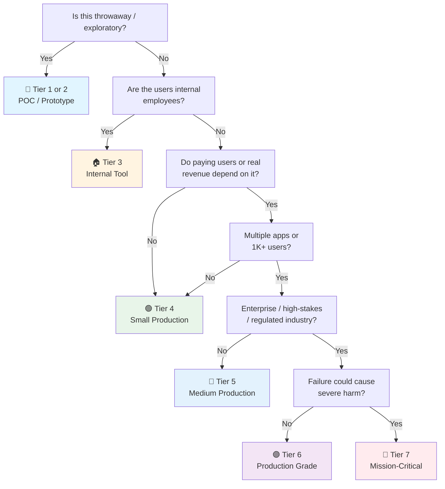

# Agent-Driven Development Checklist (General / Multi-Tool)

> How to structure and run a project driven by AI coding agents in general — Codex, Qwen Code, Gemini CLI, Cursor, Copilot agent, OpenHands, or any CLI agent. Tool-agnostic: the AGENTS.md standard, repo traits agents need, task decomposition, verification loops, and orchestration.
> Claude Code-specific steering stack: [[claude-driven]] · App-building checklist: [[ai]] · General frontend: [[web]]
> Last updated: 2026-09-14 (new file — generalized from agents-driven.md; added Role-section persona guidance + §3 Project Structure & Per-Harness Layout)

---

## 1. AGENTS.md (The Cross-Tool Standard)

- [ ] **One `AGENTS.md` at repo root** — The open standard read by Codex, Qwen Code, Gemini CLI, Cursor, Jules, Factory, OpenHands, and most CLI agents. Write it once, every tool sees it.
- [ ] **Tool-specific files link, not duplicate** — `CLAUDE.md`, `.cursor/rules`, `.github/copilot-instructions.md`: one line importing/pointing at AGENTS.md, plus only the genuinely tool-specific delta. Duplicated rules drift.
- [ ] **`.agents/` is not a cross-tool standard** — the actual convention is a single root `AGENTS.md` file. Only add `.agents/` if a tool you run genuinely reads it; otherwise treat it as optional on-demand storage (context deep-dives, persona blobs) referenced *from* AGENTS.md.
- [ ] **Content: what the agent can't infer** — Exact build/test/lint commands, repo layout map, architecture constraints, conventions, red lines. No personality, no generic advice.
- [ ] **Short and earned** — Start minimal; add a line each time an agent gets something wrong worth recording. Long instruction files dilute adherence — the more instructions, the weaker each one.
- [ ] **`## Role` / `## Persona` section on top** — A short persona block (identity, mission, 3–6 operating principles) leads AGENTS.md. The full persona rides the tool's system-prompt channel, not the always-loaded memory file — a 200-line SOUL dump into AGENTS.md dilutes the facts and lowers adherence.
- [ ] **Nested AGENTS.md for monorepo zones** — Closest file wins in most tools. Root = global; `apps/api/AGENTS.md` = zone overrides.
- [ ] **Committed and PR-reviewed** — The instruction file is code. Changes to how agents behave get reviewed like changes to what the software does.

## 2. Tool Landscape & Portability

- [ ] **Know the equivalence classes** — All major agents converge on: an always-on instruction file (AGENTS.md), on-demand procedures (skills/rules), isolated workers (subagents), deterministic gates (hooks), external tools (MCP). Map each tool's flavor to the concept → [[claude-driven]] for the Claude mapping.
- [ ] **MCP for shared tool surface** — DB introspection (read-only), issue tracker, internal APIs via MCP servers work across Codex/Claude/Cursor/Qwen. One integration, every agent.
- [ ] **Model-agnostic instructions** — AGENTS.md written for "a competent engineer with no memory of yesterday" works on every model. Don't exploit one model's quirks in shared instructions.
- [ ] **Persona rides the system-prompt channel** — portable default: the AGENTS.md `## Role` section. Per-tool: Cursor `alwaysApply` `.mdc` rule, Codex `~/.codex/config.toml`, Claude Code `output-styles/`. Distill to ~10 lines; copy/adapt, never reference a machine-local path.
- [ ] **Model swap test** — The setup works if you swap GPT ↔ Claude ↔ Qwen ↔ Gemini behind the same AGENTS.md. If it breaks, you encoded tool quirks as project rules.
- [ ] **Per-tool config committed deliberately** — `.claude/`, `.cursor/`, `.codex/` in the repo only when the team uses that tool. Dead config for tools nobody runs is noise.
- [ ] **CLI-first for automation** — Headless modes (`codex exec`, `claude -p`, `qwen -p`) for CI/scheduled agent jobs. Same instructions, no terminal babysitting.

## 3. Project Structure & Per-Harness Layout

- [ ] **One instruction file, thin deltas** — AGENTS.md is the source of truth. Each harness adds only its tool-specific delta below; never duplicate shared rules across files. Dead config for a tool nobody runs is noise — commit only what the team actually uses.
- [ ] **Master layout:**

```text
my-project/
├── AGENTS.md                      # THE standard — §1 Role §2 Commands §3 Arch §4 Conventions §5 Red lines
├── CLAUDE.md                      # Claude Code delta → [[claude-driven]]
├── GEMINI.md                      # Gemini CLI delta (or point .gemini/settings.json at AGENTS.md)
├── .github/copilot-instructions.md# Copilot agent delta
├── .cursor/rules/*.mdc            # Cursor rules (alwaysApply = global, globs = scoped)
├── .agents/                       # OPTIONAL on-demand context (only if a tool reads it)
│   ├── context.md                 #   architecture deep-dive, ADR summary (load on demand)
│   └── personas/                  #   persona blobs referenced by AGENTS.md
├── docs/adr/                      # ADRs — the "why" agents grep
├── openapi.yaml                   # contract → generated types
└── src/ ...                       # feature-based → [[web]] §2
```

### Codex CLI (OpenAI)

- [ ] **Reads `AGENTS.md`** — root + nested (closest wins), plus user-level `~/.codex/AGENTS.md` for machine-wide defaults.
- [ ] **Config in `~/.codex/config.toml`** — approval mode, model profile, sandbox settings. Repo-local `.codex/` is experimental; keep team config in the repo AGENTS.md, personal config in the user TOML.
- [ ] **Approval modes + sandbox** — `read-only` (explore), `auto` (edits need approval), `full-auto` (autonomous — sandbox only). Match to tier: full-auto only inside a container with no prod creds.
- [ ] **Subagents via TOML, not custom commands yet** — no `.codex/commands/` support; encode procedures as AGENTS.md sections or MCP. Headless: `codex exec` for CI/scheduled runs.
- [ ] **Reasoning-effort dial** — set per task class: low for mechanical edits, high for architecture/debugging. Saves tokens on boilerplate.

```text
my-project/
├── AGENTS.md                      # primary (Codex-native)
└── ~/.codex/                      # user-level, NOT committed
    ├── AGENTS.md                  #   machine-wide defaults
    └── config.toml                #   approval mode, model, sandbox
```

### Qwen Code

- [ ] **Reads `AGENTS.md` + `QWEN.md`** — forked from Gemini CLI but diverged; `QWEN.md` is the Qwen-native context file. Keep AGENTS.md as the shared layer, put Qwen-specific model/settings hints in QWEN.md.
- [ ] **Config via `settings.json`** — shared with the desktop app; env vars and CLI flags override. Auth via `/auth` (Qwen account or Alibaba Cloud Model Studio).
- [ ] **Multi-protocol, OpenAI-compatible** — works with Qwen models *and* any OpenAI-compatible provider; local models via llama-server / LM Studio → [[ai-inference-serving]].
- [ ] **Supports commands, agents, skills, MCP** — a full harness: define subagents and skills for repeated workflows (mirrors the [[claude-driven]] concept mapping).

```text
my-project/
├── AGENTS.md                      # shared layer
├── QWEN.md                        # Qwen-specific context + model/settings hints
└── settings.json                  # Qwen Code config (shared w/ desktop)
```

### Gemini CLI → Antigravity (Google)

- [ ] **Gemini CLI reads `GEMINI.md`** — hierarchical: `~/.gemini/GEMINI.md` (machine) + root→leaf `GEMINI.md` files. `.gemini/settings.json` can set `context.fileName` to redirect at AGENTS.md instead.
- [ ] **Skills + MCP + plan mode** — SKILL.md format compatible (write once, runs across Gemini/Cursor/Claude); MCP for external tools.
- [ ] **⚠️ Migration note** — Gemini CLI is being sunset in favor of **Google Antigravity** (agentic IDE + `agy` CLI). New projects: target Antigravity, not Gemini CLI.
- [ ] **Antigravity uses Rules** — markdown files (size-limited) for constraints, plus workflows and skills. Agent Manager runs asynchronous agents; dedicated browser subagent; harness supports custom agents, tools, lifecycle hooks, and declarative safety policies.

```text
# Gemini CLI (legacy)
~/.gemini/GEMINI.md                # machine-wide
GEMINI.md                          # project (hierarchical root→leaf)
.gemini/settings.json              # can point context.fileName → AGENTS.md

# Antigravity (successor)
rules/                             # markdown rule files (constraints, stack, style)
workflows/                         # repeated task playbooks
skills/                            # on-demand procedures
```

### Cursor

- [ ] **`.cursor/rules/*.mdc`** — frontmatter `description` + either `alwaysApply: true` (global) or `globs` (scoped). Legacy `.cursorrules` is deprecated — migrate to the rules directory.
- [ ] **Also reads AGENTS.md** — keep shared rules in AGENTS.md, put Cursor-specific editor behavior in rules. Persona = an `alwaysApply` rule (§1).

```text
my-project/
├── AGENTS.md
└── .cursor/rules/
    ├── persona.mdc                # alwaysApply: true
    └── api-conventions.mdc        # globs: ["src/api/**"]
```

### GitHub Copilot

- [ ] **`.github/copilot-instructions.md`** — repo-scoped instructions; user-level via the VS Code/GitHub settings. Keep it a thin "follow AGENTS.md" delta.
- [ ] **Reads AGENTS.md** — the shared layer covers it; add Copilot-only notes (suggestions behavior, chat context) here.

```text
my-project/
├── AGENTS.md
└── .github/copilot-instructions.md   # "follow AGENTS.md" + Copilot-only notes
```


## 4. Repo Traits Agents Need

- [ ] **Small modules, explicit boundaries** — Feature-based folders with public exports (→ [[web]] §2). Agents edit safely where blast radius is contained.
- [ ] **Types as contracts** — OpenAPI spec + generated clients, Zod/Pydantic schemas in shared packages. Agents infer intent from types far better than from prose.
- [ ] **Tests next to code** — Co-located tests give the agent an immediate pass/fail signal per module (§5).
- [ ] **Fast feedback loops** — Test suite that runs in seconds, not minutes; incremental typecheck; cached builds. Agent iteration speed = your feedback speed. Slow CI makes agents guess instead of verify.
- [ ] **One command per operation** — `pnpm dev`, `make test`, `./scripts/deploy.sh`, documented in AGENTS.md. An agent that can run the check can self-verify.
- [ ] **Docs the agent can grep** — Working README, ADRs for the "why", runbooks. Agents read docs; stale docs mislead them confidently.

- [ ] **Deterministic formatting** — Biome/Prettier/gofmt/ruff configured. Style debates don't burn agent turns; hooks/CI enforce.
- [ ] **Seed data + local environment** — `docker compose up` gives a working dev stack (DB, cache, mocks). Agents can exercise the app, not just compile it. Homelab pattern: compose stack on the db-network → infra notes.

## 5. Task Decomposition & Scoping

- [ ] **Bounded outcomes per task** — "Add rate limiting to /auth endpoints with tests" not "improve security". Name the outcome, the files, the check that proves done.
- [ ] **One issue per prompt** — A prompt listing every problem does worse than working through them one at a time.
- [ ] **Point at existing patterns** — "Follow `features/users/`" beats describing the convention. Agents learn conventions from real examples faster than from prose.
- [ ] **Slice vertically, not horizontally** — One end-to-end thin slice (route → handler → service → test) beats "all the models, then all the endpoints". Each slice is verifiable and revertible.
- [ ] **Plan before multi-file changes** — Ask for a plan (and its open questions) before edits. Reviewed plan → implementation lands in one pass; unreviewed plan → backtracking.
- [ ] **Estimate by agent-labor, not human-labor** — Mechanical refactors across 50 files: cheap for agents, tedious review for you. Architecture decisions: expensive back-and-forth, keep human-led. Spend accordingly.

## 6. Verification Loops

- [ ] **Every task has a runnable pass/fail check** — Tests, build exit code, lint, screenshot diff. Without one, agents stop when work *looks* done.
- [ ] **Agent shows command + output** — "Tests pass" without the run is a claim, not a result.
- [ ] **Fix root cause, never suppress** — Instruction-file red line: no bare `except:`/`catch {}`, no fake fallback data, no disabling the failing test to go green.
- [ ] **Layered verification by risk** — Light: in-prompt "run until green". Medium: deterministic gate (hook/CI) blocking completion. Heavy: second-opinion model reviewing the diff — the agent doing the work shouldn't grade it.
- [ ] **Spec first for big features** — Acceptance criteria written down (your spec-driven flow: PO → SA → UX → QA → Dev). Agents implement against the spec; QA checks against the same spec.
- [ ] **CI is the final verifier** — Everything re-runs in CI. Agent output that skips CI doesn't merge.
- [ ] **Eval-style checks for AI features** — If the product itself is agentic/LLM-based, golden-set evals in CI → [[ai]] §5.

## 7. Permissions, Sandboxing & Secrets

- [ ] **Deny-by-default execution policy** — Each tool's permission system (Codex approval modes, Claude permissions, Cursor allowlists): auto-approve reads + routine commands, ask for writes outside the repo, deny destructive ops (rm -rf, force-push, prod access).
- [ ] **Sandbox for autonomous runs** — Container/devcontainer/VM for anything running unattended or with skip-permissions flags. No prod credentials inside the sandbox. Ever.
- [ ] **Secrets unreachable by default** — Env injection at runtime, vault references, no `.env` with real keys in the working tree the agent reads. Instruction files never contain secrets.
- [ ] **Scoped credentials** — Fine-grained repo-scoped tokens (PR-only where possible), read-only DB creds for exploration, separate elevated path guarded by human approval.
- [ ] **Prompt-injection threat model** — Web pages, dependency READMEs, issue comments = untrusted input that can carry instructions. Deterministic gates (hooks, permissions, CI) are the backstop; instruction-file "never do X" lines are not.
- [ ] **Egress control for autonomous agents** — Network allowlist where the platform supports it. An agent that fetches arbitrary URLs is an injection vector with a shell.
- [ ] **Audit trail** — Agent sessions logged (transcripts), commits attributable (co-author trailers / bot identities), actions traceable to a task. Required for any regulated context.

## 8. Model & Tool Selection

- [ ] **Match model to task class** — Mechanical (renames, test-writing, boilerplate, migrations): fast/cheap models. Reasoning-heavy (architecture, debugging, security review): strongest available. Don't pay frontier prices for gofmt-with-extra-steps.
- [ ] **Heterogeneous review** — Reviewer model from a *different family* than the implementer when stakes are high. Same-model self-review shares blind spots.
- [ ] **Local models for sensitive code** — Where policy forbids sending code to external APIs: local GGUF/weights behind the same agent harness (llama.cpp, vLLM → [[ai-inference-serving]]). Expect capability drop; tighten task scope to match.
- [ ] **Cost budget per task class** — Token/credit budgets tracked; runaway loops detected (same error 3× → stop and escalate to human, don't retry into the void).
- [ ] **Benchmark on YOUR repo** — Public leaderboards don't predict performance on your stack. Trial candidate models on 3–5 real backlog tasks before switching.

## 9. Multi-Agent Orchestration

- [ ] **Parallelize independent work only** — Two agents on disjoint modules/worktrees: fine. Two agents on the same file: merge hell. Use git worktrees or branch-per-agent.
- [ ] **Orchestrator–worker pattern** — One lead decomposes + dispatches + integrates; workers execute bounded tasks in isolated contexts and return summaries. Workers don't talk to each other.
- [ ] **Merge conflicts get a neutral resolver** — Conflicting agent branches: a fresh agent (or human) reconciles with both diffs in view, not one implementer "winning".
- [ ] **Shared state via files, not context** — Task status, decisions, and intermediate artifacts in the repo (plan files, task JSON), not in any single agent's context window. Survives restarts; readable by the next agent.
- [ ] **Concurrency limits are deliberate** — More agents ≠ faster. Review bandwidth is the bottleneck: 3 parallel agents producing PRs nobody reviews = negative velocity.
- [ ] **Human owns integration** — Agents open PRs; humans merge. Trunk stays protected regardless of how good the agents get.

## 10. Human Review Gates & Commit Hygiene

- [ ] **Every diff read before commit** — Agent-generated code is yours the moment it lands. Scan for security regressions, secrets, suppressed errors, and "plausible but wrong" logic.
- [ ] **Clean, revertible commits** — Conventional commits (`feat:`, `fix:`, `docs:`). Logical checkpoints, not one mega-commit. Revert = one line, not archaeology.
- [ ] **Attribution convention** — Decide and document: co-author trailers, bot committer identity, or neither. Consistency matters more than the choice.
- [ ] **PR description tells the story** — What changed, why, what was verified (with the actual test output), what's risky. The agent can draft it; the human owns it.
- [ ] **Review effort scales with blast radius** — Generated boilerplate + green tests: skim. Auth, payments, migrations, public API: line-by-line, plus second opinion (§5).
- [ ] **No auto-merge for agent PRs** — Unless the tier explicitly allows it with full deterministic gates. CI green is necessary, not sufficient.

## 11. Context Engineering & Session Discipline

- [ ] **Fresh context per task** — Start clean between unrelated tasks. Compaction preserves assumptions — including wrong ones; a restart with a sharper prompt is the reliable fix.
- [ ] **Context as a budget** — Stuff the window with dead ends and output quality drops regardless of model strength. Restarting cheap beats pushing expensive.
- [ ] **Retrieve, don't dump** — Point agents at files (`@path`, grep) instead of pasting whole codebases. Progressive disclosure: summaries in the instruction file, detail on demand.
- [ ] **Heavy research in isolated workers** — Exploration dig returns a short summary; raw digging never touches the lead context (§8).
- [ ] **Durable memory in the repo** — Decisions → ADRs, conventions → AGENTS.md, lessons → skills/rules files. Memory that lives only in a chat session is memory lost.
- [ ] **Session artifacts committed** — Plans, task lists, and review notes that future agents (or you) need go in the repo, not the transcript.

## 12. Workflow Integration (Team Level)

- [ ] **Agents in the SDLC, not around it** — Spec → implement → review → test → deploy still applies; agents accelerate stages, they don't skip gates. Your persona handoff flow (PO → SA → UX/UI → QA → Dev) works unchanged — each persona's output is an agent task input.
- [ ] **Backlog groomed for agent-readability** — Issues with acceptance criteria, file pointers, and a definition of done. A well-written issue is a prompt.
- [ ] **Scheduled/background jobs guarded** — Cron-triggered agents (dependency updates, vuln fixes, report generation): sandboxed, scoped, and their PRs still hit human review.
- [ ] **Incident use with care** — Agents great at log analysis, RCA drafting, and reproducing bugs; the fix to prod goes through the normal [[Release]] gate, human-approved.
- [ ] **Metrics on agent work** — Track: PR merge rate of agent output, revert rate, review time, cost per merged PR. DORA metrics still apply — agent velocity that raises change-failure-rate is negative value.
- [ ] **Skill/rule feedback loop** — Agent made a mistake worth preventing? It becomes an AGENTS.md line, a rule, or a hook — same session, while it's fresh. The system compounds.

---

## Quick Sanity Check Before Letting Agents Loose

- [ ] `AGENTS.md` exists at root with working build/test/lint commands
- [ ] Only the harness config the team actually uses is committed (no dead `.cursor/`, `.codex/`, GEMINI.md noise)
- [ ] Tool-specific instruction files point at AGENTS.md, no duplicated rules
- [ ] Permission policy: deny-by-default, destructive ops blocked, sandbox for autonomous runs
- [ ] No secrets reachable from the agent's working tree
- [ ] Every task names its pass/fail check; agents show the run
- [ ] Branch protection on trunk — agents open PRs, humans merge
- [ ] Diffs read before commit; review effort matches blast radius
- [ ] Fresh-context habit: new task, new session
- [ ] Second-opinion review (different model or human) for high-stakes changes
- [ ] Agent mistakes feed back into AGENTS.md/rules/hooks the same session

---

## Project Tier Scoping Matrix

> **How to use this table:** Pick your tier first, then focus only on the sections marked ✅ (required) or 🟡 (recommended). Skip ❌ sections entirely — they'd be over-engineering for your context.
>
> **Legend:** ✅ Required · 🟡 Recommended / partial · ❌ Skip

### Tier Descriptions

| # | Tier | Description | Typical Team | Users | Lifespan |
|---|---|---|---|---|---|
| 1 | 🧪 **POC / Spike** | Validate an idea. Throwaway code. `console.log` is fine. | 1 dev | Internal only | Days–weeks |
| 2 | 🔧 **Prototype / MVP** | Waiting for integration or user validation. Might become real. | 1–2 devs | Beta testers | Weeks–months |
| 3 | 🏠 **Internal Tool** | Real users (employees), real traffic. No external exposure or paying customers. | 1–3 devs | Employees | Ongoing |
| 4 | 🟢 **Small Production** | Single app, few pages, low traffic. Real users, maybe early revenue. | 1–2 devs | < 1K users | Ongoing |
| 5 | 🔵 **Medium Production** | Multiple apps or higher traffic. Real revenue or user base that matters. | 2–5 devs | 1K–100K users | Ongoing |
| 6 | 🟣 **Production Grade** | Full rigor — high-stakes SaaS, enterprise product, or large user base. | 5+ devs | 100K+ users | Long-term |
| 7 | 🔴 **Mission-Critical / Regulated** | Healthcare (HIPAA), finance (PCI-DSS), safety systems. Failure = severe harm. Adds formal verification, regulatory audit. | 10+ devs | Varies | Decades |

### Which Tier Am I?



### Checklist Applicability by Tier

| # | Section | 🧪 POC | 🔧 Prototype | 🏠 Internal | 🟢 Small Prod | 🔵 Medium Prod | 🟣 Production Grade | 🔴 Mission-Critical |
|---|---|:---:|:---:|:---:|:---:|:---:|:---:|:---:|
| 1 | AGENTS.md (Standard) | 🟡 commands only | ✅ | ✅ | ✅ | ✅ + nested | ✅ + reviewed | ✅ + controlled |
| 2 | Tool Landscape & Portability |
| 3 | Project Structure & Per-Harness Layout | ❌ | 🟡 single tool | ✅ | ✅ + deltas | ✅ + multi-harness | ✅ + reviewed | ✅ + controlled | ❌ | 🟡 single tool | ✅ | ✅ + MCP | ✅ + multi-tool | ✅ + approved tools | ✅ + governed |
| 4 | Repo Traits Agents Need | 🟡 | ✅ basics | ✅ | ✅ + fast CI | ✅ + boundaries | ✅ + full docs | ✅ + compliance docs |
| 5 | Task Decomposition & Scoping | 🟡 | ✅ bounded tasks | ✅ | ✅ + plans | ✅ + vertical slices | ✅ + spec-first | ✅ + formal specs |
| 6 | Verification Loops | 🟡 build passes | ✅ runnable check | ✅ + gates | ✅ + CI | ✅ + layered | ✅ + second opinion | ✅ + formal V&V |
| 7 | Permissions, Sandboxing & Secrets | 🟡 no secrets | ✅ deny-default | ✅ + sandbox | ✅ + scoped creds | ✅ + injection defense | ✅ + egress control | ✅ + formal audit |
| 8 | Model & Tool Selection | 🟡 whatever works | ✅ | ✅ task-matched | ✅ + budgets | ✅ + heterogeneous review | ✅ + local option | ✅ + approved models |
| 9 | Multi-Agent Orchestration | ❌ | ❌ | 🟡 if needed | 🟡 worktrees | ✅ orchestrator-worker | ✅ + limits | ✅ + change control |
| 10 | Human Review Gates & Commits | 🟡 | ✅ read diffs | ✅ + PR gate | ✅ + protected trunk | ✅ + attribution | ✅ + blast-radius policy | ✅ + sign-off chain |
| 11 | Context Engineering & Sessions | 🟡 | ✅ fresh context | ✅ | ✅ + durable memory | ✅ + artifacts committed | ✅ + cost monitoring | ✅ + retention rules |
| 12 | Workflow Integration (Team) | ❌ | 🟡 | ✅ backlog-ready | ✅ + SDLC gates | ✅ + metrics | ✅ + DORA-tracked | ✅ + regulatory flow |

---

## Sources

- AGENTS.md open standard — agents.md: single instruction file read by Codex, Qwen Code, Gemini CLI, Cursor, Jules, Factory, OpenHands and others; nested-file and closest-wins conventions.
- Anthropic — "Steering Claude Code" (2026-08) and Claude Code best practices: instruction-following dilution, deterministic gates over prompted rules, compaction preserving assumptions.
- OpenHands — "10 Claude Code Best Practices for Agentic Coding" (2026-07): explore-plan-code-commit loop; layered verification; Spotify background-agent verifier pattern (deterministic checks + LLM judge).
- Generalized 2026-09-14 from `agents-driven.md` (2026-06-02) alongside its Claude-specific rewrite → [[claude-driven]].
- Harness conventions researched 2026-09-14: Codex CLI (AGENTS.md + `~/.codex/config.toml`, approval modes, no custom commands), Qwen Code (AGENTS.md + QWEN.md, `settings.json`, Gemini-CLI fork), Gemini CLI (GEMINI.md hierarchical, sunset → Antigravity), Antigravity (Rules/workflows/skills, `agy` CLI), Cursor (`.cursor/rules/*.mdc`), Copilot (`.github/copilot-instructions.md`).
- Complements: [[claude-driven]] (tool-specific steering), [[ai]] (building AI products), [[QA]] (verification strategy), [[Release]] (shipping gates), [[Security]] §12 (AI security).
