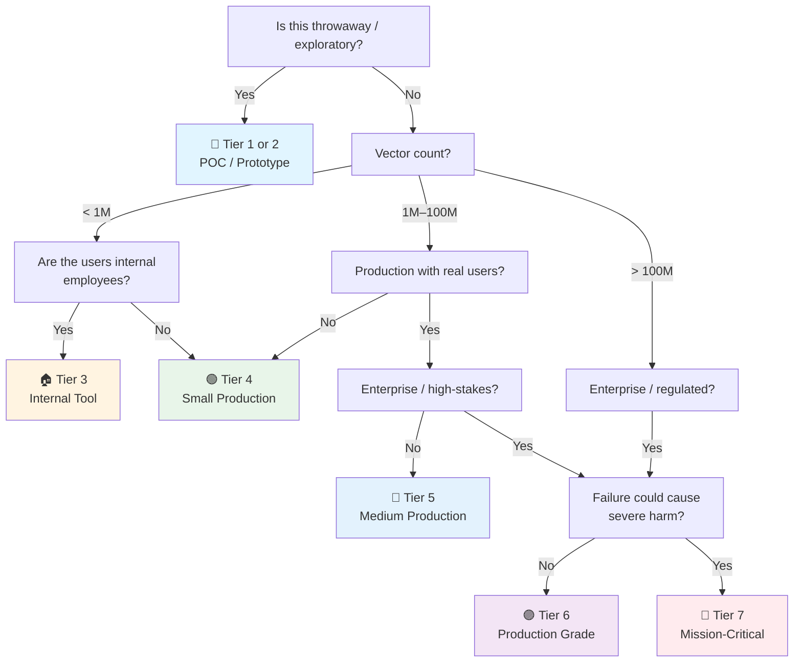

# Vector Database Checklist

> The **embedding storage** checklist — vector indexes for similarity search, RAG, semantic caching, and recommendation.
> Companion to [[AI]] (RAG section), [[PostgreSQL]] (pgvector), and the general [[Database]] checklist.
> Covers pgvector, Qdrant, Milvus, Weaviate, Chroma, Pinecone — the principles are the same.
> Last updated: 2026-08-07

---

## 1. Use Case & Engine Selection

- [ ] **Use case defined** — What are you doing? The engine choice depends on it:
  - **RAG (knowledge retrieval)** — Hybrid search, metadata filtering, moderate scale (1K–10M vectors)
  - **Semantic search / search box** — Pure similarity, fast query, optional re-ranking
  - **Recommendation / deduplication** — High-throughput batch similarity, clustering
  - **Semantic caching** — Find similar past queries to avoid LLM calls (different cost profile)
  - **Image / audio similarity** — Higher dimensions, different embedding models
- [ ] **Scale understood** — < 1M vectors: any engine works, even pgvector. 1M–100M: purpose-built (Qdrant, Milvus). 100M+: distributed with sharding (Milvus cluster, Pinecone). Don't start with a distributed cluster for 50K vectors.
- [ ] **Build vs buy decided** — Self-hosted (pgvector, Qdrant, Milvus open-source) vs managed (Pinecone, Zilliz Cloud, Weaviate Cloud). Trade-off: operational burden vs cost. pgvector is free and already in your Postgres — start there.
- [ ] **Vector store is NOT a primary database** — Vector stores optimize for similarity search, not OLTP. Store metadata in your primary DB, store vectors in the vector store, join by an ID. Don't use a vector store as your system of record → [[Database]] §1.

## 2. Embedding Fundamentals

- [ ] **Embedding model chosen deliberately** — Trade-off table:

| Model | Dimensions | Quality (MTEB) | Cost | Speed | Best for |
|---|---|---|---|---|---|
| OpenAI text-embedding-3-small | 1536 | High | Low | Fast | General-purpose, managed |
| OpenAI text-embedding-3-large | 3072 | Highest | Medium | Fast | High-recall RAG |
| BGE-m3 (open) | 1024 | High | Free | Medium | Multilingual, self-hosted |
| all-MiniLM-L6-v2 (open) | 384 | Medium | Free | Very Fast | Prototypes, semantic cache |
| Cohere embed-v3 | 1024 | High | Low | Fast | Multilingual, rerank-compatible |

- [ ] **MTEB benchmark checked** — [MTEB leaderboard](https://huggingface.co/spaces/mteb/leaderboard) ranks embedding models on retrieval, classification, clustering tasks. Don't guess — check the scores for your task and language (Thai embeddings exist but score lower than English).
- [ ] **Embedding model versioned and pinned** — Like an LLM version. Changing the embedding model means **every vector in the index is invalid** and must be re-computed. Pin the version, plan the migration (see §6).
- [ ] **Dimension vs cost trade-off understood** — Higher dimensions = better recall but: more storage (`dim × 4 bytes per vector`), slower search (more distance computations), more memory. For 10M vectors: 384d = ~15 GB, 1536d = ~61 GB. Match the dimension to your quality bar.
- [ ] **Embedding happens at indexing AND query time** — Same model, same version, same preprocessing. Embedding model mismatch between index and query = garbage results. Centralize embedding in a shared service or library.

## 3. Indexing & Search Performance

- [ ] **Index type chosen** — This is the #1 performance decision:

| Index | How it works | Recall | Speed | Build time | When to use |
|---|---|---|---|---|---|
| **Flat (brute-force)** | Scans all vectors | 100% | Slow at scale | Instant | < 100K vectors, or exact search required |
| **HNSW** | Hierarchical graph | High (95-99%) | Very fast | Moderate | **Default for most use cases.** Best recall/speed ratio. |
| **IVF** | Inverted file (clusters) | Medium (90-95%) | Fast | Fast | Very large datasets, batch workloads |
| **IVFFlat** | IVF + flat within cluster | Medium-High | Fast | Fast | Mid-size datasets, tunable `nlist`/`nprobe` |
| **DiskANN** | Disk-resident graph | High | Medium | Slow | Datasets larger than RAM, cost-sensitive |

- [ ] **HNSW parameters tuned** — The default index. Key parameters:
  - `m` (connections per node, default 16) — Higher = better recall, more memory. 16–48 typical.
  - `ef_construction` (build-time search width, default 64) — Higher = better index quality, slower build. 200–500 for production.
  - `ef_search` (query-time search width, default 40) — Higher = better recall, slower query. **This is your recall/latency knob** — tune at query time without rebuilding. 50–200 typical.
  - **Tune by benchmarking:** Build index → measure recall@10 at different `ef_search` values → pick the lowest `ef_search` that hits your recall target.
- [ ] **Distance metric matches the embedding model** — The metric MUST match what the model was trained with:

| Metric | When | Models |
|---|---|---|
| **Cosine** | Direction matters, magnitude doesn't (text embeddings) | OpenAI, BGE, most sentence transformers |
| **Dot product** | Magnitude is meaningful (some models, recommendation) | Models normalized to unit length — cosine ≈ dot product |
| **Euclidean (L2)** | Spatial/physical distance | Image embeddings (sometimes), CLIP |

Using cosine vectors with L2 distance (or vice versa) gives subtly wrong results — the model will "work" but recall is degraded.

- [ ] **Exact search for small datasets** — For < 100K vectors, brute-force flat index (exact search) is fast enough and gives 100% recall. Don't index what doesn't need indexing.
- [ ] **Query latency budgeted** — Target: < 50ms p99 for interactive search, < 500ms for batch. HNSW on a single node handles 1K–10K QPS easily. If you're slower, check: wrong distance metric, `ef_search` too high, dimension too high, or too many metadata filters.

## 4. Metadata & Hybrid Search

- [ ] **Metadata stored alongside vectors** — Each vector carries a payload: `{"source": "doc_123", "page": 4, "tenant": "acme", "date": "2026-08-07"}`. This enables filtered search ("find similar vectors WHERE tenant = X AND date > Y"). Without metadata, you can't enforce access control or freshness filters.
- [ ] **Metadata filtering performance understood** — Pre-filtering (filter first, then search) vs post-filtering (search, then filter results). Pre-filtering is precise but can be slow if the filter is selective. Post-filtering is fast but can return too few results if the filter removes most candidates. Qdrant and Milvus support efficient pre-filtering; pgvector's approach varies.
- [ ] **Hybrid search (vector + keyword)** — Pure vector search misses exact matches (product codes "SKU-12345", names "Jon", IDs). Hybrid: run BM25 keyword search + vector search, merge results with **Reciprocal Rank Fusion (RRF)**. RRF formula: `score = Σ 1/(k + rank)` where k≈60. Implementations: Qdrant hybrid, pgvector + tsvector, Weaviate hybrid.
- [ ] **Re-ranking for quality** — Retrieve top-K (e.g. top-50) with fast vector search, then re-rank with a cross-encoder model (Cohere Rerank, BGE-reranker). Cross-encoders are slower but more accurate — they read both query and document together, not just compare vectors. Big quality win for RAG.
- [ ] **Multi-vector / dense-sparse hybrid** — Some engines (Milvus 2.4+, Qdrant) support storing both dense and sparse vectors (like SPLADE) in the same collection. Sparse vectors handle keyword matching natively, dense handles semantic. Best of both worlds.

## 5. Operations & Reliability

- [ ] **Collection / index naming versioned** — `knowledge_base_v3` not `knowledge_base`. When you change the embedding model or schema, create a new collection. Switch reads/writes atomically. Never mutate a live index's embedding model.
- [ ] **Write pattern: upsert by ID** — Vectors are inserted with a unique ID. Upsert (`INSERT ... ON CONFLICT DO UPDATE`) updates the vector if the ID exists. Use deterministic IDs (hash of content) for idempotent re-indexing — re-running the pipeline doesn't duplicate.
- [ ] **Batch inserts** — Insert vectors in batches (100–10,000 per request), not one at a time. Single-vector inserts are 10–100x slower due to index update overhead. Bulk loader tools (Milvus bulk insert, Qdrant batch API) for initial loads.
- [ ] **Index build is not instant** — HNSW index construction takes time for large datasets. Plan for background indexing — writes are accepted immediately but search may be slow or incomplete until the index is built. Check index build status before declaring "ready."
- [ ] **Persistence & recovery** — Vector stores must persist to disk. Qdrant: snapshots to S3. Milvus: backs up object storage (S3/MinIO). pgvector: it's in Postgres — use your normal backup pipeline. Test restore (a snapshot you never restored is fiction → [[Database]] §3).
- [ ] **Replication & HA** — Single-node is fine for dev/small prod. For production: Qdrant supports replicas, Milvus has query node replication, Pinecone/Zilliz are managed. Read replicas for query-heavy workloads.

## 6. Re-Indexing & Embedding Model Migration

> This is the #1 operational risk with vector databases. Plan for it before you need it.

- [ ] **Re-indexing strategy documented** — When the embedding model changes (you will upgrade eventually), you must re-embed every document and rebuild the index. Strategy:
  1. Create new collection with new embedding model
  2. Backfill: re-embed all documents, write to new collection
  3. Dual-query during transition: query both collections, merge results (or switch atomically if quality is validated)
  4. Switch read traffic to new collection
  5. Decommission old collection
- [ ] **Zero-downtime migration plan** — During backfill, queries continue against the old index. Plan the cutover: feature flag, dual-write (new inserts go to both), or accept a brief read-only window. Measure backfill time on staging first.
- [ ] **Re-embedding cost estimated** — Re-embedding 1M documents with OpenAI text-embedding-3-small (~$0.02 per 1M tokens): if avg doc is 500 tokens, that's 500M tokens = ~$10. Cheap. Self-hosted: it's compute time + electricity. Always estimate before starting.
- [ ] **Dimension change handled** — Going from 384d to 1536d? The new collection has different dimensions — you can't update vectors in place. Must create a new collection. Storage cost increases (see §2). Plan capacity.
- [ ] **Rollback plan** — If the new embedding model performs worse in production (input drift, edge cases), can you revert? Keep the old collection alive for a cooling-off period (1–2 weeks) before deleting.

## 7. Observability & Monitoring

- [ ] **Query latency tracked** — p50, p99 search latency per collection. Sudden latency spike = index corruption, memory pressure, or a query pattern that defeats the index (very selective metadata filter).
- [ ] **Recall monitored** — Sample queries with known-good results (golden set), measure recall@k against the ground truth. A recall drop = index degradation, dimension mismatch, or embedding model drift. This is the "data quality" of vector search.
- [ ] **Index health** — HNSW graph integrity, segment count (Qdrant), segment merge progress (Milvus). Degraded index = slow queries and wrong results.
- [ ] **Storage growth** — Vector storage grows linearly with document count × dimensions. Track disk/memory usage. A dimension upgrade or corpus growth can fill disk surprisingly fast.
- [ ] **Zero-result rate tracked** — What % of queries return no results (or < k results)? May indicate: corpus too small, embedding model mismatch (query embedded differently than corpus), or overly restrictive metadata filters.

## 8. Security & Access Control

- [ ] **Tenant isolation** — Multi-tenant RAG: metadata filter `WHERE tenant_id = ?` on every query. **This is data security, not optional.** Without it, user A can retrieve user B's documents by similarity. Test: query as tenant A, verify zero results from tenant B's corpus.
- [ ] **Access control at the metadata level** — Document-level permissions encoded as metadata: `{"allowed_roles": ["admin", "team_a"]}`. Query filters by the user's role. Vector stores don't have RBAC — you enforce via metadata filtering.
- [ ] **API key / auth** — Managed vector DBs (Pinecone, Zilliz) use API keys. Self-hosted (Qdrant, Milvus) may have no auth by default — enable it. Never expose a vector DB directly to the internet.
- [ ] **No secrets in vectors** — Embeddings can theoretically leak training data (model inversion attacks). Don't embed classified/regulated data into a shared index. Treat embeddings like any other derived data product → [[Security]].

---

## Quick Sanity Check Before Launch

- [ ] Embedding model chosen via MTEB benchmark, version pinned
- [ ] Distance metric matches the embedding model (cosine for most text)
- [ ] Index type chosen (HNSW for most, flat for < 100K)
- [ ] HNSW `ef_search` tuned to hit recall target at acceptable latency
- [ ] Metadata filtering for tenant isolation and access control
- [ ] Hybrid search (vector + BM25) if exact-term matching matters
- [ ] Collection naming versioned (`kb_v3`, not `kb`)
- [ ] Upsert by deterministic ID, batch inserts
- [ ] Re-indexing strategy documented (embedding model will change eventually)
- [ ] Backup/snapshot tested — restore verified
- [ ] Query latency < 50ms p99 for interactive search
- [ ] Recall monitored on a golden set

---

## Project Tier Scoping Matrix

> **How to use this table:** Pick your tier first, then focus only on the sections marked ✅ (required) or 🟡 (recommended). Skip ❌ sections entirely — they'd be over-engineering for your context.
>
> **Legend:** ✅ Required · 🟡 Recommended / partial · ❌ Skip

### Tier Descriptions

| # | Tier | Description | Typical Team | Users | Lifespan |
|---|---|---|---|---|---|
| 1 | 🧪 **POC / Spike** | Validate RAG. In-memory Chroma or pgvector. | 1 dev | Internal only | Days–weeks |
| 2 | 🔧 **Prototype / MVP** | RAG feature in a prototype. Might become real. | 1–2 devs | Beta testers | Weeks–months |
| 3 | 🏠 **Internal Tool** | Real RAG/search for employees. < 1M vectors. | 1–3 devs | Employees | Ongoing |
| 4 | 🟢 **Small Production** | Single-node vector store, < 10M vectors. Real users. | 1–2 devs | < 1K users | Ongoing |
| 5 | 🔵 **Medium Production** | Purpose-built engine, 10M–100M vectors, hybrid search. | 2–5 devs | 1K–100K users | Ongoing |
| 6 | 🟣 **Production Grade** | Distributed/clustered, > 100M vectors, multi-tenant at scale. | 5+ devs | 100K+ users | Long-term |
| 7 | 🔴 **Mission-Critical / Regulated** | Healthcare/finance/legal RAG with audit and compliance. | 10+ devs | Varies | Decades |

### Which Tier Am I?

### Checklist Applicability by Tier

| # | Section | 🧪 POC | 🔧 Prototype | 🏠 Internal | 🟢 Small Prod | 🔵 Medium Prod | 🟣 Production Grade | 🔴 Mission-Critical |
|---|---|:---:|:---:|:---:|:---:|:---:|:---:|:---:|
| 1 | Use Case & Engine | 🟡 pgvector/Chroma | 🟡 pgvector | ✅ pgvector/Qdrant | ✅ | ✅ Qdrant/Milvus | ✅ distributed | ✅ formal |
| 2 | Embedding Fundamentals | 🟡 any model | ✅ pinned | ✅ + MTEB checked | ✅ + trade-offs | ✅ + benchmarked | ✅ + custom if needed | ✅ + formal |
| 3 | Indexing & Search | ❌ flat scan | 🟡 default HNSW | ✅ + HNSW tuned | ✅ + ef_search tuned | ✅ + benchmarked | ✅ + custom index | ✅ + capacity plan |
| 4 | Metadata & Hybrid | ❌ | 🟡 metadata | ✅ + filtering | ✅ + hybrid search | ✅ + re-ranking | ✅ + multi-vector | ✅ + formal |
| 5 | Operations & Reliability | ❌ | 🟡 upserts | ✅ + versioned names | ✅ + batch inserts | ✅ + replication | ✅ + HA + snapshots | ✅ + formal |
| 6 | Re-Indexing Strategy | ❌ | ❌ | 🟡 documented | ✅ + zero-downtime plan | ✅ + tested | ✅ + dual-index migration | ✅ + formal |
| 7 | Observability | ❌ | ❌ | 🟡 latency | ✅ + recall monitored | ✅ + index health | ✅ + storage growth | ✅ + full stack |
| 8 | Security & Access | ❌ | 🟡 basic | ✅ + tenant filter | ✅ + metadata ACL | ✅ + API auth | ✅ + network isolation | ✅ + audit + regulatory |

---

## Sources

- Complements [[AI]] (RAG section), [[PostgreSQL]] (pgvector), [[Database]] (general), [[Security]].
- pgvector — https://github.com/pgvector/pgvector
- Qdrant docs — https://qdrant.tech/documentation/
- Milvus docs — https://milvus.io/docs
- MTEB leaderboard — https://huggingface.co/spaces/mteb/leaderboard
- HNSW paper — https://arxiv.org/abs/1603.09320
