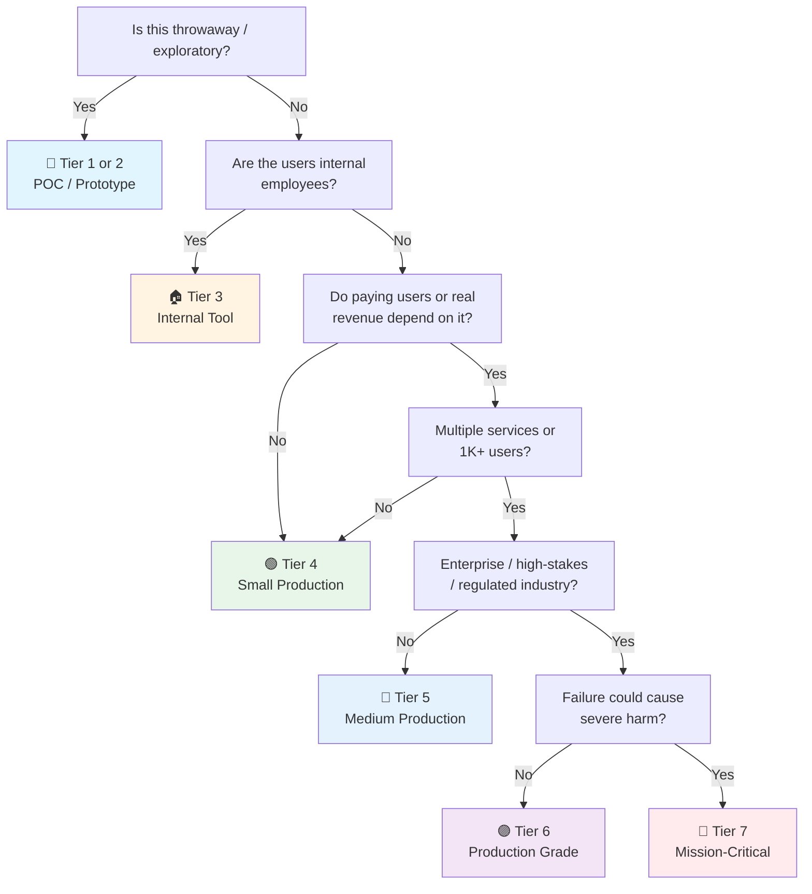

# ASP.NET Core API Checklist

> ASP.NET Core 10 (.NET 10 LTS) companion to the general [API checklist](api.md).
> Covers Minimal APIs, Entity Framework Core 10, C# 14, and the standard production stack.
> Last updated: 2026-08-05

---

## 1. Project Setup & Bootstrapping

- [ ] **.NET SDK** — `dotnet --version` should be 10.x (LTS). Use `global.json` to pin SDK version across team.
- [ ] **Create project** — `dotnet new webapi -n MyApi` (Minimal APIs template) or `dotnet new webapi -controllers` for controller-based.
- [ ] **Solution structure** — Multi-project solution with `dotnet new sln`. Separate API, Application, Domain, Infrastructure projects (Clean Architecture).
- [ ] **NuGet packages** — Install core dependencies:
  ```bash
  dotnet add package Microsoft.EntityFrameworkCore
  dotnet add package FluentValidation.DependencyInjectionExtensions
  dotnet add package Serilog.AspNetCore
  dotnet add package OpenTelemetry.Extensions.Hosting
  ```
- [ ] **`Program.cs`** — Minimal hosting model. `WebApplication.CreateBuilder(args)` → configure services → `app.Run()`.
- [ ] **Environment configuration** — `appsettings.json`, `appsettings.Development.json`, `appsettings.Production.json`. Secrets via user secrets (dev) or Azure Key Vault (prod).

---

## 2. Project Structure (Clean Architecture)

```
src/
├── Application/              # Business logic, CQRS handlers
│   ├── Common/
│   │   ├── Behaviors/        # MediatR pipeline behaviors
│   │   └── Interfaces/
│   ├── Features/             # Feature-based folders
│   │   ├── Users/
│   │   │   ├── Commands/
│   │   │   ├── Queries/
│   │   │   └── Validators/
│   │   └── Orders/
│   └── DTOs/
├── Domain/                   # Entities, value objects, enums
│   ├── Entities/
│   └── Events/
├── Infrastructure/           # EF Core, external services
│   ├── Data/
│   ├── Services/
│   └── Migrations/
└── WebApi/                   # ASP.NET Core entry point
    ├── Endpoints/            # Minimal API endpoints
    ├── Middleware/
    └── Configuration/

tests/
├── Application.UnitTests/
├── Application.IntegrationTests/
└── Infrastructure.IntegrationTests/
```

- [ ] **Separation of concerns** — Domain has no dependencies. Application depends on Domain. Infrastructure depends on Application. WebApi depends on all.
- [ ] **Feature folders** — Group commands, queries, validators by feature (Users, Orders), not by layer.
- [ ] **MediatR registration** — `builder.Services.AddMediatR(cfg => cfg.RegisterServicesFromAssembly(typeof(CreateUserCommand).Assembly))`.

---

## 3. Minimal APIs (Preferred for New Projects)

- [ ] **Endpoint registration** — `app.MapGet("/api/v1/users/{id}", async (int id, IUserService service) => await service.GetById(id))`.
- [ ] **Group endpoints** — `var userGroup = app.MapGroup("/api/v1/users").WithTags("Users")`.
- [ ] **Request binding** — `[FromBody]`, `[FromQuery]`, `[FromRoute]` attributes. Minimal APIs auto-bind simple types.
- [ ] **Response types** — `Results.Ok()`, `Results.Created()`, `Results.NotFound()`, `Results.ValidationProblem()`. Use `TypedResults` for compile-time safety.
- [ ] **OpenAPI metadata** — `.WithName("GetUserById")`, `.WithSummary("Retrieves a user")`, `.Produces<UserResponse>(200)`.
- [ ] **Authorization** — `.RequireAuthorization("Admin")` or `.RequireAuthorization(policy => policy.RequireRole("Admin"))`.
- [ ] **Validation** — `.AddValidation()` (built-in, .NET 9+) or manual validation in handler.

---

## 4. Controllers (Alternative for Complex Scenarios)

- [ ] **`[ApiController]` attribute** — Enables automatic model validation, problem details for 400 errors.
- [ ] **Attribute routing** — `[Route("api/v1/[controller]")]`. Avoid conventional routing for APIs.
- [ ] **Action results** — `ActionResult<T>` for flexible return types. `Ok()`, `Created()`, `NotFound()`, `Problem()`.
- [ ] **Filters** — `[ServiceFilter(typeof(LoggingFilter))]` for cross-cutting concerns. Prefer middleware for global concerns.
- [ ] **Model binding** — `[FromBody]`, `[FromQuery]`, `[FromRoute]`, `[FromHeader]`. Custom `IModelBinder` for complex types.

---

## 5. Dependency Injection

- [ ] **Service lifetimes** — `AddTransient<T>()` (per request), `AddScoped<T>()` (per HTTP request), `AddSingleton<T>()` (app lifetime).
- [ ] **Interface-based** — Register interfaces: `builder.Services.AddScoped<IUserService, UserService>()`.
- [ ] **Avoid service locator** — Inject dependencies via constructor, not `IServiceProvider.GetService()`.
- [ ] **Keyed services** (.NET 8+) — `AddKeyedScoped<ICache, RedisCache>("redis")`. Inject with `[FromKeyedServices("redis")]`.
- [ ] **Scrutor for decorators** — `services.Decorate<IUserService, CachingUserServiceDecorator>()` for cross-cutting concerns.

---

## 6. Configuration

- [ ] **appsettings.json** — Default config. Environment-specific overrides: `appsettings.Development.json`, `appsettings.Production.json`.
- [ ] **User secrets** — `dotnet user-secrets init` → `dotnet user-secrets set "ConnectionStrings:Default" "..."`. Dev only, never committed.
- [ ] **Azure Key Vault** — `builder.Configuration.AddAzureKeyVault(new Uri("https://myvault.vault.azure.net/"), new DefaultAzureCredential())`.
- [ ] **Strongly-typed config** — `builder.Services.Configure<ApiSettings>(builder.Configuration.GetSection("ApiSettings"))`. Inject `IOptions<ApiSettings>`.
- [ ] **Validation** — `builder.Services.AddOptions<ApiSettings>().Bind(config).ValidateDataAnnotations().ValidateOnStart()`.

---

## 7. Entity Framework Core 10

- [ ] **DbContext registration** — `builder.Services.AddDbContext<AppDbContext>(options => options.UseSqlServer(connectionString))`.
- [ ] **Migrations** — `dotnet ef migrations add InitialCreate` → `dotnet ef database update`. Committed to source control.
- [ ] **Entity configuration** — `IEntityTypeConfiguration<T>` in separate files. Fluent API over data annotations for complex mappings.
- [ ] **N+1 prevention** — Use `.Include()` for eager loading, `.AsSplitQuery()` for multiple includes. Monitor with `EnableSensitiveDataLogging()` in dev.
- [ ] **Transactions** — `await using var transaction = await context.Database.BeginTransactionAsync()`. Auto-rollback on exception.
- [ ] **Soft deletes** — Global query filters: `modelBuilder.Entity<User>().HasQueryFilter(u => !u.IsDeleted)`.
- [ ] **Performance** — Use `.AsNoTracking()` for read-only queries. Compiled queries for hot paths.

---

## 8. Validation (FluentValidation)

- [ ] **Install package** — `dotnet add package FluentValidation.DependencyInjectionExtensions`.
- [ ] **Validator classes** — Separate from DTOs:
  ```csharp
  public class CreateUserValidator : AbstractValidator<CreateUserCommand>
  {
      public CreateUserValidator()
      {
          RuleFor(x => x.Email).EmailAddress().WithMessage("Invalid email format");
          RuleFor(x => x.Password).MinimumLength(8).Matches("[A-Z]").WithMessage("Must contain uppercase");
      }
  }
  ```
- [ ] **Auto-registration** — `builder.Services.AddValidatorsFromAssembly(typeof(CreateUserValidator).Assembly)`.
- [ ] **Minimal APIs integration** — `.AddValidation()` (built-in, .NET 9+) or manual: `var result = validator.Validate(command); if (!result.IsValid) return Results.ValidationProblem(result.ToDictionary())`.
- [ ] **Controllers integration** — `[ApiController]` auto-validates. Customize with `ApiBehaviorOptions`.
- [ ] **Async validation** — `await validator.ValidateAsync(command)` for DB-dependent rules (e.g., email uniqueness).

---

## 9. Authentication & Authorization

- [ ] **JWT Bearer** — `builder.Services.AddAuthentication(JwtBearerDefaults.AuthenticationScheme).AddJwtBearer(options => { options.TokenValidationParameters = ... })`.
- [ ] **Token validation** — `ValidateIssuer`, `ValidateAudience`, `ValidateLifetime`, `IssuerSigningKey`. Use RS256 (asymmetric) for production.
- [ ] **Authorization policies** — `builder.Services.AddAuthorization(options => options.AddPolicy("Admin", policy => policy.RequireRole("Admin")))`.
- [ ] **Claims-based auth** — `policy.RequireClaim("department", "engineering")`.
- [ ] **Resource-based auth** — `IAuthorizationService.AuthorizeAsync(user, resource, policy)` for per-resource checks.
- [ ] **Duende IdentityServer** — For full OAuth2/OIDC server. Commercial license for production.
- [ ] **Azure AD / Entra ID** — `Microsoft.Identity.Web` package. `AddMicrosoftIdentityWebApp()` for user auth, `AddMicrosoftIdentityWebApi()` for API protection.

---

## 10. Middleware Pipeline

- [ ] **Order matters** — Exception handling → HSTS → HTTPS redirection → Routing → CORS → Authentication → Authorization → Endpoints.
- [ ] **Exception handling** — `app.UseExceptionHandler("/error")` or custom middleware. Return consistent error format.
- [ ] **CORS** — `builder.Services.AddCors(options => options.AddPolicy("AllowFrontend", policy => policy.WithOrigins("https://frontend.com").AllowAnyMethod().AllowAnyHeader()))`.
- [ ] **Request logging** — Serilog middleware: `app.UseSerilogRequestLogging()`. Logs request/response with correlation IDs.
- [ ] **Rate limiting** — `builder.Services.AddRateLimiter(options => options.AddFixedWindowLimiter("fixed", opt => { opt.PermitLimit = 100; opt.Window = TimeSpan.FromMinutes(1) }))`. Apply with `.RequireRateLimiting("fixed")`.
- [ ] **Custom middleware** — `IMiddleware` interface or inline: `app.Use(async (context, next) => { /* logic */ await next() })`.

---

## 11. Error Handling

- [ ] **ProblemDetails** — RFC 7807 standard. `Results.Problem(detail: "User not found", statusCode: 404)`.
- [ ] **Global exception handler** — Custom middleware catches unhandled exceptions, logs full error, returns sanitized response.
- [ ] **Validation errors** — `Results.ValidationProblem(errors)` returns 400 with field-level details.
- [ ] **Consistent error shape** — `{ "type": "...", "title": "...", "status": 404, "detail": "...", "errors": {} }`.
- [ ] **Don't leak internals** — Never expose stack traces or internal error messages in production. Log them server-side.

---

## 12. Caching

- [ ] **IMemoryCache** — Single-instance deployments. `cache.GetOrCreate(key, entry => { entry.AbsoluteExpirationRelativeToNow = TimeSpan.FromMinutes(5); return ComputeExpensiveValue() })`.
- [ ] **IDistributedCache** — Multi-instance deployments. `SetAsync(key, bytes, options)` with `DistributedCacheEntryOptions`.
- [ ] **Redis** — `builder.Services.AddStackExchangeRedisCache(options => options.Configuration = connectionString)`.
- [ ] **HybridCache** (.NET 9) — Built-in stampede protection. `cache.GetOrCreateAsync(key, async token => await ComputeValue(), token)`.
- [ ] **Response caching** — `[ResponseCache(Duration = 300, VaryByQueryKeys = new[] { "page" })]` or `.CacheOutput()` for Minimal APIs.
- [ ] **Cache invalidation** — `cache.Remove(key)` on write operations. Consider cache tags for bulk invalidation.

---

## 13. Background Jobs (Hangfire)

- [ ] **Install Hangfire** — `dotnet add package Hangfire.AspNetCore` + storage package (SQL Server, PostgreSQL, Redis).
- [ ] **Configuration** — `builder.Services.AddHangfire(config => config.UseSqlServerStorage(connectionString))`. `app.UseHangfireDashboard("/hangfire")`.
- [ ] **Fire-and-forget** — `BackgroundJob.Enqueue<IPaymentService>(service => service.ProcessPayment(orderId))`.
- [ ] **Delayed jobs** — `BackgroundJob.Schedule<INotificationService>(service => service.SendReminder(userId), TimeSpan.FromDays(1))`.
- [ ] **Recurring jobs** — `RecurringJob.AddOrUpdate<ICleanupService>("cleanup", service => service.CleanupOldRecords(), Cron.Daily)`.
- [ ] **Continuations** — `BackgroundJob.ContinueJobWith<INotificationService>(jobId, service => service.NotifyCompletion(userId))`.
- [ ] **Retry policies** — `[AutomaticRetry(Attempts = 3, DelaysInSeconds = new[] { 10, 60, 300 })]` on job methods.

---

## 14. Observability

- [ ] **OpenTelemetry** — `builder.Services.AddOpenTelemetry().WithTracing(builder => builder.AddAspNetCoreInstrumentation().AddHttpClientInstrumentation().AddEntityFrameworkCoreInstrumentation().AddOtlpExporter())`.
- [ ] **Serilog** — `builder.Host.UseSerilog((context, config) => config.ReadFrom.Configuration(context.Configuration))`. JSON format in production.
- [ ] **Structured logging** — `logger.LogInformation("User {UserId} created account", userId)`. Not string interpolation.
- [ ] **Correlation IDs** — `SerilogTimings` or custom middleware adds request ID to all logs.
- [ ] **Health checks** — `builder.Services.AddHealthChecks().AddDbContextCheck<AppDbContext>().AddRedis(redisConnectionString)`. `app.MapHealthChecks("/health")`.
- [ ] **Metrics** — `builder.Services.AddOpenTelemetry().WithMetrics(builder => builder.AddAspNetCoreInstrumentation().AddPrometheusExporter())`.

---

## 15. Resilience (Polly)

- [ ] **Install Polly** — `dotnet add package Microsoft.Extensions.Http.Polly`.
- [ ] **Circuit breaker** — Prevent cascading failures:
  ```csharp
  services.AddHttpClient<PaymentClient>()
      .AddPolicyHandler(Policy.Handle<HttpRequestException>()
          .CircuitBreakerAsync(5, TimeSpan.FromSeconds(30)));
  ```
- [ ] **Retry with backoff** — `Policy.Handle<HttpRequestException>().WaitAndRetryAsync(3, attempt => TimeSpan.FromSeconds(Math.Pow(2, attempt)))`.
- [ ] **Timeout** — `Policy.TimeoutAsync<HttpResponseMessage>(TimeSpan.FromSeconds(30))`.
- [ ] **Fallback** — `Policy.Handle<HttpRequestException>().FallbackAsync(defaultResponse)`.
- [ ] **Policy wrapping** — `Policy.WrapAsync(retryPolicy, circuitBreakerPolicy, timeoutPolicy)`. Retry inside circuit breaker.
- [ ] **HttpClientFactory** — Always use `IHttpClientFactory` or typed clients. Prevents socket exhaustion.

---

## 16. API Versioning

- [ ] **Install Asp.Versioning** — `dotnet add package Asp.Versioning.Http`.
- [ ] **Configuration** — `builder.Services.AddApiVersioning(options => { options.DefaultApiVersion = new ApiVersion(1, 0); options.AssumeDefaultVersionWhenUnspecified = true; options.ReportApiVersions = true })`.
- [ ] **URL segment versioning** — `[ApiVersion("1.0")]` on endpoints. Route: `/api/v{version:apiVersion}/users`.
- [ ] **Query string versioning** — `?api-version=1.0`. Configure with `QueryStringApiVersionReader`.
- [ ] **Header versioning** — `api-version: 1.0`. Configure with `HeaderApiVersionReader("api-version")`.
- [ ] **Deprecation** — `[ApiVersion("1.0", Deprecated = true)]`. Sunset date in response headers.
- [ ] **OpenAPI integration** — `builder.Services.AddOpenApi().AddApiVersioning()`. Separate docs per version.

---

## 17. Testing

- [ ] **xUnit** — `dotnet add package xunit` + `xunit.runner.visualstudio`. `[Fact]` for single tests, `[Theory]` + `[InlineData]` for parameterized.
- [ ] **Unit tests** — Test business logic in isolation. Mock dependencies with Moq or NSubstitute.
- [ ] **Integration tests** — `WebApplicationFactory<Program>` for in-memory testing. Override services with test doubles.
- [ ] **Testcontainers** — Real PostgreSQL/SQL Server/Redis in integration tests:
  ```csharp
  var container = new PostgreSqlBuilder().Build();
  await container.StartAsync();
  var connectionString = container.GetConnectionString();
  ```
- [ ] **WireMock.Net** — Mock external HTTP dependencies. Record and replay interactions.
- [ ] **FluentAssertions** — `result.Should().BeEquivalentTo(expected)`. Readable assertions.
- [ ] **Test naming** — `MethodName_Scenario_ExpectedBehavior()`. e.g., `GetUserById_UserNotFound_Returns404()`.

---

## 18. Containerization

- [ ] **Dockerfile** — Multi-stage build:
  ```dockerfile
  FROM mcr.microsoft.com/dotnet/sdk:10.0-alpine AS build
  WORKDIR /src
  COPY . .
  RUN dotnet publish -c Release -o /app
  
  FROM mcr.microsoft.com/dotnet/aspnet:10.0-alpine
  WORKDIR /app
  COPY --from=build /app .
  ENTRYPOINT ["dotnet", "MyApi.dll"]
  ```
- [ ] **Alpine images** — ~50MB runtime, minimal attack surface. Use `alpine` tags.
- [ ] **Native AOT** — `<PublishAot>true</PublishAot>` in `.csproj`. Sub-second startup, dramatically smaller memory. Use `runtime-deps` base image.
- [ ] **Health checks** — `HEALTHCHECK CMD curl -f http://localhost:8080/health || exit 1` in Dockerfile.
- [ ] **Non-root user** — `USER app` (built-in `app` user in .NET 8+ images).
- [ ] **Environment variables** — `ASPNETCORE_ENVIRONMENT`, `ASPNETCORE_URLS=http://+:8080`.

---

## 19. AI/LLM Integration

- [ ] **OpenAI client** — `dotnet add package OpenAI` (official SDK). Or `Betalgo.OpenAI` for community wrapper with more features.
- [ ] **Azure OpenAI** — `Azure.AI.OpenAI` package. Managed service, enterprise-grade, data residency.
- [ ] **Ollama** — `OllamaSharp` package for local LLM inference. No API keys needed.
- [ ] **LangChain.NET** — For complex chains, agents, RAG pipelines.
- [ ] **Semantic Kernel** — Microsoft's AI orchestration framework. Plugins, planners, memory.
- [ ] **Streaming responses** — Minimal APIs: `app.MapGet("/chat", async (HttpContext context) => { context.Response.ContentType = "text/event-stream"; await foreach (var chunk in client.StreamChatAsync(prompt)) await context.Response.WriteAsync($"data: {chunk}\n\n") })`.
- [ ] **Token budget tracking** — Log input/output tokens per request. Alert on budget exceedance.
- [ ] **Rate limiting** — Apply stricter rate limits to LLM endpoints (costly per call).
- [ ] **Timeout handling** — LLM calls can take 30s+. Configure `HttpClient.Timeout` and Polly timeout policies accordingly.
- [ ] **Circuit breaker** — Protect against LLM provider outages. Fallback to cached responses or degraded mode.

---

## 20. Data Privacy & Compliance

- [ ] **PII masking in logs** — Custom Serilog enricher or destructuring policy:
  ```csharp
  Log.Logger = new LoggerConfiguration()
      .Destructure.ByTransforming<User>(u => new { u.Id, Email = "***" })
      .CreateLogger();
  ```
- [ ] **Data retention** — Hangfire recurring job deletes old records. `RecurringJob.AddOrUpdate<ICleanupService>("gdpr-cleanup", service => service.DeleteExpiredData(), Cron.Daily)`.
- [ ] **Right to erasure** — Endpoint to delete all user data. Cascade deletes in EF Core: `modelBuilder.Entity<User>().HasMany(u => u.Orders).WithOne().OnDelete(DeleteBehavior.Cascade)`.
- [ ] **Data export** — Endpoint to export all user data as JSON/CSV. `IUserService.ExportUserData(userId)`.
- [ ] **Consent management** — Track consent timestamps. Conditional processing based on consent status.
- [ ] **Field-level encryption** — EF Core value converters:
  ```csharp
  modelBuilder.Entity<User>().Property(u => u.SSN)
      .HasConversion(v => Encrypt(v), v => Decrypt(v));
  ```
- [ ] **Audit logging** — EF Core interceptors or `SaveChangesAsync` override to log all data access.
- [ ] **DPA compliance** — Data Processing Agreements with third-party services (payment, email, analytics).
- [ ] **Anonymization** — Replace PII with pseudonyms for analytics. Separate PII table with encryption.

---

## 21. Performance & Optimization

- [ ] **Async all the way** — `async`/`await` throughout. Never `.Result` or `.Wait()` (deadlock risk).
- [ ] **Connection pooling** — EF Core and HttpClient both use connection pooling by default. Tune pool sizes.
- [ ] **Response compression** — `builder.Services.AddResponseCompression(options => options.EnableForHttps = true)`. `app.UseResponseCompression()`.
- [ ] **Output caching** (.NET 7+) — `builder.Services.AddOutputCache()`. `.CacheOutput()` on endpoints. Configurable expiration and tags.
- [ ] **Frozen collections** (.NET 8+) — `FrozenDictionary`/`FrozenSet` for lookup-heavy hot paths.
- [ ] **Span** — Use `ReadOnlySpan<char>` for string parsing. Avoid allocations.
- [ ] **Native AOT** — `<PublishAot>true</PublishAot>` for serverless/containers. Sub-second startup, ~50MB memory.

---

## 22. gRPC & Real-time

- [ ] **gRPC server** — `dotnet add package Grpc.AspNetCore`. Define `.proto` files, generate C# with `Grpc.Tools`.
- [ ] **gRPC client** — `dotnet add package Grpc.Net.Client`. `GrpcChannel.ForAddress("https://api.example.com")`.
- [ ] **SignalR** — Real-time WebSockets. `builder.Services.AddSignalR()`. `app.MapHub<ChatHub>("/chat")`.
- [ ] **SignalR scaling** — Redis backplane: `builder.Services.AddSignalR().AddStackExchangeRedis(redisConnectionString)`.
- [ ] **MessagePack protocol** — Binary protocol for SignalR (smaller than JSON). `AddMessagePackProtocol()`.

---

## Quick Sanity Check

- [ ] `dotnet build` passes — no warnings (treat warnings as errors: `<TreatWarningsAsErrors>true</TreatWarningsAsErrors>`)
- [ ] `dotnet test` passes — all unit and integration tests green
- [ ] Minimal APIs or controllers registered — endpoints accessible
- [ ] EF Core migrations applied — `dotnet ef database update` succeeds
- [ ] FluentValidation validators registered and working
- [ ] JWT authentication configured — 401 for missing/invalid tokens
- [ ] CORS configured — specific origins, not `*`
- [ ] Serilog logging — JSON format in production, structured fields
- [ ] Health checks exposed — `/health` returns 200
- [ ] Rate limiting applied to sensitive endpoints
- [ ] Exception handling middleware — consistent error format
- [ ] Docker image builds and runs — `docker build` + `docker run` succeeds
- [ ] Environment variables override config — `ASPNETCORE_ENVIRONMENT=Production`

---

## Project Tier Scoping Matrix

> **How to use this table:** Pick your tier first, then focus only on the sections marked ✅ (required) or 🟡 (recommended). Skip ❌ sections entirely — they'd be over-engineering for your context. This matrix adapts the general [API checklist](api.md) tiers to ASP.NET Core specifics.
>
> **Legend:** ✅ Required · 🟡 Recommended / partial · ❌ Skip

### Tier Descriptions

| # | Tier | Description | Typical Team | Users | Lifespan |
|---|---|---|---|---|---|
| 1 | 🧪 **POC / Spike** | Validate an idea. Throwaway code. `Console.WriteLine()` is fine. | 1 dev | Internal only | Days–weeks |
| 2 | 🔧 **Prototype / MVP** | Waiting for integration or user validation. Might become real. | 1–2 devs | Beta testers | Weeks–months |
| 3 | 🏠 **Internal Tool** | Real users (employees), real traffic. No external exposure or paying customers. | 1–3 devs | Employees | Ongoing |
| 4 | 🟢 **Small Production** | Single .NET service, few endpoints, low traffic. Real users, maybe early revenue. | 1–2 devs | < 1K users | Ongoing |
| 5 | 🔵 **Medium Production** | Multiple services or higher traffic. Real revenue or user base that matters. | 2–5 devs | 1K–100K users | Ongoing |
| 6 | 🟣 **Production Grade** | Full rigor — high-stakes SaaS, enterprise product, or large user base. | 5+ devs | 100K+ users | Long-term |
| 7 | 🔴 **Mission-Critical / Regulated** | Healthcare (HIPAA), finance (PCI-DSS), safety systems. Failure = severe harm. | 10+ devs | Varies | Decades |

### Which Tier Am I?



### ASP.NET Core Checklist Applicability by Tier

| # | Section | 🧪 POC | 🔧 Prototype | 🏠 Internal | 🟢 Small Prod | 🔵 Medium Prod | 🟣 Production Grade | 🔴 Mission-Critical |
|---|---|:---:|:---:|:---:|:---:|:---:|:---:|:---:|
| 1 | Project Setup & Bootstrapping | 🟡 basic | ✅ | ✅ | ✅ | ✅ | ✅ | ✅ + SBOM |
| 2 | Project Structure | ❌ | 🟡 single project OK | ✅ | ✅ | ✅ | ✅ | ✅ |
| 3 | Minimal APIs | 🟡 basic | ✅ | ✅ | ✅ | ✅ | ✅ | ✅ |
| 4 | Controllers | 🟡 if needed | 🟡 if complex | ✅ if used | ✅ if used | ✅ if used | ✅ if used | ✅ if used |
| 5 | Dependency Injection | 🟡 basic | ✅ | ✅ | ✅ | ✅ | ✅ | ✅ |
| 6 | Configuration | 🟡 appsettings.json | ✅ + user secrets | ✅ + Key Vault | ✅ + Key Vault | ✅ + Key Vault | ✅ + Key Vault | ✅ + rotation |
| 7 | Entity Framework Core | 🟡 SQLite OK | 🟡 | ✅ | ✅ | ✅ | ✅ | ✅ + audit |
| 8 | Validation | ❌ | 🟡 basic | ✅ | ✅ | ✅ | ✅ | ✅ |
| 9 | Authentication & Authorization | ❌ | 🟡 basic JWT | ✅ | ✅ | ✅ | ✅ | ✅ + rotation |
| 10 | Middleware Pipeline | 🟡 basic | ✅ | ✅ | ✅ | ✅ | ✅ | ✅ + WAF |
| 11 | Error Handling | ❌ | 🟡 basic | ✅ | ✅ | ✅ | ✅ | ✅ + formal |
| 12 | Caching | ❌ | ❌ | 🟡 if needed | ✅ if used | ✅ | ✅ | ✅ + invalidation |
| 13 | Background Jobs | ❌ | ❌ | 🟡 if needed | ✅ if used | ✅ | ✅ | ✅ + DLQ |
| 14 | Observability | ❌ | 🟡 Serilog | ✅ + metrics | ✅ + tracing | ✅ + dashboards | ✅ + SLO | ✅ + full stack |
| 15 | Resilience (Polly) | ❌ | ❌ | 🟡 if ext APIs | 🟡 if ext APIs | ✅ | ✅ | ✅ + chaos |
| 16 | API Versioning | ❌ | ❌ | 🟡 if needed | ✅ | ✅ | ✅ | ✅ + formal |
| 17 | Testing | ❌ maybe smoke | 🟡 unit | ✅ | ✅ + integration | ✅ + Testcontainers | ✅ + contract | ✅ + formal |
| 18 | Containerization | ❌ | 🟡 basic Docker | ✅ + Alpine | ✅ + multi-stage | ✅ + K8s | ✅ + canary | ✅ + signed |
| 19 | AI/LLM Integration | 🟡 if AI is the POC | 🟡 | 🟡 if used | ✅ if used | ✅ | ✅ + guardrails | ✅ + audit trail |
| 20 | Data Privacy & Compliance | ❌ | ❌ | 🟡 PII masking | ✅ erasure + retention | ✅ + consent + DPA | ✅ full compliance | ✅ + regulatory framework |
| 21 | Performance & Optimization | ❌ | ❌ | 🟡 async | ✅ + caching | ✅ + compression | ✅ + AOT | ✅ + capacity |
| 22 | gRPC & Real-time | ❌ | ❌ | 🟡 if needed | ✅ if used | ✅ | ✅ | ✅ + scaling |

---

## Sources

- ASP.NET Core docs — https://learn.microsoft.com/en-us/aspnet/core/
- Entity Framework Core — https://learn.microsoft.com/en-us/ef/core/
- FluentValidation — https://docs.fluentvalidation.net/
- Polly — https://www.pollydocs.org/
- Hangfire — https://docs.hangfire.io/
- `[[api]]` — general API checklist (tick first)
