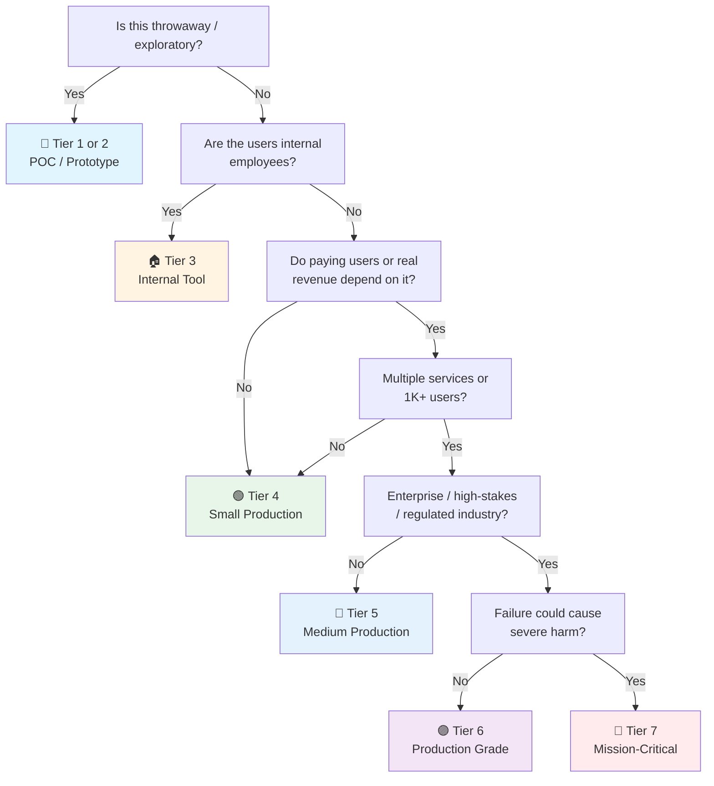

# FastAPI Checklist

> Python + FastAPI companion to the general [API checklist](api.md).
> Covers FastAPI 0.141+, Pydantic v2, SQLAlchemy 2.0+, uv package management.
> Last updated: 2026-08-05

---

## 1. Project Setup

- [ ] **Python version** — 3.10+ required, 3.12+ recommended. Pin in `.python-version` or `pyproject.toml`.
- [ ] **uv package manager** — `uv init myproject` to create project. 10-100x faster than pip, replaces pip + pip-tools + virtualenv.
- [ ] **Install FastAPI** — `uv add "fastapi[standard]"` (includes uvicorn, pydantic, and extras).
- [ ] **Core dependencies**:
  ```bash
  uv add "fastapi[standard]"          # Framework + uvicorn
  uv add sqlalchemy[asyncio]          # ORM with async support
  uv add asyncpg                      # Async PostgreSQL driver
  uv add alembic                      # Database migrations
  uv add pydantic-settings            # Type-safe configuration
  uv add python-jose[cryptography]    # JWT encoding/decoding
  uv add "passlib[bcrypt]"            # Password hashing
  uv add httpx                        # Async HTTP client (testing + external calls)
  ```
- [ ] **Dev dependencies**:
  ```bash
  uv add --dev pytest pytest-asyncio pytest-cov
  uv add --dev ruff                   # Linting + formatting (replaces flake8+isort+black)
  uv add --dev mypy                   # Static type checking
  uv add --dev factory-boy            # Test data factories
  uv add --dev testcontainers         # Docker-based integration tests
  ```
- [ ] **`pyproject.toml`** — single source of truth for project config, dependencies, tool settings.
- [ ] **`.env` file** — environment variables. Add to `.gitignore`. Loaded via pydantic-settings.

---

## 2. Project Structure (Feature-Based / Clean Architecture)

```
project/
├── app/
│   ├── __init__.py
│   ├── main.py                  # FastAPI app factory, lifespan, middleware
│   ├── core/
│   │   ├── config.py            # pydantic-settings BaseSettings
│   │   ├── security.py          # auth, JWT, password hashing
│   │   ├── database.py          # engine, session factory
│   │   └── events.py            # startup/shutdown lifecycle hooks
│   ├── api/
│   │   ├── dependencies.py      # shared Depends (get_db, get_current_user)
│   │   └── v1/
│   │       ├── router.py        # top-level v1 router aggregating all features
│   │       └── endpoints/       # one file per feature/resource
│   ├── features/
│   │   ├── users/
│   │   │   ├── router.py        # APIRouter for /users
│   │   │   ├── models.py        # SQLAlchemy models
│   │   │   ├── schemas.py       # Pydantic request/response models
│   │   │   ├── service.py       # business logic
│   │   │   ├── repository.py    # data access layer
│   │   │   └── dependencies.py
│   │   └── items/
│   │       └── ...              # same pattern
│   └── shared/                  # cross-cutting utilities
├── migrations/                  # Alembic migrations
│   ├── env.py
│   └── versions/
├── tests/
│   ├── conftest.py              # fixtures, test client, db overrides
│   └── features/
│       └── test_users.py
├── alembic.ini
├── pyproject.toml
├── .env
└── Dockerfile
```

- [ ] **Clean Architecture layers** — Router (interface) → Service (use cases) → Repository (data access) → Models (persistence).
- [ ] **Feature modules** — each feature is self-contained: router, schemas, service, repository, dependencies.
- [ ] **`main.py` is thin** — creates app, registers middleware, includes routers, handles lifespan. ~50 lines.

---

## 3. FastAPI App Setup

- [ ] **App factory pattern** — `def create_app() -> FastAPI` for testability and configuration flexibility.
- [ ] **Lifespan context manager** (replaces deprecated `@app.on_event`):
  ```python
  from contextlib import asynccontextmanager
  
  @asynccontextmanager
  async def lifespan(app: FastAPI):
      # startup: init DB pool, cache connections
      yield
      # shutdown: close connections, cleanup
  
  app = FastAPI(lifespan=lifespan)
  ```
- [ ] **APIRouter composition** — `app.include_router(users_router, prefix="/api/v1/users", tags=["Users"])`.
- [ ] **Tags** — group endpoints for OpenAPI docs. One tag per feature.
- [ ] **Custom title/description** — `FastAPI(title="My API", version="1.0.0", description="...")`.

---

## 4. Pydantic v2 Models (Request/Response Schemas)

- [ ] **Pydantic v2 syntax** — `model_config = ConfigDict(...)` replaces `class Config`. `model_validate()` replaces `parse_obj()`. `model_dump()` replaces `dict()`.
- [ ] **`Annotated` types with `Field()`**:
  ```python
  from typing import Annotated
  from pydantic import BaseModel, Field, EmailStr
  
  class UserCreate(BaseModel):
      model_config = ConfigDict(str_strip_whitespace=True)
      name: Annotated[str, Field(min_length=1, max_length=100)]
      email: EmailStr
      age: Annotated[int, Field(ge=0, le=150)]
  ```
- [ ] **Separate schemas** — `UserCreate` (input), `UserUpdate` (input), `UserResponse` (output), `UserSummary` (list output). Never expose DB models directly.
- [ ] **`field_validator`** — custom validation logic:
  ```python
  @field_validator("name")
  @classmethod
  def name_not_admin(cls, v: str) -> str:
      if v.lower() == "admin":
          raise ValueError("Reserved name")
      return v
  ```
- [ ] **`model_validator`** — cross-field validation (e.g., password confirmation).
- [ ] **`@computed_field`** — read-only derived properties in response models.
- [ ] **Strict mode** — `ConfigDict(strict=True)` disables coercion for security-sensitive fields.

---

## 5. Dependency Injection

- [ ] **`Depends()` for injectable dependencies** — composable, async-aware, testable:
  ```python
  async def get_db() -> AsyncGenerator[AsyncSession, None]:
      async with async_session_factory() as session:
          yield session
  
  @app.get("/users/{id}")
  async def get_user(id: int, db: AsyncSession = Depends(get_db)):
      return await db.get(User, id)
  ```
- [ ] **Yield dependencies** — for resource lifecycle (DB sessions, file handles) with automatic cleanup.
- [ ] **`Annotated` shorthand** — avoid repeating `Depends()`:
  ```python
  DB = Annotated[AsyncSession, Depends(get_db)]
  CurrentUser = Annotated[User, Depends(get_current_user)]
  
  @app.get("/users/{id}")
  async def get_user(id: int, db: DB, user: CurrentUser):
      ...
  ```
- [ ] **Nested dependencies** — FastAPI auto-resolves the full dependency graph.
- [ ] **`dependency_overrides`** — swap dependencies in tests:
  ```python
  app.dependency_overrides[get_db] = get_test_db
  ```
- [ ] **Class-based dependencies** — callable classes with `__call__` for stateful deps.

---

## 6. Configuration (pydantic-settings)

- [ ] **`BaseSettings`** — type-safe config with auto-loading from environment:
  ```python
  from pydantic_settings import BaseSettings, SettingsConfigDict
  
  class Settings(BaseSettings):
      model_config = SettingsConfigDict(
          env_file=".env",
          env_nested_delimiter="__",
          case_sensitive=False,
      )
      app_name: str = "My API"
      debug: bool = False
      database_url: str
      secret_key: str
      allowed_origins: list[str] = ["http://localhost:3000"]
      redis_url: str = "redis://localhost:6379"
  
  settings = Settings()
  ```
- [ ] **Priority order** — Constructor args > Environment variables > `.env` file > Default values.
- [ ] **Inject as dependency** — `def get_settings() -> Settings: return settings` then `Depends(get_settings)`.
- [ ] **Never commit secrets** — `.env` in `.gitignore`. Use vault/KMS in production.

---

## 7. Database (SQLAlchemy 2.0 + asyncpg)

- [ ] **Async engine** — `create_async_engine(settings.database_url, echo=settings.debug)`.
- [ ] **Async session factory** — `async_sessionmaker(engine, class_=AsyncSession, expire_on_commit=False)`.
- [ ] **SQLAlchemy 2.0 declarative models** — `Mapped[]` type annotations:
  ```python
  class User(Base):
      __tablename__ = "users"
      id: Mapped[int] = mapped_column(primary_key=True)
      email: Mapped[str] = mapped_column(String(255), unique=True, index=True)
      name: Mapped[str] = mapped_column(String(100))
      created_at: Mapped[datetime] = mapped_column(server_default=func.now())
  ```
- [ ] **Alembic migrations** — `alembic init migrations` → `alembic revision --autogenerate -m "initial"` → `alembic upgrade head`.
- [ ] **Run migrations on startup** — in lifespan: `async with engine.begin() as conn: await conn.run_sync(Base.metadata.create_all)` (dev only). Use Alembic in production.
- [ ] **SQLModel alternative** — unifies Pydantic + SQLAlchemy in one class. Good for simpler CRUD APIs where schemas closely mirror models.
- [ ] **N+1 prevention** — `selectinload()` or `joinedload()` for eager loading. Monitor with `echo=True` in dev.
- [ ] **Soft deletes** — filter `is_deleted=False` in repository queries or use a mixin.

---

## 8. Authentication (JWT + OAuth2)

- [ ] **OAuth2PasswordBearer** — `oauth2_scheme = OAuth2PasswordBearer(tokenUrl="token")`.
- [ ] **JWT creation** — python-jose with RS256 (asymmetric) for production, HS256 for development:
  ```python
  from jose import jwt
  
  def create_access_token(data: dict, expires_delta: timedelta) -> str:
      to_encode = data.copy()
      to_encode["exp"] = datetime.utcnow() + expires_delta
      return jwt.encode(to_encode, SECRET_KEY, algorithm="RS256")
  ```
- [ ] **Token validation dependency**:
  ```python
  async def get_current_user(
      token: str = Depends(oauth2_scheme),
      db: DB,
  ) -> User:
      try:
          payload = jwt.decode(token, PUBLIC_KEY, algorithms=["RS256"])
          user_id = payload.get("sub")
          # fetch user from DB
      except JWTError:
          raise HTTPException(status_code=401)
  ```
- [ ] **Password hashing** — passlib with bcrypt: `pwd_context.hash(password)` / `pwd_context.verify(password, hashed)`.
- [ ] **Role-based access** — `Depends(require_role("admin"))` as a dependency factory.
- [ ] **fastapi-users** — complete user management system (registration, auth, password reset, OAuth) if you don't want to build from scratch.
- [ ] **Refresh tokens** — short-lived access tokens (15-30 min), long-lived refresh tokens (7-30 days). Rotate on refresh.

---

## 9. Middleware & Security

- [ ] **CORS** — built-in `CORSMiddleware`. Specific origins, never `"*"` with credentials:
  ```python
  app.add_middleware(
      CORSMiddleware,
      allow_origins=settings.allowed_origins,
      allow_credentials=True,
      allow_methods=["*"],
      allow_headers=["*"],
  )
  ```
- [ ] **Rate limiting** — `slowapi` for per-endpoint or per-IP rate limits:
  ```python
  from slowapi import Limiter
  from slowapi.util import get_remote_address
  
  limiter = Limiter(key_func=get_remote_address)
  app.state.limiter = limiter
  
  @app.post("/login")
  @limiter.limit("5/minute")
  async def login(request: Request):
      ...
  ```
- [ ] **Security headers middleware** — `X-Content-Type-Options: nosniff`, `X-Frame-Options: DENY`, `Strict-Transport-Security`.
- [ ] **Request body size limit** — middleware to reject payloads > N MB.
- [ ] **Middleware order** — CORS → Security Headers → Rate Limiting → Request ID → Logging.

---

## 10. Error Handling

- [ ] **Custom exception handler** — consistent error format:
  ```python
  @app.exception_handler(AppException)
  async def app_exception_handler(request, exc: AppException):
      return JSONResponse(
          status_code=exc.status_code,
          content={"error": {"code": exc.code, "message": exc.message}},
      )
  ```
- [ ] **`HTTPException`** — for standard HTTP errors. FastAPI auto-converts to JSON.
- [ ] **Pydantic validation errors** — auto-return 422 with field-level details. Customize with `RequestValidationError` handler.
- [ ] **Don't leak internals** — catch `Exception` as a fallback, log full error, return sanitized 500 response.

---

## 11. Observability

- [ ] **structlog** — structured JSON logging:
  ```python
  import structlog
  
  logger = structlog.get_logger()
  logger.info("user_created", user_id=123, email="user@example.com")
  ```
- [ ] **OpenTelemetry** — `opentelemetry-instrumentation-fastapi` for distributed tracing. Export to Jaeger/Zipkin/OTLP.
- [ ] **Prometheus metrics** — `prometheus-fastapi-instrumentator`:
  ```python
  from prometheus_fastapi_instrumentator import Instrumentator
  Instrumentator().instrument(app).expose(app, endpoint="/metrics")
  ```
- [ ] **Health checks** — `/health` (liveness) and `/ready` (readiness):
  ```python
  @app.get("/health")
  async def health():
      return {"status": "healthy"}
  
  @app.get("/ready")
  async def readiness(db: DB):
      await db.execute(text("SELECT 1"))
      return {"status": "ready"}
  ```
- [ ] **Correlation IDs** — middleware generates request ID, propagates to all logs and downstream calls.

---

## 12. Resilience

- [ ] **tenacity for retries** — exponential backoff with jitter:
  ```python
  from tenacity import retry, stop_after_attempt, wait_exponential
  
  @retry(stop=stop_after_attempt(3), wait=wait_exponential(multiplier=1, min=2, max=10))
  async def call_external_api():
      async with httpx.AsyncClient(timeout=30.0) as client:
          response = await client.get("https://api.example.com/data")
          response.raise_for_status()
          return response.json()
  ```
- [ ] **circuitbreaker** — prevent cascading failures:
  ```python
  from circuitbreaker import circuit
  
  @circuit(failure_threshold=5, recovery_timeout=60)
  async def call_payment_service():
      ...
  ```
- [ ] **Timeouts everywhere** — `httpx.AsyncClient(timeout=30.0)` for all external calls. Never infinite timeouts.
- [ ] **Bulkhead isolation** — separate connection pools per downstream service.

---

## 13. Caching

- [ ] **fastapi-cache2** — decorator-based caching with Redis backend:
  ```python
  from fastapi_cache import FastAPICache
  from fastapi_cache.backends.redis import RedisBackend
  from fastapi_cache.decorator import cache
  
  # In lifespan:
  redis = aioredis.from_url(settings.redis_url)
  FastAPICache.init(RedisBackend(redis), prefix="fastapi-cache")
  
  @app.get("/items/{item_id}")
  @cache(expire=60)
  async def get_item(item_id: int):
      return await repository.get(item_id)
  ```
- [ ] **Cache invalidation** — explicit `cache.invalidate()` on write operations, or TTL-based expiry.
- [ ] **Cache stampede protection** — lock-based caching to prevent thundering herd on cache miss.
- [ ] **Multi-level caching** — in-memory (LRU) for hot data → Redis for shared cache → DB as source of truth.

---

## 14. Background Tasks

- [ ] **FastAPI BackgroundTasks** — simple fire-and-forget:
  ```python
  from fastapi import BackgroundTasks
  
  @app.post("/register")
  async def register(user: UserCreate, bg: BackgroundTasks):
      db_user = await create_user(user)
      bg.add_task(send_welcome_email, db_user.email)
      return db_user
  ```
- [ ] **ARQ** — async-first job queue with Redis. Better than BackgroundTasks for reliability:
  ```python
  from arq import create_pool
  from arq.connections import RedisSettings
  
  # Worker:
  async def send_email(ctx, user_id: int, subject: str):
      await email_service.send(user_id, subject)
  
  class WorkerSettings:
      functions = [send_email]
  
  # Enqueue:
  await redis.enqueue_job('send_email', user.id, "Welcome!")
  ```
- [ ] **Celery** — for complex workflows, multiple brokers (Redis, RabbitMQ), beat scheduling.
- [ ] **Dramatiq** — modern alternative to Celery with better error handling.
- [ ] **Idempotent tasks** — safe to retry. Use unique task IDs and check completion before processing.
- [ ] **Dead letter queues** — failed tasks go to DLQ for manual inspection.

---

## 15. API Versioning

- [ ] **URL path versioning** (recommended) — separate routers per version:
  ```python
  v1_router = APIRouter(prefix="/api/v1")
  v2_router = APIRouter(prefix="/api/v2")
  app.include_router(v1_router)
  app.include_router(v2_router)
  ```
- [ ] **Header versioning** — `version: str = Header(default="v1")` then route internally.
- [ ] **Deprecation** — add `Sunset` header on deprecated endpoints. Document migration path.
- [ ] **Backward compatibility** — maintain within major versions. Breaking changes = new version.

---

## 16. Testing

- [ ] **pytest + pytest-asyncio** — async test support:
  ```python
  @pytest.mark.asyncio
  async def test_create_user():
      async with AsyncClient(app=app, base_url="http://test") as client:
          response = await client.post("/api/v1/users", json={"name": "test"})
          assert response.status_code == 201
  ```
- [ ] **httpx AsyncClient** — test async endpoints without starting a server.
- [ ] **Dependency overrides** — swap DB, auth, external services in tests:
  ```python
  app.dependency_overrides[get_db] = get_test_db
  app.dependency_overrides[get_current_user] = get_test_user
  ```
- [ ] **Testcontainers** — real PostgreSQL/Redis in integration tests:
  ```python
  from testcontainers.postgres import PostgresContainer
  
  @pytest.fixture(scope="session")
  def postgres_container():
      with PostgresContainer("postgres:16") as pg:
          yield pg.get_connection_url()
  ```
- [ ] **factory_boy** — test data factories for realistic fixtures.
- [ ] **conftest.py** — shared fixtures: test client, test DB, authenticated user.
- [ ] **Coverage** — `pytest --cov=app --cov-report=html`. Aim for 80%+ on business logic.
- [ ] **ruff** — linting + formatting: `ruff check .` + `ruff format .`.

---

## 17. Containerization

- [ ] **Dockerfile** — multi-stage build with uv:
  ```dockerfile
  FROM python:3.12-slim AS builder
  COPY --from=ghcr.io/astral-sh/uv:latest /uv /usr/local/bin/uv
  WORKDIR /app
  COPY pyproject.toml uv.lock ./
  RUN uv sync --frozen --no-dev
  
  FROM python:3.12-slim
  WORKDIR /app
  COPY --from=builder /app/.venv /app/.venv
  COPY ./app ./app
  ENV PATH="/app/.venv/bin:$PATH"
  CMD ["uvicorn", "app.main:app", "--host", "0.0.0.0", "--port", "8000"]
  ```
- [ ] **ASGI server** — uvicorn (standard) or granian (faster, Rust-based):
  ```bash
  uvicorn app.main:app --host 0.0.0.0 --port 8000 --workers 4
  ```
- [ ] **Workers** — `--workers 4` for multi-process (CPU-bound). Or Gunicorn + uvicorn workers for production:
  ```bash
  gunicorn app.main:app -w 4 -k uvicorn.workers.UvicornWorker
  ```
- [ ] **Health check in Dockerfile** — `HEALTHCHECK CMD curl -f http://localhost:8000/health || exit 1`.
- [ ] **Non-root user** — `USER nobody` in production images.
- [ ] **`.dockerignore`** — exclude `.venv/`, `__pycache__/`, `.git/`, `tests/`, `.env`.

---

## 18. AI/LLM Integration

- [ ] **OpenAI Python SDK** — `uv add openai`. Official client with streaming support:
  ```python
  from openai import AsyncOpenAI
  
  client = AsyncOpenAI()
  
  @app.post("/chat")
  async def chat(prompt: str):
      response = await client.chat.completions.create(
          model="gpt-4o",
          messages=[{"role": "user", "content": prompt}],
      )
      return {"response": response.choices[0].message.content}
  ```
- [ ] **Streaming responses** — Server-Sent Events for real-time LLM output:
  ```python
  from fastapi.responses import StreamingResponse
  
  @app.get("/chat/stream")
  async def chat_stream(prompt: str):
      async def generate():
          stream = await client.chat.completions.create(
              model="gpt-4o", messages=[{"role": "user", "content": prompt}], stream=True
          )
          async for chunk in stream:
              if chunk.choices[0].delta.content:
                  yield f"data: {chunk.choices[0].delta.content}\n\n"
      return StreamingResponse(generate(), media_type="text/event-stream")
  ```
- [ ] **LangChain** — for complex chains, agents, RAG pipelines: `uv add langchain langchain-openai`.
- [ ] **LlamaIndex** — for document indexing and retrieval-augmented generation.
- [ ] **Vector databases** — `chromadb`, `qdrant-client`, `pgvector` (SQLAlchemy extension) for embedding storage.
- [ ] **Ollama** — `uv add ollama` for local LLM inference. No API keys needed.
- [ ] **Token budget tracking** — log input/output tokens per request. Alert on budget exceedance.
- [ ] **Timeout handling** — LLM calls can take 30s+. Configure httpx timeout and tenacity retry.
- [ ] **Circuit breaker** — protect against LLM provider outages. Fallback to cached responses.

---

## 19. Data Privacy & Compliance

- [ ] **PII masking in logs** — structlog processor to redact sensitive fields:
  ```python
  def redact_pii(logger, method_name, event_dict):
      for key in ["email", "phone", "ssn"]:
          if key in event_dict:
              event_dict[key] = "***"
      return event_dict
  
  structlog.configure(processors=[redact_pii, ...])
  ```
- [ ] **Data retention** — scheduled background task (ARQ/Celery) to delete expired records.
- [ ] **Right to erasure** — endpoint to delete all user data. Cascade deletes in SQLAlchemy relationships.
- [ ] **Data export** — endpoint to export all user data as JSON/CSV.
- [ ] **Consent management** — track consent timestamps. Conditional processing based on consent status.
- [ ] **Field-level encryption** — SQLAlchemy `TypeDecorator` for encrypted columns:
  ```python
  class EncryptedString(TypeDecorator):
      impl = String
      def process_bind_param(self, value, dialect):
          return encrypt(value)
      def process_result_value(self, value, dialect):
          return decrypt(value)
  ```
- [ ] **Audit logging** — SQLAlchemy event listeners to log all data access.
- [ ] **Anonymization** — `faker` library for generating pseudonyms. Separate PII table with encryption.

---

## 20. Performance & Optimization

- [ ] **Async all the way** — `async def` endpoints, `await` on all I/O. Never block the event loop.
- [ ] **`asyncpg` over `psycopg2`** — async PostgreSQL driver. 3-5x faster than sync alternatives.
- [ ] **Connection pooling** — SQLAlchemy pool settings: `pool_size=20`, `max_overflow=10`, `pool_timeout=30`.
- [ ] **Response compression** — `GZipMiddleware` for large JSON responses.
- [ ] **`orjson`** — faster JSON serialization: `pip install orjson` + custom response class.
- [ ] **Profiling** — `py-spy` or `cProfile` for identifying bottlenecks.
- [ ] **Caching hot paths** — cache expensive queries and computations.

---

## Quick Sanity Check

- [ ] `ruff check .` passes — no linting errors
- [ ] `ruff format --check .` passes — consistent formatting
- [ ] `mypy app/` passes — type safety verified
- [ ] `pytest` passes — all tests green
- [ ] `uvicorn app.main:app` starts — server runs without errors
- [ ] `/docs` renders — OpenAPI docs auto-generated
- [ ] `/health` returns 200 — liveness check works
- [ ] Pydantic models validate input — invalid data returns 422
- [ ] JWT auth works — 401 for missing token, 403 for wrong role
- [ ] Database migrations applied — `alembic upgrade head` succeeds
- [ ] `.env` loaded — settings accessible via pydantic-settings
- [ ] Structured logging — JSON format in production
- [ ] Docker image builds — `docker build` + `docker run` succeeds
- [ ] Rate limiting active — login endpoint limited to 5/min

---

## Project Tier Scoping Matrix

> **How to use this table:** Pick your tier first, then focus only on the sections marked ✅ (required) or 🟡 (recommended). Skip ❌ sections entirely — they'd be over-engineering for your context. This matrix adapts the general [API checklist](api.md) tiers to FastAPI specifics.
>
> **Legend:** ✅ Required · 🟡 Recommended / partial · ❌ Skip

### Tier Descriptions

| # | Tier | Description | Typical Team | Users | Lifespan |
|---|---|---|---|---|---|
| 1 | 🧪 **POC / Spike** | Validate an idea. Throwaway code. `print()` is fine. | 1 dev | Internal only | Days–weeks |
| 2 | 🔧 **Prototype / MVP** | Waiting for integration or user validation. Might become real. | 1–2 devs | Beta testers | Weeks–months |
| 3 | 🏠 **Internal Tool** | Real users (employees), real traffic. No external exposure or paying customers. | 1–3 devs | Employees | Ongoing |
| 4 | 🟢 **Small Production** | Single FastAPI service, few endpoints, low traffic. Real users, maybe early revenue. | 1–2 devs | < 1K users | Ongoing |
| 5 | 🔵 **Medium Production** | Multiple services or higher traffic. Real revenue or user base that matters. | 2–5 devs | 1K–100K users | Ongoing |
| 6 | 🟣 **Production Grade** | Full rigor — high-stakes SaaS, enterprise product, or large user base. | 5+ devs | 100K+ users | Long-term |
| 7 | 🔴 **Mission-Critical / Regulated** | Healthcare (HIPAA), finance (PCI-DSS), safety systems. Failure = severe harm. | 10+ devs | Varies | Decades |

### Which Tier Am I?



### FastAPI Checklist Applicability by Tier

| # | Section | 🧪 POC | 🔧 Prototype | 🏠 Internal | 🟢 Small Prod | 🔵 Medium Prod | 🟣 Production Grade | 🔴 Mission-Critical |
|---|---|:---:|:---:|:---:|:---:|:---:|:---:|:---:|
| 1 | Project Setup | 🟡 basic | ✅ | ✅ | ✅ | ✅ | ✅ | ✅ + SBOM |
| 2 | Project Structure | ❌ | 🟡 single file OK | ✅ | ✅ | ✅ | ✅ | ✅ |
| 3 | FastAPI App Setup | 🟡 basic | ✅ | ✅ | ✅ | ✅ | ✅ | ✅ |
| 4 | Pydantic v2 Models | 🟡 basic types | ✅ | ✅ | ✅ | ✅ | ✅ | ✅ + strict |
| 5 | Dependency Injection | 🟡 basic | ✅ | ✅ | ✅ | ✅ | ✅ | ✅ |
| 6 | Configuration | 🟡 .env | ✅ | ✅ | ✅ | ✅ | ✅ | ✅ + vault |
| 7 | Database (SQLAlchemy) | 🟡 SQLite OK | 🟡 | ✅ | ✅ | ✅ | ✅ | ✅ + audit |
| 8 | Authentication | ❌ | 🟡 basic JWT | ✅ | ✅ | ✅ | ✅ | ✅ + rotation |
| 9 | Middleware & Security | 🟡 CORS | ✅ | ✅ | ✅ | ✅ | ✅ | ✅ + WAF |
| 10 | Error Handling | ❌ | 🟡 basic | ✅ | ✅ | ✅ | ✅ | ✅ + formal |
| 11 | Observability | ❌ | 🟡 structlog | ✅ + metrics | ✅ + tracing | ✅ + dashboards | ✅ + SLO | ✅ + full stack |
| 12 | Resilience | ❌ | ❌ | 🟡 if ext APIs | 🟡 if ext APIs | ✅ | ✅ | ✅ + chaos |
| 13 | Caching | ❌ | ❌ | 🟡 if needed | ✅ if used | ✅ | ✅ | ✅ + invalidation |
| 14 | Background Tasks | ❌ | ❌ | 🟡 BackgroundTasks | ✅ ARQ | ✅ ARQ/Celery | ✅ + DLQ | ✅ + monitoring |
| 15 | API Versioning | ❌ | ❌ | 🟡 if needed | ✅ | ✅ | ✅ | ✅ + formal |
| 16 | Testing | ❌ maybe smoke | 🟡 unit | ✅ | ✅ + integration | ✅ + Testcontainers | ✅ + contract | ✅ + formal |
| 17 | Containerization | ❌ | 🟡 basic Docker | ✅ + multi-stage | ✅ | ✅ + K8s | ✅ + canary | ✅ + signed |
| 18 | AI/LLM Integration | 🟡 if AI is the POC | 🟡 | 🟡 if used | ✅ if used | ✅ | ✅ + guardrails | ✅ + audit trail |
| 19 | Data Privacy & Compliance | ❌ | ❌ | 🟡 PII masking | ✅ erasure + retention | ✅ + consent + DPA | ✅ full compliance | ✅ + regulatory framework |
| 20 | Performance & Optimization | ❌ | ❌ | 🟡 async | ✅ + caching | ✅ + compression | ✅ + profiling | ✅ + capacity |

---

## Sources

- FastAPI docs — https://fastapi.tiangolo.com/
- Pydantic v2 docs — https://docs.pydantic.dev/latest/
- SQLAlchemy 2.0 — https://docs.sqlalchemy.org/en/20/
- `[[api]]` — general API checklist (tick first)
