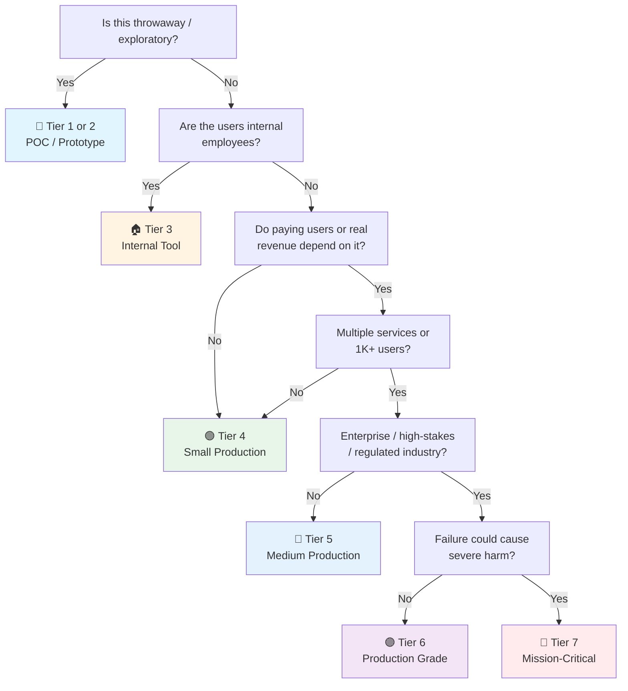

# Fiber v3 API Checklist

> Go + Fiber v3 specific companion to [[api]]. Tick the general checklist first, then this one for Fiber-specific concerns.
> Fiber v3 requires Go 1.22+. Last updated: 2026-08-05

---

## Project Setup

- [ ] **Go 1.22+** — Fiber v3 minimum. `go mod init github.com/you/project`
- [ ] **Module path** — lowercase, no underscores, follows `domain.com/user/repo` convention
- [ ] **`go.sum` committed** — reproducible builds
- [ ] **Linter** — `golangci-lint` with `.golangci.yml`. At minimum: `errcheck`, `gosimple`, `govet`, `ineffassign`, `staticcheck`, `unused`
- [ ] **Air for hot reload** — `go install github.com/air-verse/air@latest`. `.air.toml` at project root

---

## App Structure

```
cmd/
└── server/
    └── main.go          ← Entry point. Wires everything. Starts server.
internal/
├── handler/              ← HTTP handlers (thin — parse request, call service, write response)
├── service/              ← Business logic
├── repository/           ← Data access
├── middleware/            ← Custom middleware (if standard middleware package doesn't cover it)
├── model/                ← Domain types, request/response DTOs
└── config/               ← Config loading
```

- [ ] **Package-by-feature, not by-layer** — `internal/` grouped by domain (order/, user/), not by layer (handlers/, services/). Avoids import cycles.
- [ ] **`internal/` for private packages** — Go compiler enforces. Packages outside `internal/` CAN'T import them.
- [ ] **`cmd/` is thin** — `main.go` creates deps, wires middleware, calls `app.Listen()`. No business logic.

---

## Fiber App Setup

- [ ] **Error handling** — Fiber v3 `Config.ErrorHandler` returns JSON. Custom handler for all routes:
```go
app := fiber.New(fiber.Config{
    ErrorHandler: func(c fiber.Ctx, err error) error {
        code := fiber.StatusInternalServerError
        if e, ok := err.(*fiber.Error); ok { code = e.Code }
        return c.Status(code).JSON(fiber.Map{"error": err.Error()})
    },
})
```

- [ ] **`fiber.Config.Immutable`** — set `true`. Prevents accidental config mutation post-startup.
- [ ] **`fiber.Config.StructValidator`** — `gookit/validate` is Fiber's default. Custom validator: `fiber.SetValidator(customValidator)`.
- [ ] **Trusted proxies** — `fiber.Config.TrustedProxies` or `fiber.Config.TrustedProxy` for X-Forwarded-* headers.
- [ ] **Prefork** — `fiber.Config.Prefork: false` (default). Only enable if you know you need it (saturates all cores with child processes).
- [ ] **Body limit** — `fiber.Config.BodyLimit: 10 * 1024 * 1024` (10MB). Prevent OOM on large uploads.
- [ ] **Disable startup banner** — `fiber.Config.DisableStartupMessage: true` (production).

---

## Middleware Chain

- [ ] **Request ID** — `fiber/middleware/requestid`. Custom `Generator` using UUID v7 or similar.
- [ ] **CORS** — `fiber/middleware/cors`. Specific origins per environment. Not `*`.
- [ ] **Recover** — `fiber/middleware/recover`. Built-in. Panics caught, written to stderr, returns 500.
- [ ] **Logger** — `fiber/middleware/logger`. Structure: `"${time} ${status} ${method} ${path} ${latency}"`. Skip health check noise: `Next: skipHealthCheck`.
- [ ] **Helmet** — `fiber/middleware/helmet`. Security headers. Enable at minimum: `XSSProtection`, `ContentTypeNosniff`, `XFrameOptions`, `HSTS`.
- [ ] **Rate Limiter** — `fiber/middleware/limiter`. Per-IP. `Max: 100`, `Expiration: 1 * time.Minute`. Use Redis store for multi-instance.
- [ ] **Compression** — `fiber/middleware/compress`. Level: `compress.LevelDefault`. Skip tiny responses.
- [ ] **ETag** — `fiber/middleware/etag`. Reduces bandwidth for unchanged responses.
- [ ] **Cache** — `fiber/middleware/cache`. Short TTL (5-30s) for semi-dynamic content. Redis store for multi-instance.

Middleware order matters:
```
RequestID → Logger → Recover → Helmet → CORS → Compress → RateLimiter → Routes
```

---

## Routing

- [ ] **Group routes by version** — `v1 := app.Group("/api/v1")`
- [ ] **Route naming** — `v1.Get("/users/:id", handler.GetUser).Name("get-user")`
- [ ] **`fiber.All` for 405** — `app.All("/api/v1/users", func(c fiber.Ctx) error { return c.SendStatus(405) })` when a path has specific methods.
- [ ] **404 handler** — Custom `app.Use(func(c fiber.Ctx) error { return c.Status(404).JSON(...) })` at the end.
- [ ] **Validation middleware** — custom or `fiber/middleware/validate` route-level validation before handler.
- [ ] **`c.Params` always validated** — never trust route params. `id := c.Params("id")` → validate format immediately.
- [ ] **`c.ParamsInt` / `c.ParamsFloat`** — use Fiber's typed param helpers instead of manual conversion.

---

## Request / Response

- [ ] **`c.BodyParser`** — parses JSON. Check error: `if err := c.BodyParser(&req); err != nil { return fiber.ErrBadRequest }`
- [ ] **`c.QueryParser`** — for GET query params. Same pattern.
- [ ] **`c.Locals` for request-scoped values** — user context from auth middleware, request ID, logger instance. Don't use globals.
- [ ] **`c.SendStatus` for empty responses** — `c.SendStatus(204)` cleaner than `c.Status(204).JSON(nil)`
- [ ] **Consistent JSON casing** — `fiber.Config.JSONEncoder: json.Marshal` (Go's default is PascalCase for exported fields). Use `json:"camelCase"` tags everywhere.
- [ ] **Pagination** — query params `?page=1&limit=20`. Defaults enforced. Response includes `total`, `page`, `totalPages`.
- [ ] **Content negotiation** — `c.Accepts("application/json")` check if your API supports multiple formats.

---

## Authentication

- [ ] **JWT middleware** — `fiber/middleware/jwt`. `jwtware.New(jwtware.Config{SigningKey: ...})`. RS256/ES256, not HMAC in production.
- [ ] **Route protection** — `v1.Use(jwtMiddleware)` on protected groups. Public routes (health, login) before middleware.
- [ ] **`c.Locals("user")`** — JWT middleware stores claims. Type-assert in handler: `user := c.Locals("user").(*jwt.Token)`.
- [ ] **API key middleware** — custom `func(c fiber.Ctx) error` that checks `X-API-Key` header. For service-to-service calls.

---

## Config & Secrets

- [ ] **Viper** — `github.com/spf13/viper`. `config.yaml` defaults, env overrides, no secrets in config files.
- [ ] **`.env` gitignored** — always. `.env.example` committed.
- [ ] **Config struct** — `type Config struct { Server ServerConfig; DB DBConfig }` loaded once at startup. Immutable.
- [ ] **Graceful shutdown** — `app.ShutdownWithTimeout(30 * time.Second)`. Listen for `os.Signal` (SIGINT, SIGTERM).
- [ ] **Health check** — `app.Get("/health", func(c fiber.Ctx) error { return c.SendStatus(200) })`. Simple first. Add DB ping if needed.

---

## Database (SQL)

- [ ] **sqlx over GORM** — Unless you need change tracking/complex ORM features. `sqlx` is lighter, faster, closer to SQL.
- [ ] **Connection pool** — `db.SetMaxOpenConns(25)`, `db.SetMaxIdleConns(10)`, `db.SetConnMaxLifetime(5 * time.Minute)`.
- [ ] **Migrations** — `golang-migrate/migrate` or `pressly/goose`. Versioned SQL files. Not auto-migrate.
- [ ] **Context propagation** — `db.QueryContext(ctx, ...)` with context from `c.UserContext()`. Respects timeouts and cancellation.
- [ ] **Repository pattern** — interfaces in `internal/repository/`, implementations in same package or sub-package. Injectable to services.

---

## Logging

- [ ] **slog (stdlib)** — `log/slog`. Go 1.21+. Structured JSON output in production (`slog.NewJSONHandler`).
- [ ] **Log levels** — `slog.LevelDebug` dev, `slog.LevelInfo` prod. Configurable via `LOG_LEVEL` env.
- [ ] **Request-scoped logger** — middleware adds `requestID`, `userID` to context. Handlers use `slog.InfoContext(ctx, ...)`.
- [ ] **Redact secrets** — `slog.Handler` wrapper that masks password/token fields. Or don't log them.

---

## Testing

- [ ] **`testing` + `testify`** — Go stdlib `testing` + `github.com/stretchr/testify` for `assert` and `require`.
- [ ] **Table-driven tests** — idiomatic Go. `tests := []struct { name; input; expected }`. Loop + `t.Run`.
- [ ] **`httptest`** — `fiber.Test(app)` creates a test request. No server needed. Fast.
- [ ] **Handler tests** — `app.Test(httptest.NewRequest(...))`. Expect status code + response body.
- [ ] **Integration tests** — `TestMain` sets up DB (Testcontainers or Docker), runs migrations, runs tests, tears down.
- [ ] **Test helpers** — `internal/testutil/` for shared setup (test app, test DB, fixtures).
- [ ] **Parallel tests** — `t.Parallel()` where tests are independent. Faster CI.

---

## Observability

- [ ] **OpenTelemetry** — `go.opentelemetry.io/otel`. Fiber OTel middleware: `otelgofiber`. Trace propagation via W3C TraceContext.
- [ ] **Metrics** — Prometheus via `fiber/middleware/adaptor` + `promhttp`. Or custom middleware that counts requests/errors.
- [ ] **pprof** — `net/http/pprof` on separate port (`:6060`) in dev. Firewalled in prod.

## OpenAPI / Swagger

- [ ] **swaggo/swag** — `go install github.com/swaggo/swag/cmd/swag@latest`. Annotations on handlers: `@Summary`, `@Param`, `@Success`, `@Failure`, `@Router`.
- [ ] **swag init** — `swag init -g cmd/server/main.go -o docs/`. Generates `docs/` (commit it).
- [ ] **gofiber/swagger** — `fiber/middleware/swagger`. `app.Get("/swagger/*", swagger.HandlerDefault)`. Serves Swagger UI from generated `docs/`.
- [ ] **`@Security ApiKeyAuth`** — marks endpoints needing JWT. `@SecurityDefinitions` in main.go for global auth scheme.
- [ ] **`@Tags`** on handler functions** — groups endpoints in Swagger UI.

## Build & Deploy

- [ ] **Multi-stage Dockerfile** — `golang:1.22-alpine` build, `scratch` or `alpine:3.20` runtime. `CGO_ENABLED=0` for static binary.
- [ ] **Binary size** — `-ldflags="-s -w"` strips debug info. `upx` if you need smaller.
- [ ] **`GOOS` / `GOARCH`** — cross-compile: `GOOS=linux GOARCH=amd64 go build`. CI matrix for target platforms.
- [ ] **Health check endpoint** — Docker/K8s probes hit `/health`. Return 200 only when app is ready.

---

## AI/LLM Integration (if applicable)

> **When you need it:**
> 🤖 **Any Fiber service calling an LLM** (OpenAI, Anthropic, Ollama, local models) — ✅ mandatory.
> 🧱 **Pure CRUD with no AI features** — ❌ skip this section.

- [ ] **OpenAI Go client** — `github.com/sashabaranov/go-openai`. Streaming via `client.CreateChatCompletionStream(ctx, req)`. Close stream in `defer`. Use `c.UserContext()` for timeout propagation.
- [ ] **Ollama Go client** — `github.com/ollama/ollama/api`. Local model inference. `client.Generate(ctx, req)` with context from `c.UserContext()`. Health check the Ollama sidecar at startup.
- [ ] **Streaming responses via Fiber SSE** — Use `c.Set("Content-Type", "text/event-stream")` + `c.Context().SetBodyStreamWriter(fasthttp.StreamWriter)` to stream LLM tokens to the client. Cancel upstream on client disconnect.
- [ ] **Prompt injection prevention** — Never concatenate user input into system prompts. Use templated prompts with delimiter boundaries. Treat all LLM output as untrusted — never pass it to `os/exec`, `database/sql` without parameterization, or `reflect`.
- [ ] **Output validation** — Validate LLM JSON output against a Go struct with `json.Unmarshal`. Use `openai.ChatCompletionRequest{ResponseFormat: JSON}` for structured output. Reject responses that don't parse.
- [ ] **Token cost controls** — Track `usage.PromptTokens` + `usage.CompletionTokens` per request. Per-user budgets via Redis counter with TTL. Alert on anomalous spend via slog structured fields: `slog.Int("tokens_in", usage.PromptTokens)`.
- [ ] **Model fallback** — Circuit breaker (`sony/gobreaker`) around LLM calls. Fallback to cheaper model or cached response on failure. Return 503 with retry-after, not 500.
- [ ] **Context cancellation** — Always pass `c.UserContext()` to LLM client calls. Fiber's context cancels when the client disconnects — prevents burning tokens for dead connections.
- [ ] **Hallucination guardrails** — RAG: ground responses in retrieved documents. Log retrieval context + generated output for debugging. "I don't know" is valid — engineer prompts to prefer refusal over fabrication.

---

## Data Privacy & Compliance

> **When you need it:**
> 🌍 **Any Fiber service handling user data** — ✅ mandatory if you have users in EU (GDPR), California (CCPA), Brazil (LGPD).
> 🏥 **Healthcare/financial data** — ✅ mandatory (HIPAA, PCI-DSS).
> 🔧 **Internal-only tools with no user PII** — 🟡 review, likely lighter.

- [ ] **PII masking in slog** — Custom `slog.Handler` that redacts sensitive fields before they reach the JSON output:
```go
func redactPII(next slog.Handler) slog.Handler {
    return &piihandler{next: next, sensitive: map[string]bool{
        "email": true, "phone": true, "ip": true, "ssn": true,
    }}
}
```
Apply at startup: `slog.SetDefault(slog.New(redactPII(slog.NewJSONHandler(os.Stdout, nil))))`.

- [ ] **Request-scoped PII logger** — Middleware strips PII from request bodies before logging: `c.Locals("safeBody", sanitizedBody)`. Logger middleware reads from Locals, never from raw `c.Body()`.
- [ ] **Right to erasure** — `sqlx` cascade delete across all tables holding user data. Verify deletion with `SELECT count(*) FROM users WHERE id = $1` post-delete. Include caches (Redis `DEL`), search indexes, and third-party processor notifications.
- [ ] **Right to access (data export)** — Export all user data via repository queries aggregated into a `map[string]interface{}`. Serialize to JSON/CSV. Include data from all services, not just the primary DB.
- [ ] **Consent management** — Track consent in a dedicated table: `user_id`, `purpose`, `granted_at`, `revoked_at`. Middleware checks consent before processing sensitive data. Granular, not all-or-nothing.
- [ ] **Data retention enforcement** — Cron job (`robfig/cron`) purges records past retention window. `DELETE FROM audit_log WHERE created_at < NOW() - INTERVAL '7 years'`. Log purge counts. Don't keep data "just in case."
- [ ] **Audit trail** — Immutable append-only table: `who`, `what`, `when`, `resource_id`, `ip`. Never update or delete audit rows. Retained longer than operational data. Required for compliance audits.
- [ ] **Encryption at rest** — Database-level encryption (PostgreSQL TDE, or provider-managed). Field-level encryption for SSN/health data using `golang.org/x/crypto/nacl/secretbox`. Key from Vault/secrets manager, never in config.
- [ ] **Data minimization in DTOs** — Response structs only include fields the client needs. Never return full DB rows. Use separate `UserPublic` and `UserInternal` structs.
- [ ] **Data processing agreements** — Every third-party (Redis Cloud, SendGrid, S3) that touches user data has a signed DPA. Review when adding new dependencies to `go.mod`.

---

## Quick Sanity Check

- [ ] `fiber.Config.Immutable: true` — config frozen after start
- [ ] `fiber.Config.BodyLimit` set — no unbounded request bodies
- [ ] `fiber.Config.TrustedProxies` configured — behind reverse proxy
- [ ] Recover middleware before all routes
- [ ] JWT middleware on protected route groups (not individual routes)
- [ ] `c.UserContext()` passed to all downstream calls (DB, external APIs)
- [ ] `go.sum` committed, `go mod tidy` runs in CI
- [ ] Graceful shutdown with timeout
- [ ] No global variables holding request-scoped state
- [ ] `slog` JSON output in production

---

## Sources

- Fiber v3 docs — https://docs.gofiber.io/
- `[[api]]` — general API checklist (tick first)
- `[[03 Authentication]]`, `[[03 API Security]]` — auth patterns

---

## Project Tier Scoping Matrix

> **How to use this table:** Pick your tier first, then focus only on the sections marked ✅ (required) or 🟡 (recommended). Skip ❌ sections entirely — they'd be over-engineering for your context.
>
> **Legend:** ✅ Required · 🟡 Recommended / partial · ❌ Skip

### Tier Descriptions

| # | Tier | Description | Typical Team | Users | Lifespan |
|---|---|---|---|---|---|
| 1 | 🧪 **POC / Spike** | Validate an idea. Throwaway code. `fmt.Println` is fine. | 1 dev | Internal only | Days–weeks |
| 2 | 🔧 **Prototype / MVP** | Waiting for integration or user validation. Might become real. | 1–2 devs | Beta testers | Weeks–months |
| 3 | 🏠 **Internal Tool** | Real users (employees), real traffic. No external exposure or paying customers. | 1–3 devs | Employees | Ongoing |
| 4 | 🟢 **Small Production** | Single service, few endpoints, low traffic. Real users, maybe early revenue. | 1–2 devs | < 1K users | Ongoing |
| 5 | 🔵 **Medium Production** | Multiple services or higher traffic. Real revenue or user base that matters. | 2–5 devs | 1K–100K users | Ongoing |
| 6 | 🟣 **Production Grade** | Full rigor — high-stakes SaaS, enterprise product, or large user base. | 5+ devs | 100K+ users | Long-term |
| 7 | 🔴 **Mission-Critical / Regulated** | Healthcare (HIPAA), finance (PCI-DSS), safety systems. Failure = severe harm. | 10+ devs | Varies | Decades |

### Which Tier Am I?



### Checklist Applicability by Tier

| # | Section | 🧪 POC | 🔧 Prototype | 🏠 Internal | 🟢 Small Prod | 🔵 Medium Prod | 🟣 Production Grade | 🔴 Mission-Critical |
|---|---|:---:|:---:|:---:|:---:|:---:|:---:|:---:|
| 1 | Project Setup | 🟡 `go run` | ✅ | ✅ | ✅ | ✅ | ✅ | ✅ |
| 2 | App Structure | ❌ | 🟡 basic | ✅ | ✅ | ✅ | ✅ | ✅ |
| 3 | Fiber App Setup | 🟡 defaults | 🟡 | ✅ | ✅ | ✅ | ✅ | ✅ + hardened |
| 4 | Middleware Chain | ❌ | 🟡 CORS+Recover | ✅ | ✅ | ✅ | ✅ | ✅ + WAF |
| 5 | Routing | 🟡 | ✅ | ✅ | ✅ | ✅ | ✅ | ✅ |
| 6 | Request / Response | 🟡 basic | ✅ | ✅ | ✅ | ✅ | ✅ | ✅ |
| 7 | Authentication | ❌ | 🟡 basic JWT | ✅ | ✅ | ✅ | ✅ | ✅ + mTLS |
| 8 | Config & Secrets | 🟡 env vars | ✅ | ✅ | ✅ | ✅ | ✅ + Vault | ✅ + Vault + rotation |
| 9 | Database (SQL) | 🟡 SQLite OK | 🟡 | ✅ | ✅ | ✅ | ✅ | ✅ + encryption |
| 10 | Logging | ❌ `fmt.Println` | 🟡 slog basic | ✅ slog JSON | ✅ + tracing | ✅ + dashboards | ✅ + SLO | ✅ + full stack |
| 11 | Testing | ❌ | 🟡 unit | ✅ + httptest | ✅ + integration | ✅ + contract | ✅ + chaos | ✅ + formal |
| 12 | Observability | ❌ | ❌ | 🟡 metrics | ✅ + OTel | ✅ + dashboards | ✅ + SLO/alerting | ✅ + full stack |
| 13 | OpenAPI / Swagger | ❌ | 🟡 if external | ✅ | ✅ | ✅ | ✅ | ✅ |
| 14 | Build & Deploy | ❌ | 🟡 basic Docker | ✅ multi-stage | ✅ + CI | ✅ + canary | ✅ + GitOps | ✅ + signed artifacts |
| 15 | AI/LLM Integration | 🟡 if AI is POC | 🟡 | 🟡 if used | ✅ if used | ✅ | ✅ + guardrails | ✅ + audit trail |
| 16 | Data Privacy | ❌ | ❌ | 🟡 PII masking | ✅ erasure + retention | ✅ + consent + DPA | ✅ full compliance | ✅ + regulatory framework |
