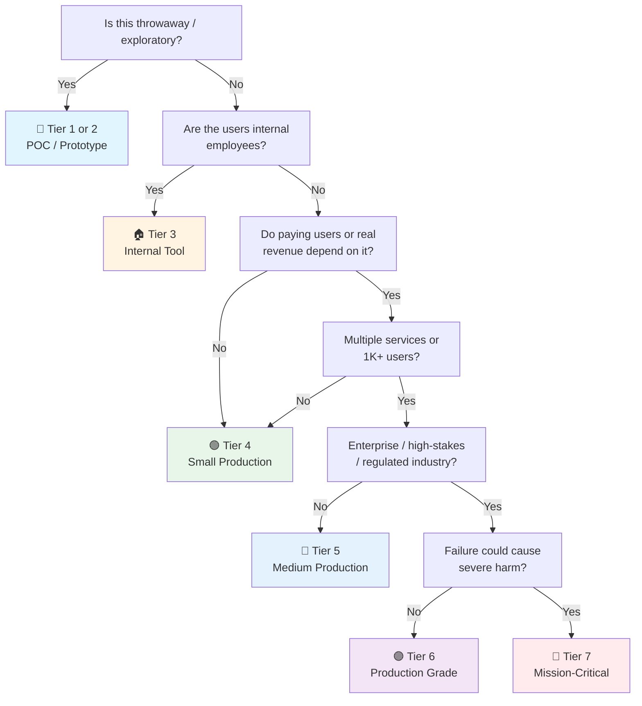

# NestJS API Checklist

> Last updated: 2026-08-05
> NestJS-specific companion to [[api]]. Tick the general checklist first. Assumes TypeScript + Express (default) or Fastify.

---

## Project Setup

- [ ] **`@nestjs/cli`** — `nest new project --strict`. TypeScript strict mode on.
- [ ] **`tsconfig.json`** — `strict: true`, `noUncheckedIndexedAccess`, `noUnusedLocals`, `paths` for `@/` aliases.
- [ ] **ESLint + Prettier** — `@nestjs/eslint-config`. Pre-commit: `lint-staged` + `husky`.
- [ ] **SWC builder** — `@nestjs/swc`. Faster than tsc. Swap in `nest-cli.json`. Or Bun/Vite for extreme speed.

---

## Module Structure

```
src/
├── common/            ← guards, interceptors, pipes, filters, decorators
├── config/            ← `@nestjs/config` module + validation
├── database/          ← TypeORM/Prisma module
├── modules/
│   ├── user/          ← controller, service, repository, dto, entity, module
│   └── order/
├── app.module.ts
└── main.ts
```

- [ ] **Feature modules** — each domain is a `@Module({ imports, controllers, providers, exports })`. No god module.
- [ ] **`AppModule` imports feature modules** — nothing else. `main.ts` bootstraps `AppModule`.
- [ ] **No circular imports** — `forwardRef(() => Module)` only as last resort. Usually means cross-cutting logic needs extracting.

---

## `main.ts` Bootstrapping

- [ ] **Global pipes** — `app.useGlobalPipes(new ValidationPipe({ whitelist: true, forbidNonWhitelisted: true, transform: true }))`
- [ ] **Global filters** — `app.useGlobalFilters(new HttpExceptionFilter())` for consistent error shape.
- [ ] **Global interceptors** — `ClassSerializerInterceptor` + `@Exclude()/@Expose()` on entities.
- [ ] **Global prefix** — `app.setGlobalPrefix('api/v1')`.
- [ ] **CORS** — `app.enableCors({ origin: config.cors.origins })`. Specific origins, not `*`.
- [ ] **Shutdown hooks** — `app.enableShutdownHooks()`. Gracefully closes DB connections, message brokers.
- [ ] **Versioning** — `app.enableVersioning({ type: VersioningType.URI })` or `Header` type.

---

## Controllers

- [ ] **`@Controller('users')`** — route prefix on class. Method decorators: `@Get(':id')`, `@Post()`, `@Patch(':id')`, `@Delete(':id')`.
- [ ] **DTOs with validation** — `class CreateUserDto { @IsEmail() email: string; @MinLength(8) password: string; }`
- [ ] **`@UseGuards(JwtAuthGuard)`** — on class or method. `@Public()` decorator for unauthenticated routes.
- [ ] **`@ApiTags`, `@ApiOperation`, `@ApiResponse`** — Swagger decorators. Not on every method if verbose, but on every controller.
- [ ] **Controller is thin** — parse request into DTO → call service → transform response DTO. No business logic.

---

## Providers & DI

- [ ] **Services are `@Injectable()`** — injected via constructor. `constructor(private userService: UserService) {}`
- [ ] **Repository pattern** — `@Injectable()` repository class wrapping TypeORM `Repository<T>` or Prisma client. Injected into services.
- [ ] **Custom providers** — `useFactory`, `useClass`, `useValue` for non-class dependencies (config objects, third-party clients).
- [ ] **`@Inject()`** only for custom tokens — constructor injection with class types doesn't need it.

---

## Validation & Transformation

- [ ] **`class-validator` decorators** — `@IsString()`, `@IsInt()`, `@IsEnum()`, `@IsOptional()`, `@ValidateNested()`. On every DTO field.
- [ ] **`class-transformer`** — `@Type(() => NestedDto)` for nested objects. `@Transform()` for custom transforms.
- [ ] **ValidationPipe global** — `whitelist: true` (strip unknown), `forbidNonWhitelisted: true` (error on unknown), `transform: true` (auto-type).
- [ ] **Custom validators** — `@ValidatorConstraint()`. For domain rules beyond built-in decorators.
- [ ] **Validation groups** — `@ValidateIf()` or separate DTOs for create vs update. Groups get confusing — separate DTOs are simpler.

---

## Database (TypeORM / Prisma)

- [ ] **TypeORM** — `@nestjs/typeorm`. `TypeOrmModule.forRootAsync()` with config. `@Entity()` classes. Repository pattern via `@InjectRepository()`.
- [ ] **Prisma** — `PrismaService extends PrismaClient implements OnModuleInit`. `@Injectable()` singleton. No extra repository layer needed — Prisma IS the repository.
- [ ] **`onModuleInit`** — `await this.$connect()` in Prisma service. `onModuleDestroy` — `await this.$disconnect()`.
- [ ] **Migrations** — TypeORM: `typeorm migration:generate`. Prisma: `prisma migrate dev`. Versioned, committed.
- [ ] **Transactions** — TypeORM: `dataSource.transaction()`. Prisma: `prisma.$transaction()`. Interactive transactions for complex logic.
- [ ] **Connection pool** — TypeORM: `extra: { max: 20 }`. Prisma: `connection_limit` in datasource URL.

---

## Authentication & Authorization

- [ ] **`@nestjs/passport` + `@nestjs/jwt`** — `PassportModule`, `JwtModule.registerAsync()`. `JwtStrategy extends PassportStrategy(Strategy)`.
- [ ] **`JwtAuthGuard`** — `extends AuthGuard('jwt')`. Applied globally via `APP_GUARD`.
- [ ] **`@Public()` decorator** — `SetMetadata('isPublic', true)`. Custom guard checks `Reflector` to skip auth on public routes.
- [ ] **`@Roles('admin')`** — `RolesGuard` checks roles from JWT. Combined with `@UseGuards(JwtAuthGuard, RolesGuard)`.
- [ ] **`@CurrentUser()` decorator** — `createParamDecorator((_, ctx) => ctx.switchToHttp().getRequest().user)`. Type-safe user extraction.

---

## Error Handling

- [ ] **Custom exception filter** — `@Catch() implements ExceptionFilter`. Catches `HttpException` + unknown errors. Returns `{ statusCode, message, timestamp, path }`.
- [ ] **`NotFoundException` over generic errors** — `throw new NotFoundException('User not found')`.
- [ ] **Domain exceptions** — `throw new BadRequestException('Insufficient balance')`. NestJS maps to 400.
- [ ] **No stack traces in production** — `exceptionFilter` checks `NODE_ENV` before including stack.

---

## Configuration

- [ ] **`@nestjs/config`** — `ConfigModule.forRoot({ isGlobal: true, validate })`. `ConfigService` injected, never `process.env` directly.
- [ ] **Config validation** — `Joi` or `class-validator` on config object. `validate(config)` throws on missing/invalid env vars at startup. Fail fast.
- [ ] **`.env` gitignored** — `.env.example` committed with dummy values.
- [ ] **`registerAs`** for namespaced config — `database.config.ts`, `auth.config.ts`. `@Inject(databaseConfig.KEY)`.

---

## Logging

- [ ] **`Logger` from `@nestjs/common`** — `private readonly logger = new Logger(UserService.name)`. Class-scoped.
- [ ] **Custom logger** — `NestFactory.create(AppModule, { logger: new MyLogger() })`. Pino or Winston via adapter.
- [ ] **Request logging** — `morgan` middleware or custom interceptor. `:method :url :status :response-time ms`.
- [ ] **No secrets in logs** — filter out `password`, `token`, `authorization` from request/response logging.

---

## Testing

- [ ] **Jest** — `@nestjs/testing`. `Test.createTestingModule({ imports: [], providers: [] }).compile()`.
- [ ] **Unit tests** — services with mocked repositories. `jest.fn()` or `jest-mock-extended`. Fast, parallel.
- [ ] **Controller tests** — `app = module.createNestApplication().init()`. `supertest(app.getHttpServer())`. Real HTTP, no server listen.
- [ ] **E2E tests** — full app with test DB. `beforeAll` starts app + runs migrations. `afterAll` closes.
- [ ] **`@golevelup/ts-jest`** — `createMock<Repository<User>>()`. Cleaner than manual `jest.fn()` for complex mocks.
- [ ] **Test DB** — Docker `postgres:16-alpine` via Testcontainers. Not SQLite (different dialect).

---

## Swagger / OpenAPI

- [ ] **`@nestjs/swagger`** — `SwaggerModule.createDocument(app, config)`. `SwaggerModule.setup('api/docs', app, document)`.
- [ ] **`@ApiProperty()` on DTOs** — type, example, description, required/optional. This IS your API documentation.
- [ ] **`@ApiBearerAuth()`** — marks endpoints needing JWT. Global via `addBearerAuth()` in swagger config.
- [ ] **`@ApiTags('Users')` on controllers** — groups endpoints in Swagger UI.

---

## Performance

- [ ] **Compression** — `compression` middleware via `app.use(compression())`.
- [ ] **Helmet** — `app.use(helmet())`. Security headers.
- [ ] **Rate limiting** — `@nestjs/throttler`. `ThrottlerModule.forRoot({ ttl: 60, limit: 100 })`. `@Throttle()` or `@SkipThrottle()`.
- [ ] **Fastify** — `NestFactory.create(AppModule, new FastifyAdapter())`. Faster than Express. `@nestjs/platform-fastify`.
- [ ] **Clustering** — `cluster` module (Node) or PM2. Use worker threads if CPU-bound.

---

## AI/LLM Integration (if applicable)

> **When you need it:**
> 🤖 **NestJS service calling an LLM** (OpenAI, Anthropic, local models, RAG pipelines) — ✅ mandatory.
> 🧱 **Pure CRUD NestJS API with no AI features** — ❌ skip this section.

- [ ] **Library choice** — `openai` (official SDK, TypeScript-native), `@langchain/community` + `langchain` for orchestration/chains, `@xenova/transformers` for local inference, or `@ai-sdk/core` (Vercel AI SDK) for streaming UI patterns. Pick one — don't mix.
- [ ] **LLM service as `@Injectable()` provider** — Wrap LLM calls in a dedicated service (e.g., `AiService`). Inject via DI so it's mockable in tests. Never call the SDK directly from controllers.
- [ ] **Prompt injection prevention** — Never concatenate `req.body` into system prompts. Use template literals with explicit delimiter boundaries. Sanitize user input before it reaches any prompt template. If using function calling / tool use: validate every argument server-side before executing the tool.
- [ ] **Output validation & sanitization** — LLM output is non-deterministic. Use OpenAI's `response_format: { type: 'json_object' }` or structured output with Zod schemas. Validate parsed output before returning to the client. Sanitize before rendering (XSS).
- [ ] **Token cost controls** — Track `usage.total_tokens` per call via a NestJS interceptor or decorator. Set per-user budgets in Redis (`@nestjs/cache-manager`). Use `@nestjs/throttler` on LLM endpoints — token-based, not just request-count.
- [ ] **Model fallback via `HttpService`** — Wrap LLM calls with circuit breaker (`@nestjs/terminus` or `opossum`). Fallback to a smaller/cheaper model on failure. Return a degraded response, not a 500. Cache frequent identical queries with `@nestjs/cache-manager` (semantic cache for near-matches).
- [ ] **Streaming with `@Sse()` decorator** — Use `@Sse('stream')` for server-sent events streaming LLM output. Handle client disconnect: cancel the LLM call to stop burning tokens. Set timeout on first token. Return partial response on premature close.
- [ ] **RAG pipeline** — `@nestjs/terminus` health check on vector DB (pgvector, Qdrant, Pinecone). Ground responses in retrieved documents. Cite sources. Log retrieval context alongside generated output for debugging.
- [ ] **Content safety** — Use OpenAI Moderation API or custom filters before sending user input to the model. Redact PII from prompts. Screen output for toxicity/harmful content before returning.
- [ ] **LLM-specific observability** — Log via NestJS `Logger`: model, prompt template version, token counts (in/out), latency, cost per call. Trace the full chain: request → retrieval → prompt assembly → model call → validation → response. A/B test prompt versions.
- [ ] **PII in prompts** — Know what sensitive data leaves your infrastructure. Strip PII before sending to third-party LLMs. Use `@nestjs/config` for data processing agreement metadata. Consider `@xenova/transformers` for on-prem inference on sensitive workloads.

---

## Data Privacy & Compliance

> **When you need it:**
> 🌍 **NestJS service handling user data** — ✅ mandatory if you have users in EU (GDPR), California (CCPA/CPRA), Brazil (LGPD).
> 🏥 **Healthcare/financial data** — ✅ mandatory (HIPAA, PCI-DSS).
> 🔧 **Internal-only tools with no user PII** — 🟡 review, likely lighter.

- [ ] **PII masking with NestJS Logger** — Custom `LoggerService` implementation that redacts PII fields before writing. Use `class-transformer` `@Exclude()` on DTOs that go to logs. Audit log configurations quarterly — a new `this.logger.log(user)` can leak PII silently.
- [ ] **`ClassSerializerInterceptor` for response sanitization** — Already in bootstrapping. Ensure `@Exclude()` is on every PII field in entities. Use `@Groups()` to expose different fields per role (admin sees email, public doesn't).
- [ ] **Right to erasure service** — Dedicated `DataErasureService` (`@Injectable()`) that cascades deletes across all repositories, caches (`CacheManager`), and search indexes. Soft delete alone does NOT satisfy GDPR Article 17. Expose as admin endpoint with audit trail.
- [ ] **Right to access (data export)** — `UserDataExportService` that aggregates all user data from every repository into a machine-readable JSON/CSV. Must complete within 30 days. Automated pipeline preferred.
- [ ] **Consent tracking module** — Dedicated `ConsentModule` with entity tracking what the user consented to (marketing, analytics, third-party sharing). Granular consent. Withdrawal as easy as granting. Audit trail: who, what, when, how.
- [ ] **Data retention via `@nestjs/schedule`** — `@Cron()` jobs that purge expired records per retention policy. Define retention periods per data type in `@nestjs/config`. Don't keep data "just in case."
- [ ] **Audit trail interceptor** — Custom interceptor that logs who accessed whose data, when, and why. Append-only audit log (separate `AuditLogEntity`). Retained longer than operational logs.
- [ ] **`@nestjs/config` for DPAs** — Store data processing agreement metadata in config. Every third-party service that touches user data has a signed DPA tracked in config/DB.
- [ ] **Breach notification procedure** — Documented incident response. GDPR: 72 hours to notify authority. NestJS health check (`@nestjs/terminus`) includes data integrity checks.
- [ ] **Encryption** — TLS for all data in transit. Encryption at rest for PII databases (AES-256). Consider field-level encryption via custom `ValueTransformer` in TypeORM or Prisma middleware for highly sensitive fields.
- [ ] **Data minimization in DTOs** — Only collect fields you actually use. Review DTOs quarterly — are you still using that field? If not, remove from DTO and stop collecting. Use `whitelist: true` in `ValidationPipe` to enforce.

---

## Quick Sanity Check

- [ ] `ValidationPipe` global with `whitelist` and `transform` — no unexpected fields, auto-typed
- [ ] `JwtAuthGuard` global (or on protected routes via controller-level)
- [ ] `@Public()` decorator works — health/login/register accessible without token
- [ ] `enableShutdownHooks()` called — graceful DB disconnect on SIGTERM
- [ ] `ConfigModule` validates at startup — missing `DATABASE_URL` fails fast, not at first request
- [ ] Error filter returns consistent `{ statusCode, message, timestamp, path }`
- [ ] Swagger UI at `/api/docs` (dev only or gated behind basic auth in prod)
- [ ] Migrations committed + run automatically in CI/CD — no `synchronize: true` in prod
- [ ] `.env` not committed, `.env.example` is

---

## Sources

- NestJS docs — https://docs.nestjs.com/
- `[[api]]` — general API checklist (tick first)
- `[[03 Authentication]]`, `[[03 API Security]]` — auth patterns

---

## Project Tier Scoping Matrix

> **How to use this table:** Pick your tier first, then focus only on the sections marked ✅ (required) or 🟡 (recommended). Skip ❌ sections entirely — they'd be over-engineering for your NestJS context.
>
> **Legend:** ✅ Required · 🟡 Recommended / partial · ❌ Skip

### Tier Descriptions

| # | Tier | Description | Typical Team | Users | Lifespan |
|---|---|---|---|---|---|
| 1 | 🧪 **POC / Spike** | Validate an idea. Throwaway code. `console.log` is fine. | 1 dev | Internal only | Days–weeks |
| 2 | 🔧 **Prototype / MVP** | Waiting for integration or user validation. Might become real. | 1–2 devs | Beta testers | Weeks–months |
| 3 | 🏠 **Internal Tool** | Real users (employees), real traffic. No external exposure or paying customers. | 1–3 devs | Employees | Ongoing |
| 4 | 🟢 **Small Production** | Single NestJS service, few endpoints, low traffic. Real users, maybe early revenue. | 1–2 devs | < 1K users | Ongoing |
| 5 | 🔵 **Medium Production** | Multiple NestJS modules or higher traffic. Real revenue or user base that matters. | 2–5 devs | 1K–100K users | Ongoing |
| 6 | 🟣 **Production Grade** | Full rigor — high-stakes SaaS, enterprise product, or large user base. | 5+ devs | 100K+ users | Long-term |
| 7 | 🔴 **Mission-Critical / Regulated** | Healthcare (HIPAA), finance (PCI-DSS), safety systems. Failure = severe harm. | 10+ devs | Varies | Decades |

### Which Tier Am I?



### Checklist Applicability by Tier

| # | Section | 🧪 POC | 🔧 Prototype | 🏠 Internal | 🟢 Small Prod | 🔵 Medium Prod | 🟣 Production Grade | 🔴 Mission-Critical |
|---|---|:---:|:---:|:---:|:---:|:---:|:---:|:---:|
| 1 | Project Setup (`@nestjs/cli`, tsconfig, ESLint) | 🟡 | ✅ | ✅ | ✅ | ✅ | ✅ | ✅ |
| 2 | Module Structure (feature modules, DI) | ❌ | 🟡 | ✅ | ✅ | ✅ | ✅ | ✅ |
| 3 | `main.ts` Bootstrapping (pipes, filters, CORS) | 🟡 basic | 🟡 | ✅ | ✅ | ✅ | ✅ | ✅ |
| 4 | Controllers (DTOs, guards, Swagger) | 🟡 basic REST | 🟡 | ✅ | ✅ | ✅ | ✅ | ✅ |
| 5 | Providers & DI (services, repositories) | 🟡 | ✅ | ✅ | ✅ | ✅ | ✅ | ✅ |
| 6 | Validation & Transformation (class-validator) | 🟡 | 🟡 | ✅ | ✅ | ✅ | ✅ | ✅ |
| 7 | Database (TypeORM/Prisma, migrations) | 🟡 SQLite OK | 🟡 | ✅ | ✅ | ✅ | ✅ | ✅ |
| 8 | Auth & Authorization (Passport, JWT, RBAC) | ❌ | 🟡 basic JWT | ✅ | ✅ | ✅ | ✅ | ✅ |
| 9 | Error Handling (filters, exceptions) | 🟡 basic | ✅ | ✅ | ✅ | ✅ | ✅ | ✅ |
| 10 | Configuration (`@nestjs/config`, validation) | ❌ | 🟡 .env only | ✅ | ✅ | ✅ | ✅ | ✅ |
| 11 | Logging (Logger, request logging) | ❌ `console.log` | 🟡 structured | ✅ | ✅ + tracing | ✅ + dashboards | ✅ + SLO | ✅ + full stack |
| 12 | Testing (Jest, unit, E2E) | ❌ maybe smoke | 🟡 unit | ✅ | ✅ + E2E | ✅ + load | ✅ + chaos | ✅ + formal |
| 13 | Swagger / OpenAPI (`@nestjs/swagger`) | ❌ | 🟡 basic | ✅ | ✅ | ✅ | ✅ | ✅ |
| 14 | Performance (compression, throttler, Fastify) | ❌ | ❌ | 🟡 cache | ✅ | ✅ | ✅ | ✅ + capacity |
| 15 | AI/LLM Integration | 🟡 if AI is the POC | 🟡 | 🟡 if used | ✅ if used | ✅ | ✅ + guardrails | ✅ + audit trail |
| 16 | Data Privacy & Compliance | ❌ | ❌ | 🟡 PII masking | ✅ erasure | ✅ + consent + DPA | ✅ full | ✅ + regulatory |

