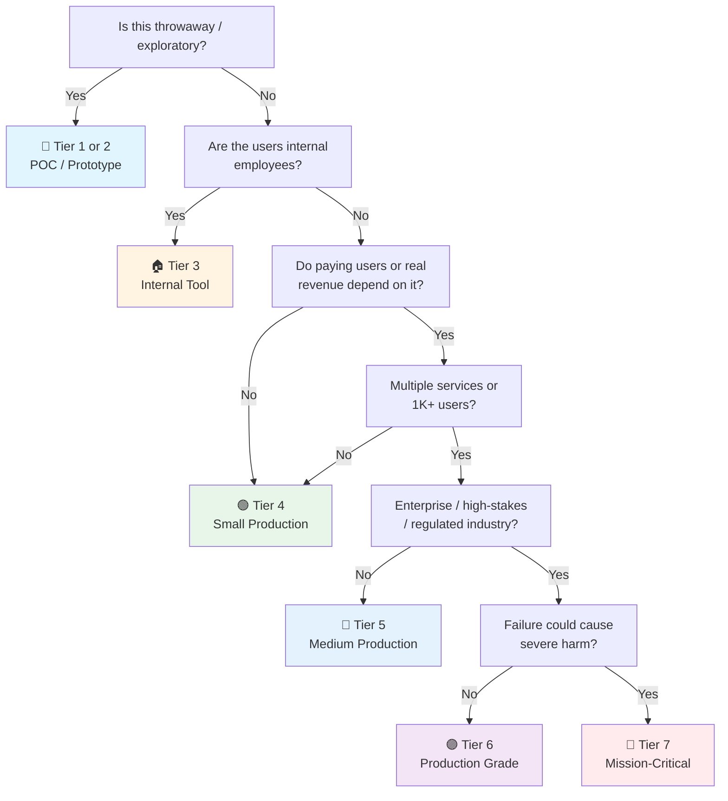

# Rust + Axum API Checklist

> Rust + Axum companion to [[api]]. Tick the general checklist first. Axum is built on tokio + tower + hyper — the standard Rust async stack.
> Last updated: 2026-08-05

---

## Project Setup

- [ ] **Rust toolchain** — `rustup default stable`. `cargo new project-name`
- [ ] **Dependencies** — `Cargo.toml`:
```toml
[dependencies]
axum = "0.8"
tokio = { version = "1", features = ["full"] }
serde = { version = "1", features = ["derive"] }
serde_json = "1"
tower-http = { version = "0.6", features = ["cors", "trace", "compression", "limit"] }
sqlx = { version = "0.8", features = ["runtime-tokio", "postgres"] }
tracing = "0.1"
tracing-subscriber = { version = "0.3", features = ["json", "env-filter"] }
```
- [ ] **Clippy** — `cargo clippy -- -D warnings`. Strict linting. CI gate.
- [ ] **`rustfmt`** — `rustfmt.toml` at project root. `edition = "2021"`, `max_width = 120`.
- [ ] **`cargo-watch`** — `cargo install cargo-watch`. `cargo watch -x run` for dev hot-reload.
- [ ] **`.cargo/config.toml`** — `[build] rustflags = ["-D", "warnings"]`. No warnings in CI.

---

## Project Structure

```
src/
├── main.rs              ← Bootstrap. Tokio runtime. Router. Shutdown.
├── config.rs            ← Config loading + validation (envy/config crate)
├── error.rs             ← AppError type + IntoResponse impl
├── router.rs            ← All route definitions. Thin — calls handlers.
├── handlers/
│   ├── mod.rs
│   ├── users.rs         ← Extractors → service → response
│   └── orders.rs
├── services/
│   ├── mod.rs
│   ├── users.rs         ← Business logic. No HTTP concerns.
│   └── orders.rs
├── repositories/
│   ├── mod.rs
│   └── users.rs         ← SQL queries. Returns domain types.
├── models/
│   ├── mod.rs
│   ├── user.rs          ← Domain types + serde DTOs
│   └── order.rs
└── middleware/
    ├── mod.rs
    └── auth.rs          ← JWT extraction layer
```

- [ ] **`main.rs` is thin** — creates router, starts server, handles shutdown signal. ~30 lines.
- [ ] **`lib.rs` if integration tests needed** — `pub mod` all modules. Integration tests import `use crate::`.

---

## Axum App Setup

- [ ] **Tokio runtime** — `#[tokio::main]`. Multi-threaded by default. Work-stealing scheduler.
- [ ] **Router** — `axum::Router::new().route("/api/v1/users", get(handlers::users::list))`.
- [ ] **Nest routers by domain** — `let app = Router::new().nest("/api/v1/users", users::router()).nest("/api/v1/orders", orders::router())`.
- [ ] **State** — `axum::extract::State`. `Arc<AppState>` shared across handlers. Contains DB pool, config. `Router::new().with_state(state)`.
- [ ] **Shutdown** — `axum::serve(listener, app).with_graceful_shutdown(shutdown_signal())`. Catch SIGTERM.
- [ ] **Graceful period** — `tokio::select!` between server and shutdown signal. Drain connections within timeout.

---

## Extractors (Request Parsing)

- [ ] **`axum::Json<T>`** — parses JSON body. `Json(payload): Json<CreateUserRequest>`. Returns 400 on parse failure.
- [ ] **`axum::extract::Path<T>`** — `Path(id): Path<i64>`. Returns 400 on parse failure.
- [ ] **`axum::extract::Query<T>`** — `Query(params): Query<PaginationParams>`. Query string params.
- [ ] **`axum::extract::State`** — `State(state): State<Arc<AppState>>`. Shared application state.
- [ ] **Custom extractors** — `impl FromRequestParts<S> for CurrentUser`. Type-safe, reusable auth extraction.
- [ ] **`axum::extract::Request`** — raw request when needed (middleware compatibility checks).

---

## Responses

- [ ] **`impl IntoResponse`** — handlers return types implementing `IntoResponse`. `Json` for JSON, `StatusCode` for empty, `Html` for templates.
- [ ] **`(StatusCode, Json<T>)`** — explicit status + body. `(StatusCode::CREATED, Json(user))`.
- [ ] **Error responses** — custom `AppError` enum. `impl IntoResponse for AppError`. Maps variants to status codes.
- [ ] **Pagination wrapper** — `Json(PaginatedResponse { data, total, page, total_pages })`.

---

## Error Handling

- [ ] **`AppError` enum** — variants: `NotFound`, `BadRequest`, `Unauthorized`, `Forbidden`, `Internal`.
- [ ] **`impl IntoResponse for AppError`** — single place mapping errors to HTTP responses. Consistent shape: `{ "error": { "code": "NOT_FOUND", "message": "..." } }`.
- [ ] **`impl From<sqlx::Error> for AppError`** — auto-convert DB errors. `RowNotFound` → `AppError::NotFound`.
- [ ] **`impl From<validator::ValidationErrors> for AppError`** — validation errors → 400 with field-level messages.
- [ ] **500 catch-all** — `impl From<anyhow::Error> for AppError` for truly unexpected errors. Log the full error, return sanitized message.

---

## Validation

- [ ] **`validator` crate** — `#[derive(Validate)]` on request DTOs. `#[validate(email)]`, `#[validate(length(min = 8))]`.
- [ ] **Validate in handler** — `payload.validate().map_err(AppError::from)?`. Early return on invalid input.
- [ ] **Custom validators** — `#[validate(custom(function = "validate_password_strength"))]`. Pure functions, unit-testable.

---

## Database (sqlx)

- [ ] **sqlx** over Diesel — sqlx is query-first (write SQL, get typed results). Diesel is ORM-first (DSL, more magic). sqlx is simpler.
- [ ] **`sqlx::PgPool`** — connection pool created once in `main.rs`. `Arc<AppState>` holds it. `PgPool::connect(&config.database_url).await?`.
- [ ] **`sqlx::query_as!(T, ...)`** — compile-time checked SQL. Column names/types validated against DB at build time (requires `DATABASE_URL` env).
- [ ] **`sqlx::query_as::<_, T>(...)`** — runtime-checked. Works without compile-time DB access. Slower compile, same safety at runtime.
- [ ] **Migrations** — `sqlx migrate run`. `.sql` files in `migrations/`. Committed. Run in `main()` before binding listener.
- [ ] **Transactions** — `pool.begin().await?`. `tx.commit().await?`. Auto-rollback on drop if not committed.
- [ ] **Connection pool** — `PgPoolOptions::new().max_connections(20).connect(...)`. Tune per instance.

---

## Authentication (JWT)

- [ ] **jsonwebtoken crate** — `encode`, `decode`. `Header`, `Validation`. RS256 (private key on auth server, public key on resource servers).
- [ ] **Auth middleware** — `axum::middleware::from_fn_with_state(auth::require_auth)`. Runs before handlers. Extracts JWT → validates → injects claims into request extensions.
- [ ] **`CurrentUser` extractor** — `impl FromRequestParts<S> for CurrentUser`. Reads claims from request extensions. Fails 401 if missing.
- [ ] **`RequireRole` extractor** — `RequireRole("admin")`. Like `CurrentUser` but checks role. Returns 403.
- [ ] **Public routes** — auth middleware applied only on protected `Router::nest()` groups, not globally. Health, login are public.

---

## Middleware (tower-http)

- [ ] **CORS** — `tower_http::cors::CorsLayer`. `allow_origin(config.cors_origins)`. `allow_methods`, `allow_headers`.
- [ ] **Compression** — `tower_http::compression::CompressionLayer`. Gzip + Brotli. `compress_br()` for modern browsers.
- [ ] **Request body limit** — `tower_http::limit::RequestBodyLimitLayer::new(10 * 1024 * 1024)`. Applied per-route or globally.
- [ ] **Tracing** — `tower_http::trace::TraceLayer`. Request ID, method, path, status, latency. `on_request`, `on_response`, `on_failure`.
- [ ] **Sensitive headers** — `TraceLayer` defaults to redacting `authorization` and `cookie`. Good. Keep it.
- [ ] **Timeout** — `tower_http::timeout::TimeoutLayer::new(Duration::from_secs(30))`. Per-request timeout.
- [ ] **Rate limiting** — `tower_governor` crate. Per-IP or per-token. Redis backend for multi-instance.

---

## Logging (tracing)

- [ ] **tracing subscriber** — `tracing_subscriber::fmt().json().with_env_filter("info").init()`. JSON in production.
- [ ] **`tracing::instrument`** — `#[instrument(skip(pool))]` on handlers. Auto-logs function entry/exit, args, return. `skip` for sensitive params.
- [ ] **Span context** — request ID, user ID in span. `tracing::Span::current().record("user_id", user.id)`.
- [ ] **`tracing::info!` / `error!` / `warn!`** — structured fields: `info!(user_id = %id, "User created")`. No string interpolation for fields.
- [ ] **Redact secrets** — never log tokens, passwords, API keys. Skip via `#[instrument(skip(password))]`.

---

## Testing

- [ ] **Unit tests** — `#[cfg(test)] mod tests { ... }`. Inline with source. `cargo test`.
- [ ] **Handler tests** — `axum::body::Body`, `axum::http::Request`. `router.oneshot(request).await`. No real server. Fast.
- [ ] **Integration tests** — `tests/` directory. Full app with test DB. `sqlx::migrate!()` in test setup.
- [ ] **Test utilities** — `tests/common/mod.rs`. `async fn test_app() -> (Router, PgPool)`. Shared across integration tests.
- [ ] **`rstest`** — `use rstest::rstest`. Fixtures, parameterized tests. Cleaner than manual `test_case` macros.
- [ ] **`fake` crate** — `use fake::Fake`. Generate realistic test data. `let user: UserParams = fake::Faker.fake()`.

---

## Observability

- [ ] **OpenTelemetry** — `tracing-opentelemetry` layer. Traces exported to OTel collector. W3C trace context propagation.
- [ ] **Metrics** — `tower_http::metrics` or custom middleware. Count requests, errors, latency histograms. Prometheus endpoint on `/metrics`.
- [ ] **Health check** — `axum::Router::new().route("/health", get(|| async { StatusCode::OK }))`. Separate router or path.

---

## Build & Deploy

- [ ] **Release profile** — `[profile.release] lto = true`, `codegen-units = 1`, `opt-level = 3`. Binary size vs compile time trade-off.
- [ ] **`cargo build --release`** — single static binary. No runtime needed (unlike Go, Rust has no GC).
- [ ] **Docker** — Multi-stage: `rust:slim` build, `debian:slim` runtime (need libssl, ca-certificates). Or `FROM scratch` if `tokio` doesn't need libssl.
- [ ] **`dockerignore`** — `target/`, `.git/`. Otherwise context is huge (Rust `target/` can be 10GB+).
- [ ] **sccache** — `cargo install sccache`. Speeds up CI builds 2-3x. Configured in `.cargo/config.toml`.

---

## AI/LLM Integration (if applicable)

> **When you need it:**
> 🤖 **Any Rust service calling an LLM** (OpenAI, Anthropic, local models via Ollama, RAG pipelines) — ✅ mandatory. LLMs are untrusted downstream systems with non-deterministic output, token costs, and prompt injection attack surface.
> 🧱 **Pure CRUD with no AI features** — ❌ skip this section.

- [ ] **HTTP client for LLM APIs** — `reqwest` with `json` and `rustls-tls` features. Async, connection pooling, timeout support. Wrap calls in a dedicated `LlmClient` struct — don't scatter `reqwest::post` across handlers.
- [ ] **Ollama integration (local models)** — `ollama-rs` crate for local/self-hosted models. Same client pattern as external APIs. Useful for sensitive workloads where data cannot leave infrastructure.
- [ ] **Structured output parsing** — LLM returns JSON → parse into typed Rust structs with `serde_json::from_str::<T>()`. Validate with the same `validator` crate used for API inputs. Reject malformed output, don't silently default.
- [ ] **Prompt injection prevention** — Never `format!()` user input directly into system prompts. Use a template struct with explicit field separation. Treat LLM output as untrusted — never pass it to `std::process::Command`, never interpolate into SQL (always parameterize via `sqlx`).
- [ ] **Token cost controls** — Track `prompt_tokens` + `completion_tokens` from API response metadata. Per-request and per-user budgets via middleware or service-layer check. Alert on anomalous spend (runaway retry, injection inflating context). Cap context window — don't send 128k tokens when 4k suffices.
- [ ] **Streaming responses** — `reqwest` streaming with `bytes_stream()`. Forward via Axum `Sse` (Server-Sent Events) or WebSocket. Backpressure: if client disconnects, cancel the upstream `reqwest` future (tokio `select!` with a cancellation token). Timeout on first token to detect stalled generation.
- [ ] **Model fallback & degradation** — Primary model rate-limited or down? Circuit breaker (see `tower_governor` or custom) around LLM calls. Fallback to cheaper/smaller model, not a 500. Cache frequent identical queries (semantic hash or exact match in Redis). Return "AI unavailable" with degraded/static result instead of failing the whole request.
- [ ] **Hallucination guardrails (RAG)** — Ground responses in retrieved documents. Cite sources with verifiable references (document ID + chunk offset). Log retrieval context alongside generated output in a separate tracing field for debugging. "I don't know" is a valid output — engineer prompts to prefer refusal over fabrication.
- [ ] **Content safety & moderation** — Input filtering before the model sees it (regex + domain blocklist). Output filtering: PII redaction via regex or a dedicated crate before returning to user. Use provider guardrails (OpenAI moderation endpoint) plus your own domain rules.
- [ ] **LLM-specific observability** — `tracing::info!` with structured fields: `model`, `prompt_template_version`, `tokens_in`, `tokens_out`, `latency_ms`, `cost_usd`. Never log the full prompt/response in production — hash or truncate. A/B test prompt versions via a feature flag.
- [ ] **Data sent to external models** — Know what PII leaves your infrastructure. Strip or anonymize before sending. For sensitive workloads, use self-hosted models (Ollama) behind the same `LlmClient` interface. Log what was sent (audit trail) but redact in log storage.

## Data Privacy & Compliance

> **When you need it:**
> 🌍 **Any Rust service handling user data** — ✅ mandatory if you have users in EU (GDPR), California (CCPA/CPRA), Brazil (LGPD), or similar jurisdictions.
> 🏥 **Healthcare/financial data** — ✅ mandatory (HIPAA, PCI-DSS add stricter requirements on top).
> 🔧 **Internal-only tools with no user PII** — 🟡 review, likely lighter requirements.

- [ ] **PII masking in `tracing` logs** — Never log email, phone, full IP, names, addresses, or tokens in plain text. Use `#[instrument(skip(email, phone, ip))]` to exclude sensitive fields from spans. For fields that must be logged, hash them: `tracing::info!(user_email_hash = %sha256(email), "login")`. Audit `tracing` spans quarterly — a new `info!(user = ?user)` can leak PII silently.
- [ ] **Custom `tracing` layer for PII redaction** — Implement `tracing_subscriber::Layer` that intercepts events and redacts known PII field names before they reach the formatter. Centralized, not scattered across `skip` attributes. Pair with a `SENSITIVE_FIELDS` constant set.
- [ ] **`serde` skip/serialize_with for DTOs** — `#[serde(skip_serializing)]` on password hash fields. `#[serde(serialize_with = "redact_email")]` for response DTOs that include PII in admin contexts. Defense in depth — even if a handler accidentally serializes the full struct, PII is masked.
- [ ] **Right to erasure (hard delete)** — GDPR Article 17, CCPA. Implement a `delete_user_cascade` service method that touches every table, cache entry, search index, and object storage path. Soft delete (`deleted_at`) alone does NOT satisfy erasure. Verify deletion across: PostgreSQL, Redis, S3/MinIO, Elasticsearch, analytics (within retention window), and third-party processors (notify via API).
- [ ] **Right to access (data export)** — GDPR Article 15, CCPA. `export_user_data(user_id) -> UserDataExport` service method that aggregates from all repositories. Return machine-readable JSON/CSV. Automated pipeline preferred — manual `psql` extraction is error-prone and slow. Include data from all services (not just the primary DB).
- [ ] **Consent tracking** — `consent` table: `user_id`, `purpose` (marketing, analytics, third_party_sharing), `granted: bool`, `granted_at`, `revoked_at`. Granular, not all-or-nothing. Withdrawal as easy as granting. Audit trail: who, what, when, how. Cookie consent separate from data processing consent.
- [ ] **Data retention policies** — Retention periods per data type in config (`app.retention.user_data_months`, `app.retention.audit_log_months`). Background tokio task (`tokio::spawn` + `tokio::time::interval`) runs nightly purge: `DELETE FROM users WHERE deleted_at < NOW() - interval 'X months'`. Don't keep data "just in case." Document retention schedule.
- [ ] **Immutable audit log** — Separate `audit_log` table (append-only, no UPDATE/DELETE granted to app user). Log: `actor_id`, `action`, `target_user_id`, `timestamp`, `ip_hash`, `justification`. Retained longer than operational logs (7 years for financial, 2 years minimum). Required for compliance audits and breach investigation.
- [ ] **Data processing agreements (DPAs)** — Every third-party service that touches user data (SendGrid, Stripe, AWS, LLM providers) has a signed DPA. Review sub-processors list. Document in a `docs/dpa-registry.md` or similar — not just in legal's inbox.
- [ ] **Breach notification procedure** — GDPR: 72 hours to notify supervisory authority. Documented incident response plan. Runbook: detect → contain → assess scope → notify DPO → notify authority → notify affected users. Test annually. Contact list in the runbook, not in someone's head.
- [ ] **Encryption at rest & in transit** — TLS 1.3 for all data in transit (handled by reverse proxy or `rustls`). Encryption at rest for PII-containing databases (provider-managed or AES-256 with key in Vault). Field-level encryption for highly sensitive fields (SSN, health data) — wrap in a `EncryptedField<T>` newtype with `serde` serialize/deserialize that encrypts/decrypts transparently.
- [ ] **Data minimization** — Collect only what you need. Review data collection points quarterly — if a struct field isn't used, delete it from the DTO and the migration. Anonymize or pseudonymize where possible (hash user IDs in analytics tables).

---

## Quick Sanity Check

- [ ] `cargo clippy -- -D warnings` passes — no warnings in CI
- [ ] `cargo test` passes — all tests green
- [ ] `#[tokio::main]` — async runtime bootstrapped
- [ ] `axum::serve` with graceful shutdown — no dropped connections on SIGTERM
- [ ] `AppState` behind `Arc` — cheap clone, thread-safe
- [ ] `tower-http` middleware layered in correct order (`TraceLayer` first, `CorsLayer`, then `CompressionLayer`)
- [ ] `sqlx` migrations run at startup — `sqlx::migrate!().run(&pool).await?`
- [ ] JWT validation not trusting `alg: none` — `jsonwebtoken::Validation::default()` rejects it
- [ ] Error shape consistent — all errors return `{ "error": { "code": "...", "message": "..." } }`
- [ ] `tracing` JSON format in production — structured logs, not human-readable

---

## Sources

- Axum docs — https://docs.rs/axum/latest/axum/
- `[[api]]` — general API checklist (tick first)
- `[[03 Authentication]]`, `[[03 API Security]]` — auth patterns

---

## Project Tier Scoping Matrix

> **How to use this table:** Pick your tier first, then focus only on the sections marked ✅ (required) or 🟡 (recommended). Skip ❌ sections entirely — they'd be over-engineering for your context. This matrix adapts the general [API checklist](api.md) tiers to Rust + Axum specifics.
>
> **Legend:** ✅ Required · 🟡 Recommended / partial · ❌ Skip

### Tier Descriptions

| # | Tier | Description | Typical Team | Users | Lifespan |
|---|---|---|---|---|---|
| 1 | 🧪 **POC / Spike** | Validate an idea. Throwaway code. `println!()` is fine. | 1 dev | Internal only | Days–weeks |
| 2 | 🔧 **Prototype / MVP** | Waiting for integration or user validation. Might become real. | 1–2 devs | Beta testers | Weeks–months |
| 3 | 🏠 **Internal Tool** | Real users (employees), real traffic. No external exposure or paying customers. | 1–3 devs | Employees | Ongoing |
| 4 | 🟢 **Small Production** | Single Axum service, few endpoints, low traffic. Real users, maybe early revenue. | 1–2 devs | < 1K users | Ongoing |
| 5 | 🔵 **Medium Production** | Multiple services or higher traffic. Real revenue or user base that matters. | 2–5 devs | 1K–100K users | Ongoing |
| 6 | 🟣 **Production Grade** | Full rigor — high-stakes SaaS, enterprise product, or large user base. | 5+ devs | 100K+ users | Long-term |
| 7 | 🔴 **Mission-Critical / Regulated** | Healthcare (HIPAA), finance (PCI-DSS), safety systems. Failure = severe harm. | 10+ devs | Varies | Decades |

### Which Tier Am I?



### Rust + Axum Checklist Applicability by Tier

| # | Section | 🧪 POC | 🔧 Prototype | 🏠 Internal | 🟢 Small Prod | 🔵 Medium Prod | 🟣 Production Grade | 🔴 Mission-Critical |
|---|---|:---:|:---:|:---:|:---:|:---:|:---:|:---:|
| 1 | Project Setup | 🟡 minimal deps | ✅ | ✅ | ✅ | ✅ | ✅ | ✅ + audit |
| 2 | Project Structure | ❌ | 🟡 | ✅ | ✅ | ✅ | ✅ | ✅ |
| 3 | Axum App Setup | 🟡 basic router | ✅ | ✅ | ✅ | ✅ | ✅ | ✅ + shutdown |
| 4 | Extractors | 🟡 Json + Path | ✅ | ✅ | ✅ | ✅ | ✅ | ✅ |
| 5 | Responses | 🟡 basic | ✅ | ✅ | ✅ | ✅ | ✅ | ✅ |
| 6 | Error Handling | ❌ | 🟡 AppError | ✅ | ✅ | ✅ | ✅ | ✅ + formal |
| 7 | Validation | ❌ | 🟡 validator | ✅ | ✅ | ✅ | ✅ | ✅ |
| 8 | Database (sqlx) | 🟡 SQLite OK | 🟡 | ✅ | ✅ | ✅ | ✅ | ✅ + audit |
| 9 | Authentication (JWT) | ❌ | 🟡 basic | ✅ | ✅ | ✅ | ✅ | ✅ + rotation |
| 10 | Middleware (tower-http) | ❌ | 🟡 CORS + trace | ✅ | ✅ | ✅ | ✅ | ✅ + WAF |
| 11 | Logging (tracing) | ❌ `println!` | 🟡 structured | ✅ | ✅ + JSON | ✅ + OTel | ✅ + SLO | ✅ + full stack |
| 12 | Testing | ❌ maybe smoke | 🟡 unit + handler | ✅ | ✅ + integration | ✅ + load | ✅ + chaos | ✅ + formal |
| 13 | Observability | ❌ | ❌ | 🟡 health | ✅ + metrics | ✅ + tracing | ✅ + dashboards | ✅ + full |
| 14 | Build & Deploy | ❌ | 🟡 debug build | ✅ + release | ✅ + Docker | ✅ + CI/CD | ✅ + canary | ✅ + signed |
| 15 | AI/LLM Integration | 🟡 if AI is the POC | 🟡 | 🟡 if used | ✅ if used | ✅ | ✅ + guardrails | ✅ + audit trail |
| 16 | Data Privacy & Compliance | ❌ | ❌ | 🟡 PII masking | ✅ erasure + retention | ✅ + consent + DPA | ✅ full compliance | ✅ + regulatory framework |
