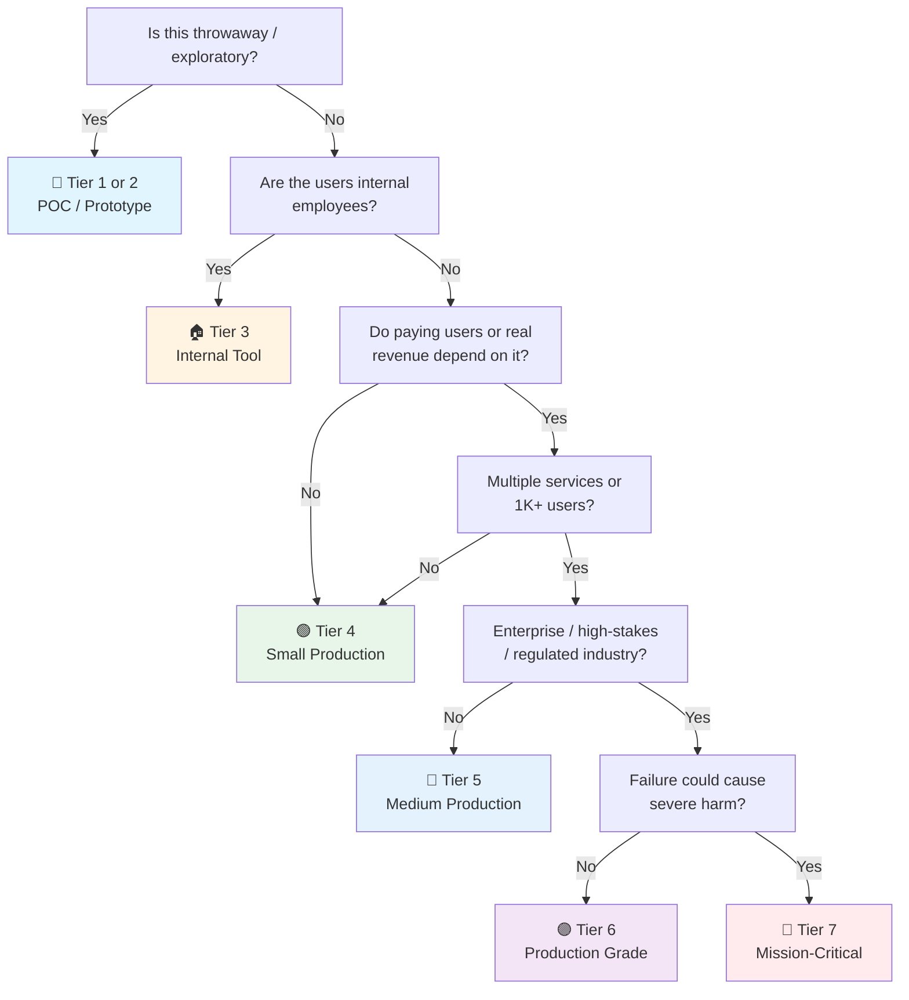

# Spring Boot API Checklist

> Spring Boot 4.x-specific companion to the general [Backend Checklist](api.md).
> Covers Boot 4.0+ (Spring Framework 7, Java 21+, modular starters, Security 7, Jackson 3).
> Last updated: 2026-08-05

---

## 1. Spring Boot Version & Bootstrapping

- [ ] **Spring Boot 4.x** — Built on Spring Framework 7. Boot 3.x is now legacy. Java 21 minimum (LTS), Java 25 for latest features. Virtual threads auto-configured.
- [ ] **Modular starters — new naming** — Boot 4 fully modularized. Key renames: `spring-boot-starter-web` → `spring-boot-starter-webmvc`. OAuth2 starters now prefixed `spring-boot-starter-security-oauth2-*`. Every tech has a companion test starter (`spring-boot-starter-*-test`).
- [ ] **Use `spring-boot-properties-migrator` on upgrade** — Add `spring-boot-properties-migrator` as `runtime` dependency during migration. It prints diagnostics and temporarily migrates deprecated properties. Remove after migration.
- [ ] **Starters, not manual deps** — `spring-boot-starter-webmvc` (or `-webflux`), `spring-boot-starter-data-jpa`, `spring-boot-starter-security`. Flyway and Liquibase now require their own starters: `spring-boot-starter-flyway` or `spring-boot-starter-liquibase`. Skip version tags — Boot manages them.
- [ ] **No Undertow** — Undertow doesn't support Servlet 6.1. Removed in Boot 4. Use Tomcat (default) or Jetty (`spring-boot-starter-jetty`).
- [ ] **No `@SpringBootApplication` abuse** — One class with `@SpringBootApplication` in the root package. Everything else scanned from there.
- [ ] **`@ConfigurationProperties` over `@Value`** — Type-safe, validated, testable. Boot 4: only binds to private fields with getters/setters (public field binding removed). `@ConfigurationProperties(prefix = "app.payment")`. `@Validated` on the class.
- [ ] **Profiles** — `application.yml` (defaults), `application-dev.yml`, `application-prod.yml`. Secrets NEVER in profiles. Use `spring.profiles.active` at runtime.
- [ ] **Build tool** — Maven or Gradle. `spring-boot-maven-plugin` or `bootJar` task. Use `spring-boot:build-image` (Cloud Native Buildpacks) for production images. Fully executable JAR scripts removed — use `java -jar` or Buildpacks instead.

## 2. Project Structure (Package-by-Feature, not by-Layer)

- [ ] **Package structuring that scales** — Avoid the `/controllers/`, `/services/`, `/repositories/` anti-pattern (becomes a mess at 20+ classes). Package by feature:

```
com.example.app/
├── user/
│   ├── User.java              ← entity
│   ├── UserController.java    ← REST endpoint
│   ├── UserService.java       ← business logic
│   ├── UserRepository.java    ← data access
│   └── UserDto.java           ← DTO
├── order/
│   ├── Order.java
│   ├── OrderController.java
│   ├── OrderService.java
│   └── OrderRepository.java
└── shared/                     ← cross-cutting
    ├── error/
    ├── config/
    └── audit/
```

- [ ] **Interface segregation** — Repository interfaces for JPA. Service interfaces optional (only if you genuinely have multiple implementations — otherwise YAGNI).
- [ ] **DTOs at boundaries** — Request DTOs (`CreateUserRequest`, `UpdateUserRequest`), Response DTOs (`UserResponse`, `UserSummaryResponse`). Entities never exposed to controllers. Use MapStruct or manual mapping — don't over-engineer with a mapping library for 5 fields.
- [ ] **No circular dependencies** — Package-by-feature makes circular deps obvious. Use interfaces + `@Lazy` injection as last resort (or refactor to extract shared concern).

## 3. REST API (Spring Web MVC)

- [ ] **`@RestController` + `@RequestMapping`** — Not `@Controller` + `@ResponseBody` on every method. Prefix routes: `@RequestMapping("/api/v1/users")`.
- [ ] **API versioning — Boot 4 built-in** — Spring Boot 4 adds first-class API versioning support. `@ApiVersion` annotation on controllers. Declare supported versions; gateway/routing picks up automatically.
- [ ] **HTTP Service Clients — Boot 4 built-in** — `@HttpExchange` for declarative HTTP clients. Replaces manual `RestTemplate`/`WebClient` wiring. Interfaces annotated with `@HttpExchange("/api/v1/users")`. Auto-implemented at runtime.
- [ ] **`@RestControllerAdvice` for global error handling** — Centralized `@ExceptionHandler`. Map exceptions → consistent error response. `MethodArgumentNotValidException` → 400. `AccessDeniedException` → 403. `EntityNotFoundException` → 404. Generic `Exception` → 500 (log stack trace, don't leak to client).
- [ ] **`ResponseEntity` when needed, simple return when not** — `return userService.getUser(id)` is cleaner than `ResponseEntity.ok()` for happy paths. `ResponseEntity` for custom headers or non-200 status.
- [ ] **`@Valid` / `@Validated` on controller params** — `public UserResponse createUser(@Valid @RequestBody CreateUserRequest request)`. Validation annotations on DTO fields (`@NotBlank`, `@Email`, `@Size`).
- [ ] **Jackson 3 — package relocated** — Boot 4 prefers Jackson 3. Package moved: `com.fasterxml.jackson` → `tools.jackson`. Custom serializers/deserializers need import updates. Jackson 2 still works during transition but will be removed.
- [ ] **`@JsonView` or dedicated DTOs** — Don't serialize entities with lazy-loaded collections (N+1 in Jackson). DTOs or `@JsonIgnoreProperties` on bidirectional relationships. `@JsonIgnore` on password fields.
- [ ] **Pagination** — `Pageable` parameter. `Page<T>` return type. Set `spring.data.web.pageable.default-page-size` and `max-page-size` in config.
- [ ] **OpenAPI** — `springdoc-openapi-starter-webmvc-ui` (verify Boot 4 compatibility). Annotations on controllers (`@Operation`, `@ApiResponse`). API doc at `/v3/api-docs`, Swagger UI at `/swagger-ui.html`.

## 4. Validation

- [ ] **Bean Validation (JSR-380 / Jakarta Bean Validation)** — `@NotBlank`, `@NotNull`, `@Email`, `@Size`, `@Positive`, `@Past`. On DTOs, not entities.
- [ ] **Custom validators** — `@Constraint(validatedBy = MyValidator.class)`. For domain rules that can't be expressed with built-in annotations. `ConstraintValidator` interface.
- [ ] **Validation groups** — `@Validated({OnCreate.class, OnUpdate.class})` when the same DTO has different rules for create vs update. Better: just use separate DTOs. Groups become confusing.
- [ ] **Method-level validation** — `@Validated` on service class + `@Valid` on method params. Validates service inputs even when called internally. Requires `MethodValidationPostProcessor`.
- [ ] **Validation messages in i18n** — `@NotBlank(message = "{user.name.notBlank}")`. `messages.properties` / `messages_th.properties`. Don't hardcode English strings in annotations.

## 5. Spring Data JPA (Hibernate 7.1)

- [ ] **Repository interfaces** — `extends JpaRepository<Entity, Long>`. Custom queries: `@Query`, method naming convention (`findByEmailAndStatus`), or `Specification<T>` for dynamic queries.
- [ ] **Build-time query validation** — Spring Data 2025.1 processes repository query methods at build time by default. Malformed queries that were runtime errors in Boot 3 are now compile-time errors. Faster startup, better GraalVM native image compatibility.
- [ ] **Hibernate 7.1** — `ReentrantLock` replaces `synchronized` blocks = much better virtual thread throughput. ~12% lower SessionFactory bootstrap memory.
- [ ] **`@Entity` best practices** — No-arg constructor (required). `equals()` and `hashCode()` on business key, not all fields. `@Version` for optimistic locking. `@CreatedDate` / `@LastModifiedDate` with `@EntityListeners(AuditingEntityListener.class)` + `@EnableJpaAuditing`.
- [ ] **`@Transactional` where it matters** — On service layer, not repository. `readOnly = true` on read-only methods (Hibernate flush optimization). Boot already rolls back on RuntimeException.
- [ ] **N+1 prevention** — `@EntityGraph` for eager loading. `JOIN FETCH` in `@Query` for fine-grained control. `spring.jpa.properties.hibernate.default_batch_fetch_size` to batch lazy loads.
- [ ] **`spring.jpa.open-in-view: false`** — Turn it off. Fix `LazyInitializationException` by fetching data in service layer, returning DTOs.
- [ ] **Migration tool** — Flyway now requires `spring-boot-starter-flyway`. Liquibase requires `spring-boot-starter-liquibase`. Migrations in `src/main/resources/db/migration/`. Naming: `V1__create_users_table.sql`.

## 6. Spring Security 7

- [ ] **Security filter chain** — `SecurityFilterChain` bean. `WebSecurityConfigurerAdapter` is removed entirely in Boot 4. `authorizeHttpRequests()` only — `authorizeRequests()` is fully removed. `requestMatchers` for specific paths. `.anyRequest().authenticated()` as the catch-all.
- [ ] **CSRF — NEW default for APIs** — Spring Security 7 enables CSRF for ALL endpoints by default, including REST APIs. Stateless APIs with JWT in `Authorization` header must explicitly disable CSRF: `.csrf(csrf -> csrf.disable())`. For cookie-based auth: keep CSRF on, configure `CsrfTokenRequestHandler`.
- [ ] **OAuth2 starter renames** — `spring-boot-starter-oauth2-resource-server` → `spring-boot-starter-security-oauth2-resource-server`. Same pattern for `-client` and `-authorization-server`.
- [ ] **Method security** — `@EnableMethodSecurity` on config class. `@PreAuthorize("hasRole('ADMIN')")` on service methods. `@PostAuthorize` for return-value filtering. Method security over URL-based when auth logic is domain-specific.
- [ ] **JWT integration** — `spring-boot-starter-security-oauth2-resource-server`. `jwtAuthenticationConverter` to extract authorities. Or manual `OncePerRequestFilter`. Never roll your own JWT verification.
- [ ] **OAuth2 / Resource Server** — `spring.security.oauth2.resourceserver.jwt.issuer-uri` for auto-configuration. `JwtDecoder` bean. `JwtAuthenticationToken` in security context.
- [ ] **CORS** — `CorsConfigurationSource` bean. Or `spring.web.cors.*` in config. Specific origins, not `*`.
- [ ] **Password encoder** — `BCryptPasswordEncoder` or `Argon2PasswordEncoder` bean. `PasswordEncoder` interface. Strength: `BCryptPasswordEncoder(12)` (tune for ~250ms).
- [ ] **JSpecify null safety** — Spring APIs now annotated with `@Nullable`/`@NonNull` via JSpecify. Kotlin projects: expect null-safety compilation errors where Spring APIs were assumed non-null. Fix type declarations to match null contracts.

## 7. Circuit Breaker & Service Resilience

> **When you need it:**  
> 🔄 **Microservices** — ✅ mandatory. Every service-to-service HTTP call is a potential failure point.  
> 🧱 **Monolith calling external APIs** (payment gateway, email provider, SMS, third-party) — ✅ recommended.  
> 🧱 **Monolith internal calls** (in-process method invocations) — ❌ unnecessary. No network hop = no thread pool exhaustion. Circuit breakers protect remote calls, not local method calls.

- [ ] **Resilience4j** — `spring-cloud-starter-circuitbreaker-resilience4j`. De-facto for Spring Boot (Hystrix is dead). Works with `WebClient`, `RestClient`, `RestTemplate`.
- [ ] **Declarative: `@CircuitBreaker`** — Annotate service methods that make remote calls:

```java
@CircuitBreaker(name = "orderService", fallbackMethod = "orderServiceFallback")
public OrderResponse getOrder(Long id) {
    return orderServiceClient.getOrder(id);  // WebClient / @HttpExchange call
}

public OrderResponse orderServiceFallback(Long id, Exception e) {
    log.warn("Order service degraded for id={}", id, e);
    return OrderResponse.degraded(id); // stale cache, default, or domain error
}
```

- [ ] **Programmatic: `CircuitBreakerFactory`** — When you need more control or dynamic breaker creation:

```java
@Autowired
private CircuitBreakerFactory<?, ?> cbFactory;

public PaymentResult charge(PaymentRequest req) {
    return cbFactory.create("paymentGateway").run(
        () -> paymentClient.charge(req),
        throwable -> paymentFallback(req)
    );
}
```

- [ ] **Fallback method rules** — Same return type as original method. Same parameters + one `Exception` (or `Throwable`) at the end. One fallback per circuit breaker name. Fallback logic: return cached stale data, default/empty response, or throw a domain-specific exception. Never return `null` silently — that pushes the problem downstream.
- [ ] **Per-destination configuration** — Not one global breaker. Different downstreams have different failure profiles:

```yaml
resilience4j.circuitbreaker:
  configs:
    default:
      slidingWindowSize: 10
      failureRateThreshold: 50
      waitDurationInOpenState: 30s
      permittedNumberOfCallsInHalfOpenState: 3
  instances:
    paymentGateway:
      failureRateThreshold: 30     # stricter: money
      waitDurationInOpenState: 60s  # slower recovery: money
    notificationService:
      failureRateThreshold: 80     # looser: non-critical
      waitDurationInOpenState: 15s
```

- [ ] **Sliding window type** — Count-based (`slidingWindowType: COUNT_BASED`, `slidingWindowSize: 10`) for predictable load. Time-based (`TIME_BASED`, `slidingWindowSize: 30`) for bursty traffic patterns. Count-based is simpler and usually sufficient.
- [ ] **Half-open state** — After `waitDurationInOpenState` expires, circuit moves to half-open. `permittedNumberOfCallsInHalfOpenState` requests probe the downstream. All succeed → circuit closes. Any fail → circuit re-opens immediately. This prevents thundering-herd reconnection.
- [ ] **Record vs ignore exceptions** — By default, all exceptions count toward opening the circuit. Fine-tune:
  - `recordExceptions` — only trip on connectivity/timeout (e.g., `ConnectTimeoutException`, `IOException`)
  - `ignoreExceptions` — don't count business exceptions (`NotFoundException`, `ValidationException`, `IllegalArgumentException`)
  - A 404 from downstream is a successful call (it responded), not a circuit breaker event
- [ ] **Retry + Circuit Breaker ordering** — Retry goes INSIDE circuit breaker. Circuit breaker wraps retry, not the other way around. Why: if retries exhaust and still fail, breaker counts it as ONE failure. If circuit is open, retries fail fast instead of waiting.
- [ ] **Timeout always paired** — Circuit breaker alone doesn't stop slow calls — it only counts failures after they happen. Always pair with timeouts:
  - `spring.cloud.openfeign.client.config.*.connectTimeout: 3000` / `readTimeout: 30000` (if using OpenFeign)
  - `WebClient` / `RestClient`: `.requestFactory(..).connectTimeout(Duration.ofSeconds(3)).readTimeout(Duration.ofSeconds(30))`
  - `@TimeLimiter` for reactive stacks (`spring-cloud-starter-circuitbreaker-reactor-resilience4j`)
- [ ] **Metrics** — Resilience4j exposes via Micrometer automatically. Key metrics: `resilience4j.circuitbreaker.calls` (success/failure/not_permitted), circuit state (closed/open/half_open), failure rate, number of calls blocked. Alert when any circuit opens.
- [ ] **Health indicator** — `management.health.circuitbreakers.enabled: true`. Circuit state visible in `/actuator/health`. Open circuits → `DOWN` (may be noisy — configure per breaker whether to fail health).
- [ ] **Testing circuit breakers** — Simulate downstream failure → verify circuit opens → verify fallback returned → verify half-open after wait duration → verify successful probe closes circuit. Use `CircuitBreakerRegistry` to inspect state in tests:

```java
@Autowired
private CircuitBreakerRegistry registry;

@Test
void shouldOpenCircuitOnRepeatedFailure() {
    // given: downstream returns 500
    for (int i = 0; i < 5; i++) {
        assertThat(orderService.getOrder(1L).isDegraded()).isTrue();
    }
    // then: circuit is open
    assertThat(registry.circuitBreaker("orderService").getState())
        .isEqualTo(CircuitBreaker.State.OPEN);
}
```

> **Gateway + Service tier:** Circuit breaker at the API gateway protects external callers. But internal service-to-service calls bypass the gateway. Each service needs its own breaker for calls it makes to other services. Both tiers, same principle. See [API Gateway Checklist — Resilience Patterns](api-gateway.md).

## 8. Caching

- [ ] **`@EnableCaching`** — On `@Configuration` class. Cache manager: `ConcurrentMapCacheManager` (dev/test), `RedisCacheManager` (production).
- [ ] **`@Cacheable`** — On service methods. `@Cacheable(value = "users", key = "#id")`. Cache `null` unless you handle it: `unless = "#result == null"`.
- [ ] **`@CacheEvict`** — On update/delete methods. `@CacheEvict(value = "users", key = "#id")` or `allEntries = true` for list caches. Evict before or after? `beforeInvocation = false` (default, after method succeeds — safe). `beforeInvocation = true` (evict even if method fails — use with caution).
- [ ] **`@CachePut`** — Updates cache without skipping method. Use sparingly — usually better to evict + let next read re-populate.

## 9. Async Processing (Virtual Threads Ready)

- [ ] **`@EnableAsync`** — On `@Configuration` class. `TaskExecutor` bean.
- [ ] **`@Async`** — On service methods. Return `void`, `CompletableFuture<T>`, or `ListenableFuture<T>`. `CompletableFuture` preferred — composable, cancellable.
- [ ] **Virtual threads — auto-configured** — Boot 4 on Java 21+ auto-configures virtual threads. `spring.threads.virtual.enabled` defaults to `true`. No thread pool tuning needed. Hibernate 7.1's `ReentrantLock` switch makes virtual threads significantly faster under database load.
- [ ] **Thread pool for non-virtual** — If disabling virtual threads: `ThreadPoolTaskExecutor` with `corePoolSize`, `maxPoolSize`, `queueCapacity`. Rejection policy: `CallerRunsPolicy`.

## 10. Observability (Actuator + Micrometer + OpenTelemetry)

- [ ] **Spring Boot Actuator** — `spring-boot-starter-actuator`. Endpoints: `health`, `metrics`, `info`, `loggers`, `env` (restricted). Secure in production: `management.endpoints.web.exposure.include: health,metrics,info`. `management.endpoint.health.show-details: when-authorized`.
- [ ] **OpenTelemetry starter (NEW in Boot 4)** — `spring-boot-starter-opentelemetry`. First-party observability starter. Replaces manual Micrometer + Prometheus + OTel wiring. Traces, metrics, logs exported to OTel collector automatically.
- [ ] **Micrometer** — `spring-boot-starter-micrometer-metrics`. `MeterRegistry` bean. Custom metrics: `Counter`, `Timer`, `Gauge`. `@Timed` annotation on methods.
- [ ] **Distributed tracing** — `spring-boot-starter-micrometer-tracing` + `spring-boot-starter-zipkin` or OTel. `spring.sleuth.*` is deprecated → Micrometer Tracing. Trace ID in logs: `%clr([%X{traceId:-},%X{spanId:-}])` in logback pattern.
- [ ] **Modularized observability starters** — Boot 4 splits observability into focused modules: `spring-boot-starter-micrometer-metrics`, `-micrometer-tracing`, `-opentelemetry`, `-zipkin`. Pick what you need.
- [ ] **Logging** — Logback (default) or Log4j2. JSON logging: `logstash-logback-encoder`. Config: `logback-spring.xml` (supports `springProfile`). Not `logback.xml` (loaded before Spring context).

## 11. Testing (Modular Test Starters)

- [ ] **Test starter companions — new in Boot 4** — Every tech has a test starter. `@WebMvcTest` needs `spring-boot-starter-webmvc-test`. `@DataJpaTest` needs `spring-boot-starter-data-jpa-test`. Security tests need `spring-boot-starter-security-test` (for `@WithMockUser`). Don't rely on a single `spring-boot-starter-test` pulling everything transitively.
- [ ] **Test slices, not `@SpringBootTest` for everything** — Fast feedback. `@WebMvcTest(UserController.class)` — only web layer. `@DataJpaTest` — only JPA layer, auto-rollback. `@JsonTest`, `@RestClientTest`. `@SpringBootTest` only for full integration tests.
- [ ] **Testcontainers** — `@Testcontainers`, `@Container static PostgreSQLContainer<?>`. Real database in tests, not H2. H2 doesn't match PostgreSQL in SQL dialect, functions, or behavior. `@DynamicPropertySource` to set `spring.datasource.url`.
- [ ] **`MockMvc`** — For controller tests. `mockMvc.perform(get("/api/v1/users/{id}", 1)).andExpect(status().isOk()).andExpect(jsonPath("$.name").value("Alice"))`.
- [ ] **`@MockBean` / `@SpyBean`** — Mock dependencies in slice tests.
- [ ] **Security testing** — `@WithMockUser(roles = "ADMIN")`, `@WithAnonymousUser`. Requires `spring-boot-starter-security-test`. Test new CSRF defaults: without explicit `.csrf().disable()`, expect 403 on POST/PUT/DELETE.
- [ ] **Test configuration** — `@TestConfiguration` inner class. `@TestPropertySource` for test-specific properties.

## 12. Database Performance (Spring + JPA Specific)

- [ ] **Hibernate statistics** — `spring.jpa.properties.hibernate.generate_statistics: true` in dev. Log slow queries: `hibernate.session.events.log.LOG_QUERIES_SLOWER_THAN_MS`. Fix what you can see.
- [ ] **Batch processing** — `spring.jpa.properties.hibernate.jdbc.batch_size: 20`. `spring.jpa.properties.hibernate.order_inserts: true`. For bulk operations: `JdbcTemplate` or `EntityManager.flush()` + `clear()` in batches. JPA is for entities, not ETL.
- [ ] **Connection pool** — HikariCP is the default (and the best). Tune: `maximumPoolSize`, `minimumIdle`, `connectionTimeout`, `idleTimeout`, `maxLifetime` (shorter than DB-side timeout). Monitor pool via Micrometer.
- [ ] **Lazy loading boundary** — `@Transactional` defines the persistence context boundary. Lazy loading only works inside it. Return DTOs from within the transaction — don't cross the boundary with lazy proxies.
- [ ] **Second-level cache** — Hibernate L2C + `hibernate-jcache` + a JCache provider (Ehcache, Hazelcast). Only cache rarely-changed, frequently-read data. L2C adds complexity — make sure you need it.

## 13. Containerization (Spring Boot 4 Specific)

- [ ] **Buildpacks** — `spring-boot:build-image` (Maven) or `bootBuildImage` (Gradle). Cloud Native Buildpacks, no Dockerfile needed. Paketo buildpacks produce secure, layered, minimal images.
- [ ] **Custom Dockerfile** — Multi-stage: `eclipse-temurin:21-jdk-alpine` for build, `eclipse-temurin:21-jre-alpine` for run. `EXPLODE` the JAR and `COPY` exploded layers.
- [ ] **Docker Compose integration** — `spring.docker.compose.*`. Auto-starts services from `docker-compose.yml` at dev startup.
- [ ] **Graceful shutdown** — `server.shutdown: graceful`. `spring.lifecycle.timeout-per-shutdown-phase: 30s`. Align with K8s `terminationGracePeriodSeconds`.
- [ ] **Embedded server** — Tomcat (default, spring-boot-starter-tomcat) or Jetty (spring-boot-starter-jetty). Undertow removed in Boot 4.

## 14. Config & Secrets

- [ ] **Externalized config** — `application.yml` for defaults. Env vars for overrides. Spring's `PropertySource` order: command line args > env vars > profile-specific `.yml` > default `.yml`.
- [ ] **Secrets** — `spring.config.import: vault://` or `configtree:/run/secrets/`. Never `spring.datasource.password: mypassword` in committed properties. Env vars or mounted secrets files.
- [ ] **`@ConfigurationProperties` for type-safe config** — `@ConfigurationProperties(prefix = "app.storage")`, `record` or `class` with `@Validated`. Not `@Value("${app.storage.bucket}")` sprinkled across 12 classes.
- [ ] **Feature toggles** — `@ConditionalOnProperty("app.feature.new-checkout.enabled")` for simple toggles. LaunchDarkly / Unleash for runtime toggles with percentage rollouts.

---

## AI/LLM Integration (if applicable)

> **When you need it:**
> 🤖 **Any Spring Boot service calling an LLM** (OpenAI, Anthropic, local models, RAG pipelines) — ✅ mandatory. LLMs are untrusted downstream systems with non-deterministic output, token costs, and prompt injection attack surface.
> 🧱 **Pure CRUD with no AI features** — ❌ skip this section.

- [ ] **Spring AI (first-party)** — `spring-ai-spring-boot-starter`. Unified API across OpenAI, Anthropic, Azure OpenAI, Ollama, and local models. `ChatClient` bean auto-configured from `spring.ai.openai.api-key` (or `spring.ai.ollama.base-url`). Preferred over rolling your own `RestClient` wiring for LLM calls.
- [ ] **LangChain4j (alternative)** — `langchain4j-spring-boot-starter` if you need richer abstractions (chains, agents, memory, tool calling). Mature ecosystem, more features than Spring AI, but heavier dependency. Use when Spring AI's `ChatClient` isn't expressive enough.
- [ ] **`@HttpExchange` for custom LLM wrappers** — When Spring AI doesn't cover a provider (custom endpoint, self-hosted model with non-standard API), declare a declarative client: `@HttpExchange("/v1/chat/completions")` interface. Auto-implemented by Boot 4. Wrap in a dedicated `LlmClient` service — don't scatter calls across handlers.
- [ ] **Structured output parsing** — Spring AI's `BeanOutputConverter<T>` maps LLM JSON output to typed Java records/classes. Validation via Bean Validation annotations on the output DTO. Reject malformed output — don't silently default. Same `@Valid` pattern as controller inputs.
- [ ] **Prompt injection prevention** — Use Spring AI's `PromptTemplate` with named placeholders (`{user_input}`) — never `String.format()` or string concatenation with user input into system prompts. Treat LLM output as untrusted — never pass it to `Runtime.exec()`, never interpolate into JPQL/SQL (always parameterize via `@Query` or `JdbcTemplate`).
- [ ] **Token cost controls** — Spring AI's `ChatResponse.getMetadata().getUsage()` returns prompt + completion tokens. Track per-request and per-user in a dedicated `TokenUsageService` (Micrometer counter: `llm.tokens.used{model,user_tier}`). Alert on anomalous spend (runaway retry, injection inflating context). Cap context window — don't send 128k tokens when 4k suffices. Tier limits by user plan.
- [ ] **Streaming responses** — Spring AI's `ChatClient.stream()` returns `Flux<ChatResponse>`. Forward via Spring WebFlux `SseEmitter` or `text/event-stream` `ResponseEntity`. Backpressure: if client disconnects, cancel the upstream Flux (Reactor handles this natively). Timeout on first token (`Flux.timeout`) to detect stalled generation.
- [ ] **Model fallback & degradation** — Primary model rate-limited or down? Circuit breaker (`@CircuitBreaker` from Resilience4j — see §7) around LLM calls. Fallback method returns cached/stale result or routes to a cheaper/smaller model. Cache frequent identical queries (Spring `@Cacheable` on a semantic hash of the prompt). Return "AI unavailable" with degraded/static result instead of failing the whole request.
- [ ] **Hallucination guardrails (RAG)** — Spring AI's `DocumentRetriever` + `VectorStore` (PgVector, Redis, Chroma, etc.). Ground responses in retrieved documents. Cite sources with verifiable references (document ID + chunk offset in the response metadata). Log retrieval context alongside generated output at DEBUG level. "I don't know" is a valid output — engineer prompts to prefer refusal over fabrication.
- [ ] **Content safety & moderation** — Input filtering before the model sees it (Spring AI's `ChatClient.advisors()` with a custom `CallAroundAdvisor` for pre-flight checks). Output filtering: PII redaction via regex or a dedicated advisor before returning to user. Use provider guardrails (OpenAI moderation endpoint) plus your own domain rules. Log flagged content at WARN for review.
- [ ] **LLM-specific observability** — Spring AI auto-instruments calls via Micrometer when `spring.ai.chat.client.observation.enabled=true` (default in Boot 4). Metrics: `spring.ai.chat.client` timer with `model`, `operation` tags. Add custom tags via `ObservationConvention`. Trace the full chain: user input → retrieval → prompt assembly → model call → output validation → response. A/B test prompt versions via a feature flag (`@ConditionalOnProperty`).
- [ ] **Data sent to external models** — Know what PII leaves your infrastructure. Strip or anonymize before sending (custom advisor or service-layer redaction). For sensitive workloads, use self-hosted models (Ollama) behind the same `ChatClient` interface — swap provider via profile, no code change. Log what was sent (audit trail) but redact in log storage.

## Data Privacy & Compliance

> **When you need it:**
> 🌍 **Any Spring Boot service handling user data** — ✅ mandatory if you have users in EU (GDPR), California (CCPA/CPRA), Brazil (LGPD), or similar jurisdictions.
> 🏥 **Healthcare/financial data** — ✅ mandatory (HIPAA, PCI-DSS add stricter requirements on top).
> 🔧 **Internal-only tools with no user PII** — 🟡 review, likely lighter requirements.

- [ ] **PII masking in Logback logs** — Never log email, phone, full IP, names, addresses, or tokens in plain text. Use Logback's `MaskingPatternLayout` (from `logstash-logback-encoder` or `logback-mask`) to redact PII patterns in log output. For structured fields, use a custom `Converter` that hashes or masks known PII MDC keys. Audit `logback-spring.xml` quarterly — a new `log.info("user={}", user)` can leak PII silently.
- [ ] **Jackson `@JsonIgnore` / custom serializer for DTOs** — `@JsonIgnore` on password hash fields. `@JsonSerialize(using = PiiMaskingSerializer.class)` for response DTOs that include PII in admin contexts. Defense in depth — even if a controller accidentally serializes the full entity, PII is masked.
- [ ] **Spring Security audit events** — `@EnableJpaAuditing` + `AuditorAware<UUID>` bean to capture `created_by` / `last_modified_by` on entities. For sensitive operations (admin actions, PII access), log to a dedicated `audit_log` table via a `@TransactionalEventListener` on domain events. Immutable (no UPDATE/DELETE granted to app user). Retained longer than operational logs.
- [ ] **Right to erasure (hard delete)** — GDPR Article 17, CCPA. Implement a `UserDataErasureService` with `@Transactional` that cascades across all repositories, caches (`@CacheEvict` on all user-keyed caches), search indexes (Elasticsearch `DELETE /users/{id}`), and object storage (S3 delete). Soft delete (`deleted_at`) alone does NOT satisfy erasure. Verify deletion across all stores. Notify third-party processors via API.
- [ ] **Right to access (data export)** — GDPR Article 15, CCPA. `UserDataExportService` aggregates from all repositories into a `UserDataExport` DTO. Return machine-readable JSON/CSV. Automated pipeline preferred — manual `pg_dump` extraction is error-prone and slow. Include data from all services (not just the primary DB). `@Async` with `CompletableFuture<ExportResult>` for large exports — return 202 Accepted with a download URL.
- [ ] **Consent tracking** — `Consent` entity: `user_id`, `purpose` enum (MARKETING, ANALYTICS, THIRD_PARTY_SHARING), `granted`, `granted_at`, `revoked_at`. Repository with `findByUserIdAndPurpose`. Granular, not all-or-nothing. Withdrawal as easy as granting. Audit trail via `@CreatedDate` / `@LastModifiedDate` on the entity. Cookie consent separate from data processing consent.
- [ ] **Data retention policies** — Retention periods per data type in `application.yml` (`app.retention.user-data-months`, `app.retention.audit-log-months`). `@Scheduled(cron = "0 0 2 * * ?")` nightly purge job: `@Modifying @Query("DELETE FROM User u WHERE u.deletedAt < :cutoff")`. Don't keep data "just in case." Document retention schedule. Backups: define when aged backups are exempt vs. when they must be purged.
- [ ] **Immutable audit log** — Separate `audit_log` table (append-only, no UPDATE/DELETE granted to app user). Log: `actor_id`, `action`, `target_user_id`, `timestamp`, `ip_hash`, `justification`. Retained longer than operational logs (7 years for financial, 2 years minimum). Required for compliance audits and breach investigation. Use `@EntityListeners(AuditingEntityListener.class)` with a custom `AuditorAware` that captures the actor.
- [ ] **Data processing agreements (DPAs)** — Every third-party service that touches user data (SendGrid, Stripe, AWS, LLM providers) has a signed DPA. Review sub-processors list. Document in a `docs/dpa-registry.md` or similar — not just in legal's inbox. Spring's `@ConfigurationProperties(prefix = "app.vendors")` can hold the vendor list for runtime reference.
- [ ] **Breach notification procedure** — GDPR: 72 hours to notify supervisory authority. Documented incident response plan. Runbook: detect → contain → assess scope → notify DPO → notify authority → notify affected users. Test annually. Contact list in the runbook, not in someone's head. Spring Security's `ApplicationEventPublisher` can fire a `DataBreachEvent` that triggers the notification workflow.
- [ ] **Encryption at rest & in transit** — TLS 1.3 for all data in transit (Spring Boot's embedded Tomcat with `server.ssl.*` or reverse proxy). Encryption at rest for PII-containing databases (provider-managed or AES-256 with key in Vault). Field-level encryption for highly sensitive fields (SSN, health data) — use a JPA `@Converter` that encrypts/decrypts transparently on persist/load (`AttributeConverter<String, String>` with `@Converter(autoApply = true)`).
- [ ] **Data minimization** — Collect only what you need. Review data collection points quarterly — if a DTO field isn't used, delete it from the DTO and the migration. Anonymize or pseudonymize where possible (hash user IDs in analytics tables).

---

## Quick Sanity Check Before Launch

- [ ] `spring.jpa.open-in-view: false` in production config
- [ ] Actuator endpoints secured (health, metrics, info only — no env exposed)
- [ ] `@Transactional` on service methods that touch multiple repositories
- [ ] `@RestControllerAdvice` handles all known exceptions → consistent error format
- [ ] `@Valid` on all `@RequestBody` params
- [ ] JPA `@Entity` classes have no-arg constructor + `equals/hashCode`
- [ ] Migrations run via Flyway/Liquibase, not `spring.jpa.hibernate.ddl-auto: update`
- [ ] Flyway/Liquibase have explicit starters (new requirement in Boot 4)
- [ ] CSRF explicitly configured: enabled for cookie auth, disabled for stateless JWT APIs
- [ ] `authorizeHttpRequests()` used — `authorizeRequests()` removed in Security 7
- [ ] Jackson 3 imports updated if using custom serializers (`tools.jackson`, not `com.fasterxml.jackson`)
- [ ] Security filter chain tested: 401 for no auth, 403 for wrong role
- [ ] Testcontainers in integration tests (not H2)
- [ ] JSON logs in production (not human-readable pattern)
- [ ] Graceful shutdown configured (`server.shutdown: graceful`)
- [ ] No `@Value` for config blocks with >2 fields — use `@ConfigurationProperties` with private fields + getters
- [ ] Modular test starters declared (spring-boot-starter-webmvc-test, etc.)
- [ ] Virtual threads tested under load (auto-enabled on Java 21+)
- [ ] `spring-boot-properties-migrator` removed after migration complete
- [ ] Circuit breaker configured for every remote HTTP call (service-to-service or external API)
- [ ] Fallback methods return sane degraded responses, never null
- [ ] Circuit breaker + retry ordering correct (retry inside breaker)
- [ ] Circuit breaker tested (downstream killed → circuit opens → fallback returns → recovery)

---

## Project Tier Scoping Matrix

> **How to use this table:** Pick your tier first, then focus only on the sections marked ✅ (required) or 🟡 (recommended). Skip ❌ sections entirely — they'd be over-engineering for your context. This matrix adapts the general [API checklist](api.md) tiers to Spring Boot 4.x specifics.
>
> **Legend:** ✅ Required · 🟡 Recommended / partial · ❌ Skip

### Tier Descriptions

| # | Tier | Description | Typical Team | Users | Lifespan |
|---|---|---|---|---|---|
| 1 | 🧪 **POC / Spike** | Validate an idea. Throwaway code. `System.out.println()` is fine. | 1 dev | Internal only | Days–weeks |
| 2 | 🔧 **Prototype / MVP** | Waiting for integration or user validation. Might become real. | 1–2 devs | Beta testers | Weeks–months |
| 3 | 🏠 **Internal Tool** | Real users (employees), real traffic. No external exposure or paying customers. | 1–3 devs | Employees | Ongoing |
| 4 | 🟢 **Small Production** | Single Spring Boot service, few endpoints, low traffic. Real users, maybe early revenue. | 1–2 devs | < 1K users | Ongoing |
| 5 | 🔵 **Medium Production** | Multiple services or higher traffic. Real revenue or user base that matters. | 2–5 devs | 1K–100K users | Ongoing |
| 6 | 🟣 **Production Grade** | Full rigor — high-stakes SaaS, enterprise product, or large user base. | 5+ devs | 100K+ users | Long-term |
| 7 | 🔴 **Mission-Critical / Regulated** | Healthcare (HIPAA), finance (PCI-DSS), safety systems. Failure = severe harm. | 10+ devs | Varies | Decades |

### Which Tier Am I?



### Spring Boot Checklist Applicability by Tier

| # | Section | 🧪 POC | 🔧 Prototype | 🏠 Internal | 🟢 Small Prod | 🔵 Medium Prod | 🟣 Production Grade | 🔴 Mission-Critical |
|---|---|:---:|:---:|:---:|:---:|:---:|:---:|:---:|
| 1 | Version & Bootstrapping | 🟡 basic Boot | ✅ | ✅ | ✅ | ✅ | ✅ | ✅ + SBOM |
| 2 | Project Structure | ❌ | 🟡 package-by-layer OK | ✅ | ✅ | ✅ | ✅ | ✅ |
| 3 | REST API (Spring Web MVC) | 🟡 basic | ✅ | ✅ | ✅ | ✅ | ✅ | ✅ + formal |
| 4 | Validation | ❌ | 🟡 basic | ✅ | ✅ | ✅ | ✅ | ✅ |
| 5 | Spring Data JPA | 🟡 H2 OK | 🟡 | ✅ | ✅ | ✅ | ✅ | ✅ + audit |
| 6 | Spring Security 7 | ❌ | 🟡 basic JWT | ✅ | ✅ | ✅ | ✅ | ✅ + rotation |
| 7 | Circuit Breaker & Resilience | ❌ | ❌ | 🟡 if ext APIs | 🟡 if ext APIs | ✅ | ✅ | ✅ + chaos |
| 8 | Caching | ❌ | ❌ | 🟡 if needed | ✅ if used | ✅ | ✅ | ✅ + invalidation |
| 9 | Async Processing | ❌ | ❌ | 🟡 if needed | ✅ if used | ✅ | ✅ | ✅ + DLQ |
| 10 | Observability | ❌ | 🟡 actuator | ✅ + metrics | ✅ + tracing | ✅ + dashboards | ✅ + SLO | ✅ + full stack |
| 11 | Testing | ❌ maybe smoke | 🟡 unit + slice | ✅ | ✅ + Testcontainers | ✅ + contract | ✅ + chaos | ✅ + formal |
| 12 | Database Performance | ❌ | ❌ | 🟡 pool tuning | ✅ + N+1 | ✅ + batch | ✅ + read replicas | ✅ + capacity |
| 13 | Containerization | ❌ | 🟡 basic Docker | ✅ + Buildpacks | ✅ + multi-stage | ✅ + K8s | ✅ + canary | ✅ + signed |
| 14 | Config & Secrets | 🟡 application.yml | ✅ + profiles | ✅ + vault | ✅ + vault | ✅ + vault | ✅ + vault | ✅ + vault + rotation |
| 15 | AI/LLM Integration | 🟡 if AI is the POC | 🟡 | 🟡 if used | ✅ if used | ✅ | ✅ + guardrails | ✅ + audit trail |
| 16 | Data Privacy & Compliance | ❌ | ❌ | 🟡 PII masking | ✅ erasure + retention | ✅ + consent + DPA | ✅ full compliance | ✅ + regulatory framework |
