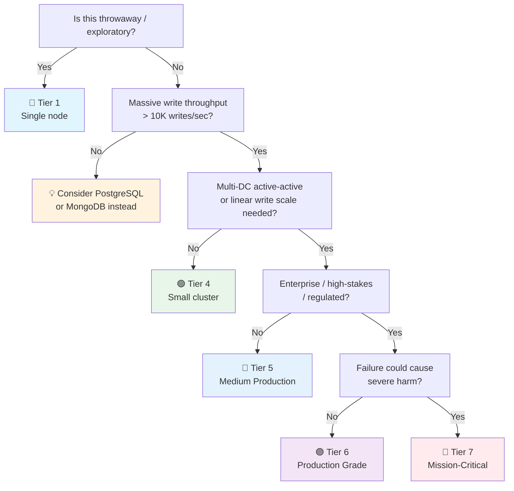

# Cassandra / ScyllaDB Checklist

> Wide-column / distributed NoSQL companion to the general [[Database]] checklist.
> Covers Cassandra 5.x / ScyllaDB 6.x — the standard eventually-consistent, partitioned wide-column stores.
> ScyllaDB is a C++ rewrite of Cassandra: protocol-compatible (CQL), shard-per-core architecture, 5–10x throughput. Cassandra knowledge transfers directly.
> Companion to [[PostgreSQL]], [[MongoDB]], and [[Valkey]] for the other engines in the homelab.
> Last updated: 2026-08-07

---

## 1. Cluster Setup & Topology

- [ ] **Version** — Cassandra 5.x (or ScyllaDB 6.x). `nodetool version` or `cqlsh -e "SELECT release_version FROM system.local;"` recorded. Upgrade path known (rolling, no downtime within a major).
- [ ] **Replication factor ≥ 3** — `RF=3` minimum for production. Survives one node failure with quorum reads/writes. `RF=1` = no redundancy (data lost on node loss). `RF=2` = single-failure survival but no quorum math (one dead → can't reach quorum). Odd RF + N+2 nodes is the rule: RF=3, 4+ nodes.
- [ ] **NetworkTopologyStrategy (NTS) for production** — `CREATE KEYSPACE ... WITH replication = {'class': 'NetworkTopologyStrategy', 'datacenter1': 3, 'datacenter2': 3};`. Never `SimpleStrategy` in production (it ignores topology). NTS replicates per-datacenter, enabling multi-DC deployment and failover. Each DC's RF is independent.
- [ ] **Snitch matches deployment** — Snitch tells Cassandra how nodes are grouped into racks/DCs:
  - `GossipingPropertyFileSnitch` — standard for self-managed (reads topology from `cassandra-rackdc.properties`)
  - `Ec2Snitch` / `Ec2MultiRegionSnitch` — AWS
  - `GoogleCloudSnitch` — GCP
  - **Wrong snitch = replicas on the same rack → rack failure = data loss.** Get this right at bootstrap; changing later requires repair.
- [ ] **vnodes (virtual nodes)** — `num_tokens: 16` (Cassandra default 16, ScyllaDB recommended: 2× cores with `.shard-awareness`). Vnodes distribute data evenly across nodes without manual token assignment. More tokens = more even distribution but more overhead per node. Do NOT change `num_tokens` after bootstrap without repair.
- [ ] **ScyllaDB shard-per-core** — ScyllaDB runs one shard per CPU core (no shared-nothing within a node). Each shard owns its data and handles its own I/O. `--smp` set to core count. This is why ScyllaDB is faster: no lock contention between cores. Don't pin shards to cores manually — let ScyllaDB manage it.

## 2. Data Modeling (Query-First Design)

- [ ] **Query-first design, not normalization-first** — Cassandra data modeling is fundamentally different from relational. Start with the queries you need to run, then design tables to serve those queries. One table per query pattern. Denormalization is not just allowed — it's required. Normalized 3NF schemas don't work.
- [ ] **Partition key design — the #1 critical decision** — The partition key determines:
  - Which node stores the data (via consistent hashing)
  - Data distribution across the cluster (hot partition = hot node)
  - Query efficiency (`WHERE` must include the full partition key for efficiency)
  - **Rules:** High cardinality (even distribution), time-bucketed (avoid unbounded partitions), query-aligned (serves your access pattern). A partition that grows forever (all rows in one partition) will kill the node that owns it.
- [ ] **Clustering columns for ordering** — Within a partition, clustering columns define sort order: `PRIMARY KEY ((user_id), created_at DESC)`. Rows within a partition are physically sorted by clustering columns. Query with `WHERE user_id = ? AND created_at > ?` — efficient. You can only range-scan within a single partition.
- [ ] **Partition size bounded** — Target < 100 MB per partition, < 100K rows per partition. Large partitions cause: read timeouts, compaction issues, repair issues, GC pressure. For time-series: bucket by time (`((user_id, day), timestamp)`) to bound partition growth.
- [ ] **One table per query pattern** — Need to query by `user_id` and also by `email`? Create two tables: `users_by_id` and `users_by_email`. Write to both (batched). This is Materialized View or application-managed denormalization. Yes, you duplicate data — storage is cheap, latency is not.
- [ ] **No JOINs, no foreign keys** — Cassandra has no JOIN, no FK, no subqueries. All relationships must be denormalized into the table design. If your application needs joins, Cassandra is the wrong choice → consider [[PostgreSQL]] or [[MongoDB]].
- [ ] **Collections bounded** — `list`, `set`, `map` collections: keep small (< 100 elements). Unbounded collections cause partition bloat, read amplification (entire collection read on any update), and tombstone issues on collection element deletion. For large collections, use a separate table with one row per element.
- [ ] **Counter tables** — `counter` type for distributed counting (view counts, like counts). Counters are eventually consistent and can over/under-count during conflicts. Use a dedicated table per counter. For exact counts: maintain a separate aggregation (e.g., Kafka → ClickHouse) or use `Spark` + Cassandra connector for batch count.

## 3. Consistency & Tunable Consistency

- [ ] **Consistency level chosen per operation** — Set per query: `CONSISTENCY LOCAL_QUORUM`. Levels:
  - `ONE` — fastest, any one replica responds. Acceptable for low-stakes, latency-sensitive reads.
  - `LOCAL_QUORUM` — majority in the local DC. **The production default** — balances latency, availability, and consistency.
  - `QUORUM` — majority across all DCs. Stronger but slower (cross-DC latency).
  - `ALL` — all replicas respond. Strongest, but any node failure = failure. Never for writes in production.
  - `LOCAL_ONE` — any one replica in local DC. For latency-sensitive, staleness-tolerant reads.
- [ ] **Read-your-writes consistency** — If the app writes then immediately reads: write at `LOCAL_QUORUM`, read at `LOCAL_QUORUM`. With `RF=3` + `LOCAL_QUORUM`, reads see writes (2 of 3 replicas overlap). At `ONE`/`ONE`, you may read a stale replica.
- [ ] **Write consistency ≥ read consistency** — If you write at `ONE` and read at `QUORUM`, a read may see data from a replica that didn't get the write yet. Keep write CL ≥ read CL for read-your-writes.
- [ ] **Tunable consistency documented** — Document per use case: "user profile write: LOCAL_QUORUM; analytics read: LOCAL_ONE; session token write: ONE." Make the trade-off explicit — it's a product decision, not an implementation detail.
- [ ] **Lightweight transactions (LWT) used sparingly** — `INSERT ... IF NOT EXISTS` / `UPDATE ... IF` uses Paxos consensus. Provides linearizable consistency (stronger than quorum). But 4x latency overhead and does NOT scale under contention. Use for: unique username registration, account creation dedup. Do NOT use for high-throughput writes.
- [ ] **`SERIAL` consistency for LWT** — `SERIAL CONSISTENCY LOCAL_SERIAL` — Paxos agreement in local DC only. `SERIAL` across all DCs (very slow). Use `LOCAL_SERIAL` for LWT in multi-DC deployments.

## 4. Compaction & Tombstones

- [ ] **Compaction strategy chosen** — Per-table setting. Strategies:
  - **STCS (Size-Tiered)** — Default. Good for write-heavy. Merges similarly-sized SSTables. Bad for read-heavy (many SSTables to scan). Can create very large SSTables.
  - **LCS (Leveled)** — Good for read-heavy. Fixed-size L0 → L1 → ... levels, 10x size increase per level. Better read performance, higher write amplification. More disk usage.
  - **TWCS (Time-Window)** — Best for time-series. Writes within a time window (e.g. 1 day) into one SSTable. After the window closes, no more compaction — the SSTable is final. Excellent for TTL data: entire SSTable expires at once.
- [ ] **Compaction throughput tuned** — `compaction_throughput_mb_per_sec` (default 64 MB/s). Too low = SSTables pile up. Too high = steals I/O from reads/writes. Tune per workload: higher for write-heavy with time-series, lower for read-heavy.
- [ ] **Tombstones understood** — Deletes in Cassandra don't remove data — they write a **tombstone** (a marker saying "this data is deleted"). Tombstones are purged only after `gc_grace_seconds` (default 10 days) and only during compaction. Until then, reads must scan past them.
- [ ] **Tombstone ratio monitored** — `nodetool compactionstats` shows tombstones vs live cells. High tombstone ratio (> 0.2) = read amplification + latency. Caused by: frequent deletes, TTL expiry, collection element removal. Fix by: switching to TWCS for time-series TTL data, avoiding unnecessary deletes.
- [ ] **TTL for automatic expiry** — `INSERT INTO ... USING TTL 86400` auto-deletes after N seconds. Tombstone is written when TTL expires. Use TWCS for TTL-heavy tables — entire SSTables expire at once (no tombstones to scan). For non-time-series: TTL + STCS = tombstone accumulation.
- [ ] **`gc_grace_seconds` understood** — Default 10 days. Before this period, tombstones are kept to give time for repair (in case a node was down during the delete). After: tombstones are eligible for removal during compaction. **If a node is down > `gc_grace_seconds`, data can resurrect** — deleted data comes back because the tombstone was purged but the node still has the original data. Run repair before `gc_grace_seconds` elapses for any restored node.
- `gc_grace_seconds` can be reduced for TWCS tables (tombstones purge faster) — but understand the trade-off.
- [ ] **Node repair scheduled** — `nodetool repair` (anti-entropy repair) synchronizes data between replicas. Essential for consistency: fixes missed writes, merges conflicting versions, purges eligible tombstones. Schedule: full cluster repair every `gc_grace_seconds` (10 days). Use incremental repair (`-pr`) for ongoing maintenance. Sub-range repair for large clusters (avoid full-repair on huge datasets).

## 5. Replication & Multi-DC

- [ ] **`NetworkTopologyStrategy` per-DC RF** — Each datacenter has its own RF. Multi-DC: `{'dc1': 3, 'dc2': 3}`. Replication between DCs is asynchronous and continuous. Each DC is independently consistent.
- [ ] **Hinted handoff understood** — When a replica is down, the coordinator stores a "hint" to deliver the write when the node recovers. `max_hint_window_in_ms` (default 3 hours) — after this, hints are dropped. Recovered nodes beyond this window need repair. Monitor hinted handoff queue size.
- [ ] **Read repair** — Background consistency repair. On a read, if replicas return inconsistent data, Cassandra triggers a read repair to converge. `read_repair = 'BLOCKING'` (default, slower) or `'NONE'` (faster, rely on anti-entropy repair). For `LOCAL_QUORUM` reads, read repair happens for the extra replica read.
- [ ] **Multi-DC failover plan** — If DC1 goes down: redirect traffic to DC2 via driver config. DC2 already has full data (NTS replication). Failover is a client-side config change, not a cluster operation. Document and test the failover procedure.
- [ ] **`cqlsh CONSISTENCY` and driver routing** — Driver connects to a local DC (contact points + `local-datacenter` config). Cross-DC queries are avoided by routing to local replicas. Wrong DC routing adds latency.

## 6. Performance & Operating

- [ ] **Read-before-write anti-pattern avoided** — Cassandra is optimized for writes. A read-then-write pattern (read current value, compute, write back) is: slow (read latency), inconsistent under concurrency, and wastes resources. Design for write-only: append events, compute aggregates at read time or in a separate aggregation tier.
- [ ] **Paging for large result sets** — `SELECT * FROM table WHERE ...` without `LIMIT` triggers server-side paging (default 1000 rows per page). Driver fetches pages automatically. For large scans: use token-based paging (`SELECT ... WHERE token(pk) > ? AND token(pk) <= ?`) to parallelize across the cluster.
- [ ] **`nodetool` operations** — Essential operational tool:
  - `nodetool status` — cluster topology, load, ownership
  - `nodetool compactionstats` — active compactions, pending tasks
  - `nodetool tpstats` — thread pool stats, dropped messages
  - `nodetool netstats` — streaming, repair progress
  - `nodetool describecluster` — schema versions, partitioner
- [ ] **ScyllaDB `iostat` / `seastar` metrics** — ScyllaDB exposes per-shard metrics via REST API (`/metrics`) and Prometheus. Monitor: reactor utilization per shard, SMI (Scylla Monitoring Infrastructure). ScyllaDB needs dedicated I/O — don't co-locate with other I/O-heavy services.
- [ ] **JVM tuning (Cassandra only)** — Heap 8–16 GB (don't go higher — Lucene-like off-heap is where data lives). GC: G1GC (Cassandra 4+) or CMS. Monitor GC pauses. ScyllaDB has no JVM — it's C++, no GC tuning needed.
- [ ] **Connection pooling (driver)** — Driver maintains connection pool to each node. `core_connections_per_host`, `max_connections_per_host`, `max_requests_per_connection` tuned. ScyllaDB: more connections per shard (ShardAwareDriver). Default driver settings are often too low for production throughput.

## 7. Backup & Recovery

- [ ] **Snapshots** — `nodetool snapshot` — creates a hard-link-based snapshot of all SSTables. Fast (hard links, not a copy), consistent (point-in-time). Snapshot then copy to object storage. **Snapshot does not copy data — it creates pointers. You must copy the snapshot files to backup storage.**
- [ ] **Incremental backups** — `nodetool enableincrementalbackup` — hard-links new SSTables as they're flushed. Backup the incremental directory + the snapshot. Reduces backup window vs. full snapshots only.
- [ ] **Snapshot schedule** — Daily snapshot + incremental between snapshots. Copy to S3/object storage. Retention matches RPO.
- [ ] **Restore tested** — Restore procedure: stop node → clear data directory → copy snapshot + incrementals → run `nodetool refresh` (loads SSTables without restart) or restart node → run repair to sync. Tested quarterly → [[Database]] §3.
- [ ] **Schema backed up separately** — `DESCRIBE KEYSPACE` → CQL schema export. Schema is stored in `system_schema` keyspace. A snapshot includes schema, but keep a separate versioned copy in git.
- [ ] **Multi-DC as disaster recovery** — With NTS + multi-DC, the secondary DC is a live replica. Regional disaster: failover to secondary DC (driver config change). No restore needed — data is already there.

## 8. Security & Access Control

- [ ] **Authentication enabled** — `authenticator: PasswordAuthenticator` (Cassandra) / `authenticator: PasswordAuthenticator` (ScyllaDB). Default is `AllowAllAuthenticator` — **must change in production**. Create users/roles with passwords.
- [ ] **Authorizer enabled** — `authorizer: CassandraAuthorizer`. `GRANT SELECT ON keyspace.table TO role`. Default is `AllowAllAuthorizer` — no access control. **Must enable in production** → [[Security]] §8.
- [ ] **TLS for client + internode** — Client-to-node: `client_encryption_options`. Node-to-node: `server_encryption_options`. Both required — gossip and internode traffic carry data. `internode_encryption: all` (not `none` or `dc`).
- [ ] **Network isolation** — Cassandra ports: 7000 (internode), 7001 (internode TLS), 9042 (CQL native), 9142 (CQL TLS). All firewalled except to application subnet. Admin ports (7199 JMX) never exposed.
- [ ] **JMX secured** — JMX (7199) is a remote code execution vector if unauthenticated. `COM_ORG_CASSANDRA_AUTH_JMXRALEVEN` or credential-based JMX auth. Never expose JMX to an untrusted network.
- [ ] **Audit logging (Cassandra 5.x+)** — `audit_logging` for regulated tiers. Logs DML, DDL, auth events. Filter by user, category, probability.
- [ ] **ScyllaDB: enterprise security** — ScyllaDB Enterprise adds LDAP, Kerberos, encryption at rest (Transparent Encryption). Community edition has TLS + auth but not at-rest encryption — use volume-level encryption.

## 9. Observability & Monitoring

- [ ] **`nodetool` health checks** — `nodetool status` (up/down, load), `nodetool compactionstats` (compaction backlog), `nodetool tpstats` (dropped messages), `nodetool gossipinfo` (cluster membership). Run daily; script the output to Prometheus.
- [ ] **Prometheus exporter** — `cassandra_exporter` or `mcac` (Metrics Collector for Apache Cassandra) / ScyllaDB's built-in Prometheus endpoint. Metrics: read/write latency, compaction queue, tombstone ratio, dropped mutations, heap/GC.
- [ ] **Dropped mutations monitored** — `nodetool tpstats` shows dropped mutations (writes that couldn't be delivered within timeout). Dropped = data inconsistency — the replica missed the write. Alert on any drop rate > 0. Run repair.
- [ ] **Streaming monitored** — `nodetool netstats` — data streaming between nodes (bootstrap, rebuild, repair). Large streaming operations impact cluster performance. Schedule during low-traffic windows.
- [ ] **Capacity trend** — Disk usage per node (`nodetool status`), partition size distribution, compaction overhead. Cassandra clusters grow fast — plan node additions (capacity) and token redistribution.
- [ ] **Repair compliance** — Track last-repair date per keyspace/table. If a table hasn't been repaired within `gc_grace_seconds`, data inconsistency risk grows. Alert on overdue repairs.

---

## Quick Sanity Check Before Launch

- [ ] RF=3, NetworkTopologyStrategy, correct snitch for your topology
- [ ] Partition keys chosen for even distribution + query alignment
- [ ] Partition size bounded (< 100 MB, < 100K rows)
- [ ] Consistency level documented per use case (LOCAL_QUORUM default)
- [ ] Compaction strategy matches data pattern (TWCS for time-series, LCS for read-heavy)
- [ ] Tombstone ratio healthy (< 0.2)
- [ ] Repair scheduled within `gc_grace_seconds` (10 days default)
- [ ] Snapshot + incremental backup to S3, restore tested
- [ ] Auth + authorizer enabled, TLS on client + internode
- [ ] JMX secured (not exposed)
- [ ] Dropped mutations = 0, streaming not active during peak
- [ ] Multi-DC failover plan documented (if multi-DC)
- [ ] No read-before-write patterns, no unbounded collections

---

## Project Tier Scoping Matrix

> **How to use this table:** Pick your tier first, then focus only on the sections marked ✅ (required) or 🟡 (recommended). Skip ❌ sections entirely — they'd be over-engineering for your context.
>
> **Legend:** ✅ Required · 🟡 Recommended / partial · ❌ Skip

### Tier Descriptions

| # | Tier | Description | Typical Team | Users | Lifespan |
|---|---|---|---|---|---|
| 1 | 🧪 **POC / Spike** | Validate an idea. Single-node Cassandra. | 1 dev | Internal only | Days–weeks |
| 2 | 🔧 **Prototype / MVP** | Multi-node prototype. Might become real. | 1–2 devs | Beta testers | Weeks–months |
| 3 | 🏠 **Internal Tool** | Real data for employees. Small cluster (3–5 nodes). | 1–3 devs | Employees | Ongoing |
| 4 | 🟢 **Small Production** | 3–5 node cluster, low traffic. Real users. | 1–2 devs | < 1K users | Ongoing |
| 5 | 🔵 **Medium Production** | 6–20 node cluster, multi-DC or meaningful traffic. | 2–5 devs | 1K–100K users | Ongoing |
| 6 | 🟣 **Production Grade** | Full rigor — large cluster, multi-DC, high write throughput. | 5+ devs | 100K+ users | Long-term |
| 7 | 🔴 **Mission-Critical / Regulated** | High-stakes: financial event logging, IoT at scale. | 10+ devs | Varies | Decades |

> **⚠️ Cassandra tiering note:** Cassandra/ScyllaDB is **overkill for Tiers 1–2** and marginal for Tier 3. Its value shines at Tier 5+ — massive write throughput, multi-DC active-active, linear horizontal scalability. If you're at Tier 3–4, consider [[PostgreSQL]] or [[MongoDB]] first. Choose Cassandra when you specifically need: (1) write-heavy workload (>10K writes/sec), (2) multi-DC active-active, (3) linear write scalability, (4) always-on availability (no downtime for failover).

### Which Tier Am I?

### Checklist Applicability by Tier

| # | Section | 🧪 POC | 🔧 Prototype | 🏠 Internal | 🟢 Small Prod | 🔵 Medium Prod | 🟣 Production Grade | 🔴 Mission-Critical |
|---|---|:---:|:---:|:---:|:---:|:---:|:---:|:---:|
| 1 | Cluster Setup & Topology | 🟡 1 node | 🟡 3 nodes | ✅ RF=3 + NTS | ✅ + snitch | ✅ + vnodes tuned | ✅ + multi-DC | ✅ + formal |
| 2 | Data Modeling | 🟡 minimal | ✅ | ✅ + partition sizing | ✅ + query-first | ✅ + bucketing | ✅ + collection bounds | ✅ + formal review |
| 3 | Consistency | ❌ | 🟡 ONE | ✅ LOCAL_QUORUM | ✅ + documented | ✅ + read-your-writes | ✅ + LWT sparingly | ✅ + formal |
| 4 | Compaction & Tombstones | ❌ | 🟡 default STCS | ✅ + strategy chosen | ✅ + tombstone ratio | ✅ + TWCS for time-series | ✅ + gc_grace tuning | ✅ + formal |
| 5 | Replication & Multi-DC | ❌ | ❌ | ❌ | 🟡 single-DC | ✅ + multi-DC | ✅ + failover tested | ✅ + active-active |
| 6 | Performance & Operating | ❌ | 🟡 basic | ✅ + nodetool | ✅ + paging | ✅ + driver tuning | ✅ + capacity plan | ✅ + formal |
| 7 | Backup & Recovery | ❌ | ❌ | 🟡 snapshots | ✅ + incremental | ✅ + restore tested | ✅ + multi-DC DR | ✅ + regulatory |
| 8 | Security | 🟡 local only | 🟡 auth on | ✅ + authorizer | ✅ + TLS | ✅ + JMX secured | ✅ + audit | ✅ + regulatory |
| 8 | Observability | ❌ | ❌ | 🟡 nodetool | ✅ + exporter | ✅ + dropped mutations | ✅ + repair compliance | ✅ + full stack |

---

## Sources

- Complements [[Database]] (general), [[Security]] (access control), [[Infrastructure]] (hosting).
- Cassandra docs — https://cassandra.apache.org/doc/latest/
- ScyllaDB docs — https://docs.scylladb.com/
- Cassandra data modeling — https://cassandra.apache.org/doc/latest/cassandra/developing/data-modeling/
- Compaction — https://cassandra.apache.org/doc/latest/cassandra/operating/compaction/
- ScyllaDB University — https://university.scylladb.com/
