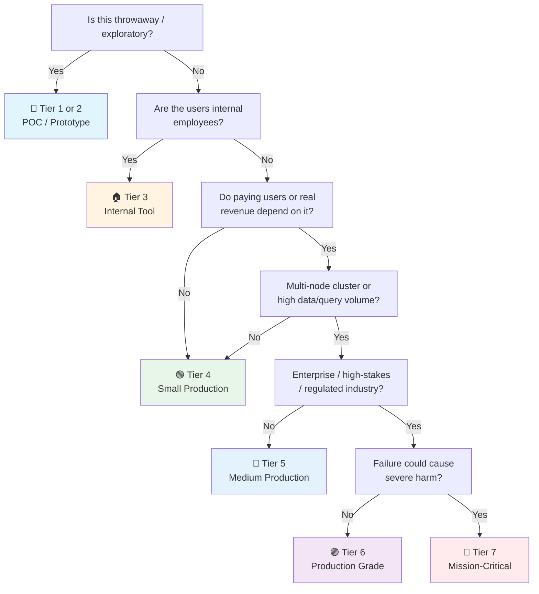

# ClickHouse Checklist

> OLAP / columnar companion to the general [[Database]] checklist.
> Covers ClickHouse 25.x (current) — the standard open-source columnar analytics database.
> Companion to [[PostgreSQL]] (OLTP), [[MongoDB]], and [[Valkey]] for the other engines in the homelab.
> Last updated: 2026-08-07

---

## 1. Cluster Setup & Configuration

- [ ] **Version** — ClickHouse 25.x (or current). `SELECT version()` recorded. Upgrade path known (rolling for minor; cluster-wide coordinated for major).
- [ ] **Deployment topology decided** — Single server (small analytics), single-shard + replicated (HA), multi-shard + replicated (horizontal scale). Match the tier matrix below.
- [ ] **ClickHouse Keeper / ZooKeeper** — Required for replication and distributed DDL. ClickHouse Keeper (C++ built-in, preferred) or external ZooKeeper. 3 nodes minimum for quorum. Without Keeper, no replication, no distributed DDL.
- [ ] **Storage layout** — Data on NVMe/SSD (hot data), cold data on object storage (S3 disk). `storage_configuration` with multiple disks and volumes. Tiered storage: move old partitions to S3 automatically.
- [ ] **Memory limits set** — `max_memory_usage` (per query), `max_memory_usage_for_user` (per user), `max_server_memory_usage` (global). ClickHouse will OOM-kill queries when exceeded — better than the kernel killing the process.
- [ ] **Container/Docker notes** — Volume for `/var/lib/clickhouse/data` + `/var/lib/clickhouse/coords` (Keeper), `ulimit -n` raised (default 1024 is too low for ClickHouse). Healthcheck `clickhouse-client --query "SELECT 1"` → [[Infrastructure]].

## 2. Table Engines & Schema Design

- [ ] **MergeTree family understood** — Every table is a `MergeTree` variant. Choose deliberately:
  - `MergeTree` — base engine, manual dedup
  - `ReplacingMergeTree` — dedup by version/timestamp (eventual, not real-time)
  - `CollapsingMergeTree` — cancel rows via sign column (+1/-1)
  - `AggregatingMergeTree` — pre-aggregate via AggregateFunction state
  - `SummingMergeTree` — auto-sum numeric columns on merge
  - ❌ Never use plain `MergeTree` when you need dedup — it doesn't dedup.
- [ ] **`ORDER BY` is the primary index** — Unlike Postgres, the `ORDER BY` clause defines the sparse primary index and physical sort order. It determines: which queries are fast (filtering on prefix columns), data compression (similar values cluster together), and merge behavior. Choose columns by query patterns: high-filter columns first.
- [ ] **`PARTITION BY` for data lifecycle** — Monthly or daily partition (`toYYYYMM(date)`, `toDate(...)`). Partitions enable: atomic partition drops (instant `ALTER TABLE ... DROP PARTITION`), partition-level operations, and tiered storage movement. Do NOT over-partition — each partition is a separate set of parts.
- [ ] **Sparse primary index** — ClickHouse indexes every Nth row (default 8192, `index_granularity`). Good for filtering billions of rows down to ranges. NOT good for point lookups on a single row — use a secondary `bloom_filter` or `set` skip index if you need point-lookup on non-prefix columns.
- [ ] **Compression codec chosen** — Default `LZ4` (fast). `ZSTD` for better ratio on historical/cold data (e.g. `CODEC(ZSTD(3))` on partition-level). Delta + LZ4 for sequential numeric columns (`Delta(8)`). Compression is where ClickHouse gets much of its speed — columnar + good compression = less I/O.
- [ ] **Low-cardinality columns** — `LowCardinality(String)` for columns with < 10K distinct values (country codes, status, category). Stores as dictionary-encoded integers — 5–10x compression and faster aggregation. Never use for high-cardinality columns (slows writes).
- [ ] **Nullable avoided** — `Nullable(T)` adds a separate null bitmap and prevents optimizations. Prefer a default value (`0`, `''`, `'1970-01-01'`) and a separate boolean flag. ClickHouse philosophy: never nullable unless the column is genuinely optional and rarely read.

## 3. Data Ingestion & Insert Patterns

- [ ] **Batch inserts — NEVER single-row inserts** — `INSERT INTO ... VALUES` one row at a time creates one "part" per insert, triggering merges that overwhelm the cluster. Minimum batch: 10K–100K rows per insert. Ideal: 100K–1M rows per insert, or every 1–2 seconds. Use a buffer (Kafka, file, Arrow) between the app and ClickHouse.
- [ ] **`INSERT` is idempotent in `ReplacingMergeTree`** — Re-inserting the same primary key with a newer version replaces the old row (eventually, on merge). Design for this: include a version/timestamp column. Do NOT rely on immediate dedup — `SELECT ... FINAL` is slow; design queries to tolerate duplicates or aggregate them away.
- [ ] **`INSERT INTO ... SELECT` for ETL** — Transform within ClickHouse using SQL (`INSERT INTO target SELECT ... FROM source WHERE ...`). Faster than export-transform-import. Materialized views automate this (see §6).
- [ ] **Async inserts for streaming sources** — `async_insert: 1` batches small inserts on the server side before writing. For Kafka/streaming sources that produce many small batches. Buffers in memory, flushes by size or timeout.
- [ ] **No UPDATE / DELETE in hot paths** — `ALTER TABLE ... UPDATE` / `DELETE` are **mutations** — heavy, asynchronous, and rewrite entire parts. For updatable data: use `CollapsingMergeTree` (insert a cancel + new row) or `ReplacingMergeTree` (insert a new version). Mutations are for one-off fixes, not application writes.
- [ ] **Kafka / streaming integration** — `Kafka` table engine reads from a topic, materialized view pipes into a MergeTree table. Offset tracking is automatic. Use a consumer group per table. Monitor lag between Kafka and ClickHouse.

## 4. Query Performance & Optimization

- [ ] **Queries hit the `ORDER BY` prefix** — Queries filtering on `ORDER BY` prefix columns are fast (sparse index + data is sorted). Queries filtering on non-prefix columns trigger full scans — acceptable in columnar (only read needed columns), but add skip indexes for hot point-lookups.
- [ ] **`PREWHERE` optimization** — ClickHouse reads the `WHERE` filter column first to reduce rows before reading other columns. `PREWHERE` pushes this further — filter on a cheap column first, then read expensive columns only for surviving rows. Automatic in most cases, but tune for specific queries.
- [ ] **`GROUP BY` uses memory efficiently** — ClickHouse aggregates in memory; large cardinality `GROUP BY` can spill to disk (with `max_bytes_before_external_group_by`). Set this to ~50% of `max_memory_usage` to spill before OOM.
- [ ] **JOINs are expensive — denormalize or use dictionaries** — ClickHouse JOINs are hash joins in memory; large right-side tables OOM. Solutions: (1) denormalize at insert time (embed dimension data in the fact row), (2) use a `Dictionary` for dimension lookups (loaded into memory, point-lookup in O(1)), (3) `JOIN` with a subquery that limits the right side first.
- [ ] **`any()`, `argMax()` over `GROUP BY`** — Use ClickHouse-specific aggregate functions for efficiency: `any(value)` (first value, no sorting), `argMax(value, expr)` (value where expr is max), `groupArray()` (collect into array). Faster than standard SQL equivalents.
- [ ] **`LIMIT BY` not `ROW_NUMBER()`** — `SELECT ... LIMIT 10 BY user_id` returns top-10 per user — far faster than a window function. ClickHouse-specific syntax for common "top-N per group" patterns.
- [ ] **Query log reviewed** — `system.query_log` table records every query with duration, memory, rows read, bytes read. Query it to find slow/expensive queries. The first place to look when optimizing: `SELECT query, elapsed, read_rows FROM system.query_log ORDER BY elapsed DESC LIMIT 20`.

## 5. Replication, Sharding & Distributed Tables

- [ ] **`ReplicatedMergeTree` for HA** — Replication factor ≥ 2. Each shard has N replicas. Keeper coordinates inserts and metadata. `INSERT` goes to one replica, replicates to others. Read from any replica.
- [ ] **Distributed table as a query router** — A `Distributed` table fans a query out to local tables across shards. Writes: insert into the local table on each shard (or insert into the Distributed table, which routes — but this is less efficient for large batches). Reads: query the Distributed table, ClickHouse fans out and merges results.
- [ ] **Sharding key chosen deliberately** — `sharding_key` in the Distributed table determines which shard a row goes to. Must match your query patterns: if you always filter by `tenant_id`, shard by `tenant_id`. Bad sharding key = uneven data distribution + queries must hit all shards.
- [ ] **Cluster configuration in `config.xml`** — `<remote_servers>` defines the cluster topology (shards, replicas, weights). Versioned. ClickHouse Keeper for distributed DDL (`ON CLUSTER`).
- [ ] **`ON CLUSTER` DDL** — `CREATE TABLE ... ON CLUSTER` executes on all nodes. Use for schema changes, not data operations. Verify it completes on all nodes — a failed `ON CLUSTER` can leave schema drift.
- [ ] **No cross-shard JOINs in hot paths** — A JOIN across shards requires shuffling data. Either denormalize or co-locate joined tables on the same shard (same sharding key).

## 6. Materialized Views & Aggregation

- [ ] **Materialized views for pre-aggregation** — `CREATE MATERIALIZED VIEW ... TO target_table AS SELECT ... GROUP BY ...`. Automatically processes new inserts through the aggregation. The target table holds the pre-aggregated result. Query the target (fast) instead of the raw table (slow). This is ClickHouse's superpower.
- [ ] **`AggregatingMergeTree` for incremental aggregation** — Target engine for MVs that aggregate. Stores `AggregateFunction` states (partial aggregates). Final aggregation on read with `Merge` suffix (`sumMerge`, `avgMerge`, `quantileMerge`). Avoids recomputation.
- [ ] **MV trigger: INSERT only** — Materialized views trigger on `INSERT` into the source table. They do NOT trigger on `UPDATE`, `DELETE`, or `ALTER`. Design around this — if source data changes, the MV is stale (recompute from scratch or use TTL + re-insert).
- insert block: the view processes each inserted block independently. Partial aggregates are correct because merge combines them.
- [ ] **TTL for data lifecycle** — `TTL timestamp + INTERVAL 30 DAY DELETE` on tables or columns. Automatic, partition-level deletion. For tiered storage: `TTL timestamp + INTERVAL 90 DAY TO VOLUME 'cold'` moves data to S3. Replaces manual partition-drop cron jobs.
- [ ] **Dictionaries for dimension lookups** — `CREATE DICTIONARY ...` loads a dimension table into memory (from MySQL, Postgres, ClickHouse, HTTP, file). Point-lookup via `dictGet('dict_name', 'attr', id)`. O(1) lookup, no JOIN cost. Refresh policies: `LIFETIME`, `LAYOUT(HASHED()` / `CACHE()`.

## 7. Backup & Recovery

- [ ] **`BACKUP` / `RESTORE` commands (native)** — `BACKUP TABLE tbl TO Disk('backups', 'file.backup')` (24.3+, stable). Supports S3, GCS, Azure. Incremental backups supported (`base_backup`). This is the modern, recommended approach.
- [ ] **`clickhouse-backup` for older versions** — Third-party tool (`Altinity/clickhouse-backup`) for versions without native backup. Creates filesystem-level snapshots, uploads to S3. Widely used in production pre-24.3.
- [ ] **Backup schedule** — Daily full + incremental within the day, or weekly full + daily incremental. Backups to object storage (S3). RPO documented.
- [ ] **Restore tested** — Restore to a staging cluster: verify row counts, run representative queries, measure restore time → [[Database]] §3.
- [ ] **Part-level recovery** — If a single part is corrupt: `ALTER TABLE ... FETCH PARTITION` from a replica. Faster than full restore for localized corruption.

## 8. Security & Access Control

- [ ] **Authentication configured** — Native password (`password` or `password_sha256_hex`), or LDAP / Kerberos for enterprise. No default-unprotected server in production.
- [ ] **RBAC with grants** — `CREATE USER`, `CREATE ROLE`, `GRANT SELECT ON db.table TO role`. Users have roles, roles have privileges. Row-level policies: `CREATE ROW POLICY ... USING tenant_id = currentTenant()`.
- [ ] **Network isolation** — ClickHouse not internet-exposed. Firewall/VPC rules. `listen_host` bound to private interface.
- [ ] **TLS** — `<openSSL>` config with server cert + key. `https://` in client connection. Inter-node TLS for replicated clusters.
- [ ] **Quotas & workload management** — `CREATE QUOTA` limits per-user or per-group: max queries, max errors, max execution time, max rows to read. Prevents one user's runaway query from starving the cluster.
- [ ] **Audit logging** — `query_log`, `session_log`, `part_log` system tables. Required for regulated tiers. Export to a separate log store.

## 9. Observability & Monitoring

- [ ] **`system.*` tables** — The observability backbone: `system.query_log` (query stats), `system.merges` (active merges), `system.mutations` (mutation progress), `system.replicas` (replication health), `system.parts` (part count per table), `system.disks` (disk usage).
- [ ] **Merge performance monitored** — Too many unmerged parts = slow queries and insert failures (ClickHouse throws "too many parts" error). Alert when `system.parts` active count approaches `parts_to_throw_insert` (default 300).
- [ ] **Prometheus exporter** — `clickhouse_exporter`: queries/sec, merge progress, replication lag, disk usage, zookeeper/keeper operations.
- [ ] **Keeper / ZooKeeper health** — Keeper is the coordination backbone. Monitor: request latency, outstanding requests, watch count. A sick Keeper = a sick cluster.
- [ ] **Capacity trend** — Disk growth per table (`system.parts`), compression ratio, memory usage. ClickHouse data grows fast — plan capacity quarterly.

---

## Quick Sanity Check Before Launch

- [ ] Correct MergeTree engine for the use case (Replacing/Aggregating/Summing)
- [ ] `ORDER BY` matches query patterns (filter prefix columns first)
- [ ] Inserts are batched (10K+ rows per insert, never single-row)
- [ ] No `UPDATE`/`DELETE` in hot paths (use CollapsingMergeTree or ReplacingMergeTree)
- [ ] Replication enabled (`ReplicatedMergeTree` + Keeper)
- [ ] Materialized views for pre-aggregation on hot queries
- [ ] Dictionaries for dimension lookups (no big JOINs)
- [ ] `max_memory_usage` + `max_bytes_before_external_group_by` set
- [ ] Backup to S3 configured AND restore tested
- [ ] RBAC: users + roles + quotas, no open access
- [ ] `system.query_log` monitored for slow/expensive queries
- [ ] Part count per table healthy (not approaching `parts_to_throw_insert`)

---

## Project Tier Scoping Matrix

> **How to use this table:** Pick your tier first, then focus only on the sections marked ✅ (required) or 🟡 (recommended). Skip ❌ sections entirely — they'd be over-engineering for your context.
>
> **Legend:** ✅ Required · 🟡 Recommended / partial · ❌ Skip

### Tier Descriptions

| # | Tier | Description | Typical Team | Users | Lifespan |
|---|---|---|---|---|---|
| 1 | 🧪 **POC / Spike** | Validate analytics. Single-node Docker. | 1 dev | Internal only | Days–weeks |
| 2 | 🔧 **Prototype / MVP** | Analytics for a prototype. Might become real. | 1–2 devs | Beta testers | Weeks–months |
| 3 | 🏠 **Internal Tool** | Real analytics dashboard for employees. | 1–3 devs | Employees | Ongoing |
| 4 | 🟢 **Small Production** | Single node, low query volume. Real users, maybe early revenue. | 1–2 devs | < 1K users | Ongoing |
| 5 | 🔵 **Medium Production** | Multi-node replicated cluster. Real revenue or user base. | 2–5 devs | 1K–100K users | Ongoing |
| 6 | 🟣 **Production Grade** | Full rigor — sharded + replicated, tiered storage, workload management. | 5+ devs | 100K+ users | Long-term |
| 7 | 🔴 **Mission-Critical / Regulated** | Financial analytics, regulated reporting. | 10+ devs | Varies | Decades |

### Which Tier Am I?

### Checklist Applicability by Tier

| # | Section | 🧪 POC | 🔧 Prototype | 🏠 Internal | 🟢 Small Prod | 🔵 Medium Prod | 🟣 Production Grade | 🔴 Mission-Critical |
|---|---|:---:|:---:|:---:|:---:|:---:|:---:|:---:|
| 1 | Cluster Setup | ❌ single node | 🟡 single node | ✅ | ✅ + Keeper | ✅ + replication | ✅ + sharding + tiered storage | ✅ + formal |
| 2 | Table Engines & Schema | 🟡 MergeTree | ✅ | ✅ | ✅ + codecs + LowCardinality | ✅ + engine selection | ✅ + sparse index tuning | ✅ + formal review |
| 3 | Data Ingestion | ❌ | 🟡 batch inserts | ✅ + batched | ✅ + async insert | ✅ + Kafka pipeline | ✅ + no mutations in hot path | ✅ + formal |
| 4 | Query Performance | ❌ | 🟡 basic | ✅ + ORDER BY prefix | ✅ + query_log review | ✅ + dictionaries | ✅ + PREWHERE + LIMIT BY | ✅ + capacity plan |
| 5 | Replication & Sharding | ❌ | ❌ | ❌ | 🟡 replicated | ✅ + Distributed table | ✅ + sharding key analysis | ✅ + multi-region |
| 6 | Materialized Views & TTL | ❌ | 🟡 basic MV | ✅ + TTL | ✅ + AggregatingMergeTree | ✅ + dictionaries | ✅ + tiered storage TTL | ✅ + formal |
| 7 | Backup & Recovery | ❌ | ❌ | 🟡 backup to disk | ✅ + S3 backup | ✅ + restore tested | ✅ + incremental | ✅ + regulatory |
| 8 | Security | 🟡 local only | 🟡 password | ✅ + RBAC | ✅ + network isolation | ✅ + TLS + quotas | ✅ + row policies | ✅ + audit + regulatory |
| 9 | Observability | ❌ | ❌ | 🟡 query_log | ✅ + exporter | ✅ + merge monitoring | ✅ + Keeper health | ✅ + full stack |

---

## Sources

- Complements [[Database]] (general), [[PostgreSQL]] (OLTP counterpart), [[Security]] (access control).
- ClickHouse docs — https://clickhouse.com/docs
- MergeTree family — https://clickhouse.com/docs/en/engines/table-engines/mergetree-family/
- Materialized views — https://clickhouse.com/docs/en/guides/developer/cascading-materialized-views
- Altinity clickhouse-backup — https://github.com/Altinity/clickhouse-backup
